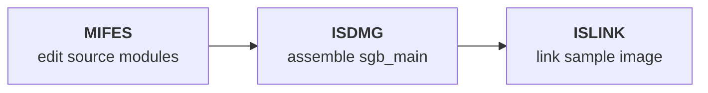

Thank you for your interest in contributing to RetroReversing! This guide explains some of the formatting guidelines and features you can use to make the posts on the page more engaging.

# Site Principles
The following are the main principles of the site and can help decide not only how to write the posts but also if content is applicable to this site or would be better suited to a different wiki.

## Audience
<div class="emoji">👥</div>
The target audience for the site are technically literate readers who likely already know how to program with modern programming languages but may be beginners when it comes to reverse engineering or programming in older languages and environments such as DOS. Bear this in mind when writing posts and try to reference any sources to back up claims. 

---
## The Content
The content of the site focuses on the **development process** and **technology** of video games from the **1980s** until around **2010**, with reverse engineering as a core aspect of the site, being the cornerstone of **digital archaeology**.

### Types of content we want
<div class="emoji">✅</div>

We want content related specifically to the game development process, this can include programming, development environments, artist software and general information about working in a retro game development studio. 

This can include:
* **Delving deep into a specific game or game engine** - looking at the game files and decompiling the executable code
* **Development Software** - General articles about a piece of software and its use in retro game development - e.g. 3D Studio Max, Deluxe Paint, Software Development Kits
* **Development hardware** - e.g. console development kits, arcade hardware, cheat devices, and even how retail hardware works
* **Tutorials** - on reverse engineering or writing emulators
* **Research material related to the game industry** - e.g. content of game industry conferences, programming/software books, game industry magazines, or even just game magazines from the past that contain interviews with game developers

### Types of content we don't want
<div class="emoji">❌</div>

We don't want to duplicate the content of other sites; we aim to contribute to them where possible. We specifically focus on the more technical aspects of retro game development - there may be a better home for certain content.

Although there are exceptions to these rules, the kind of content we aim to avoid on this site includes:
* Content about cut content in games - please contribute to the excellent [The Cutting Room Floor](https://tcrf.net/The_Cutting_Room_Floor) and then link where applicable instead

### Link to High-quality website articles rather than duplicate
<div class="emoji">🔗</div>
Please try to link out to other sites that have high-quality information on a particular topic rather than rewriting the same content here. Content on this site should either link together sources from multiple places on the web into a cohesive article or include content not available elsewhere online.

However, please provide at least a brief description of the page you are linking to and its content before the reference so readers understand the relevance. The page here should still form a cohesive narrative even without the reader following the external links. If an external page is critical, tell the user to read it before continuing.

### Reference when possible
<div class="emoji">📚</div>
We want to avoid spreading misinformation as much as possible, which can be tricky when researching old software tools since there can be conflicting information. Please reference sources so readers can verify whether the information is correct. You may use Wikipedia as a source but only as a last resort if no other websites have the information.

---
# Formatting Guidelines
Posts are written in [GitHub Flavored Markdown](https://github.github.com/gfm/) but also support additional Jekyll includes that can be used for more advanced components.

When a section is listing folder contents, prefer the existing includes over raw HTML or plain bullet dumps:
* Use `connected-folder-tree.html` when showing folders with subfolders or a nested directory structure
  `folder` should be the short display name and `path` should be the longer location, for example `folder="trunk"` and `path="agb_bootrom/trunk"`

When referencing a real source file:
* Use `source-code-card.html` and/or `source-code-card-grid.html` when you are actually showing the contents of a source file, such as its functions, variables, structs, or other internal symbols
* Its best to float the code card to the side of the text with the `rr-code-card-aside` class and use it in sections talking about that source file.
* Don't have the exact same code card in multiple sections of the same article
* Do not use code cards just to summarize what a file is for or what companion files sit beside it - use a table or normal prose for that instead
* The `functions`, `variables`, and `lines` fields on code cards must be exact numeric counts taken from the file contents, not descriptive text or estimates
* If the exact counts are not known yet, leave the card out until the file has been inspected properly enough to count them
* In a code-card item like `type::name::extra`, the final `extra` field is for function arguments only
* For variables and other non-function symbols, leave the final field blank
  Wrong: `- function::SAVE_FILE1::save wrapper for the first editor family`
  Better: `- function::SAVE_FILE1::()`
  Better: `- variable::Log_Format_2HD`
* Prefer these includes over hand-written decorative HTML so the styling stays consistent across the site

## Writing Style Rules
<div class="emoji">🔤</div>

For the writing style, think of each article as a technical handbook with references, not a blog post. 

Some general rules are below:
* **Avoid over-explaining** - Introduce only the key concept first, then provide practical examples or lists.
* **Use short paragraphs** - Break up long text with additional elements such as images, subheadings, lists, code blocks, or other features.
* **Avoid giant sentences** - Keep use of commas and semicolons to a minimum. Focus on short, readable sentences. Add newlines after sentences to break them up.
* **Tone**: Technically detailed, slightly conversational, but not casual. Avoid corporate, sales, or overly enthusiastic tones. You may include mild enthusiasm or analogies when they aid understanding but always return to clear, factual language.
* **Non-linear order** - Never assume the reader will follow a linear order. Each section should be standalone so they can read only the parts they are interested in.
* **Present then explain** - Present terminology as factual first, then justify or contextualize ("What is it?" then "Why is it useful?").
* **Encourage hands-on experimentation** - Suggest trying tools, running commands, or inspecting files.

### Character Rules
<div class="emoji">🔤</div>

When copying and pasting between programs, **ASCII/UTF** characters can sometimes change from source to destination. 

We try to maintain consistent characters here are the main rules:
* **Quotes** - Never use the slanted `“` instead use the standard `"` for quotes.
* **Dashes** - For dashes, always use `-` and never `—` (em dash).
* **Standards only** - Don't use characters that are not on standard keyboards. 

## List Rules
<div class="emoji">🔹</div>

Lists can improve readability when used appropriately but should only be used when the context makes sense.
We mainly use unordered lists (Markdown: `*`); only use ordered lists (Markdown: `-`) if there is a specific reason to do so.

If using a list, we have a preferred format for lists where each list item has a short bold part followed by a dash (-) and more information:
```markdown
First we always have a short sentence introducing the list:
* **Item title in bold** - More information about the item
````

Always have a sentence before the list explaining the list, never just have a list after a heading.

However, if the list is too long (e.g. more than 10 items), use a Markdown table instead. The site supports searching within Markdown tables, which is not useful for short lists but ideal for long ones.

## Table Rules
* NEVER use excessive spacing in Markdown tables.
* Rows in Markdown tables should not start or end with `|` as Markdown handles this automatically.

## Markdown Rules
Our pages tend to be broken up into different sections based on headings, headings are used for the table of contents and can be treated as distinct sections.

Here are some of the markdown rules:
* **Don't bold headings** - In Markdown, never use `**` to make the text bold in H1–H5 headings, as CSS handles this.
* **Don't use emoji's in headings** - Don't use emojis in headings themselves
* **Don't use backticks in headings** - Keep headings plain text and move inline code formatting into the paragraph below instead
* **Use HR before major sections** - Add a Markdown HR (`---`) when starting a new major section, such as before an H1 or H2's that are not the first subheading under a H2, same for H3 etc.
* **Use HR when jumping back up the heading hierarchy** - If a section ends at a deeper heading level and the next heading jumps back up, add a Markdown HR (`---`) immediately before the higher-level heading. For example, if an H4 section is followed by a new H1, place `---` directly before the H1.
* **No line between HR and Heading** - the next line after a HR (`---`) should be the heading itself
* **No line between heading and first paragraph** - the next line after a heading should always be the first paragraph of the section
* **Never use numbered lists** - Just use `*` for all unordered lists.
* **Short inline code** - If the code is short, wrap it with backticks (e.g. `eax, 0x00`).
* **HR before H2/H3** - Have an HR before HR/H3 but only if its not the first sub heading under a heading
* **Add a glossary for acronym-heavy pages** - If a page uses many technical acronyms or specialist terms, add a short glossary near the top.
* **Link first mention per section** - For glossary terms, link the first meaningful mention in each section to the glossary definition; avoid linking every occurrence.
* **Use stable glossary anchors** - Add explicit HTML anchors for glossary entries (for example `<a id="glossary-cop"></a>`) so in-page links remain predictable.

---
## Frontmatter Rules
The frontmatter at the top of each page should follow the current site pattern rather than copying older pages blindly.

Use this as the standard shape for new pages:
```yaml
---
layout: post
tags:
- gameboy
- leak
title: Example Page Title
category: leak
# category can also be a list when a page belongs to multiple areas:
# category:
# - leak
# - snes
image: /public/images/example.jpg
twitterimage: https://www.retroreversing.com/public/images/example.jpg
permalink: /example-page
breadcrumbs:
  - name: Home
    url: /
  - name: Example Section
    url: /example
  - name: Example Page Title
    url: #
recommend:
- gameboy
- leak
editlink: /path/to/file.md
updatedAt: '2026-03-29'
---
```

These are the main fields and what they are for:

Field | Purpose
---|---
`layout` | Usually `post` for normal RetroReversing pages
`tags` | Search/discovery tags for the page, and the values other pages match against in their `recommend` lists
`title` | Full page title shown in the page header and metadata (do not use colons! as it messes with the yaml frontmatter)
`category` | Main site grouping such as the games console name or others such as `leak`, `introduction`, `gameengines`, `maths`, or another section-specific category. This can be a single value (`category: leak`) or a list (`category: [leak, snes]`) when a page belongs to multiple categories.
`image` | Main preview image used by the page and site cards, if there is not a unique one leave it blank and it will be generated based on the category and title
`twitterimage` | Absolute URL version of the preview image for social sharing, leave blank and it will be generated
`permalink` | Final public path for the page (do not end with a trailing `/`; that is legacy format we are moving away from)
`breadcrumbs` | Breadcrumb trail shown at the top of the page
`recommend` | Related-topic tags used to build the recommended sidebar and card labels; these should usually be chosen from tags already used elsewhere on the site
`editlink` | Repo-relative path used for the "Edit on GitHub" link
`updatedAt` | Last meaningful content update date for the page
`excerpt` | Optional short summary for pages that need it
`hidden` | Optional flag for pages that should not appear in normal discovery
`videocarousel` | Optional list used only on pages that embed the video header carousel

Some frontmatter keys are now legacy or optional:
* **Only add optional keys when they are actually needed** - Avoid copying large frontmatter blocks from unrelated pages
* **`tags` and `recommend` do different jobs** - `tags` are the canonical topic labels on a page, while `recommend` tells the site which tag groups to pull related content from
* **`recommend` now falls back to `tags` when it is missing** - If you omit `recommend`, the recommended sidebar and card label will use the page's `tags`
* **Only set `recommend` when you want something more specific** - In many cases `tags` are enough, but `recommend` is useful when a page should point readers toward a narrower set of related topics

When creating a new page, it is better to start from the modern minimal pattern above than to clone an old page with stale fields.

---
## Referencing Format
<div class="emoji">📚</div>
We use the footnote Markdown format for references, all references should be at the end of the page under a H1 References heading. Each reference is numbered and can be references in multiple places throughout the page using that number like so: `[^1]`. 

When a footnote appears at the end of a sentence, put the reference before the final period, like `text [^1].`, not `. [^1]`

If it's a link, ensure it's a valid Markdown link so it's clickable:

```markdown
---
# References
[^1]: [Reference Name](https://...)
[^2]: Page X of Book Y
```

---
### Linking to other RetroReversing pages
<div class="emoji">🔗</div>
You don't need to reference posts from RetroReversing.com. Instead, just link to the relevant page using the handy include (the permalink must match the post exactly or it will not display):

```ruby



```

---
## Rules for Code Examples
For code that could be useful to run interactively in the browser, provide the example in TypeScript. Otherwise, use Python for any scripts intended to run locally.

Keep code examples in the standard Markdown format, using backticks with the language name to apply syntax highlighting.
For assembly language use `nasm` to get the correct syntax highlighting.

### Mermaid Diagrams
Mermaid can be useful for visualising build flows, folder relationships, or how source files connect together.

When using Mermaid:
* **Use it sparingly** - Only add a diagram when it makes the structure easier to understand than a paragraph or table would.
* **Bold the first line in each node** - If a node has a title and a second explanatory line, make the top line bold so the eye can separate the label from the explanation.
* **Keep labels short** - Treat Mermaid like a visual summary, not a paragraph block.

Example:


### Interactive Code
Sandpack can be used to run react/typescript:
```html
<rr-sandpack
  template="react-ts"
  app="/public/js/sandpack/examples/SnesRomHeaderViewer.tsx">
</rr-sandpack>
```

### Binary Parser
See []../tools/n64RomViewer.html](../tools/n64RomViewer.html)
```
file-parse.html include
```

---
# Tips for making the pages more visually engaging and readable
<div class="emoji">💡</div>
The last thing we want is for our pages to be boring or a chore to read. We are writing about games so it should be fun and visual! This section lists components you can use to ensure posts are not giant walls of text.

## For sections about a specific game
<figure>
  
  <figcaption>
    <a href="https://www.mobygames.com/game/27443/kc-munchkin/">K.C. Munchkin! (1981) - Odyssey 2</a>
  </figcaption>
</figure>
When a section is about a specific video game, try to find an image of the box art (e.g. from **MobyGames**) and use the format below to make it more visually appealing. It includes a link to MobyGames for more information when clicking the caption:

```markdown
## Section related to a Game
<figure>
  
  <figcaption>
    <a href="https://www.mobygames.com/game/27443/kc-munchkin/">K.C. Munchkin! (1981) - Odyssey 2</a>
  </figcaption>
</figure>
Text for the section...
```

This saves hosting all the images in this Git repository and links back to **MobyGames**, whose bandwidth we are using for the images.

---
## Emoji on left after heading
<div class="emoji">💡</div>
If there is a relevant emoji to represent the section covered by the heading you can use it like so:
```markdown
## Heading for your section
<div class="emoji">📂</div>
Introduction to your section
```

Common emojis that can be used in H4/H5:
* **Comment** - 💬 sections that are mainly commentary on a topic
* **Idea** - 💡 sections that suggest ideas
* **Tool** - 🔧 sections that talk about a tool (e.g IDE, compiler etc)
* **Component / Modular** - 🧩 sections talking about libraries or other components
* **Success** - ✅ e.g a successful step in a tutorial
* **Warning** - ⚠️ Section that warns the reader
* **Error / Stop** - ❌ Section that talks about a particular error message
* **Announcement** - 📢 - Can be used when a section covers a specific announcement from a company or developer
* **Other site** - 🔗 If the section is only talking about another site
* **Time-related section** - 🕒 

Emojis that can be used in any heading but for specific purpose:
* **Contents of a folder** - 📂 Used to highlight that this section talks about a specific folder
* **Contents of a file** - 📄,🖼️,🎧 Used for sections that talk about a specific file
* **Contents of a archive** - 🗜️ Used for sections talking about zip/rar/7z etc archives
* **Contents of physical media** - 💾,💿 Used for sections talking about floppy,cd,bluray etc (try to use a real image of the cd,floppy, game cartridge if you have one)

---
## Sticker Text


You can use stickers to break up long sections that don't have relevant images, but keep them short and use them after headings, mainly useful for sections that introduce a file format or acronym, or short company name:
```liquid





```

---
## Tabs
You can use tabs to show different variations of the same content, for example if the post has a programming example you could have the Typescript source code example in one Tab and a Python source code example in another. Don't use it to contain important post information. 

This is how you use tabs:
```html

<div class="rr-tabs">
  <div class="rr-tab" title="Tab 1 Title" default>
    <div markdown="1">
      Contents of Tab 1
    </div>
  </div>
  
  <div class="rr-tab" title="Tab 2 Title">
    <div markdown="1">
      Contents of Tab 2
    </div>
  </div>
</div>

```

Here is an example of what it will render:


<div class="rr-tabs">
<div class="rr-tab" title="C Code Example" default markdown="1">

# Heading
**Default** - C Code would be here
```c
sleep(1);
```  
</div>
  
<div class="rr-tab" title="Assembly Code" markdown="1">
   **Assembly** code would be here
</div>
</div>


---
# Technical implementation
This section is for lower level programming details about how some of the features on the site work.

## _includes folder
<div class="emoji">📁</div>
The `_includes` folder contains useful components that can be used in posts, this section talks about the style guides for contributing to them.

### Using comments
<div class="emoji">📝</div>

Use comments using the [liquid syntax](https://shopify.github.io/liquid/tags/template/#:~:text=comment) rather than html comments to describe how to use an include as the html include will be added to every page but this one won't.
```ruby

 The comment will not appear in the generated html 
<!-- This comment will appear in generated html -->

```

---
## Image Lazy Loading
To improve performance, this site uses a custom JavaScript-based lazy loading system for images.
**Lazy loading** ensures that images are only loaded when they are about to enter the viewport, reducing initial page load time.

### How it works
<div class="emoji">⚙️</div>
Any `` element with the class `lazy-load` and a `data-image-full` attribute will be lazy loaded.
The `src` attribute is set dynamically by JavaScript when the image is about to come into view.

### How to use
<div class="emoji">📝</div>
You can use it like so:
```html

```
You may set a low-res or placeholder `src` if desired, or leave it blank.
When the image scrolls into view, the script will set `src` to the value of `data-image-full`.

### Where it is used
It is already used in the following places:
* Home page cards (`_includes/home-card.html`)
* Post and site link includes (`_includes/link-to-other-post.html`, `_includes/link-to-other-site.html`)
* Placeholder images (`_includes/placeholder-post-image.html`)
* Directly in markdown files (e.g., `categories/misc/Books.md`)

---
## Lightbox Gallery
The site uses a jQuery-based lightbox plugin (`public/js/lightbox.js`) to display images in a modal overlay with optional gallery navigation.

### How it works
<div class="emoji">⚙️</div>

Any image wrapped in an `<a>` tag with a `data-lightbox` attribute will trigger the lightbox when clicked.

By default, all images with the class `postImage` are automatically wrapped in such a link by a script in `_includes/footer.html`.

The lightbox supports galleries: images with the same `gallery` value in their `data-lightbox` attribute are grouped together for navigation.

### How to use
<div class="emoji">📝</div>

Automatic (for images with postImage class):
```html

```
These will be auto-wrapped and grouped in a gallery.

### Custom Galleries
You can alson have custom galleries with just specific images like so:
```html
<a href="/images/photo1.jpg" data-lightbox='{"gallery": "holiday2024"}'>
  
</a>
<a href="/images/photo2.jpg" data-lightbox='{"gallery": "holiday2024"}'>
  
</a>
```
