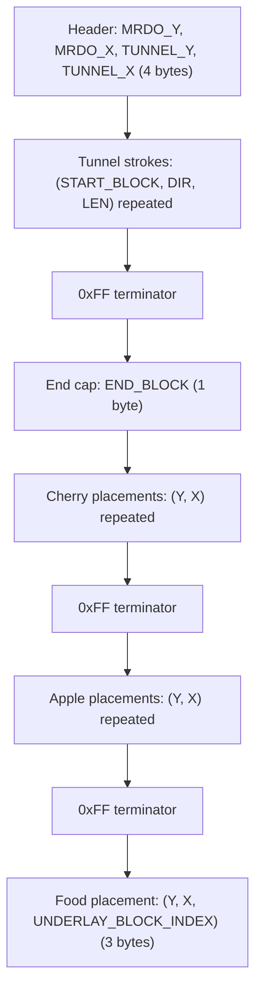
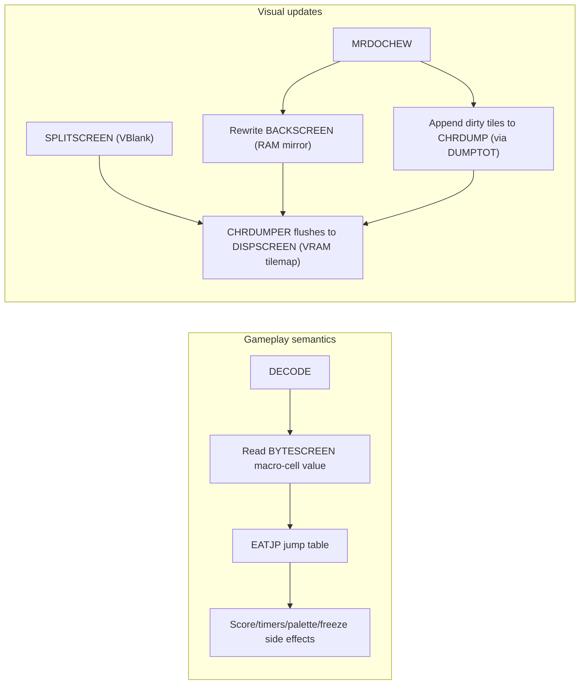
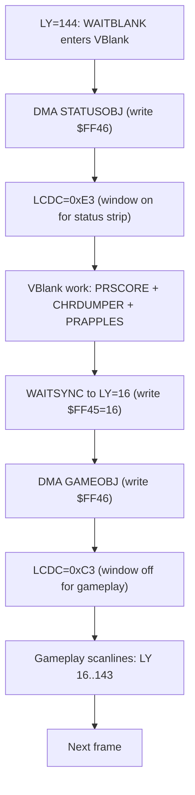

# Introduction
This page documents the official release of the assembly source for Ocean Software's Mr Do! port to the Game Boy.
It focuses on what the code is doing (maps, chewing, actors, rendering timing, and data formats), plus how to verify it in SameBoy.

## Start here
If you only read a few sections, these are the best "entry points" for understanding how the engine works:
* **Data formats** - Jump to [Scene format (maps, cherries, apples, food)](#scene-format-maps-cherries-apples-food) for the `SCENE` stream and the `BYTESCREEN` control map.
* **Core trick** - Jump to [Dirty-tile updates and why BACKSCREEN exists](#dirty-tile-updates-and-why-backscreen-exists) for the `BACKSCREEN` + `CHRDUMP` design.
* **Timing** - Jump to [Timing, VBlank, and the window split](#timing-vblank-and-the-window-split) for the mid-frame `LCDC` swap and OAM DMA strategy.
* **Hands-on** - Jump to [SameBoy debugger walkthrough](#sameboy-debugger-walkthrough) for watchpoints you can run immediately.

## Mr Do! - Game Boy Review
This video provides a brief look at the Game Boy port and is useful context before diving into the source [^6]:
<iframe width="560" height="315" src="https://www.youtube.com/embed/WniQSM86SP4" title="YouTube video player" frameborder="0" allow="accelerometer; autoplay; clipboard-write; encrypted-media; gyroscope; picture-in-picture; web-share" allowfullscreen></iframe>

---
# Source code release
The original release is a single monolithic assembly file (`mrdo.asm`) containing code, data tables, and large blocks of embedded graphics data [^2].

Description from Paul Hughes [^1]:
> Many moons ago I debugged and finished off Ocean's Mr Do! for the original Game Boy. 
> 
> As **Joffa**, the late, great original author, decided to release the source code, 
> 
> I thought I'd also put it up.

The header for the source file also mentions Wesley Knackers and gives a start date of June 28, 1990 and a last date of September 5, 1990:

```cpp
****************************************************************************
*									   *
*		MR DO! (C) 1990 SPECIAL FX SOFTWARE LIMITED		   *
*									   *
*		           BY WESLEY KNACKERS				   *
*									   *
*		  	  START DATE 28/06/90				   *
*		  	   LAST DATE 05/09/90				   *
*									   *
****************************************************************************
```

Known developers mentioned across the release and related posts:
* **Paul Hughes** - Debugged and finished off Ocean's Mr Do! for the original Game Boy (per his note) [^1].
* **Joffa** - The original author who released the source code (per Hughes) [^1].
* **Wesley Knackers** - Credited as the author in the `mrdo.asm` header [^2].

---
## Glossary of Key Terms
If you are new to Game Boy reverse engineering terminology, this quick glossary should help:
* <a id="glossary-dma"></a>**DMA** - The Game Boy OAM DMA mechanism used to copy 160 bytes of sprite attribute data into OAM via the `DMA` register (`$FF46`) [^3].
* <a id="glossary-oam"></a>**OAM** - Object Attribute Memory (`$FE00`) containing the hardware sprite list (position, tile, attributes) [^3].
* <a id="glossary-vram"></a>**VRAM** - Video RAM (`$8000-$9FFF`) containing tile graphics and background/window tilemaps [^3].
* <a id="glossary-wram"></a>**WRAM** - Work RAM (`$C000-$DFFF`) used for variables, buffers, and scratch space [^3].
* <a id="glossary-hram"></a>**HRAM** - High RAM (`$FF80-$FFFE`) used here to run short routines (including the DMA trigger) without being blocked during OAM DMA [^3].

---
# Code overview
The source is useful because it is not a "disassembly" or a ROM dump.
It is proper annotated game code with labels and routines that map closely onto the retail behaviour.

Some highlights worth skimming first:
* **Main loop** - `START` runs `SYSETUP`, `MENU`, and then enters a per-level loop that calls the gameplay subsystems in a predictable order.
* **State-machine style** - Multiple behaviours are selected via jump tables (`BADTAB`, `APPLETAB`, `LOGOTAB`, etc.) rather than long chains of branches.
* **2x2 meta-tiles** - The map is built from 4-tile blocks (top-left/top-right/bottom-left/bottom-right) with additional tables for "eaten" wall variants.
* **Split-screen rendering** - `SPLITSCREEN` does a status-window pass, then triggers OAM DMA for gameplay sprites after a timing delay.

---
# Deeper file tour
If you want to understand the game quickly, it helps to treat `mrdo.asm` as a handful of tightly-coupled subsystems that run in a strict per-frame pipeline.

## Frame pipeline
The `MAINLOOP` order is deliberate.
The parts that must run during VBlank (tilemap updates, OAM DMA) are clustered in `SPLITSCREEN`, and the rest of gameplay runs with predictable data flow:
Routine | What it does | Why it matters
---|---|---
`SPLITSCREEN` | Waits for VBlank, updates status, dumps dirty tiles, prints apples, then does <a href="#glossary-oam">OAM</a> <a href="#glossary-dma">DMA</a> swaps | Coordinates tilemap writes and sprite DMA so VRAM/OAM access stays safe
`KEYS` | Polls the joypad and writes `KEYPRESS` | Centralizes input sampling for the frame
`DECODE` | Updates Mr Do movement/animation and handles ball throwing | Implements turn validity checks and scroll updates
`MRDOCHEW` | Updates the "chewed" tunnel tiles around Mr Do | Writes tunnel state into the map mirror and queues tilemap updates
`BADDIES` | Updates all active enemies and special actors via `BADTAB` | Shared AI + per-type state machine updates
`COLLISIONS` | Checks the thrown ball against all 16x16 actors via `HITBALLTAB` | Handles catches, kills, freeze/unfreeze logic, and score popups
`APPLEPIE` | Updates apples via `APPLETAB` | Apple state machine (waiting, jiggle, falling, splitting)
`DUMPOBJ` | Builds the gameplay OAM list (`GAMEOBJ`) from sprite records | Includes a simple OAM-order mixing trick to reduce persistent flicker patterns
`STATSP` | Builds the status-window OAM list (`STATUSOBJ`) | Renders lives/extra letters + bonus monster status sprites
`CLOCK` / `RAND` / `FLAGS` | Timekeeping, RNG stirring, animation helpers | Keeps animation offsets and randomness consistent frame-to-frame

This diagram shows the per-frame call order as a pipeline:

```mermaid
flowchart LR
  SPLIT["SPLITSCREEN (VBlank work + OAM DMA)"] --> KEYS["KEYS (poll joypad)"]
  KEYS --> DECODE["DECODE (Mr Do movement + ball throw)"]
  DECODE --> CHEW["MRDOCHEW (tunnel updates + CHRDUMP)"]
  CHEW --> BADDIES["BADDIES (actor update via BADTAB)"]
  BADDIES --> COLL["COLLISIONS (ball vs actors via HITBALLTAB)"]
  COLL --> APPLE["APPLEPIE (apple states via APPLETAB)"]
  APPLE --> DUMP["DUMPOBJ (build GAMEOBJ OAM list)"]
  DUMP --> STATSP["STATSP (build STATUSOBJ OAM list)"]
  STATSP --> CLOCK["CLOCK"]
  CLOCK --> RAND["RAND"]
  RAND --> FLAGS["FLAGS"]
```


---
## Joypad polling and turn validation
Input is polled by `KEYS` using the standard `$FF00` joypad register scan, with repeated reads and bit-masking before the final nibble merge into `KEYPRESS`.
Mr Do turning is restricted to tile boundaries:
* **Tile boundary gating** - `DECODE` only considers direction changes when both `(X+8)&15 == 0` and `(Y+8)&15 == 0`, which effectively makes turns occur on a 16x16 grid even though positions are stored in pixels.
* **Directional validity tables** - The `VALIDLR` and `VALIDUD` tables translate the pressed direction bits into a "direction+1" value, letting the code reject invalid transitions cheaply.

---
## Coordinate transforms you will see everywhere
Multiple helper routines convert between pixel positions and addresses in different memory-backed maps:
* **`LOWAD` / `PIXAD`** - Convert pixel XY into a `DISPSCREEN` tilemap address.
* **`GETMAPHI` / `GETMAPLO`** - Convert pixel XY into a `BACKSCREEN` tilemap address.
* **`GETBYTEHI` / `GETBYTELO`** - Convert pixel XY into a `BYTESCREEN` byte-map address (used as a compact "control map" for tunnels/items).

If you are tracing code in an emulator, these routines are great stepping stones for understanding whether a subsystem is reading the "visual map" (`DISPSCREEN` / `BACKSCREEN`) or the compact control map (`BYTESCREEN`).

---
## Dirty-tile updates and why BACKSCREEN exists
The tunnel chewing system is optimized around a RAM mirror of the background tilemap:
* **Canonical map mirror** - `COPYMAP` copies `DISPSCREEN` into `BACKSCREEN` so gameplay logic can read/modify a RAM copy without touching VRAM constantly.
* **Chew writes go to `BACKSCREEN`** - `MRDOCHEW` edits `BACKSCREEN` tiles using direction-specific lookup tables (`UTL`, `UTR`, `UBL`, `UBR`, and friends).
* **Changes are queued** - The chewing code writes address+tile triples into `CHRDUMP` and increments `DUMPTOT`.
* **VBlank flush** - `CHRDUMPER` runs inside `SPLITSCREEN` and copies only the queued tile changes back into `DISPSCREEN`.

`CHRDUMPER` contains a particularly neat trick.
It stores queued addresses in the `BACKSCREEN` address space and then XORs the high byte so they point at the equivalent `DISPSCREEN` tilemap location.
That avoids storing two pointers per tile update and keeps the dirty list compact.

This is the `CHRDUMPER` hot loop, showing the XOR high-byte mapping:
```nasm
CHRDUMPER	LD	A,(DUMPTOT)	;ANY CHRS TO DUMP?
		OR	A
		RET	Z
		LD	B,A
		XOR	A
		LD	(DUMPTOT),A
		LD	HL,CHRDUMP
		LD	C,>DISPSCREEN^>BACKSCREEN
CDUMP		LD	E,(HL)
		INC	L
		LD	A,(HLI)
		XOR	C
		LD	D,A
		LD	A,(HLI)
		LD	(DE),A
		DEC	B
		JR	NZ,CDUMP
		RET
```

---
## Scene format (maps, cherries, apples, food)
The map/scene data (`SCENE1`..`SCENE10`) is a compact stream consumed by `DRAWMAP`.
At a high level, each scene contains:
Part | Encoding | Consumed by
---|---|---
Mr Do start + initial tunnel | 4 bytes: `MRDO_Y, MRDO_X, TUNNEL_Y, TUNNEL_X` | `DRAWMAP` then `DOTUNNEL`
Tunnel strokes | Repeating triples: `START_BLOCK, DIRECTION, LENGTH` terminated by `0xFF` | `DOTUNNEL` (draws a series of 2x2 blocks using `VECTAB2`)
End cap block | 1 byte: `END_BLOCK` | `ENDTUNNEL` (draws one final 2x2 block)
Cherry placements | Repeating pairs: `Y, X` terminated by `0xFF` | `PUTCHERRY` (draws a 2x2 cherry block at 4 offsets and increments `CHERRYTOT`)
Apple placements | Repeating pairs: `Y, X` terminated by `0xFF` | `PUTAPPLES` (initializes apple records and draws apple blocks)
Food placement | 3 bytes: `Y, X, UNDERLAY_BLOCK_INDEX` | `PUTFOOD` (draws the food block, then patches the underlay in `BACKSCREEN`)

This diagram shows the scene stream at a glance:


At the assembly level, the tunnel-stroke part of the stream is parsed by `DOTUNNEL` as a small self-recursing loop:
```nasm
DOTUNNEL	LD	A,(HLI)		;START BLOCK NUMBER
		CP	-1
		RET	Z
		ADD	A,A
		ADD	A,A
		LD	C,A
		LD	A,1
		CALL	DRAWBLOCK	;DRAW START BLOCK

		LD	A,(HLI)		;DIRECTION 0TO4
		ADD	A,A
		LD	B,A
		ADD	A,A
		LD	C,A		;C=BLOCK ADDR LOW
		LD	A,<VECTAB2
		ADD	A,B
		LD	B,A		;B=VECTOR TABLE ADDR LOW
		LD	A,(HLI)		;GET LENGTH

		PUSH	HL
		LD	H,>VECTAB2
DRAWREP		PUSH	AF
		LD	L,B
		LD	A,(HLI)		;MOVE TO NEXT POS
		ADD	A,E
		LD	E,A
		LD	A,(HL)
		ADD	A,D
		LD	D,A
		LD	A,1
		CALL	DRAWBLOCK	;DRAW REPEAT BLOCK
		POP	AF
		DEC	A
		JR	NZ,DRAWREP
		POP	HL
		JR	DOTUNNEL
```

The control-layer that makes this practical is `BYTESCREEN` (`$CC00`), which is defined as `$100` bytes.
That size is a strong hint that the gameplay logic is operating on a 16x16 grid of "macro cells" (each macro cell is a 2x2 set of 8x8 tiles, i.e. 16x16 pixels).

`DRAWBLOCK` writes a macro-cell value into `BYTESCREEN`, and `DECODE` reads it (via `GETBYTEHI`) to choose what happens when Mr Do enters a cell.
The values map directly onto the `EATJP` jump table:

Value | Meaning | `EATJP` target
---|---|---
0 | Solid wall / gravel (not yet tunneled) | `EATWALL` (slows Mr Do down while chewing)
1 | Tunnel / already-open cell | `EATUNNEL` (no-op)
2 | Cherry | `EATCHERRY` (score + sequence bonus + decrements `CHERRYTOT`)
3 | Apple | `EATAPPLE` (no-op here, apples are handled via the apple state machine)
4 | Food | `EATFOOD` (score + palette/freeze + spawns ghosts/bonus monster behaviour)

This is the core `BYTESCREEN` dispatch from `DECODE`, including the `EATJP` jump table:
```nasm
EATJP		DEFW	EATWALL		;00
		DEFW	EATUNNEL	;01
		DEFW	EATCHERRY	;02
		DEFW	EATAPPLE	;03
		DEFW	EATFOOD		;04

		CALL	GETBYTEHI
		LD	A,(HL)		;GET CONTROL BYTE
		LD	(HL),1		;SET TUNNEL BYTE
		ADD	A,A
		ADD	A,<EATJP
		LD	L,A
		LD	H,>EATJP
		LD	A,(HLI)
		LD	H,(HL)
		LD	L,A
		CALL	JPHL		;WORK EAT ROUTINE
```

The 2x2 meta-tile blocks themselves come from the `BLOCKS` table.
These are not "gameplay types", they are tilemap stamps (four bytes each) built from tile-id groups like `ED`, `CN`, `DT`, `CH`, `FD`, and `AP0`:

Block index | Purpose (from comments) | Typical use
---|---|---
`$00-$03` | Tunnel segments (U/R/D/L variants) | Repeated stamps for a tunnel stroke (`DOTUNNEL`)
`$04-$07` | Tunnel ends (U/R/D/L) | Start/end caps for strokes and final end cap (`DOTUNNEL` / `ENDTUNNEL`)
`$08-$0B` | Corners (TL/TR/BR/BL) | Corner shaping when building complex tunnels
`$0C-$0F` | Walls (top/right/bottom/left) | Wall shaping and underlays
`$10` | Cherry block | `PUTCHERRY` (placed as a 2x2 cluster of macro cells)
`$11` | Food block | `PUTFOOD` (drawn in VRAM)
`$12` | Apple block | `PUTAPPLES`
`$13` | Middle / filler | Used as a special-case stamp

The tunnel stroke direction encoding is consistent across the code:
the direction byte is used to index `VECTAB2` (macro-cell steps of 2 tiles) and to select which tunnel segment block (`$00-$03`) to stamp repeatedly.
In practice this behaves like a 4-way direction enum (up/right/down/left).

The food placement code is worth reading closely because it shows the kind of "tight" control-flow you get in commercial LR35902 assembly.
After drawing the food into VRAM using `DRAWBLOCK`, `PUTFOOD` computes the `BACKSCREEN` address for the same position and then jumps into the middle of `DRAWBLOCK` (`DRWBLOCK`) to stamp a 2x2 underlay block into the RAM mirror.
To make the stack clean up properly, it pushes `AF` three times so the `POP DE`, `POP BC`, and `POP HL` epilogue inside `DRAWBLOCK` has something to consume.
It is a tiny micro-optimization, but it is also a very "real world" example of trading readability for speed and code size.

---
## Tile ID taxonomy
This codebase relies heavily on treating a tile ID as a semantic category, not just a graphic.
Most comparisons are against the base constants that define the background tile groups:
Constant | Value | Used as
---|---|---
`WL` | `$00` | "Wall/gravel" tile group used for initial fill and tunnel shaping
`CH` | `$10` | Cherry tile group
`ED` | `$14` | Tunnel edge tile group (used by chewing, apple deformation, and ball bounce tables)
`CN` | `$1C` | Corner tile group
`DT` | `$20` | Dots/walkable tile group (also used by passability tests)
`WT` | `$24` | A single special tile labelled "WHITE CHR!"
`FD` | `$25` | Food tile group (background)
`AP0` | `$5C` | Apple tile group (background)

When you see code doing things like `CP DT+3` or `CP ED+7`, it is not doing collision against an object.
It is testing whether the background tile under an actor belongs to one of these groups.
You will also see a common trick in passability checks: it ORs the tile with `1` (`tile|1`) before comparing, which makes even/odd variants of an edge tile compare the same without a second branch.

There are similar "semantic tile ID" patterns on the sprite side.
For example, the 2x2 sprite expansion uses `CHRTABLE` to translate an animation frame index into four tile IDs plus per-quadrant flags (flip, palette, etc.).

---
## Chew algorithm deep dive
The chewing system is split between "gameplay semantics" (what happens when you enter a macro cell) and "visual updates" (how tiles are rewritten).

This diagram shows those two layers side-by-side:


At the semantic level, `DECODE` reads a macro-cell value from `BYTESCREEN` and dispatches via `EATJP`:
* **0** - `EATWALL` slows movement (sets `SPEED` and `SPDCOW`) while you are chewing.
* **1** - `EATUNNEL` does nothing (already-open cell).
* **2** - `EATCHERRY` decrements `CHERRYTOT` and adds score, including a small sequence bonus controlled by `CHERRYBON`/`CHERRYDEL`.
* **3** - `EATAPPLE` is a no-op here (apples are driven by the apple state machine).
* **4** - `EATFOOD` adds score and triggers the "food mode" effects (palette change + `FREEZE` + extra/ghost behaviour).

At the visual level, `MRDOCHEW` performs a 2x2 macro-cell rewrite into `BACKSCREEN`, and queues the corresponding `DISPSCREEN` updates for VBlank:
* **Grid gating** - It only chews when the mouth position is aligned to an 8-pixel boundary (`(x|y)&7 == 0` after a small offset).
* **Allocate dirty slots** - It uses `DUMPTOT` as an index into `CHRDUMP`, increments it by 4, and computes `HL` so there is room for four tile updates.
* **Resolve direction** - It dispatches through `CHEWJP` based on Mr Do's facing direction (`MRDOSP+FLG`).
* **Rewrite a 2x2** - Each `CHEW*` routine computes four replacement tiles using direction-specific tables (`UTL/UTR/UBL/UBR`, `LTL/LTR/LBL/LBR`, `DTL/DTR/DBL/DBR`, etc.), writes the new tiles into `BACKSCREEN`, and writes four `(addrLo, addrHi, tile)` triples into `CHRDUMP`.
* **VBlank flush** - `CHRDUMPER` runs during the next `SPLITSCREEN` and applies each queued tile to `DISPSCREEN`.

The core reason this is robust is that `BACKSCREEN` is treated as the canonical map state.
VRAM only gets updated in bursts via `CHRDUMPER`, which keeps the chew logic simple and makes it easy to reproduce in a reimplementation.

---
## Apple state machine
Apples are driven by a compact state machine very similar to the enemy and ball systems.
Each apple is a fixed-size record in `APPLESP`, and `APPLEPIE` iterates `APNUM` entries and dispatches via `APPLETAB` based on `TYP`.

The apple states are:
Value | Meaning | Update routine
---|---|---
0 | Inactive slot | `NOAPPLE`
1 | Waiting / on the map | `APPLEWAIT`
2 | Wobble ("jig") before falling | `APPLEJIG`
3 | Falling | `APPLEFALL`
4 | Splitting / impact animation | `APPLESPLIT`

`APPLEWAIT` does a very cheap support test by reading the two tiles under the apple (left and right) from the background mirror.
If either tile is less than `CH+4`, it treats that as "solid" and the apple does not fall.
If both tiles look passable, it increments `TYP` and starts a 60-frame wobble.

`APPLEJIG` uses `SPEEDFLAG` bit 2 (`%100`) to toggle the tile index (`AP0` vs `AP0+4`), which gives you a free shake animation without moving the apple.

`APPLEFALL` is the most interesting part because it is integrated with the dirty-tile system:
* **Rate control** - It uses `APPLEAND` masked with `SPEEDFLAG` to slow the fall rate (difficulty scaling).
* **Background restore** - It queues tile restores into `CHRDUMP` so the old apple stamp is erased in the next VBlank.
* **Wall deformation** - After a "critical point" (when the falling counter reaches 3), it starts modifying the edge tiles it passes through using `LAFALL` and `RAFALL`.

`APPLESPLIT` enforces that only one apple can do the expensive 4-tile split write per frame using the `SPLAT` flag ("done once").
That is a very pragmatic performance guard: without it, multiple apples impacting in the same frame would explode the dirty-tile list and VRAM work.

---
## Ball states and bounce tables
The ball is implemented as another actor type dispatched via `BADTAB`, with multiple states:
carried (`CARRYBALL`), thrown (`THROWBALL`), spinning out (`OUTBALL`), and returning (`INBALL`).

When carried, the ball is positioned relative to Mr Do using the facing direction and a small offset table.
The key tables are:
Table | Role | Notes
---|---|---
`BALLOFF` | Base XY offset from Mr Do | Indexed by direction
`BALLXY` | Extra 1-pixel offsets | Gives a 4-frame wobble animation
`BALLVEC` | Movement deltas | Maps direction to `(dx, dy)` at `BALLSPEED`

When thrown, `THROWBALL` is deliberately grid-gated:
it only does a bounce decision when `(x+4)&7 == 0` or `(y+4)&7 == 0`.
On those alignments it reads the contacted tile ID from the background mirror:
* **Wall/cherry class** - If the tile is less than `CH+4`, it always flips direction (`dir ^= 2`).
* **Bounce lookup** - Otherwise it scans a per-direction list of bounce-trigger tiles (`BALLCPS`) and uses a parallel bounce table (`BALLBOU`) to pick the new direction.
  One of the bounce entries has bit 7 set, enabling a small `RND3` perturbation that is explicitly commented as preventing the ball from getting trapped in repeatable ricochet loops.

This is the bounce decision core inside `THROWBALL`:
```nasm
		LD	L,E
		LD	H,D
		CALL	GETMAPHI	;HL=SCRN3 ADDR

		LD	A,(HL)		;GET CHR
		CP	CH+4		;WALL OR CHERRY?
		JR	NC,NOCHWL
		LD	A,B		;THEN ALWAYS FLIP DIRECTION
		XOR	2
		LD	B,A
		JR	NOCHN

NOCHWL		PUSH	DE
		LD	E,A

		LD	A,B		;GET LAST DIRECTION
		ADD	A,A
		LD	L,A
		ADD	A,A
		ADD	A,L
		ADD	A,<BALLCPS
		LD	L,A
		LD	H,>BALLCPS

		LD	D,6		;TOTAL NUMBER OF CHRS TO CHECK
BCHECK		LD	A,(HLI)		;HAVE WE HIT A VALID CHR?
		CP	E
		JR	NZ,NOBHIT

		LD	A,BALLBOU-BALLCPS-1
		ADD	A,L
		LD	L,A		;INDEX BOUNCE VECTORS
		LD	A,(HL)		;GET NEW BOUNCE DIRECTION
		BIT	7,A		;BIT OF RND?
		JR	Z,NRNDB

		LD	B,A
		LD	A,(RND3)	;STOPS BEING TRAPPED!
		AND	2
		ADD	A,128
		XOR	B

NRNDB		LD	B,A
		POP	DE
```

After a kill, the ball enters a circular spin-out phase (`OUTBALL`).
This uses the `CIRCLE` routine (lookup table + quadrant xor) and a small multiply trick (`MULTIE` / `MULTID`) to scale the circle output, then adds that to a stored centre position.
When the counter reaches a threshold it transitions into `INBALL` and eventually reattaches to Mr Do.

---
## Timing, VBlank, and the window split
Most of the rendering safety in this codebase comes from two tiny wait primitives:
Routine | Mechanism | Used for
---|---|---
`WAITBLANK` | Sets `LYC=144` and busy-waits for `STAT` bit 2 (LYC=LY) | Entering VBlank before touching VRAM/tilemaps
`WAITSYNC` | Sets `LYC=A` and busy-waits for `STAT` bit 2 | Scheduling mid-frame changes (like the status/gameplay split)

This is the full implementation of both waits in `mrdo.asm`:
```nasm
WAITBLANK	LD	A,144
WAITSYNC	LD	(LYC),A
WAITSC		LD	A,(STAT)
		BIT	2,A
		JR	Z,WAITSC
		RET
```

This diagram shows the split-screen timing model across a frame:


`SPLITSCREEN` combines these waits with `LCDC` writes to effectively toggle the status window on and off within a single frame.
This is also where OAM DMA happens, so if you are debugging timing issues in an emulator, `WAITBLANK`, `WAITSYNC`, and writes to `LCDC`/`DMA` are the most information-dense breakpoints you can set.

The split itself is implemented as a two-phase OAM DMA swap:
* **VBlank entry** - `WAITBLANK`, then <a href="#glossary-oam">OAM</a> <a href="#glossary-dma">DMA</a> `STATUSOBJ` so scanlines 0..15 use the status OAM list.
* **Status mode** - Enable the window with `LCDC=0xE3` and do VBlank work (`PRSCORE`, `CHRDUMPER`, `PRAPPLES`).
* **Boundary sync** - `WAITSYNC` to `LY==16` (a 16-pixel strip).
* **Gameplay swap** - <a href="#glossary-oam">OAM</a> <a href="#glossary-dma">DMA</a> `GAMEOBJ`, then disable the window with `LCDC=0xC3` for the rest of the frame.

The DMA trigger itself is a tiny stub (`DMATRANS`) that `SYSETUP` copies into <a href="#glossary-hram">HRAM</a> (`$FF80`) and calls via the `BLITS` label.
This is the classic safe-DMA pattern: during OAM DMA the CPU can still execute from HRAM even though most other memory access is blocked.

This is the stub and the `SYSETUP` copy loop that installs it into `INTRAM` (`$FF80`):
```nasm
DMATRANS	DI
		LD	(DMA),A
		LD	A,40
DMAL		DEC	A
		JR	NZ,DMAL
		EI
		RET

		LD	HL,DMATRANS	;SETUP DMA TRANS ROUTINE
		LD	DE,INTRAM
		LD	B,SYSETUP-DMATRANS
TOINTRAM	LD	A,(HLI)
		LD	(DE),A
		INC	E
		DEC	B
		JR	NZ,TOINTRAM
```

One caveat when rebuilding this release is that `SYSETUP` enables interrupts (`IE=1` then `EI`) but the file does not obviously define an interrupt handler ending in `RETI`.
If you try to assemble/port this code, verify what ends up at the interrupt vectors (especially `$0040`) before leaving IME enabled.

---
## SameBoy debugger walkthrough
If you want to verify the claims above, SameBoy's textual debugger is a good fit because it supports write watchpoints and conditional expressions [^5].

To use the textual debugger you generally:
* **Pause** - Press Control+C (or use the `interrupt` command).
* **Instrument** - Set breakpoints and watchpoints.
* **Run** - Use `continue` and let the emulator stop at interesting writes.

### Suggested watchpoints
These watchpoints catch the most important hardware edges and RAM mirrors:
Target | Why it matters | SameBoy command
---|---|---
`$FF46` | <a href="#glossary-oam">OAM</a> <a href="#glossary-dma">DMA</a> trigger (writes happen in `SPLITSCREEN`) | `watch/w $ff46`
`$FF40` | `LCDC` mode changes (window on/off and LCD state) | `watch/w $ff40`
`$FF45` | `LYC` scheduling for mid-frame timing (`WAITSYNC`) | `watch/w $ff45`
`$C800-$CBFF` | `BACKSCREEN` RAM mirror (canonical background state) | `watch/w $c800 to $cbff`
`$CC00-$CCFF` | `BYTESCREEN` macro-cell control map (0..4 for `EATJP`) | `watch/w $cc00 to $ccff`

If the `BACKSCREEN` and `BYTESCREEN` ranges are too noisy, narrow them temporarily to what you are currently testing (or delete/re-add watchpoints as needed).

### Lab 1 - Prove the window split
This lab is just enough to prove `SPLITSCREEN` is doing a mid-frame OAM DMA swap and toggling the window:
* **Instrument** - `watch/w $ff46` and `watch/w $ff40`.
* **Run** - `continue` and let SameBoy stop on `$ff46`.
* **Confirm the double-hit** - Continue a few times and you should see `$ff46` hit twice per frame (status OAM, then gameplay OAM).
* **Confirm the mode change** - When `$ff40` hits, check if the value matches the two modes described above (`0xE3` vs `0xC3`).

### Lab 2 - Prove chewing is BYTESCREEN + BACKSCREEN + CHRDUMP
This lab connects "macro-cell semantics" to "tilemap updates":
* **Instrument** - `watch/w $cc00 to $ccff` and `watch/w $c800 to $cbff`.
* **Chew a wall** - Walk into an unchewed area and wait for a `$cc00-$ccff` write (macro-cell type changes).
* **Watch the mirror update** - Continue and you should see `$c800-$cbff` writes as edge tiles are rewritten in `BACKSCREEN`.
* **Watch the flush (optional)** - Temporarily add `watch/w $9800 to $9bff` and you should see the queued updates land in VRAM during the next `SPLITSCREEN`.

### Debugging the window split and OAM DMA
To see the split-screen renderer in action, do this:
* **Start running** - Use `continue`.
* **Stop on OAM DMA** - The `$ff46` watchpoint should hit twice per frame (status DMA, then gameplay DMA).
* **Inspect state** - Use `lcd`, `dma`, and `registers`, then `disassemble/32 pc` to see the immediate code path.

Useful debugger commands at those stops are:
```text
lcd
dma
registers
disassemble/32 pc
```

If you want to focus on the moment the window toggles, use a conditional watchpoint on `LCDC`:
```text
watch/w $ff40 if new != old
```

### Debugging tunnel chewing and dirty-tile flushes
To connect Mr Do chewing with background writes:
* **Stop on `BYTESCREEN` writes** - Move into a wall and watch for writes into `$cc00-$ccff` (macro-cell type changes).
* **Stop on `BACKSCREEN` writes** - Watch for tunnel edge tiles being rewritten in `$c800-$cbff`.
* **Observe the VBlank flush** - If you temporarily watch `DISPSCREEN` (`$9800-$9BFF`), you should see the queued updates being applied during the next `SPLITSCREEN` when `CHRDUMPER` runs.

If you do want to watch the VRAM tilemap itself, limit it to short bursts because it is very high traffic:
```text
watch/w $9800 to $9bff   # DISPSCREEN (VRAM tilemap) - expect lots of hits
```

### Debugging apples
Apple falling is a good demonstration of this engine's "update RAM mirror, flush in VBlank" strategy.
When an apple transitions from `APPLEWAIT` to `APPLEFALL` you should see:
* **`BACKSCREEN` writes** - The apple punches through tunnel edge tiles (via `LAFALL`/`RAFALL` after the critical point).
* **Dirty-tile flush** - The queued updates are applied in the next VBlank when `CHRDUMPER` runs.

### Debugging ball bounces
Ball bounces are easiest to catch by letting the `$c800-$cbff` watchpoint stop you while the ball is in flight, then stepping until you hit a bounce decision and noting the current tile ID being compared against `BALLCPS`.

In practice the bounce decision points are rare because `THROWBALL` only checks collisions on an 8-pixel grid alignment.
If you are not seeing interesting stops, throw the ball into a dense area of tunnel corners/walls and let it ricochet.

---
## Enemy AI is shared and table-driven
The baddie update loop (`BADDIES`) is structurally very similar to the apple loop:
* **Update dispatch** - `BADTAB` maps `TYP` to the update routine for dinos, ghosts, the bonus monster states, ball states, and score popups.
* **Junction decisions** - `FINDEXITS` scans the 2x2 neighbourhood around an actor on 8-pixel boundaries and returns an exit bitmask.
* **Direction selection** - `WORKEXITS` validates the current direction (via `VECTOBIT`) and then chooses a new one using a bounded retry loop against `BITAB`/`BITTOVEC`, stirred by `RND1`/`RND2`.

This is a nice example of how multiple enemies can share navigation logic while still having distinct "animation and special case" behaviour per type.

One detail that helps when tracing enemy movement is the exit bit layout.
`FINDEXITS` sets bits in the returned mask in a slightly non-obvious order:
bit 3 is up, bit 0 is right, bit 2 is down, and bit 1 is left.
That ordering matches the `VECTOBIT` and `BITTOVEC` tables used by `WORKEXITS`.

The other critical detail is that passability is decided purely by tile IDs in `BACKSCREEN`.
`FINDEXITS` effectively whitelists a handful of `DT+*` and `ED+*` variants:
* **Up** - tile is `DT+1` or `DT+3` or `(tile|1) == ED+3`
* **Right** - `(tile|1) == DT+3` or `(tile|1) == ED+5`
* **Down** - tile is `DT+0` or `DT+2` or `(tile|1) == ED+7`
* **Left** - tile is `DT+1` or `(tile|1) == ED+1`

This is the full `FINDEXITS` tile-whitelist routine, including the `%UDLR` bit layout:
```nasm
;DE=XY RETS A=%UDLR BITS
FINDEXITS	PUSH	DE
		LD	L,E
		DEC	L
		LD	H,D
		DEC	H
		CALL	GETMAPHI
		LD	DE,$0100

		LD	A,(HLI)	;TOP CHR...
		CP	DT+1
		JR	Z,ISUP
		CP	DT+3
		JR	Z,ISUP
		OR	D
		CP	ED+3
		JR	NZ,NOUP
ISUP		SET	3,E
NOUP		LD	A,(HL)	;R CHR...
		OR	D
		CP	DT+3
		JR	Z,ISRT
		CP	ED+5
		JR	NZ,NORT
ISRT		SET	0,E
NORT		LD	A,L
		ADD	A,32
		LD	L,A
		ADC	A,H
		SUB	L
		LD	H,A
		LD	A,(HLD)	;BOT CHR...
		CP	DT+0
		JR	Z,ISDW
		CP	DT+2
		JR	Z,ISDW
		OR	D
		CP	ED+7
		JR	NZ,NODW
ISDW		SET	2,E
NODW		LD	A,(HL)	;L CHR...
		OR	D
		CP	DT+1
		JR	Z,ISLF
		CP	ED+1
		JR	NZ,NOLF
ISLF		SET	1,E
NOLF		LD	A,E
		POP	DE
		RET
```

`WORKEXITS` then adds a few pragmatic behaviours:
* **Keep direction if possible** - If the current direction remains valid, it usually keeps going.
* **Forced randomness** - Even when a direction is valid, it forces a re-pick roughly 1/8 of the time (`RND2 & 7 == 0`).
* **Bounded search** - When it must pick a new direction, it tries up to 4 candidates.

This is the core of `WORKEXITS`, showing how it keeps direction when possible and otherwise picks a new one using `BITAB` and `BITTOVEC`:
```nasm
WORKEXITS	PUSH	DE
		LD	D,L
		LD	E,A		;TEMP EXITS

		LD	A,B		;GET OLD DIR
		ADD	A,<VECTOBIT
		LD	L,A
		LD	H,>VECTOBIT
		LD	A,(HL)
		AND	E		;IS DIR AN OPTION
		JR	Z,CHANGEDIR

		LD	A,(RND2)	;RND MOVE
		AND	7
		JR	NZ,DINODE

CHANGEDIR	LD	A,(RND1)
		ADD	A,D
		SRL	A
		SRL	A
		SRL	A
FINDEX		LD	D,A
		AND	3
		ADD	A,<BITAB
		LD	L,A
		LD	A,(HL)
		AND	E
		JR	NZ,GOEXIT
		LD	A,D		;WILL DO MAX 4 TIMES ONLY!
		INC	A
		JR	FINDEX

GOEXIT		LD	A,(HL)
		ADD	A,<BITTOVEC
		LD	L,A
		LD	B,(HL)		;NEW DIRECTION
DINODE		POP	DE
		RET
```

---
## Collisions are simple AABB tests plus a jump table
`COLLISIONS` does an axis-aligned bounding-box overlap test in 16x16 space between the moving ball and every 2x2 actor.
On hit, it dispatches via `HITBALLTAB` to routines like `MRDOCATCH`, `DINODIE`, and `GHOSTDIE`.

This makes the collision layer easy to extend:
you can add a new actor type by adding a `BADTAB` entry (update) and a `HITBALLTAB` entry (ball interaction) without touching the collision loop itself.

Ball-vs-world behaviour is tile-driven and grid-gated.
The thrown ball only does bounce decisions when it is aligned to an 8-pixel grid, and then compares the contacted tile against per-direction tables (`BALLCPS` and `BALLBOU`), with a small RNG hook to reduce repeatable trap patterns.

---
## Sprite dumping and OAM ordering
`DUMPOBJ` converts logical actor records into actual OAM entries.
Each 2x2 sprite frame is expanded into four OAM entries using `CHRTABLE`, which stores tile indices and flags for the four quadrants.

There is also a small per-frame "OAM address mixing" step:
it varies the `ADL` fields for the first 8 sprite records and then uses `OBJSWAP` for the rest.
This kind of deterministic shuffling is commonly used to avoid the same sprite always losing when the hardware sprite-per-scanline limit is exceeded.

This is the start of `DUMPOBJ`, including scroll inversion and the `ADL` mixing pass:
```nasm
DUMPOBJ		LD	A,(NEWSCX)	;INVERT SCROLL OFFSETS
		CPL
		INC	A
		LD	(SCXT),A
		LD	A,(NEWSCY)
		CPL
		ADD	A,9
		LD	(SCYT),A

		LD	HL,SPRITES+ADL	;SWAP 8 OBJ POINTERS
		LD	DE,EVAR
		LD	A,(SPEEDFLAG)
		LD	C,A
		SWAP	A
		LD	B,8
MPLEX		AND	%01110000
		LD	(HL),A
		ADD	A,16
		ADD	HL,DE
		DEC	B
		JR	NZ,MPLEX
```

---
## Status line updates are deliberately amortized
The status line is updated a little at a time:
* **One digit per frame** - `PRSCORE` uses `SPEEDFLAG & 7` to update only one score digit tile each frame rather than writing all digits every frame.
* **Timers as ASCII digits** - `CLOCK` increments ASCII digits in-place and carries when a digit exceeds `"9"`.

`PRSCORE` is driven by a small pointer table (`STATNUM`) that pairs a destination tile address in `STATSCREEN` with a source byte in `REALSCORE`.
The `SPEEDFLAG & 7` index means each of the 6 score digits plus two spare slots can be refreshed gradually while keeping per-frame VRAM writes tiny.

The underlying score representation is very literal:
* **Main score** - `REALSCORE` is a 6-byte ASCII string (`"000000"`).
* **Per-level board** - `SCORE` stores multiple fixed-length records (`BRDLEN = 9`) that include score digits and extra per-level stats, with `TALLOFF` selecting the active record.

Score adds go through `SCOREADD` / `UPSCORE`, which perform ASCII digit addition with carry propagation.
That makes it easy to add different point values by passing "digit + offset" pairs rather than doing binary-to-decimal conversion every time.

---
## High score table
High scores are stored as a simple fixed-size table (`ENTRIES = 8`) beginning at `HIGHTAB`.
Each entry is `LINELEN = 12` bytes, laid out as:
Field | Bytes | Notes
---|---|---
Score | 6 | ASCII digits (same format as `REALSCORE`)
Name | 3 | Initials, wiped to `$FF` on insert
Scene | 1 | Stored as a binary value (printed via `PRDECDIGITS`)
Time | 2 | A tick count that is divided by 60 for `MM;SS` printing

`CHECKHIGH` compares `REALSCORE` against each table entry digit-by-digit and inserts the new score by shifting the table down in memory.
`PRHIGHSCORES` then prints the table into the status tilemap and formats the time by dividing the stored ticks into minutes and seconds.

---
# Memory map and data structures
The file defines a set of fixed addresses that make its rendering and buffering model easier to follow.
This is also a good example of how much you can get done on a ROM-only cartridge by leaning on careful RAM layout.

Key addresses used throughout the code are:
Name | Address | Notes
---|---|---
`STACK` | `$CFFF` | Stack top (end of WRAM)
`OBJSET` | `$8000` | Sprite tile data base in <a href="#glossary-vram">VRAM</a>
`BGSET` | `$9000` | Background tile data base in <a href="#glossary-vram">VRAM</a>
`DISPSCREEN` | `$9800` | Background tilemap for gameplay
`STATSCREEN` | `$9C00` | Background tilemap for the status window
`BACKSCREEN` | `$C800` | RAM buffer used for background work
`BYTESCREEN` | `$CC00` | Small RAM buffer used as scratch / temp
`OAMRAM` | `$FE00` | <a href="#glossary-oam">OAM</a>
`INTRAM` | `$FF80` | <a href="#glossary-hram">HRAM</a>

## Sprite records
The game uses fixed-size records in WRAM to represent sprites and "actors".
The comments in the `SPRITES` block give the layout, and you can see the same pattern repeated in multiple systems (Mr Do, dinos/ghosts, apples).

The sprite record fields are:
Field | Offset | Purpose
---|---|---
`TYP` | 0 | Actor type (used as an index into jump tables)
`YNO` | 1 | Y position (pixel units)
`XNO` | 2 | X position (pixel units)
`GNO` | 3 | Base tile index / graphics selector
`FLG` | 4 | Flags (palette, flip, priority, etc.)
`ADL` | 5 | Pointer / address low byte (varies by actor)
`YSD` | 6 | Y speed / delta
`XSD` | 7 | X speed / delta

---
# Main loop and jump-table pattern
At the top level the program flow is very direct:
* **Boot** - `START` sets up the stack, calls `SYSETUP`, runs the menu, and resets the game state.
* **Per level** - `LEVELSETUP` prepares graphics and variables and then drops into `MAINLOOP`.
* **Per frame** - `MAINLOOP` calls the major gameplay subsystems (input, Mr Do movement/eating, baddies, collisions, apples, sprite dumping, timers, RNG, and flag updates).

One of the most reusable techniques in the file is the jump-table driven state machine.
For example, `BADTAB` maps each actor type to its update routine, and `APPLETAB` does the same for apple states.
This is a good pattern to steal when writing your own LR35902 assembly because it keeps the hot-path branch structure compact.

---
# Rendering, split-screen, and DMA
The code uses two different "sprite worlds" and then does a timed swap:
* **Status sprites** - A separate OAM-shaped buffer (`STATUSOBJ`) is DMA'd first, with the LCDC configured so the status window is enabled.
* **Gameplay sprites** - After updating the status line graphics, the code waits a fixed amount of time and then DMA's the gameplay sprite list (`GAMEOBJ`) and disables the status window again.

This is orchestrated by `SPLITSCREEN`, and it relies on a tiny DMA-trigger routine being copied into <a href="#glossary-hram">HRAM</a> during `SYSETUP`.
The routine is then called via the `BLITS` label, passing the source high-byte in `A` before writing to `DMA` (`$FF46`) [^3].

If you are reverse engineering the ROM in an emulator, the easy breakpoint targets are:
* **OAM DMA** - writes to `$FF46` (DMA).
* **Mode changes** - writes to `LCDC` (`$FF40`) to enable/disable the window.

---
# Map format and 2x2 meta-tiles
The background is assembled from 2x2 blocks of tile IDs.
The `BLOCKS`, `CORNERS`, `CHERRY`, `FOOD`, and `APPLE` tables each store 4 bytes in the order "top-left, top-right, bottom-left, bottom-right".

There are also multiple "eat tables" (for example `UTL`, `UTR`, `UBL`, `UBR`) that appear to define the replacement tiles to use when Mr Do chews through walls in a particular direction.
If you are trying to re-implement or rewrite the map system, these tables are a good anchor for reconstructing the exact tile semantics.

---
# RNG and text routines
The RNG is a compact 3-byte state (`RND1`, `RND2`, `RND3`) stirred each frame and mixed with the `DIV` hardware register.
It is small enough that you can single-step it and see how entropy flows into map generation (for example the gravel fill in `DRAWMAP`).

The text routines are also worth a quick look because they show a very practical "engine" approach:
strings are stored in a compact custom format, and `PRINTEXT` renders them directly into the background tilemap.

---
# Assembling it today
The source uses an older assembler dialect with directives like `DEFB`, `DEFW`, `DEFS`, `HEX`, `ORG`, and `ENT`.
That means you should not expect it to assemble cleanly with modern `rgbds` without some conversion work [^4].

## Original Assembler
The custom assembler for this file was either Special FX's own Gameboy assembler or Ocean's own Atari ST based assembler according to Paul Hughes in his tweet [^7]:
<blockquote class="twitter-tweet"><p lang="en" dir="ltr">It was started on Special FX's own Gameboy assembler and hardware and was finished on Ocean's own Atari ST based assembler and hardware.</p>&mdash; Paul Hughes (@PaulieHughes) <a href="https://twitter.com/PaulieHughes/status/1231294467879116800?ref_src=twsrc%5Etfw">February 22, 2020</a></blockquote>

It would be great to find out more about either Special FX or Ocean's development kit hardware, so please get in touch if you have any information.

If you want to get it building as an exercise, a reasonable approach is:
* **Start with `rgbds` scaffolding** - Create a ROM0 header section and make sure the reset entry and cartridge header bytes land at the expected addresses [^3][^4].
* **Convert directives mechanically** - Map `DEFB`/`DEFW`/`DEFS` to `db`/`dw`/`ds`, and replace `HEX` blocks with `db $..` sequences.
* **Replace `ORG` with sections** - Translate fixed `ORG` placements into `SECTION` blocks pinned to ROM0/ROMX addresses.
* **Validate in an emulator** - Use breakpoints on `$FF46` and `LCDC` to confirm you are hitting the same high-level flow as the original.

Also note that the in-file cartridge header comments claim a 256K ROM, but the ROM size byte in the header is written as `0`.
If you do attempt a rebuild, you will need to reconcile those fields with the actual output ROM size.

## RGBDS conversion script
We have written a best-effort converter that keeps the original `mrdo.asm` untouched and produces a RGBDS-parseable `.asm` file:
<script src="https://gist.github.com/RetroGameDeveloper/bfecf7c09eea56398f4bc66d25d4d5ee.js"></script>

What it does:
* converts `EQU`/`DEFB`/`DEFW`/`DEFS`, turns `HEX` into `db $..`, and maps each `ORG` to an explicit `SECTION`.
* **Heuristic bank split** - The converter includes a pragmatic split so the output links as a simple ROM-only build: `ORG $800` becomes fixed ROMX bank 1 code, and the `SCENE1`+ data block is placed back into ROM0 at `$0800`.
* **Main limitation** - The original toolchain could pre-initialize RAM, but RGBDS cannot, so WRAM/HRAM sections in the output are primarily for symbol addresses (you still need real init/copy code for a working rebuild).
* **Interrupt vector stubs** - The converter injects `reti` stubs at `$0040/$0048/$0050/$0058/$0060` because the release enables interrupts (`IE=1` then `EI`) but does not define handlers in the vector table. Without this, a rebuild will often crash or "flash" as soon as VBlank fires [^3].

One thing to keep in mind is that this converted build is not trying to match the retail ROM layout.
The retail Mr Do! ROM is a banked `MBC1` cartridge and is effectively a 64 KiB-class image (4 x 16 KiB banks), while the current converter is set up to link a minimal 2-bank layout so you can explore the code paths quickly.
To produce a ROM image that matches retail size and banking, you will need to:
* split the file into multiple `ROMX` banks (and use a MBC header / `rgbfix` flags that match the chosen banking model) and
* reconcile which content belongs in which bank by comparing against a known-good retail ROM (checksums + bank contents).


### Installing RGBDS
If you want to run the `rgbasm`/`rgblink` sanity-check commands locally, install RGBDS first:
* **macOS** - Install via Homebrew (`brew install rgbds`) [^8].
* **Linux** - Install via your distro package manager, or use the official release tarball + `install.sh` [^9].
* **Windows** - Use WSL and follow the Linux instructions, or use the official `.zip` release and add it to your `PATH` [^10].

To generate a converted file:
```bash
python3 scripts/convert-mrdo-to-rgbds.py mrdo.asm build/mrdo.rgbds.asm
```

If you have RGBDS installed, you can sanity-check that the output parses and links:
```bash
rgbasm -o build/mrdo.o build/mrdo.rgbds.asm
rgblink -o build/mrdo.gb build/mrdo.o
rgbfix -v -p 0 build/mrdo.gb
```

## Rebuild feasibility checklist
If you want to go from "interesting source release" to a reproducible modern build, these are the main technical unknowns to resolve:
* **Interrupt vectors** - `SYSETUP` sets `IE=1` and executes `EI`, but `mrdo.asm` does not obviously define an ISR ending in `RETI`. You will want to verify what the original ROM has at `$0040` and friends before leaving IME enabled.
* **Header fields** - The header code writes `CARTRIDGE TYPE = 0` (ROM-only) and `ROM SIZE = 0` (which is 32 KiB in the standard header encoding), but the comment claims 256K. A rebuilt ROM must pick consistent header values and banking strategy.
* **Banking model** - The file uses fixed `ORG` placements and does not contain explicit MBC register writes, which is consistent with ROM-only or a custom build step that split content across banks. If the retail game is larger than 32 KiB, you will need to decide how to map this file into ROM0/ROMX.


## Key takeaways
If you want a quick summary of what makes this source release interesting from a reverse engineering perspective:
* **RAM mirror + dirty queue** - `BACKSCREEN` acts as the canonical map state and `CHRDUMP` batches the VRAM writes for VBlank.
* **Macro-cell control map** - `BYTESCREEN` turns map semantics into a simple 0..4 lookup (`EATJP`), separating gameplay rules from tile stamping.
* **Table-driven everything** - Actors, apples, collisions, and menus all lean on jump tables rather than deep branch trees.
* **Timing-first renderer** - The split-screen HUD is a deliberate `LYC`-timed `LCDC` toggle with an OAM DMA swap mid-frame.
* **Pragmatic performance guards** - Small flags like `SPLAT` and amortized updates like `PRSCORE` keep worst-case frames under control.

---
# Fun breadcrumbs in the comments
The release is full of tiny details that give it some personality and make it easier to follow.
Some examples you will see while browsing:
* **"STOPS STUPID BUG!"** - A defensive load before a compare in the status-sprite dump routine.
* **`HIGHBUFF`** - A hardcoded string containing `FROBUSH HERE` in the high-score data block.


---
# References
[^1]: [Paul Hughes - Downloads](https://www.pauliehughes.com/downloads.htm)
[^2]: [Paul Hughes - Mr Do GB source (mrdo.asm)](https://www.pauliehughes.com/index_htm_files/mrdo.asm)
[^3]: [Pan Docs (Game Boy technical reference)](https://gbdev.io/pandocs/)
[^4]: [RGBDS documentation](https://rgbds.gbdev.io/)
[^5]: [SameBoy debugger documentation](https://sameboy.github.io/debugger/)
[^6]: [Mr. Do! for Game Boy review video](https://www.youtube.com/watch?v=WniQSM86SP4)
[^7]: [Paul Hughes tweet about dev hardware/toolchain](https://twitter.com/PaulieHughes/status/1231294467879116800)
[^8]: [Installing RGBDS on macOS](https://rgbds.gbdev.io/install/macos)
[^9]: [Installing RGBDS on Linux](https://rgbds.gbdev.io/install/linux)
[^10]: [Installing RGBDS on Windows](https://rgbds.gbdev.io/install/windows)
