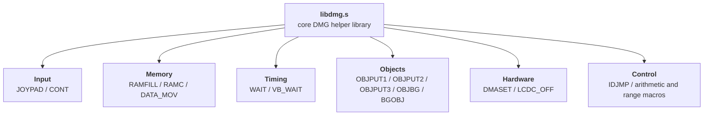
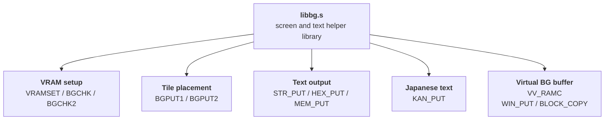
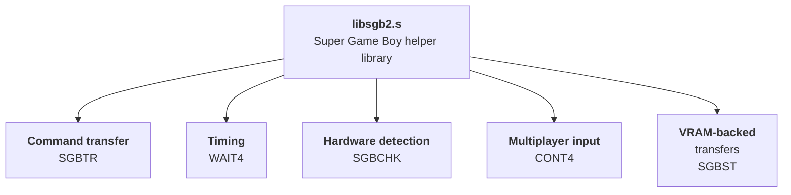
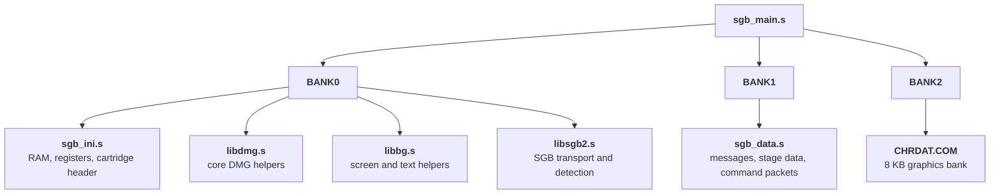
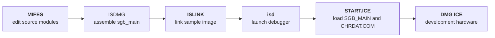
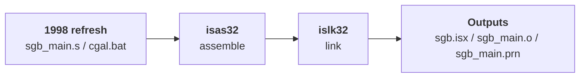

# Super Game Boy SDK Sample and BIOS Files
This page covers the `sgb` folder preserved in the Nintendo Gigaleak inside:

* `other/CGB`
* `AZL__ゼルダの伝説 夢を見る島DX`
* `Source/Disk1/ゼルダの伝説_JP3_US3_EU2/DEMO_zelda/sgb`

Although it was found inside the Link's Awakening DX demo workspace, the folder itself is a compact Super Game Boy sample and BIOS package with its own libraries, sample code, build scripts, and debugger files.



---
## Why It Matters
This package preserves two useful moments at once: an early 1994 Super Game Boy sample and BIOS toolkit, and a later October 1998 refresh of the editable source and debugger outputs.

Its location inside `DEMO_zelda` also explains why it survived at all. It was not preserved as a neat standalone SDK drop. It was carried forward inside a live Zelda DX working folder, which is why old sample files and later rebuild artefacts are still sitting side by side.

---
## What the Package Preserves
`README.DOC` describes the folder as `ＳＧＢ標準ＢＩＯＳ（サンプルプログラム付き）`, essentially a "Super Game Boy standard BIOS" with a sample program.

It says the package was created on 10 April 1994 and intended to run in an environment with the DMG ICE debugger.

The same file also lays out the contents very clearly:

Path | Role
---|---
`LIB/LIBSGB2.DMG` | Standard Super Game Boy BIOS library source module
`LIB/LIBDMG.DMG` | General-purpose DMG support library source module
`LIB/LIBBG.DMG` | Background-display support library source module
`SAMPLE/SGB_MAIN.DMG` | Main sample source module
`SAMPLE/SGB_DATA.DMG` | Sample data source module
`SAMPLE/SGB_INI.DMG` | Label definitions, jump tables, and registration source module
`SAMPLE/CHRDAT.COM` | Character data
`SAMPLE/START.ICE` | ICE execution helper
`SAMPLE/C.BAT` | Assemble and run batch file
`SAMPLE/E.BAT` | Edit batch file
`AUTO.BAT` | Auto-run helper

That gives us a good inventory of the package before even opening the source.

The folder only really makes sense once that README inventory is viewed alongside the later timestamps and build scripts.

Evidence | What it suggests
---|---
`README.DOC` dated 13 April 1994 | The package was already documented as a ready-to-use Super Game Boy sample by spring 1994
`LIB/*.DMG` and `SAMPLE/*.DMG` dated February to April 1994 | The original library and sample source modules belong to that early package
`AUTO.BAT`, `C.BAT`, and `E.BAT` | The original workflow used the older `ISDMG`, `ISLINK`, `isd`, and `MIFES` toolchain
`libbg.s`, `libdmg.s`, `libsgb2.s`, `sgb_main.s`, `sgb_data.s`, and `sgb_ini.s` dated 27 October 1998 | Someone reopened the package and converted the editable side into the newer `.s` source format
`sgb_main.o`, `sgb_main.prn`, `sgb.isx`, and debugger sidecar files dated 27 October 1998 | The sample was actively rebuilt inside the later Zelda DX workspace
`cgal.bat` using `isas32` and `islk32` | The 1998 pass was wired into the newer assembler and linker rather than left frozen in its original toolchain

That combination makes the folder much more valuable than a simple SDK snapshot. It preserves both the older development flow and the later cleanup pass that kept the sample usable in a Color-era workspace.

---
# The Libraries

`LIB` is the reusable support layer for the sample. It preserves the original 1994 DMG-format library source modules alongside the lightly refreshed 1998 `.s` versions.



- LIBBG.DMG - Original 1994 background-display library source module
- LIBDMG.DMG - Original 1994 core DMG helper library source module
- LIBSGB2.DMG - Original 1994 Super Game Boy support library source module
- libbg.s - 1998 refreshed background-display source
- libdmg.s - 1998 refreshed DMG helper source
- libsgb2.s - 1998 refreshed SGB helper source




The `LIB` directory is the foundation of the whole package. It contains the reusable support code that the sample pulls in, and it shows the clearest 1994-to-1998 source refresh inside the archive.

Library | What it does | When a game would include it
---|---|---
`libdmg.s` | Core DMG-side utility layer: register save macros, memory helpers, sprite helpers, controller decoding, DMA setup, LCD control, RAM clearing, and generic copy routines | Any sample, tool, or game code that needed a reusable low-level Game Boy support layer
`libbg.s` | Background and text presentation layer: VRAM writes, tile placement, string and hex printing, virtual BG buffering, and staged screen updates | Games, debug tools, or test programs that needed to draw menus, diagnostic text, or simple screens without rewriting BG logic each time
`libsgb2.s` | Super Game Boy hardware layer: command packet transfer, SGB detection, multi-controller reads, and VRAM-backed data transfer for SGB commands | Projects that specifically wanted to detect SGB hardware or send SGB commands for borders, palette uploads, multiplayer pad access, or other SNES-side features

## The 1994 and 1998 Source Refresh
`LIB` contains the original 1994 source modules and the 1998 refreshed `.s` versions:

File | Size | Notes
---|---|---
`LIBBG.DMG` | 7234 bytes | Background helper library source module
`LIBDMG.DMG` | 12859 bytes | General DMG helper library source module
`LIBSGB2.DMG` | 6500 bytes | Super Game Boy support library source module
`libbg.s` | 7227 bytes | 1998 source refresh of the BG library
`libdmg.s` | 12848 bytes | 1998 source refresh of the DMG helper library
`libsgb2.s` | 6496 bytes | 1998 source refresh of the SGB helper library

The really useful preservation detail is what changed between the 1994 `.DMG` source modules and the 1998 `.s` refreshes. In practice, the library layer was carried forward almost verbatim.

Pair | Similarity | What changed
---|---|---
`LIBBG.DMG` -> `libbg.s` | 99.83% | No meaningful logic changes showed up in a line-by-line diff. The 1998 file mainly drops the trailing `END` line and DOS end-of-file marker.
`LIBDMG.DMG` -> `libdmg.s` | 99.32% | The code body is the same. The visible edits are formatting cleanups around macro definitions like `LDM` and `ADD2`, where inline comments were moved onto their own lines, plus removal of the trailing `END` marker.
`LIBSGB2.DMG` -> `libsgb2.s` | 99.52% | Almost identical, with one notable syntax change: `LD C,P1` becomes `LD C,<P1`, which looks like a newer assembler form for the low-byte hardware-register reference, alongside removal of the trailing `END` marker.

That makes the `LIB` folder especially revealing. It does not look like a ground-up Color-era rewrite of the library stack. It looks more like Nintendo reopened an older Super Game Boy package, converted it into the newer source format, and made the smallest possible syntax and editor cleanup changes needed to keep rebuilding it in 1998.

The matching `.s~` files show that even this small refresh kept editor backup copies.

---
## libdmg.s
`libdmg.s` is the foundation layer. It is the least glamorous library in the package, but it is also the one that makes the other two practical to reuse.

### What It Covers
At the top it defines the kind of macros you would expect in a shared internal utility file: `PUSHALL`, `POPALL`, `LDM`, `ADD2`, `ADDM`, `SUBM`, `INCM`, `DECM`, `ADDW`, `SUBW`, and `RNG_CHK`. Those turn repetitive 8-bit and 16-bit memory/register work into shorter assembly call sites.

Below that, the subroutines cover the usual low-level jobs a Game Boy program keeps solving over and over:

* `JOYPAD` converts pad input into `JX` and `JY` movement vectors
* `RAMFILL`, `RAMC`, `V_RAMC`, `DATA_MOV`, `DATA_MOV2`, and `DATA_MOV3` handle common memory fill and copy tasks
* `WAIT` and `VB_WAIT` provide software timing and vblank waits
* `OBJPUT1`, `OBJPUT2`, `OBJPUT3`, `OBJBG`, and `BGOBJ` help map sprite and background coordinates to tile or OAM space
* `DMASET` builds the little HRAM DMA stub used for sprite transfer
* `LCDC_OFF` safely disables the LCD after waiting for vblank
* `CONT` and `IDJMP` provide generic controller-read and jump-table support

### Why It Exists
In practical terms, this is the sort of library you would include in almost any DMG-era project unless the game already had its own mature engine layer. It is not specifically about the Super Game Boy. It is the shared base that lets the sample avoid re-implementing input, timing, VRAM-safe updates, DMA, and object placement in every file.

### What Stands Out
Two parts are especially revealing. `DMASET` preserves the tiny DMA helper pattern many Game Boy projects needed for sprite transfer, while `LCDC_OFF` shows the careful "wait for vblank, then touch the display" rhythm that low-level Nintendo code treated as standard practice. `IDJMP` is also a nice little clue that the library was designed to support compact jump-table style program structure rather than just raw straight-line sample code.

Because this file also carries both object-placement helpers and generic data movers, it feels less like one narrow library and more like a shared "engine basement" file. If a programmer needed one place to grab the basic routines every cartridge project would eventually grow anyway, `libdmg.s` is that place.

---
## libbg.s
`libbg.s` sits one level higher. Where `libdmg.s` helps the CPU talk to memory and hardware safely, `libbg.s` helps the program turn that into an actual visible screen.

### What It Covers
Its macro surface already shows the intended use:

* `VRAMSET` copies font or tile data into VRAM
* `BGCHK` and `BGCHK2` calculate background positions
* `BGPUT1` and `BGPUT2` place 8x8 and 16x16 tiles
* `MEM_PUT`, `HEX_PUT`, and `STR_PUT` print memory values or strings to the background map

The routines underneath make that even clearer. `HEX_PUT` renders byte values as on-screen hex digits, `STR_PUT` walks a text stream until `@` and treats `/` as newline, and `VV_RAMC`, `WIN_PUT`, and `BLOCK_COPY` maintain and push a virtual background buffer to VRAM in staged chunks across vblanks.

### Japanese Text and Presentation
The standout routine is `KAN_PUT`, which is much heavier than a simple ASCII helper. It loads character data into VRAM, switches ROM banks while decoding the source character stream, and writes a full background text layout. That suggests the library was meant for more than tiny test labels. It was built to support real menu or message-style presentation, including Japanese text handling.

### Why It Exists
This is the library a game or debugging tool would include when it needed to put readable information on screen quickly. For a sample package, that matters a lot: it lets the demonstration code focus on SGB behavior instead of spending half the file on tilemap printing code.

### What Stands Out
`WIN_PUT` and `BLOCK_COPY` are especially interesting because they show a buffered display strategy rather than direct naive drawing. The code maintains a virtual background area and then pushes it to VRAM in timed chunks, effectively baking vblank-friendly screen updates into the helper layer itself.

That makes `libbg.s` feel like more than a text printer. It is a small presentation framework for Game Boy screens: tiles, text, layout, and screen refresh policy all bundled together in one reusable unit.

---
## libsgb2.s
`libsgb2.s` is the genuinely Super Game Boy-specific part of the stack. It is the layer that talks through the Game Boy joypad register interface to reach the SGB host on the SNES side.

### What It Covers
The core routines line up neatly with the main SGB jobs:

* `SGBTR` sends one or more 16-byte SGB command packets bit by bit through `P1`
* `WAIT4` provides the fixed delay used between transfers
* `SGBCHK` tests whether the program is running on a Super Game Boy or a plain DMG
* `CONT4` reads up to four controllers through the SGB multiplayer input mode
* `SGBST` shows the VRAM-assisted transfer pattern used for commands like `SOU_TRN`, `DATA_TRN`, `CHR_TRN`, `PCT_TRN`, `ATTR_TRN`, and `OBJ_TRN`

### The Hardware Layer
The file is valuable because it makes the transport layer explicit. `SGBTR` is not a vague "send command" wrapper. It shows the bit-level packet rhythm through `P1`, including the 16-byte packet loop, the per-bit pulse sequence, and the extra trailing transfer bit. For anyone trying to understand how SGB support really worked on original hardware, that is one of the most educational parts of the whole package.

`SGBCHK` and `CONT4` are just as useful because they show the two big practical reasons a game would care about the SGB at runtime: detecting whether enhanced behavior should activate at all, and accessing the SGB's multiplayer controller path rather than treating the machine like an ordinary DMG.

### Transfer Workflows
That last routine is especially useful historically, because it is not just a finished helper. The comments explicitly present it as an example of how to issue VRAM-backed transfer commands. In other words, the library is teaching the caller how to drive the SGB protocol, not just hiding it.

`SGBST` is the best example. It disables interrupts, stops the LCD safely, loads data into VRAM, writes a background tile layout, re-enables display, waits, and only then performs the SGB command transfer. That is a very concrete snapshot of how Nintendo expected developers to stage border, palette, or tile-related SGB data moves in practice.

### Why It Exists
This is the library a game would include only if it planned to do something specifically SGB-aware:

* detect SGB hardware and branch into enhanced behavior
* upload border or attribute data
* transfer palette or tile data through the SGB command channel
* read multiple controllers in SGB multiplayer mode

For an ordinary DMG cartridge with no SGB features, `libsgb2.s` would be unnecessary. For a Nintendo sample package, though, it is the key piece that turns a general Game Boy codebase into an SGB-capable one.

---
# The Sample Project

`SAMPLE` is the runnable example project that sits on top of the libraries. It preserves the older DMG-format source modules, the refreshed 1998 `.s` files, helper scripts, debugger setup files, and rebuilt outputs.



- SGB_MAIN.DMG - Original 1994 main sample source module
- SGB_DATA.DMG - Original 1994 sample data source module
- SGB_INI.DMG - Original 1994 setup and cartridge skeleton source module
- sgb_main.s - 1998 refreshed main sample source
- sgb_data.s - 1998 refreshed sample data source
- sgb_ini.s - 1998 refreshed setup source
- CHRDAT.COM - Character data payload loaded into bank 2
- C.BAT / E.BAT / START.ICE - Original edit, build, and debugger helpers
- cgal.bat - 1998 build script using isas32 and islk32
- sgb_main.o / sgb_main.prn / sgb.isx - Object, listing, and debugger-ready outputs




The `SAMPLE` directory is the working demonstration project that sits on top of those libraries. This is where the package becomes concrete: you can see the actual sample source, the editable 1998 refresh, and the rebuilt debugger outputs in one place.

`SAMPLE` is the working example project:

File | Size | Notes
---|---|---
`SGB_MAIN.DMG` | 15439 bytes | Main sample source module
`SGB_DATA.DMG` | 7919 bytes | Sample data source module
`SGB_INI.DMG` | 3708 bytes | Setup and registration source module
`sgb_main.s` | 15613 bytes | Main editable sample source
`sgb_data.s` | 7918 bytes | Data source for text and stage tables
`sgb_ini.s` | 3701 bytes | Initialization and low-level setup source
`CHRDAT.COM` | 8192 bytes | Character data payload
`START.ICE` | 57 bytes | Tiny ICE launch helper
`sgb.isx` | 15011 bytes | Debugger-ready executable image
`sgb_main.o` | 15044 bytes | Assembled object output
`sgb_main.prn` | 298485 bytes | Full assembler listing
`isdwdcmd.dat` / `isdwdrng.dat` / `isdwdsym.dat` | 669 / 21582 / 359070 bytes | Debugger command, range, and symbol packs generated during the 1998 rebuild

The source side is small, but it is packed with useful clues about how Nintendo expected this package to be opened, edited, built, and tested.

## The Main Program
`sgb_main.s` is where the sample stops looking like a loose collection of files and starts looking like a real runnable program.

### Bank Layout and Includes
The file is split into explicit bank groups. `BANK0` starts by pulling in `sgb_ini.s`, then the three shared libraries, while `BANK1` pulls in `sgb_data.s`. In the 1998 `.s` version there is also a `BANK2` section that uses `libbin chrdat.com`, which makes the character data payload a first-class part of the rebuilt project instead of an external afterthought.

That is one of the clearest differences from the older `SGB_MAIN.DMG` file. The earlier source is extremely close overall, but the refreshed version adds more explicit bank-group structure, keeps the newer `onbankgroup` / `isdmg` style directives, and ends by wiring `CHRDAT.COM` directly into the rebuilt layout.

### Runtime Structure
The file identifies itself as `SGBTEST`, and the routine layout shows it is more than a passive demo stub. It has a proper `RESET`, separate `DMG` and `SGB` startup paths, a `MAIN` loop, vblank handling, controller tests, unit movement, collision checks, effects, and initialization code.

Labels such as `CONT4_TEST`, `UNIT_MOVE`, `BOM_SET`, `STAR_SET`, `BURST`, `RENSA`, `HITCHK`, `EFFECT3`, `INIT`, and `V_BLANK` make it look like a compact interactive test program rather than a static border uploader. It is closer to a tiny game-like sandbox built to exercise SGB features, controller handling, sprites, and command transfer behavior all together.

### Tiny Test Game Structure
The rebuilt listing in `sgb_main.prn` makes that structure even easier to see. `RESET` sits at the expected cartridge entry area, then branches into separate `DMG` and `SGB` startup paths before dropping into `MAIN`. From there the sample repeatedly cycles through controller tests, movement updates, hit checks, burst effects, and chain-reaction logic.

That routine mix makes the project feel less like a sterile SDK menu and more like a miniature systems testbed. It has enough moving parts to exercise ordinary Game Boy gameplay logic, SGB-aware branches, multiplayer controller reads, and effect handling in one loop.

### What Changed in 1998
The sample refresh is not spread evenly across every file. `sgb_main.s` is the place where the 1998 pass is most visible.

Pair | Similarity | What changed
---|---|---
`SGB_MAIN.DMG` -> `sgb_main.s` | 98.18% | Still extremely close overall, but the `.s` version adds explicit bank-group directives, clearer include statements for the `.s` libraries, and a `BANK2` block that pulls in `CHRDAT.COM` directly as binary data
`SGB_DATA.DMG` -> `sgb_data.s` | 99.81% | Functionally unchanged apart from the missing DOS EOF marker in the newer file
`SGB_INI.DMG` -> `sgb_ini.s` | 99.38% | Almost unchanged, mainly dropping the old trailing `END` and EOF marker

That split matters because it shows the 1998 refresh was aimed more at making the sample build cleanly in the newer environment than at rewriting the sample's logic or data.

---
## The Data File
`sgb_data.s` is the content-heavy half of the sample. It is where the text, map-like layout data, palettes, command packets, sound tables, and test payloads all live.

### Screen Text and Counters
Right at the top the file tells you what the sample wants to be. It includes strings like `NINTENDO (1994.4)`, `SGB TEST PROGRAM`, `DMG MODE START`, `SGB MODE START`, `COMMAND TRNS TEST`, `TRNS TIMES`, `GET TIMES`, and `ERR TIMES`.

That makes the front-end purpose very explicit: this is a test program designed to compare ordinary DMG execution against SGB execution and to show transfer-related counters on screen.

### Object and Stage Data
The file also carries compact game-style state tables such as `PX_DATA`, `PY_DATA`, `PV_DATA`, `PW_DATA`, `PC_DATA`, and `PF_DATA`, along with a large `STAGE1` tile layout.

Later blocks like `MOV_FLA`, `MOV_CHR`, and `MOV_PAT` define frame, tile, and movement-pattern data for object updates. That reinforces the idea that the sample is interactive and animation-driven, not just a menu that fires off one system command and stops.

### SGB Command Payloads
The most historically valuable part of `sgb_data.s` is the long run of command packets: `COM00` through `COM18`, plus named blocks like `MASKON`, `MASKOFF`, `CHR_TRN`, `REQUEST_4PLAY`, `PALCLS`, `MUSIC1`, and `YOSSHI`.

These are effectively ready-made SGB command payloads preserved as source data. They show how the sample packaged palette updates, transfer commands, mask control, multiplayer requests, and other SGB-side operations into concrete 16-byte command blocks ready for `SGBTR` or `SGBST`.

The command bytes line up well with known SGB protocol IDs, so much of the table can be identified with reasonable confidence:

Label | First byte | Likely SGB command
---|---|---
`COM00` | `$01` | `PAL01`
`COM01` | `$09` | `PAL23`
`COM02` | `$11` | `PAL03`
`COM03` | `$19` | `PAL12`
`COM04` | `$21` | `ATTR_BLK`
`COM05` | `$29` | `ATTR_LIN`
`COM06` | `$31` | `ATTR_DIV`
`COM07` | `$39` | `ATTR_CHR`
`COM08` | `$41` | `SOUND`
`COM09` | `$49` | `SOU_TRN`
`COM0A` | `$51` | `PAL_SET`
`COM0B` | `$59` | `PAL_TRN`
`COM0C` | `$61` | `ATRC_EN`
`COM0D` | `$69` | `TEST_EN`
`COM0E` | `$71` | `ICON_EN`
`COM0F` | `$79` | `DATA_SND`
`COM10` | `$81` | `DATA_TRN`
`COM11` | `$89` | `MLT_REQ`
`COM12` | `$91` | `JUMP`
`COM13` | `$99` | `CHR_TRN`
`COM14` | `$A1` | `PCT_TRN`
`COM15` | `$A9` | `ATTR_TRN`
`COM16` | `$B1` | `ATTR_SET`
`MASKON` | `$B9` | `MASK_EN`
`COM18` | `$C1` | `OBJ_TRN`

That spread is important because it shows the sample was exercising a broad slice of the SGB feature set, not just one border-upload path. The table spans palettes, attribute maps, transfer commands, sound, multiplayer requests, masking, and object-related transfer behavior.

### Multiplayer and Sound Test Blocks
The named blocks near the end make the testing purpose even clearer. `REQUEST_4PLAY` is a direct four-player `MLT_REQ` packet, while `SOUND_BUBUU`, `SOUND_GOON`, `SOUND_SET1`, `SOUND_SET2`, `SOUND_BUBBLE`, `SOUND_STAR`, and `SOUND_DEAD` are all compact `SOUND` command variants with different parameter bytes.

Even without decoding the exact audible result of every one, their names show the sample was not only testing visual SGB features. It was also keeping a ready-made bank of audio and multiplayer test packets that the main program could fire while running.

The tail end of the file is especially striking because the `INIT1` to `INIT8` blocks look like embedded machine-code style payloads rather than normal text or tile data. Even without fully decoding every one, they make it clear the sample was carrying prebuilt transfer content and initialization payloads alongside its more readable test strings and layout tables.

---
## The Setup File
`sgb_ini.s` is the smallest of the three main source files, but it is the one that makes the sample look like a proper cartridge image rather than a loose demo script.

### RAM and Hardware Definitions
The first half of the file defines RAM work variables and core hardware registers. It lays out variables like `OBJYP`, `OBJXP`, `VRAMH`, `VRAML`, `VBLANK_F`, and `IEB`, then maps the standard DMG registers such as `P1`, `LCDC`, `STAT`, `LY`, `DMA`, `BGP`, `OBP0`, and `OBP1`.

This is the file that gives the rest of the project a shared hardware vocabulary. Without it, the libraries and main program would have to hardcode register and work-RAM meanings locally.

### Interrupt and Cartridge Header Data
The second half is even more revealing. It places jump targets at the expected Game Boy interrupt vectors, sets up the cartridge start vector at `$100`, embeds the standard Nintendo logo data, and reserves the title, cartridge type, ROM size, RAM size, maker code, version number, header complement, and checksum fields.

That means `sgb_ini.s` is not just configuration. It is the cartridge skeleton. It turns the sample into something the Game Boy toolchain can assemble into a proper ROM image with real startup and header structure.

---
## Build and Debug Files
The helper files around the source tell a second story: not just what the sample is, but how Nintendo expected developers to work with it.

### The Original 1994 Workflow
The older flow is preserved almost perfectly in tiny helper files:

* `C.BAT` assembles `sgb_main` with `ISDMG`, links it with `ISLINK`, and launches the debugger with `isd START`
* `E.BAT` opens the three library modules plus `SGB_DATA.DMG` and `SGB_MAIN.DMG` together in `MIFES`, a Japanese programmer's text editor used in DOS-era development environments[^1]
* `START.ICE` tells the debugger to load `SGB_MAIN`, map `CHRDAT.COM` into bank 2 at `$4000`, then run

That combination makes the original workflow very legible. A developer edits the source modules, assembles and links them, loads the external character data file into the expected bank, and runs the sample under ICE.

### What the Files Suggest about Nintendo's ICE Setup
These files do not identify the exact physical hardware unit on their own, but they do preserve a surprisingly clear picture of how the software side of Nintendo's DMG ICE workflow operated. The hardware page helps with the likely physical context, while this sample is strongest on the PC-side build, load, and debugger instructions.

What the sample proves directly is:

* `README.DOC` expected a `DMG ICE` environment
* `ISDMG`, `ISLINK`, and `isd` were part of the standard older build-and-debug flow
* `.ICE` startup scripts were used to tell the debugger what to load and where to map banked data
* `START.ICE` specifically loads the main program, maps `CHRDAT.COM` into bank 2 at `$4000`, and then begins execution

Taken together, that suggests a workflow where the PC-side tools assembled and linked the program, then handed it off to an Intelligent Systems-style debugging environment that could inject ROM and banked resources into a Game Boy development target, start execution, and expose symbols and memory to the developer.



The hardware page is useful context here because the two sides fit together neatly. The development hardware provided the emulation or debugging target, while files like `C.BAT`, `START.ICE`, `sgb.isx`, and the `isdwd*.dat` outputs show the software instructions and debugger metadata that would have driven that target during day-to-day development.

### How the Workflow Fit Together
Taken as a whole, the 1994 side of the package suggests a workflow like this:
* source edited in `MIFES`
* program assembled with `ISDMG`
* linked with `ISLINK`
* launched through `isd`
* runtime configured by `START.ICE`
* executed against Nintendo's DMG ICE development hardware

That is a useful distinction, because the SGB sample mostly preserves the software-facing half of the environment. It shows the commands, load scripts, and debugger metadata that would have fed into the hardware workflow documented on the separate development-hardware page.

### The 1998 Refresh
The later workflow is concentrated in `cgal.bat`, `ISAS32.EXE`, and `ISLK32.EXE`. `cgal.bat` assembles with `isas32 -jp sgb_main` and then links with `islk32`, emitting `sgb` as the target image with explicit bank base addresses.

That newer flow lines up neatly with the source refresh in `sgb_main.s`, where the project layout is expressed more explicitly and `CHRDAT.COM` is folded into the assembled structure.

### Debugger Outputs and Listings
The last layer is the rebuilt output set: `sgb_main.o`, `sgb_main.prn`, `sgb.isx`, and the debugger sidecar files `isdwdcmd.dat`, `isdwdrng.dat`, and `isdwdsym.dat`.

For reverse engineering, this is one of the best parts of the folder. It does not just preserve editable source. It preserves the intermediate and debug-facing outputs that show how the sample looked after assembly, how symbols were tracked, and how the debugger expected to load and inspect the program.

`sgb_main.prn` is especially helpful because it confirms key anchor points in the rebuilt image, including `RESET` at the standard `$150` cartridge entry area, the `MAIN` loop in the early body of bank 0, the `V_BLANK` handler later in the same bank, and the presence of explicit `BANK0`, `BANK1`, and `BANK2` group structure in the 1998 build.

That listing also reinforces the impression that the project was meant to be inspected while running. The symbol and range files are not just leftovers. They are exactly the kind of debugger-facing metadata you would want if the sample was being stepped through to verify command transfer behavior, controller input handling, or SGB-only branches.

### The Character Data Payload
`CHRDAT.COM` deserves to be called out separately because it is not a tiny helper blob. At 8192 bytes, it is exactly the size of 512 Game Boy 2bpp tiles. The payload is also dense: only 21 of those 512 tiles are completely zeroed, while 268 tiles have all 16 bytes populated.

That density suggests it is a real working graphics bank rather than a mostly empty placeholder. Combined with the `START.ICE` load script and the `BANK2` `libbin` inclusion in `sgb_main.s`, it looks like the sample expected a substantial tile and font payload to be loaded into bank 2 and used directly by the runtime and SGB transfer routines.

The repeated blank tile patterns show there is some reserved or spacer content, but overall `CHRDAT.COM` looks much more like a compact graphics resource bank than a one-off debugging stub.

### Small But Telling Details
A few smaller files help fill out the day-to-day development picture:

* `AUTO.BAT` at the package root simply changes into `SAMPLE` and runs `C`, which makes the whole archive feel like a deliberate ready-to-run toolkit rather than a pile of loose files
* `ISAS32.EXE` and `ISLK32.EXE` sitting directly inside `SAMPLE` suggest the 1998 refresh was meant to be rebuilt from a largely self-contained tool snapshot
* `START.ICE` is tiny, but it is one of the clearest runtime clues in the folder because it explicitly loads `SGB_MAIN`, maps `CHRDAT.COM` into bank 2 at `$4000`, and then starts execution
* the backup files `lib*.s~`, `sgb_*.s~`, `cgal.bat~`, and `sgb_main.prn~` are historically useful because they preserve traces of the editing process, not just the final 1998 state
* `sgb_main.prn~` is especially nice to have, because it implies there were at least two nearby listing outputs during the 1998 refresh rather than just one final clean rebuild
* the header comment `SGBTEST 1994- 3-24 BY T.TOMIZAWA` gives the sample a concrete authorship and dating clue that is easy to overlook once the page starts focusing on libraries and command packets

That makes the `SAMPLE` folder especially useful, because it preserves source, rebuilt outputs, listings, debugger images, and symbol data in one place.

---
## What It Suggests
The most useful way to think about this folder is:

* it is a reusable Super Game Boy sample and BIOS package
* it survived because it was copied into the Zelda DX Disk 1 demo workspace
* it was still useful enough in late 1998 to be refreshed and rebuilt there with newer Game Boy tools

That makes it a good example of how Nintendo-era Game Boy development environments could accumulate not just one game's source tree, but also old libraries, debugger setups, sample code, and reusable platform support material.

---
# References
[^1]: [TextEditors Wiki: MIFES](https://texteditors.org/cgi-bin/wiki.pl?MIFES)
