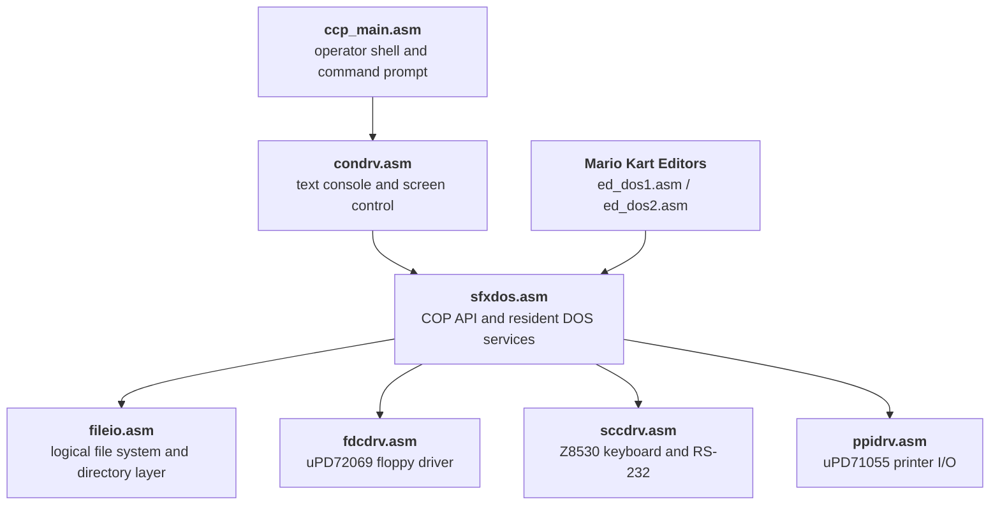
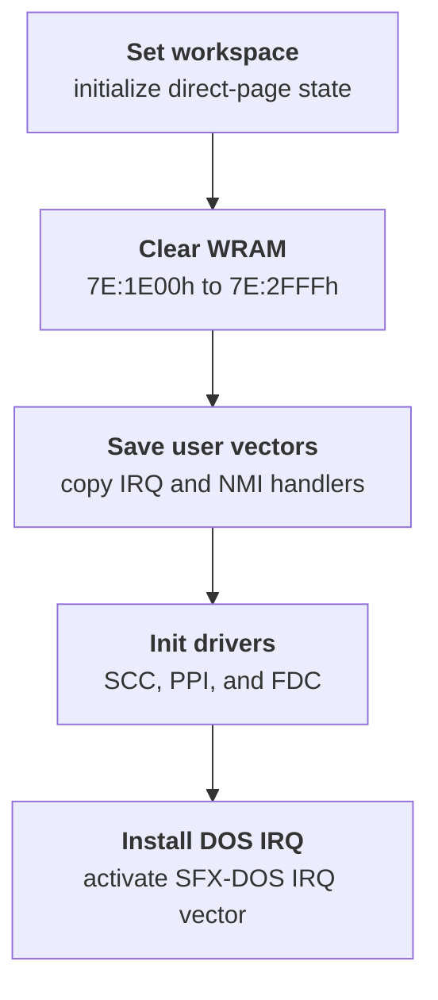
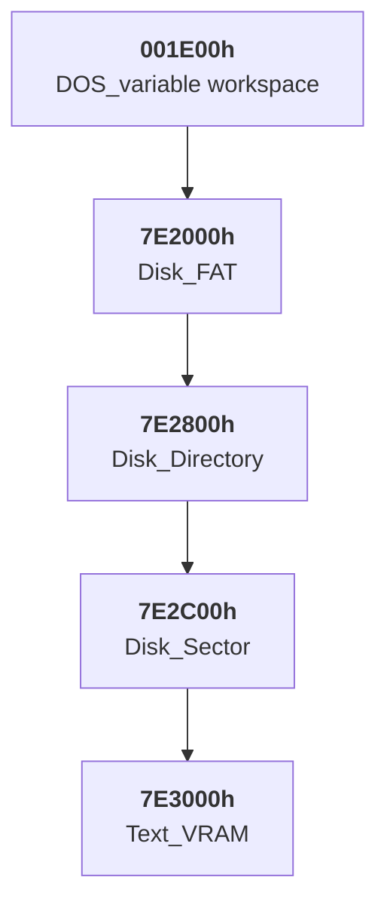
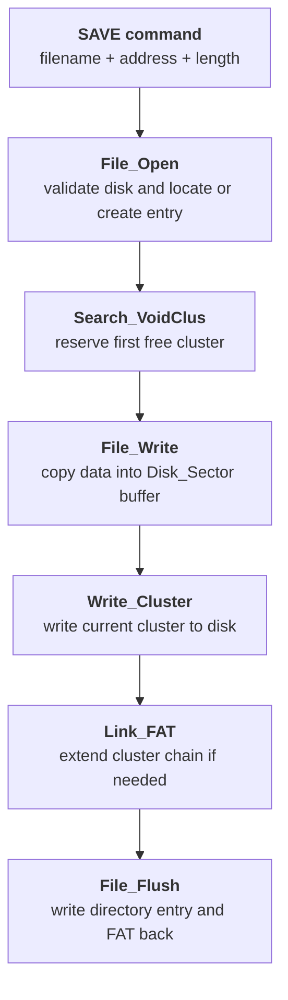
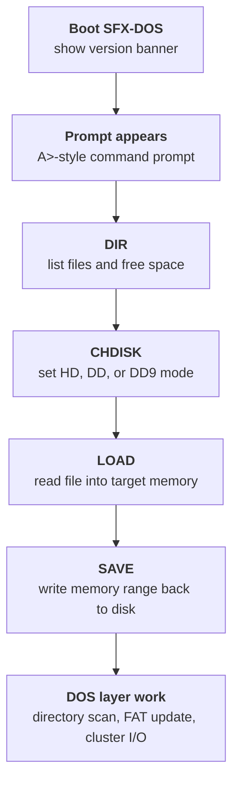

The Nintendo Gigaleak preserves a surprisingly complete Super Famicom disk and I/O environment inside the Super Mario Kart source directory.

This is the `SFX-DOS` stack: a SNES-side support layer for floppy access, directory walking, keyboard and serial I/O, printer output, and text-console interaction.
It survives inside the Mario Kart leak because the game's editors were using it directly for save and load operations.



---
## Key Findings
The biggest takeaways from the surviving files are:

* this is a genuine SNES-side service environment, not just a few loose disk helpers
* the file layer implements a packed 12-bit [FAT](#glossary-fat)-style allocation system with real directory maintenance
* the shell exposes a usable operator workflow with `DIR`, `DEL`, `REN`, `CHDISK`, `LOAD`, and `SAVE`
* Mario Kart's editors are clients of the same DOS layer rather than one-off save stubs
* the Yoshi's Island tool copy shows the package was shared across projects and remained broadly recognizable

---
## Glossary of Key Terms
If you are new to low-level SNES development terms, this quick glossary should help:

* **COP** - A 65c816 software-interrupt instruction used here as the SFX-DOS service call gateway.
* **IRQ** - A normal hardware interrupt used for routine device events.
* **NMI** - A non-maskable high-priority interrupt often used for time-critical work.
* **SCC** - The `Z8530` serial communications controller used for keyboard and RS-232 handling.
* **FDC** - The `uPD72069` floppy disk controller used for physical disk access.
* **PPI** - The `uPD71055` programmable peripheral interface used here for printer I/O signaling.
* **FAT** - The file allocation table that tracks which disk clusters belong to each file.
* **WRAM** - Work RAM, the main writable memory area used by SFX-DOS buffers and state.

---
## At a Glance
Taken together, the files look like a compact operating environment for development hardware:

Layer | Main file | Role
---|---|---
[System entry layer](#the-core-api) | `sfxdos.asm` | Central dispatcher, interrupt wrapper, and [COP](#glossary-cop)-call API
[File-system layer](#the-file-system-layer) | `fileio.asm` | Disk format, free space, directory scans, load/save, purge, and rename
[Raw hardware layer](#the-hardware-drivers) | `fdcdrv.asm`, `sccdrv.asm`, `ppidrv.asm` | Floppy, serial/keyboard, and printer drivers
[Console UI layer](#the-console-and-shell) | `condrv.asm` | Text-console screen, cursor, input, and print routines
[Operator shell](#the-built-in-commands) | `ccp_main.asm` | A command-style front end that calls into the DOS API

The overall shape is easiest to grasp as a layered stack:

The dates are useful too:

* `fileio.asm` is dated **21 August 1991**
* `sfxdos.asm` is dated **29 October 1991**
* the Mario Kart gameplay and editor files around it are mostly from **1992**

That timing makes the SFX-DOS code look like an older shared development layer that the Mario Kart team was still building on later.

---
# Where It Appears in the Leak
The relevant files survive under the Gigaleak path:

`other/SFC/ソースデータ/MarioKart`

The important modules are:

* `sfxdos.asm`
* `fileio.asm`
* `fdcdrv.asm`
* `sccdrv.asm`
* `ppidrv.asm`
* `condrv.asm`
* `ccp_main.asm`
* `ed_dos1.asm`
* `ed_dos2.asm`

That location matters.
This is not an abstract SDK disk on its own.
It is a shared system layer surviving inside a real game workspace, with the Mario Kart editors still calling into it.

---
# The Core API

- variable::sfxdos
- function::DOS_Entry
- function::COP_Entry
- function::IRQ_Entry
- function::NMI_Entry
- table::Function_call$
- variable::Break_vector
- variable::IRQ_vector




The heart of the stack is `sfxdos.asm`.
Its header calls it a `Super Famicom Disk Operation System special version`, programmed by **Y. Nishida** on **29 October 1991**.

The file exports:

* [`DOS_Entry`](/super-famicom-sfx-dos#what-dos_entry-actually-does) - the resident bootstrap path that clears work RAM, installs vectors, and initializes the drivers
* [`COP_Entry`](/super-famicom-sfx-dos#the-cop-based-service-table) - the software-interrupt gateway that dispatches byte-sized [COP](#glossary-cop) service calls
* [`IRQ_Entry`](/super-famicom-sfx-dos#the-interrupt-entry-points) - the resident [IRQ](#glossary-irq) (normal hardware interrupt) trampoline that hands control to the active DOS or user interrupt handler
* [`NMI_Entry`](/super-famicom-sfx-dos#the-interrupt-entry-points) - the resident [NMI](#glossary-nmi) (non-maskable, high-priority interrupt) trampoline used for DOS-side text refresh and user NMI handoff

That is already a strong clue that this is a resident support environment rather than a grab bag of routines.

## What the COP Instruction Is Doing Here

👮

On the 65c816 CPU, [`COP`](#glossary-cop) is a software interrupt instruction.
It behaves a bit like a built-in trap into a supervisor or monitor layer: the caller executes `cop` with a small immediate value, and the system-side handler reads that value and decides which service routine to run.

That matters here because the Mario Kart editor files are not jumping straight into a long list of internal SFX-DOS labels.
They are making compact `cop` calls like `cop 15h` and `cop 16h`, and `sfxdos.asm` turns those byte-sized service numbers into real disk, console, and file-system operations.

So when this page refers to the `COP` API, it means a software-interrupt gateway built on the CPU's own `COP` instruction, not a separate coprocessor.

---
## The COP-Based Service Table
The most important architectural detail is `COP_Entry`.
It reads a function number from the instruction stream and dispatches through a `Function_call$` jump table, effectively giving the Super Famicom code a callable DOS API.

The visible calls include:

Code | Meaning | Target routine
---|---|---
`00` | `DOSRST` | `DOS_Reset`
`01` | `DOSSTP` | `DOS_Stop`
`02` | `TXTRST` | `Text_Reset`
`03` | `CONSNS` | `Sense_Keyboard`
`04` | `CONIN` | `Input_Console`
`05` | `CONOUT` | `Output_Console`
`06` | `CONRST` | `Flush_Keyboard`
`07` | `PRNSNS` | `Sense_Printer`
`08` | `PRNOUT` | `Output_Printer`
`09` | `AUXSNS` | `Sense_RS232C`
`10` | `AUXIN` | `Input_RS232C`
`11` | `AUXOUT` | `Output_RS232C`
`12` | `AUXRST` | `Set_RS232C`
`13` | `INPUT` | `Input_String`
`14` | `PRINT` | `Print_String`
`15` | `DSKRST` | `Init_FDC_Driver`
`16` | `FORMAT` | `Disk_Format`
`17` | `DSKFRE` | `Disk_Free`
`18` | `DIRFST` | `Files_First`
`19` | `DIRNXT` | `Files_Next`
`20` | `SELDSK` | `Select_Drive`
`21` | `LOAD` | `Load_File`
`22` | `SAVE` | `Save_File`
`23` | `PURGE` | `Purge_File`
`24` | `RENAME` | `Rename_File`
`25` | `EXEC` | documented in `doscall.h`, but not implemented in the surviving `special version` source

That is one of the most important preservation details in the whole stack.
The SNES-side tools were not doing floppy access through one-off hardcoded routines.
They were calling into a stable service layer.

## What DOS_Entry Actually Does
`DOS_Entry` behaves like a boot or reset path for the whole environment.

On entry it:
* sets up the SFX-DOS direct-page workspace
* clears [WRAM](#glossary-wram) from `7E:1E00h` through `7E:2FFFh`
* copies the user's [IRQ](#glossary-irq) and [NMI](#glossary-nmi) vectors into DOS-managed slots
* initializes the **Serial Communications Controller** ([SCC](#glossary-scc)), **Programmable Peripheral Interface** ([PPI](#glossary-ppi)), and **Floppy Disk Controller** ([FDC](#glossary-fdc)) drivers
* installs the SFX-DOS IRQ vector

That startup flow is easier to scan as a sequence:

Then the smaller lifecycle hooks round the system out:

* `DOS_Reset` enables SCC and FDC interrupts and turns the DOS switch back on
* `DOS_Stop` disables those interrupts and restores the user vectors
* `Text_Reset` initializes the console driver and points NMI handling at the console-side text refresh path

That makes SFX-DOS feel much closer to a resident development service than a normal game library.

## The Interrupt Entry Points
If you are not used to low-level console terms: an **interrupt** is a hardware signal that briefly pauses the current code so the system can run a small handler.
[`IRQ`](#glossary-irq) is the regular interrupt path used for routine hardware events, while [`NMI`](#glossary-nmi) is a special high-priority interrupt that cannot be disabled and is commonly used for time-critical work.

`IRQ_Entry` and `NMI_Entry` are smaller than `DOS_Entry`, but they still matter because they show how SFX-DOS sits between the running tool code and the machine's interrupt flow.

`IRQ_Entry` jumps through the current IRQ vector, while `NMI_Entry` jumps through the current NMI vector.
In practice that means the resident layer can swap in its own handlers like `Sfxdos_IRQ` and `Sfxdos_NMI`, then later restore the user's original vectors when DOS services are stopped.

That is one more sign that this was a resident environment rather than a pile of callable helpers.
It owned the interrupt handoff path as well as the disk and console services.

## What the Shared Headers Add
One nice extra clue survives elsewhere in the Gigaleak.
Under the Yoshi's Island tool tree there is a shared `sfxdos.h`, `doscall.h`, and `sfxdos.doc`, which document the same broader SFX-DOS package family reflected in the Mario Kart copy.

Those files fill in the memory map behind the code very neatly.
The main DOS workspace is defined at:

* `DOS_variable = 001E00h`

and the big working buffers live at fixed [WRAM](#glossary-wram) addresses:

Buffer | Address | Purpose
---|---|---
`Disk_FAT` | `7E2000h` | FAT buffer
`Disk_Directory` | `7E2800h` | directory-sector buffer
`Disk_Sector` | `7E2C00h` | cluster or sector read/write buffer
`Text_VRAM` | `7E3000h` | text-console screen buffer

That layout is easier to picture visually:

That is useful because it turns the implementation from "somewhere in RAM" into a very explicit memory layout.

### Buffer Overlays Explain the Strange Reuse
The header also explains one of the more confusing parts of the code: several buffers intentionally overlap.

For example:

* `directory_entry` and `Line_buffer` share the same base region
* `search_filename` and `access_filename` share the same region
* `rename_filename`, `data_address`, and `data_length` sit on top of the same command-parameter space

That sounds messy, but it fits the way the shell and DOS layer operate.
They do not need all of those structures at once, so the package reuses the same small DOS workspace for different command phases.

In other words, the overlap is not accidental sloppiness.
It is part of the design.

## Why the Mario Kart COP Calls Matter
This API table also explains the Mario Kart editor files more precisely than a simple "disk load" label does.

The editor bridge files do not know how to talk to the floppy controller directly.
They fill out shared DOS-side buffers, then hand off to the service layer with the same `cop` mechanism used everywhere else in SFX-DOS.

For example:

* `ed_dos1.asm` and `ed_dos2.asm` both build filenames into `1ee0h`
* they populate transfer addresses in `1ef0h`
* they populate byte counts in `1ef4h`
* they then trigger the actual load or save via `cop 15h` or `cop 16h`

That means the editor save and load paths are best understood as clients of SFX-DOS rather than bespoke game-only routines.

### The Common Macro Layer
`doscall.h` is also a helpful small artifact because it shows how the package was meant to be used from application code.
It defines symbolic names like:

* `_DIRFST`
* `_DIRNXT`
* `_LOAD`
* `_SAVE`
* `_PURGE`
* `_RENAME`
* `_INPUT`
* `_PRINT`
* `_EXEC`

and then wraps them in a simple:

* `DOS macro func`
* `cop func`

That is a tiny detail, but it makes the calling convention feel much more like a documented platform service and much less like a pile of ad hoc assembly entry points.

### The Documented API Is Slightly Broader Than the Surviving Source
One interesting wrinkle is that the shared macro file and documentation describe an `EXEC` function at call `25`, but the surviving Mario Kart and Yoshi's Island `special version` source copies stop at `RENAME`.

That suggests the broader SFX-DOS package may once have had an execution or launcher-style service that is not present in this trimmed source branch, or that the documentation and macro layer were kept slightly ahead of the specific in-project build that survived here.

---
# The File-System Layer

- function::Init_FDC_Driver
- function::Disk_Format
- function::Files_First
- function::Files_Next
- function::Load_File
- function::Save_File
- variable::Log_Format_2HD
- variable::Log_Format_2DD8
- variable::Log_Format_2DD9




`fileio.asm` is where the stack becomes recognizably DOS-like.
Its header calls it the `file I/O module`, dated **21 August 1991**.

It exports the practical file operations:

* `Disk_Format`
* `Disk_Free`
* `Files_First`
* `Files_Next`
* `Select_Drive`
* `Load_File`
* `Save_File`
* `Purge_File`
* `Rename_File`

## Multiple Floppy Formats
One of the most interesting details in `fileio.asm` is that it carries full logical-disk layout tables for multiple media formats.

Format | Sector size | Notable layout details
---|---:|---
`2HD` | `1024` bytes | 1 sector per cluster, 8 sectors per track, 1223 clusters
`2DD` 8-sector | `512` bytes | 2 sectors per cluster, 8 sectors per track, 636 clusters
`2DD` 9-sector | `512` bytes | 2 sectors per cluster, 9 sectors per track, 715 clusters

The tables define:

* sectors per cluster
* sectors per track
* directory placement
* [FAT](#glossary-fat) size
* bytes per sector
* total cluster counts

That tells us SFX-DOS was not relying on opaque disk read and write commands.
It was carrying a full logical file-system layer on top of the raw floppy controller.

## More Than Fixed Load and Save
The higher-level file operations go further than a game editor strictly needed.
`Files_First` and `Files_Next` support directory walking, and `Rename_File` actually rewrites directory entries with a new filename.

That is a useful clue about the intended environment.
This stack was designed for browsing and managing files, not only loading one known block from one known disk.

## The Directory Format on Disk
`fileio.asm` also makes the directory structure much more concrete.
The code consistently treats each directory entry as a **32-byte** record and looks for two special leading-byte values:

* `00h` means end of directory
* `E5h` means a deleted entry that can be reused

That lines up neatly with the rest of the shell behavior.
`DIR` walks those 32-byte entries, `DEL` marks the first byte as `E5h`, and create or rename operations write new 11-byte 8.3 names back into the same fixed-size entry slots.

Several offsets are especially useful:

Directory field | Offset | What the code uses it for
---|---:|---
Filename | `+0` to `+10` | 8.3 name and extension
Attributes | `+11` | checked for normal file and read-only flags
First cluster | `+26` | starting cluster for file reads and writes
File size | `+28` to `+31` | displayed by `DIR` and updated during writes

That is one of the nicest low-level details in the whole package because it shows the shell and file layer are both operating on a real directory-entry format, not an abstract filename database.

## How Directory Searches Really Work
The search logic in `Sch_fname_first` and `Sch_fname_next` is more sophisticated than the shell summary alone suggests.

The search process:

* loads one root-directory sector into `Disk_Directory`
* scans entries in 32-byte steps
* compares the requested filename against each candidate with `Compare_fname`
* treats `?` as a wildcard match
* remembers the first reusable deleted slot as `notused_dir_idx`
* continues across multiple root-directory sectors until it finds a match or hits the end marker

That last point is important.
SFX-DOS is not only walking one small in-memory table.
It is paging through the root directory sector by sector and keeping enough state to both find existing files and identify where a new file could be created later.

So when `DIR` or `LOAD` or `SAVE` asks for a file, the code is using a real wildcard-aware directory scan rather than a single fixed-file lookup.

## Create, Delete, and Rename as Real Directory Operations
The basic file-management commands are also more concrete in `fileio.asm` than they first appear.

`Purge_File` does not just remove a name from a list.
It:

* finds the directory entry
* copies the file's first cluster into `current_cluster`
* marks the directory entry as deleted with `E5h`
* mounts the FAT
* unlinks the whole cluster chain with `Unlink_FAT`
* writes the updated directory and FAT back to disk

`Rename_File` is similarly literal.
It swaps the old and new 11-byte names in buffers, checks that the new name does not already exist, then overwrites the filename bytes directly inside the directory entry.

That makes SFX-DOS feel much more like a full file system than a convenience wrapper.
It is maintaining directory structure and allocation data coherently across create, delete, rename, and overwrite cases.

## Why This Looks Like a 12-Bit FAT
The [FAT](#glossary-fat) handling is one of the most interesting parts of `fileio.asm`.
The cluster logic is packed differently for even and odd cluster numbers:

* even clusters use the low 12 bits of the entry pair
* odd clusters use the high 12 bits

You can see that pattern in:

* `Next_Cluster`
* `Link_FAT`
* `Search_VoidClus`
* `Unlink_FAT`
* `Disk_Free`

That odd/even split is exactly what you would expect from a **12-bit FAT-style** allocation table.
The code is manually packing and unpacking cluster entries with shifts and masks rather than treating the FAT as a table of simple 16-bit words.

That is a very strong preservation detail.
It means SFX-DOS was not only "DOS-like" in spirit.
Its allocation logic is implementing a genuine packed FAT design.

## Cluster Allocation and End-of-Chain Rules
The allocation side is especially readable once the helper names are lined up.

`Search_VoidClus`:

* scans upward through cluster numbers
* checks whether the packed FAT entry is zero
* reserves the chosen cluster by writing an end-of-chain marker into that slot

`Link_FAT`:

* patches the current cluster so it points to the newly reserved cluster
* then makes the new cluster the current one

`Unlink_FAT`:

* walks the current cluster chain
* clears each FAT entry back to zero
* stops when it reaches an end-of-chain value of `FF8h` or above

That gives the file layer a very clear lifecycle:

* allocate a first cluster on create
* extend the chain as writes fill the current cluster
* free the whole chain on delete or overwrite

So the storage model is not only "cluster based."
It is a proper linked allocation system with explicit end-of-chain handling.

## How LOAD and SAVE Reach the Disk
The read and write paths in `fileio.asm` make the shell-level `LOAD` and `SAVE` commands much more tangible.

The flow is:

* `File_Open` validates the disk, mounts the FAT, and locates or creates the directory entry
* `File_Read` and `File_Write` stream through one cluster at a time
* each cluster is staged through the shared `Disk_Sector` buffer
* `Set_TrkSec1` converts a cluster number into a logical sector, then into track and sector values for the floppy driver

That conversion path is especially important because it ties the logical file system to the physical disk geometry.
Clusters are not abstract IDs.
They are being translated into real floppy track and sector operations based on the active media format.

## Root Directory Initialization and Formatting
The format path is also more complete than the shell alone suggests.

`Logical_Format` in `fileio.asm` does not stop at low-level media formatting.
After the raw disk steps, it:

* initializes the root directory with `Initial_RootDir`
* writes directory sectors out one by one
* creates an initial FAT with `Initial_FAT`
* writes the FAT back to disk

`Initial_RootDir` fills the directory area with deleted-entry style markers, while `Initial_FAT` seeds the FAT header with the media code and the initial reserved entries.

That is another clue that SFX-DOS is a real file system implementation.
`FORMAT` in the shell is ultimately triggering both physical formatting and logical file-system construction.

## What a Save Operation Actually Does
Once all of those pieces are put together, the write path becomes much easier to follow.

That diagram is obviously simplified, but it captures the important point: a `SAVE` in SFX-DOS is not one opaque disk write.
It is a chain of directory management, cluster allocation, buffered sector transfer, and FAT maintenance.

---
# The Hardware Drivers
Three smaller files preserve the physical assumptions behind the environment.

## fdcdrv.asm
`fdcdrv.asm` is the low-level floppy controller driver ([FDC](#glossary-fdc)).
It explicitly targets the `uPD72069` and implements raw commands like:

* reset
* standby on and off
* recalibrate
* seek
* read
* write
* write ID
* format

It also preserves the 2HD and 2DD geometry and timing values used to talk to the drive.

### Retry Loops and Standby Control
`fdcdrv.asm` is also more defensive than a bare minimum demo driver.
It includes explicit retry loops for operations like recalibrate, seek, read, write, and format, and it distinguishes between resetting standby and entering standby mode.

That matters because it makes the driver feel like real production-facing support code.
The stack expected drive errors, spin-up delays, and controller state changes, not just a perfect always-ready floppy.

The standby logic is a nice detail on its own:

* `FDC_Set_Stdby` puts the controller into standby
* `FDC_Reset_Stdby` restarts the clock and clears the standby bit
* `FDC_Reset` begins by forcing the controller out of standby before reinitializing it

So even at the lowest level, SFX-DOS is managing hardware lifecycle rather than only issuing I/O commands.

## sccdrv.asm

- function::Init_SCC_Driver
- function::Input_Keyboard
- function::Sense_Keyboard
- function::Reset_RS232C
- function::SCC_Interrupt
- variable::ChanA_init_data
- variable::ChanB_init_data
- variable::Keyboard_normal
- variable::Keyboard_shift
- variable::Keyboard_ctrl




`sccdrv.asm` targets the `Z8530`, and it is doing two jobs at once:

* [SCC](#glossary-scc) channel A is used for keyboard input
* SCC channel B is used for RS-232 serial

That split is spelled out in the comments and setup paths.
It even preserves the PC-9800 keyboard translation tables, which is one of the nicest clues in the whole package about the host workstation environment sitting next to the Super Famicom hardware.

### Default Serial Setup
The file also preserves the default serial configuration very clearly.
`Init_SCC_Driver` initializes `RS232C_baurate` to `00001010b`, which the baud table resolves to **9600 baud**, and sets `RS232C_status` for 8-bit transfer, one stop bit, and no parity.

That is a small detail, but a useful one.
It means the serial side of the environment was not an undefined "RS-232 support exists" stub.
There was a concrete default communications setup ready to go.

### Keyboard Buffering and Host Clues
The keyboard side goes further than simple byte input.
It maintains a ring buffer, scans character sets, and maps keyboard scan codes through three separate conversion tables:

* `Keyboard_normal`
* `Keyboard_shift`
* `Keyboard_ctrl`

Those tables are explicitly labeled as **PC-9800 keyboard data**.
That is one of the clearest host-environment clues anywhere in the package.
The Super Famicom-side tool stack was designed to receive keyboard input in a form that matched NEC PC-9800 hardware conventions.

## ppidrv.asm

- function::Init_PPI_Driver
- function::Sense_Printer
- function::Output_Printer




`ppidrv.asm` targets the `uPD71055`.
It is simpler than the other two drivers, but still reveals that the environment expected to support printer output directly.

Its main jobs are:

* initialize the [PPI](#glossary-ppi)
* sense printer readiness
* send bytes to the printer port

Taken together, the three drivers show that SFX-DOS was built to talk to floppy drives, a keyboard, serial devices, and a printer from the same console-side software layer.

### A Tiny But Real Printer Handshake
Even though `ppidrv.asm` is short, it still preserves useful low-level behavior.
`Init_PPI_Driver` configures the chip in **mode 0** with:

* port A as output
* port B as input
* port C as output

It then writes an initial control value that disables IRQ and leaves the strobe line inactive.

From there the data path is very direct:

* `Sense_Printer` reads `PPI_port_B` and checks bit `2` as the printer-ready or busy signal
* `Output_Printer` spins in a tight loop until that bit says the printer is ready
* it writes the outgoing byte to `PPI_port_A`
* it briefly toggles the control register to generate the output pulse
* then restores the idle control state

So while the printer support is much smaller than the floppy and serial layers, it is still real device I/O with readiness polling and a hardware output strobe rather than a placeholder API entry.

That is enough to tell us SFX-DOS expected a physically attached printer and knew how to hand bytes to it one by one from the Super Famicom side.

---
# The Console and Shell

- function::Init_CON_Driver
- function::Input_Console
- function::Output_Console
- function::Input_String
- function::Print_String
- function::CON_Driver_NMI
- variable::Screen_DMA
- variable::Character_DMA
- variable::Color_DMA
- variable::Color_data




`condrv.asm` turns the hardware layer into something a person could actually use.

It provides:

* `Init_CON_Driver` - Initializes the text console state, clears buffers, and prepares the display layer.
* `Input_Console` - Reads a single character from console input.
* `Output_Console` - Writes one character to the console, including control-code handling.
* `Input_String` - Reads and edits a full input line into the shared line buffer.
* `Print_String` - Prints a null-terminated string through the console output path.
* `CON_Driver_NMI` - Runs NMI-time console refresh tasks such as cursor and screen updates.

Internally it maintains a text-VRAM emulation buffer, cursor positions, insert and delete line support, screen clearing, palette setup, and character initialization.

So this is more than a serial log window.
It is a proper text console running on the Super Famicom side.

## A Real Text-Screen Driver
The initialization path is more elaborate than it first looks.
`Init_CON_Driver` blanks the screen, clears the text VRAM emulation buffer, initializes the BG screen, character data, and palette, then turns the display back on.

That sequence is worth calling out because it shows the console was not an abstract software terminal.
It was a real SNES background layer being prepared for interactive use.

The driver also preserves concrete screen behavior:

* cursor home starts at `x=2`, `y=3`
* the text buffer is cleared across `0x0800` bytes
* the cursor supports wraparound movement
* line insertion and deletion physically shift the emulated text VRAM contents

That is much closer to a miniature terminal than a simple debug print buffer.

## Control Codes and Escape Sequences
`Output_Console` does more than write printable characters.
It has a full control-code jump table for:

* backspace
* horizontal tab
* cursor movement
* clear screen
* carriage return
* escape-sequence handling

The escape path then branches into dedicated handlers for things like insert line and delete line.

That is a surprisingly rich interface for a game-adjacent support tool.
It means the higher-level shell could rely on proper screen control rather than repainting the whole display by hand every time.

## Input, Editing, and Cursor Blink
The input side is just as complete.
`Input_String` does line editing on top of `Input_Keyboard`, handling backspace, carriage return, and control-style editing flows while storing the result in `Line_buffer`.

On the display side, `CON_Driver_NMI` and `Cursor_Blink` keep the cursor alive during [NMI](#glossary-nmi) updates.
So the console was designed to feel interactive and stable while the SNES kept refreshing the screen in the background.

`ccp_main.asm` then looks like a shell or command processor built on top of that console and the DOS API.
It imports `CON_Driver`, `DOS_Entry`, `COP_Entry`, `NMI_Entry`, and `IRQ_Entry`, tracks current and selected drives, and includes command paths for file-management behavior such as rename support.

That is historically useful because it suggests SFX-DOS was not only a hidden service layer for game editors.
It also had its own operator-facing environment.

## The Boot Banner and Prompt
`ccp_main.asm` makes the operator-facing side unusually tangible.
Its boot message literally prints:

* `Super Famicom DOS Ver 0.10`
* `Copyright (C) 1991 Nintendo`

After boot, the shell drops to an `A>`-style prompt by outputting the current drive letter followed by `>`.

That is a great detail because it shows SFX-DOS was presenting itself like a tiny DOS command shell rather than an invisible subsystem buried under game tools.

## The Built-In Commands
The command table in `ccp_main.asm` is small but revealing.
The built-in commands are:

* `CLS`
* `DIR`
* `DEL`
* `REN`
* `CHDISK`
* `FORMAT`
* `LOAD`
* `SAVE`

So the shell was not only for startup diagnostics.
It exposed a compact but usable file-management workflow directly on the Super Famicom side.

There is even a commented-out `DOSCUT` test command, which temporarily halts SFX-DOS and then restarts it.
That is the sort of internal test hook that makes the whole package feel like active systems software rather than polished release tooling.

## How the Command Parser Actually Works
`ccp_main.asm` is more than a thin wrapper around the DOS API.
It contains a real command parser with tokenization, uppercasing, delimiter tracking, hex parsing, filename validation, and shared error handling.

The flow is roughly:

* read a line into `Line_buffer`
* uppercase the whole line with `Upcase_linbuf`
* pull the first token with `Get_Token`
* optionally parse a drive prefix like `A:`
* search the built-in command table with `Search_Command`
* dispatch through `Command_process`

That makes the shell feel much more deliberate than a one-command test harness.
It is parsing free-form command lines in a recognizably DOS-like way.

### Filename Rules and Wildcards
The filename handling code is especially nice because it shows what kind of file names the shell expected.

`Set_filename` builds an **8.3-style** name into a fixed 11-character field, padding with spaces and rejecting characters like:

* backtick
* delete
* `.`
* `:`
* `/`
* `\`

It also supports wildcard expansion.
If the user enters `*`, the parser fills the remaining filename or extension field with `?`, which is then copied into the DOS-side `access_fname` buffer.

That is a surprisingly concrete preservation detail.
This was not simply "give me a file name string."
It was a proper DOS-like 8.3 command shell with wildcard search behavior.

### Drive and Disk-Type Parsing
The shell also distinguishes between the current drive and the selected drive.
At the prompt it prints the current drive as `A>` or `B>`, but individual commands can override that with a drive prefix.

`CHDISK` then handles the media side.
Its parser accepts:

* `HD`
* `DD`
* `DD9`

and converts those into the disk-mode values later handed to the DOS-side reset call.

That detail pairs nicely with `fileio.asm`.
The shell is exposing the underlying 2HD and 2DD media distinctions directly to the operator instead of hiding them behind one generic "mount disk" action.

### What DIR Actually Does
`DIR` is more than a stub that dumps fixed filenames.

Its flow is:

* copy a wildcard search pattern of `???????????` into `access_fname`
* call `SELDSK` to select and validate the current drive
* call `DIRFST` to fetch the first matching entry
* print each filename and file size
* loop with `DIRNXT`
* finish by calling `DSKFRE` and printing free-space information

That means the shell is doing a real directory walk and then reporting remaining capacity at the end, not merely listing one static directory sector.

The display helpers are equally specific:

* `Display_fname` inserts the dot between the 8-byte name and 3-byte extension before printing
* `Display_fsize` prints the 32-bit size from the directory entry
* `Display_free` converts the free-space result into a human-readable decimal byte count

So the shell was not only functional.
It was trying to present the disk contents in a familiar, operator-friendly format.

### LOAD and SAVE Are Raw Memory Transfers
`LOAD` and `SAVE` are some of the most revealing commands in the whole file because they show the shell was meant to move raw memory blocks, not merely copy files around abstractly.

Both commands expect:

* a filename
* a hexadecimal load or save address
* a hexadecimal byte count

The parser stores those numbers into the shared command buffer before calling the DOS API.
So a `LOAD` command here really means "read this file into this target memory range," and `SAVE` means the reverse.

That makes the shell feel very development-oriented.
It is closer to a hardware monitor or tool-loader than a home-computer file browser.

### Error Messages and Failure Cases
The shell also preserves a tidy shared error path.

Command errors and DOS errors are kept separate:

* parser failures go to messages like `unknown command.`, `bad drive number.`, `bad file name`, `bad disk type`, and `bad xdigit`
* DOS-side failures index into a `Disk_error_msg` table with messages like `drive not ready`, `file not found`, `directory full`, `file read only`, `disk full`, and `file exist`

That is another strong sign that this was meant to be used interactively by humans.
The stack is not only returning status codes.
It is translating them into readable console feedback.

---
# How Mario Kart Used It
The easiest way to understand why this matters is to look at the Mario Kart editor bridge files.


- function::SAVE_FILE1
- function::LOAD_FILE1
- function::FILE_SET1



- variable::dos_set
- function::INIDOS_SET
- function::DOS_INI
- function::DOS_INI_1
- function::POINT_SET8
- function::SAVE_FILE2
- function::LOAD_FILE2
- function::FILE_SET2









`ed_dos1.asm` and `ed_dos2.asm` are not talking directly to floppy hardware.
They prepare filenames, addresses, and byte counts, then call the [`COP`](#glossary-cop)-based SFX-DOS API.

The differences between the editor save paths are especially revealing:

Editor path | Save area | Transfer size | What it suggests
---|---|---:|---
`SAVE_FILE1` / `LOAD_FILE1` | `0800h` | `0400h` | The first editor family writes a larger structured block
`SAVE_FILE2` / `LOAD_FILE2` | `1c00h` | `0080h` | The second editor family writes a compact object/map buffer
`BATTLE_SDISK` / `BATTLE_LDISK` | `7f:9300` | `0c00h` | Battle editing stages its own larger transfer outside the generic wrappers

That makes the Mario Kart toolchain much more concrete.
The editors were not pretending to load and save.
They were sitting on top of a genuine SNES-side file system and device environment.

---
# What Using It Probably Felt Like
At this point, the surviving code gives a pretty good sense of how SFX-DOS was meant to be used in practice.

A likely session would have looked something like this:

* boot into the shell and see `Super Famicom DOS Ver 0.10`
* land at an `A>`-style prompt driven by `ccp_main.asm`
* type `DIR` and watch the shell enumerate 32-byte directory entries, print 8.3 filenames, and show remaining free space
* switch media mode with `CHDISK HD`, `CHDISK DD`, or `CHDISK DD9` depending on the floppy in use
* use `LOAD filename address length` to pull a file directly into target memory
* use `SAVE filename address length` to write a raw memory region back out to disk
* rely on the shell and DOS layer to turn that request into directory scans, [FAT](#glossary-fat) updates, cluster reads or writes, and low-level track and sector transfers

That operator flow is also easy to see as a command sequence:

That flow matters because it makes the whole stack feel much less abstract.
This was not only a library that happened to contain file-system code.
It looks like a small working operating environment that a developer could actually sit in front of on Super Famicom hardware, using a keyboard, a floppy drive, and optionally a printer or serial device.

Seen that way, the Mario Kart editors fit naturally into the same world.
Their `cop` calls were not bypassing the shell and file system.
They were plugging into the same underlying environment that an operator could also drive manually from the command prompt.

---
# How Stable the Package Was Across Projects
The Gigaleak preserves at least two clearly related SFX-DOS copies:

* the Mario Kart snapshot under `other/SFC/ソースデータ/MarioKart`
* the Yoshi's Island tool copy under `other/SFC/ソースデータ/ヨッシーアイランド/ツール/tool/sfxdos`

They are not byte-identical, but they are obviously the same package family.

The comparison is easier to scan in table form:

Copy | What survives | What stands out
---|---|---
Mario Kart | `sfxdos.asm`, `sfxdos.lib`, in-project callers | looks like a project-local working snapshot with a shorter source tail
Yoshi's Island tools | `sfxdos.asm`, `sfxdos.lib`, `sfxdos.h`, `doscall.h`, `sfxdos.doc`, `sfxdos.map`, `sfxdos.rel`, `sfxdos.hex` | preserves a fuller packaged tool copy with documentation and a more explicit vector layout

The strongest signs of continuity are:

* both copies preserve the same core [COP](#glossary-cop)-based `COP_Entry` dispatcher structure
* both expose the same main service table, including `INPUT` and `PRINT`
* both still use the same driver split for floppy, [SCC](#glossary-scc), [PPI](#glossary-ppi), console, and file I/O
* both keep **Y. Nishida** attribution and the same 1991-era design

At the same time, the Yoshi tool copy is fuller in a few useful ways:

* its `sfxdos.asm` source is longer, at `441` lines versus `400` in Mario Kart
* it preserves a more explicit interrupt-vector layout at the end of the source
* it uses fixed `equ` addresses for vectors like `0DFF6h` through `0DFFEh`
* it also carries adjacent support files like `sfxdos.h`, `doscall.h`, `sfxdos.doc`, `sfxdos.map`, `sfxdos.rel`, and `sfxdos.hex`

The Mario Kart copy, by contrast, looks more like a project-local working snapshot:

* it carries the same core services
* but its source ends with a shorter local vector setup using placeholder words like `Int_Exit` and `Return_long`
* and it does not preserve the same surrounding documentation and build artifacts

So the best reading is not that Nintendo rewrote SFX-DOS separately for each game.
It looks more like a shared 1991 support package that stayed fairly stable, then survived in slightly different project-local forms as teams kept carrying it forward.

That is useful historically because it means the Mario Kart copy is not an isolated oddity.
It appears to be one snapshot of a broader internal SFX-DOS toolkit that was still recognizable in later Super Famicom development material.

---
# Why This Matters
SFX-DOS is one of the most illuminating support packages in the Gigaleak because it shows how development hardware, editor code, and game code met in the middle.

It preserves:

* a callable SNES-side DOS API
* a logical floppy file system with multiple disk geometries
* the raw controller drivers behind that file system
* a text console and shell for human interaction
* real game-editor code calling into the whole stack

That is much more than a few disk routines.
It is a snapshot of how a Super Famicom development environment could behave like a small operating system attached to a game project.
