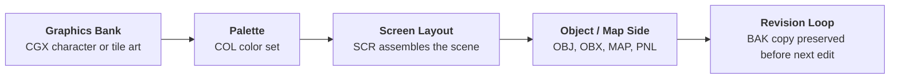

On 24 July 2020, a large Nintendo archive was uploaded online and quickly became known as the `Gigaleak`.
It was not one single neat source drop.
It was a mixed archive of ROMs, source trees, boot ROM repositories, internal tools, and later CVS/Subversion backups.


## Uploaded Files
These were the archive files uploaded on 4chan /g/ on 24 July 2020, the day the Gigaleak was leaked:
* **other.7z** - The broadest archive, containing DMG, CGB, SFC, lot-check, and boot ROM material
* **agb_bootrom_trunk.zip** - Extracted latest trunk snapshot of the AGB boot ROM repository
* **cgb_bootrom_trunk.zip** - Extracted latest trunk snapshot of the CGB boot ROM repository
* **pokemon-checkout.7z** - Pokemon-related source/material
* **netcard.7z** - Material for a cancelled Game Boy Advance peripheral
* **20100713cvs_backup.tar.7z** - CVS repository backup with later Nintendo projects

This page will cover each of these files, linking out to specific posts for each to dive into the details.

The next day its sequel, often called **Gigaleak 2**, followed with much more Nintendo 64 material.

---
# Other (other.7z)
The archive mysteriously named **other.7z** is one of the most interesting parts of the leak because it mixes game source trees with internal repositories and support material.

It contains these major sub-archives:
* **agb_bootrom.zip**  - Subversion repositories for both the Game Boy Advance and Game Boy Color boot ROM projects
* **CGB.7z** - Game Boy Color Source Code for Zelda and a build of Hamtaro 2
* **dmg.7z** - Original Game Boy Source Code for Zelda
* **Famicom_NES.7z** - Full set of official JP/USA Famicom/NES ROMS (Lot Check)
* **NEWS.7z** - A smaller archive with SFC-adjacent material and logs
* **SFC.7z** - SNES Source Code


---
## Original Game Boy Source Code for The Legend of Zelda Links Awakening (dmg.7z)
The archive **dmg.7z** contains the source code for the original version of The Legend of Zelda Links Awakening.



---
## Game Boy Color Source Code for The Legend of Zelda Links Awakening DX (CGB.7z)
The archive **CGB.7z** contains the source code for the Game Boy Color game The Legend of Zelda Links Awakening DX and pre-build ROM images of Hamtaro 2.



---
## Famicom (NES) Lot Check ROMS (Famicom_NES.7z)
We have a post covering the Full set of official JP/USA Famicom/NES ROMS released in the **Famicom_NES.7z** archive along with other LotCheck releases:



---
## Super Nintendo Source Code (SFC.7z/ソースデータ)
Contains the uncompiled raw source code for a number of Super Famicom (SNES) titles. In the leak, this codebase is preserved both as the `SFC.7z` archive and as a fully unzipped `other/SFC/ソースデータ` (Source Data) working directory. 

We have dedicated deep-dives exploring the leaked source code and assets for each of these massive titles:









One small provenance detail is easy to miss here.
While the primary unzipped source directories live under `other/SFC/ソースデータ`, three of these source trees—**F-Zero**, **Star Fox 2**, and **Super Mario Collection** (`srd13-SFCマリオコレクション`)—also survive duplicated inside `other/NEWS`. 

So far this `NEWS` material looks identical to the `other/SFC/ソースデータ/` versions rather than a different branch, but it is still useful because it shows these exact snapshots were also present concurrently in a Sony NEWS-side working environment.

---
## NEWS Workstation Material (other/NEWS)
The `NEWS.7z` archive is smaller and messier than `SFC.7z`, but it still preserves some useful workstation-side context.

As mentioned above, the F-Zero, Star Fox 2, and Super Mario Collection source trees also appear again here as exact copies, confirming they shared the same workstation environment snapshot. 
Inside `other/NEWS/FZERO`, the `Game` and `Tools` folders reappear, and the folder is even duplicated as `other/NEWS/FZERO/FZERO`. That does not currently seem to add any new F-Zero content, but serves as an additional preserved copy of the same archive.

Beyond the source trees, the `NEWS.7z` archive also contains a **テープリストア** (tape-restore) directory holding seven workstation backup snapshots in `.tar` format, plus a manifest file. These appear to be uncompressed mid-development system backups from around 2014:

### Tape Archive Backups (テープリストア)

| Archive | Size | Entries | Contents |
|---------|------|---------|----------|
| **NEWS_02.tar** | 12M | 187 | System logs and user configs (`.net`, `.cshrc`, `.login`, `.logout`, mail profiles) and some compressed ROMs inside emails |
| **NEWS_04.tar** | 96M | 5,309 | **Mixed graphics workstation**: 2,297 `.BAK`, 991 `.SCR`, 876 `.CGX`, 431 `.COL`, 266 `.OBJ`, 108 `.MAP`; includes late Star Fox 2 art, Zelda/GB-Zelda branches, confirmed Super Mario Kart assets, and a likely Pilotwings-era prototype |
| **NEWS_05.tar** | 109M | 3,831 | **Star Fox 2 3D CAD Pipeline & Development Toolkit**: 628 `.txt`, 500 `.cad` 3D models, 371 `.anm` animations, 307 `.nca` Nintendo CAD files, 268 `.c` C source files |
| **NEWS_09.tar** | 34M | 1,374 | **SNES sprite/level assets**: 502 `.BAK` backups, 213 `.CGX`, 128 `.COL`, 117 `.OBJ`, 56 `.SCR`, 52 `.PNL` panels - Yoshi-related content |
| **NEWS_11.tar** | 127M | 5,401 | **Largest dump**: 921 `.CGX`, 709 `.OBJ`, 648 `.SCR`, 526 `.COL`, 391 `.BAK`, 336 `.cgx` - primarily Yoshi's Island production artwork and sprite objects |
| **NEWS_17.tar** | 4.0K | 2 | Stub: `Backup.info` only |
| **NEWS_41.tar** | 4.0K | 2 | Stub: `Backup.info` only |

These tars represent raw workstation snapshots rather than organized source archives. The bulk of the data (NEWS_04, NEWS_05, NEWS_09, NEWS_11) consists of SNES development assets - heavily weighted toward graphics files (`.CGX`/`.COL` color palettes and screens), object definitions (`.OBJ`/`.OBZ` 3D/sprite data), and map data (`.MAP` and `.SCR`). Notably, NEWS_05 also preserves CAD files and animation source, suggesting multi-disciplinary workstation backups captured during active development cycles.



### NEWS_02 - Email Attachments and ROM Payloads
`NEWS_02.tar` is mostly system/user environment data, but it also preserves email payloads with attached ROM files.
For extracting those attachments, use this [NEWS_02 email extraction script](https://pastebin.com/yxRwWjpE).

Make sure to use the correct key for each email and put them in quotes e.g:

```bash
## eng/Mail/inbox
python3 decode.py -i '/usr01/eng/Mail/inbox/1' -k 'nishi\0' # sromchk.lzh - SROMCHK.EXE (ROM CHECKER for SHVC/SNES  Version 0.02)
python3 decode.py -i '/usr01/eng/Mail/inbox/2' -k 'is\0' # SNES Audio/Music Tooling from 12th March 1993 (containing SGE.ENV SGE.EXE SGE.OVR SME.EXE SME.OVR SWM.EXE SWM.OVR)
python3 decode.py -i '/usr01/eng/Mail/inbox/3' -k 'isw\0' # 15th March 1993 isw.lzh - Only ISW.COM and ISW.EXE
python3 decode.py -i '/usr01/eng/Mail/inbox/4' -k 'is\0'  # SNES SDK Binaries from March 1993 - ISASMN.lzh (IS65.EXE, ISLINK.EXE, ISSND.EXE), ISW0318.LZH (ISW.COM, ISWASM.BAT, ISWREQ.COM, TEST2.X65 ISW.EXE, ISWEDIT.BAT TEST1.X65, TEST3.X65)
python3 decode.py -i '/usr01/eng/Mail/inbox/5' -k 'newscad\0' # mario-4.lzh (containing CHIJO.COL, M-POSE.CGX, M-POSE.OBJ, RUN.OBJ, YOSHI.CGX, YOSHI.OBJ)

## Nintendo of America (NOA)
python3 decode.py -i '/usr01/noa/Mail/inbox/1' -k 'angry\0' # neskr.lzh containing PRG.ROM from 11th March 1993
python3 decode.py -i '/usr01/noa/Mail/inbox/#2' -k 'antepaenultima\0' # mar19th.lzh containing DMGJCX00.PRG

##  Research and Development 1 (RD1)
python3 decode.py -i '/usr01/rd1/Mail/inbox/1' -k 'izushi\0' # MINES.LZH - Containing Windows Minesweeper

python3 decode.py -i '/usr01/uji/Mail/inbox/#1' -k 'pmdawn\0' # The Great Waldo Search (SGW05) and Bubsy (SUY02)
python3 decode.py -i '/usr01/uji/Mail/inbox/1' -k 'sickboy\0' # Wayne's World (SWW07-0.COM and SWW07-1.COM) from Feb 17th
python3 decode.py -i '/usr01/uji/Mail/inbox/2' -k 'starwing\0' # SFRG-FO - German Star Fox
python3 decode.py -i '/usr01/uji/Mail/inbox/3' -k 'toomanygames\0' # 5 games (NHI02, NU803, SHX01, SMU00, STX02)
```


The recovered ROM groups include the following [^2]:
* From the "5 games" email:
  * `NHI02` (single file) and `NU803` (split) - do not currently load in bsnes; from size these are likely NES-side builds
  * `SHX01` (split) - **Super High Impact**
  * `SMU00` (split) - **Mario is Missing**
  * `STX02` (split) - **TAZ-MANIA**
* From the "bubsy and waldo" email:
  * `SGW05` - **The Great Waldo Search**
  * `SUY02` (split) - first **Bubsy**


## NEWS_04 - Nintendo Graphics Workstation Backup
`NEWS_04.tar` is a 96 MB Nintendo backup from one of their **Sony NEWS workstations** that preserves a large amount of graphics-side production material rather than source code.

Where [NEWS_05](/gigaleak-news-05) captures the Star Fox 2 3D toolchain, `NEWS_04` captures the more traditional 2D side of console production: character banks, palettes, screen layouts, object definitions, maps, and a huge number of backup revisions.

The archive is especially useful because it is not a clean, single-project handoff.
It is a live multi-user workstation snapshot with three home directories, several different projects, and visible evidence of iterative art work.

---

### At a Glance
`NEWS_04` is best understood as a **mixed graphics workstation backup**.
It preserves:

* **5,309 archive entries** under three user homes: `arimoto` (Masanao Arimoto), `sugiyama` (Tadashi Sugiyama), and `kakui`
* **2,297 `.BAK` files**, showing heavy iteration and local backup habits
* **991 `.SCR` files**, making screen and scene layout one of the dominant data types
* **876 `.CGX` files** and **431 `.COL` files**, pointing to SNES/GB graphics-bank and palette work
* **266 `.OBJ` files** and **108 `.MAP` files**, showing object/layout and map-side asset organization
* **One especially important late Star Fox 2 art workspace** under `home/arimoto/SF2`
* **Older Zelda and Game Boy Zelda art workspaces** under `home/arimoto/zelda` and `home/arimoto/GB-zelda`
* **A second artist-style workspace** under `home/sugiyama` with `fly`, `flyman`, `CAR`, `SIM`, `MARIO`, and `FX2`

Unlike `NEWS_05`, this archive contains almost no conventional program source.
Its value comes from file naming, layout formats, revision backups, and the way several projects coexist on one machine.

---

### The Main Story: Masanao Arimoto's Workspace
Arimoto's home directory is the most important part of the archive.
It combines one late and unusually dense `SF2` workspace with several older Zelda-related branches.

Project | Files | Dominant types | Date range | Reading
---|---|---|---|---
`SF2` | `1236` | `.BAK`, `.CGX`, `.SCR`, `.COL`, `.OBJ`, `.OBX` | `1993-07-01` to `1995-09-19` | The late, most active branch and the real centerpiece of `NEWS_04`
`GB-zelda` | `824` | `.BAK`, `.OBJ`, `.CGX`, `.MAP`, `.SCR`, `.PNL` | `1991-11-27` to `1994-08-02` | Game Boy Zelda visual and layout work, with stronger map/object emphasis
`zelda` | `545` | `.BAK`, `.CGX`, `.SCR`, `.COL`, `.MAP`, `.PNL` | `1991-05-23` to `1994-07-25` | Earlier Zelda screen/map art branch
`DELDA` | `213` | `.BAK`, `.CGX`, `.SCR`, `.COL` | `1991-05-23` to `1991-10-24` | Small early Zelda-related branch or internal variant





---

### Tadashi Sugiyama's Mixed Graphics Workspace
Sugiyama's home is the second major component of `NEWS_04`.
It is older than Arimoto's, broader in scope, and reads like a workstation that served multiple productions over five years rather than one focused project.

Project | Files | Dominant types | Date range | Likely game
---|---|---|---|---
`flyman` | `429` | SCR `286`, BAK `139` | `1989-10-13` → `1991-05-07` | Pilotwings-era prototype (unconfirmed)
`fly` | `388` | BAK `137`, CGX `102`, SCR `78`, COL `69` | `1989-10-13` → `1994-03-18` | Pilotwings-era prototype (art side; 1994 date = tape restore)
`CAR` | `415` | BAK `198`, SCR `148`, CGX `38`, MD7 `3` | `1991-04-05` → `1994-03-18` | **Super Mario Kart** ✓
`SIM` | `85` top-level + `is/` | SCR, CGX, OBJ, SFX, BAK | `1990-11-27` → `1993-01-22` | **SimCity SNES** (probable)
`MARIO` | `77` | CGX, SCR, COL, BAK | `1993-04-08` → `1993-06-21` | **Super Mario Collection** front-end/menu branch (probable)
`FX2` | `41` | CGX, SCR, COL, BAK | `1993-07-06` → `1993-12-08` | **Wild Trax / Stunt Race FX** ✓

#### Sugiyama Root
One useful thing about Sugiyama's home is that the project folders are not the whole story.
The root of `home/sugiyama` also preserves the shared workstation and CAD-tool layer that sat above those game directories.

The loose files split into a few clear groups:

* Sony NEWS user-environment files like `.cshrc`, `.login`, `.profile`, `.Xdefaults`, `.sxsession`, and `sj2usr.dic`
* generic CAD/sample art assets like `X.CGX`, `X.SCR`, `X0.SCR` to `X3.SCR`, `256.CGX`, `PATTERN.SCR`, and `cad.CGX`
* `sfx_main` sample manifests like `SAMPLE.sfx_main.LST`, `run.sfx_main.LST`, and their matching `.DAT` files
* a large set of tiny `.cbm` files named after editor actions such as `pencil`, `paint`, `line`, `circle`, `zoom`, `rotation`, `priority`, `map-open`, `scr-open`, and `chr-open`

Those `.cbm` files are especially useful.
There are **31** of them, every one is exactly **206 bytes**, and the names read like UI commands rather than game data.
The safest interpretation is that they are compact command or button definitions for Nintendo's SNES graphics tools, not per-game assets.

The `sfx_main` files point in the same direction.
Their `.LST` contents reference paths like `/usr/local/srd/cad/sfc/sfx_main.hex`, which makes the root of Sugiyama's home look like a real SRD CAD workstation environment rather than just a pile of extracted game folders.

#### fly and flyman
`fly` and `flyman` are complementary art/layout directories for an early SNES flight-game branch, likely connected to a Pilotwings-era prototype path.



#### CAR
`CAR` preserves unambiguous Super Mario Kart production assets (`MARIO-CAR`, `JUGEM`, `DOKAN`, `POLE`, `SLOT`) and Mode 7 track-map work.



#### SIM
`SIM` preserves SimCity SNES menu/UI structures (`SELECT-SCENARIO`, `MAP-SELECT`, `TOWN`, `LEVEL`, `INPUT`) and a distinctive `.SFX` pairing workflow tied to an `S-CG-CAD` tool signature.



One important extra detail at the NEWS_04 level is that Sugiyama's root directory also preserves shared CAD-tool resources above the project folders themselves, including generic sample screens, `sfx_main` manifests, and thirty-one tiny `.cbm` files that look like editor command or button definitions for Nintendo's graphics tools.

#### MARIO
`MARIO` is a short, menu-heavy branch centered on `GAMESELECT.*`, `MA-ROGO-OBJ.CGX`, and `2PR-S1.*`, currently read as probable Super Mario Collection / All-Stars front-end work.



#### FX2
`FX2` preserves Wild Trax / Stunt Race FX selection-screen assets, including lower-case naming patterns (`cpt`, `p-select`) that differ from earlier Sugiyama branches.



---

### NEWS_04 Timeline Snapshot

Period | Project | Status
---|---|---
`1989-10-13` | `fly` + `flyman` open together | Early SNES flight game begins
`1990-11-27` | `SIM` opens | SimCity SNES UI/art phase begins
`1991-04-05` | `CAR` opens | Super Mario Kart development begins
`1991-05-23` | `DELDA` + `zelda` open | Early SNES Zelda graphics phases begin
`1991-11-27` | `GB-zelda` opens | Game Boy Zelda branch begins
`1993-04-08` | `MARIO` opens | Probable All-Stars front-end branch begins
`1993-07-06` | `FX2` opens | Wild Trax UI art begins
`1994-03-18` | Tape snapshot | `fly`/`CAR` share restore-date timestamps
`1995-09-19` | `SF2` latest files | Late Star Fox 2 art branch remains active

---

### Practical 2D Workflow Pattern Preserved in NEWS_04


That pattern appears repeatedly across both Arimoto and Sugiyama workspaces.

---

---
## Super Famicom Built ROMs (other/SFC/ROM)
The `other/SFC/ROM` folder contains an unexpected subset of built Super Famicom binaries and a utility executable rather than source code. Specifically, it holds what appears to be a build of Star Fox 2, multi-disc split ROMs for Super Mario RPG in both Japanese and US localizations, and a checksum application.

### At a Glance
The `other/SFC/ROM` directory preserves:
* a single 1MB build path for the officially unreleased Star Fox 2
* Japanese and US builds of the 4MB Super Mario RPG, split perfectly into 1MB "Discs"
* a Windows/DOS executable tool for calculating ROM checksums


The folder structure is organized by game and region, revealing how large 4MB SNES games (like Super Mario RPG) were handled in 1MB chunks, along with an English test build of Star Fox 2.



- CheckSumHVC.exe - A command-line utility for calculating or validating ROM checksums
- StarFox2 - Directory for Star Fox 2 builds
- StarFox2/usa/SXJ03.COM - A built 1MB executable ROM image for Star Fox 2 (USA)
- SuperMarioRPG - Directory for Super Mario RPG (SA-1)
- SuperMarioRPG/JP - Japanese localization (ARWJ)
- SuperMarioRPG/JP/Disc0/ARWJ02-0.SFC - 1MB chunk 0 of the 4MB ROM
- SuperMarioRPG/JP/Disc1/ARWJ02-1.SFC - 1MB chunk 1 of the 4MB ROM
- SuperMarioRPG/JP/Disc2/ARWJ02-2.SFC - 1MB chunk 2 of the 4MB ROM
- SuperMarioRPG/JP/Disc3/ARWJ02-3.SFC - 1MB chunk 3 of the 4MB ROM
- SuperMarioRPG/US - US localization (ARWE)
- SuperMarioRPG/US/Disc0/ARWE00-0.SFC - 1MB chunk 0 of the 4MB ROM
- SuperMarioRPG/US/Disc1/ARWE00-1.SFC - 1MB chunk 1 of the 4MB ROM
- SuperMarioRPG/US/Disc2/ARWE00-2.SFC - 1MB chunk 2 of the 4MB ROM
- SuperMarioRPG/US/Disc3/ARWE00-3.SFC - 1MB chunk 3 of the 4MB ROM




### The EPROM Split Structure
The 4MB Super Mario RPG Japanese (`ARWJ`) and US (`ARWE`) ROMs are interesting because they are systematically cut into four `1048576` byte (1MB) files, sorted into `Disc0` through `Disc3`.

This division isn't an indicator of multi-disc gameplay like the PlayStation. Instead, it demonstrates the physical realities of development and testing at the time.

This is how the real SNES SA-1 prototype boards were burned physically, but emulator software won't recognize them out of the box until they are merged back into a single binary file.

Burning a full 4MB (32Mbit) game for testing meant dividing the binary across multiple 1MB EPROM chips. These folders explicitly preserve that file-splitting step before a physical board was flashed.

To play the builds on modern emulators, the split 1MB files just need to be rejoined in binary order. Because SNES games are flat binaries, a short Python script can safely merge them back into a working 4MB `.sfc` image:

```python
import os

base_path = './SuperMarioRPG/US'
output_path = './SuperMarioRPG-US-Merged.sfc'

chunks = [
    os.path.join(base_path, 'Disc0', 'ARWE00-0.SFC'),
    os.path.join(base_path, 'Disc1', 'ARWE00-1.SFC'),
    os.path.join(base_path, 'Disc2', 'ARWE00-2.SFC'),
    os.path.join(base_path, 'Disc3', 'ARWE00-3.SFC')
]

with open(output_path, 'wb') as outfile:
    for chunk in chunks:
        with open(chunk, 'rb') as infile:
            outfile.write(infile.read())
            
print(f'Successfully stitched 4MB ROM to: {output_path}')
```

Once stitched together, running a cryptographic hash (like `shasum -a 1`) on the resulting `SuperMarioRPG-US-Merged.sfc` file returns `a4f7539054c359fe3f360b0e6b72e394439fe9df`. This exact SHA-1 hash is heavily documented by ROM hacking and preservation communities (such as No-Intro) as being the bit-for-bit identical match to the final, unmodified commercial release of **Super Mario RPG: Legend of the Seven Stars (USA)**. This confirms the Gigaleak repository was holding the absolute final code rather than a beta or localization candidate!

### Star Fox 2 (USA)
`SXJ03.COM` is preserved as a 1MB file for the US version of Star Fox 2 (`usa`). The `.COM` extension is notable in Nintendo's development environments - it is identically sized to a standard 1MB SFC ROM dump and represents the direct compiled output, sharing conventions with the `.com` monitor artifacts seen in the Game Boy boot ROM repositories. Finding it packaged under the `SFC/ROM` directory provides a direct glimpse into the internal naming conventions for the project prior to its original cancellation.

By extracting the 64-byte block starting at `0x7FC0`, we can reveal the internal SNES ROM header embedded right inside the `SXJ03.COM` executable. The raw binary output exposes the title, layout, and makeup of the cartridge:

```text
00007fc0  53 54 41 52 46 4f 58 32  20 20 20 20 20 20 20 20  |STARFOX2        |
00007fd0  20 20 20 20 20 20 15 0a  00 01 33 00 d8 71 27 8e  |      ....3..q'.|
```

When decoded against the official SNES header specification, the metadata breaks down elegantly:
* **Internal Title:** `STARFOX2` (exactly 21 characters padded with spaces)
* **Map Mode (`0x15`):** Identifies the ROM layout 
* **Cartridge Type (`0x0A`):** Typically indicates `ROM + Battery + Coprocessor`, directly signaling the presence of the Argonaut Super FX chip needed rendering the 3D polygons!
* **ROM Size (`0x00`):** Curiously, the ROM size field is left completely blank (`0`), confirming that this `.COM` executable was a raw testing dump and not yet parsed through Nintendo's final master validation tool.

### Internal Tool: CheckSumHVC.exe
A string analysis of the `CheckSumHVC.exe` binary reveals it is a multi-platform command-line utility used internally by Nintendo. Despite having `HVC` in the name (Home Video Computer, the internal family code for the Famicom), this tool was used for validating lot-check checksums across multiple console generations.

The internal strings reveal its command-line flags:
* `[/?]` - show help (this text)
* `[/Q]` - show only SUM result
* `[/L]` - show SUM result in lower-case
* `[/C]` - set SUM to clip board
* `[/0]` - DMG Mode: check as addresses 0x014E, 0x014F data are 0x00

The `/0` DMG flag is particularly interesting. In the original Game Boy (DMG) cartridge header architecture, addresses `0x014E` and `0x014F` hold the Global Checksum of the ROM. The `/C` clipboard flag also provides a glimpse into the developer workflow, allowing engineers to quickly copy-paste generated checksums into their assembly configuration files before a final build. 

Additionally, because the tool was compiled via MSVC for Windows, it inadvertently preserved the exact hard drive path of the Nintendo developer who originally built the executable:
> `D:\n2633\Documents\Code\CheckSumHVC\CheckSumHVC\Release\CheckSumHVC.pdb`

The `n2633` directory is almost certainly a Nintendo internal employee or machine ID.


---
## Boot ROM Repositories (other/agb_bootrom)
The `other/agb_bootrom` folder is much richer than the filename suggests.
On disk it survives as two full Subversion repositories, one for `agb_bootrom` and one for `cgb_bootrom`, complete with revision history, `trunk/branches/tags`, and surrounding build material.

It is best thought of as two related but quite different archives:
* the AGB side is a broader monitor, startup, library, and tooling environment
* the CGB side is a tighter DMG-era monitor build package with spec documents

If you don't have subversion tooling installed the full trunk versions of both were released as separate archives **agb_bootrom_trunk.zip** and **cgb_bootrom_trunk.zip**.

---
### Gameboy Color Boot ROM (cgb_bootrom_trunk.zip)
The `cgb_bootrom_trunk.zip` archive is best understood as an exported working copy from the `cgb_bootrom` Subversion repository preserved inside `other/agb_bootrom`.



---
### Game Boy Advance Boot ROM (agb_bootrom_trunk.zip)
The `agb_bootrom_trunk.zip` archive is the extracted latest working copy from the much larger `agb_bootrom` Subversion repository found inside `other/agb_bootrom`.



---
---
# Netcard & Online Pokémon Project
We have a dedicated page delving deep into the BroadOn design documents regarding this cancelled Game Boy Advance online peripheral and the planned 3rd Floor of the Pokémon Center!



---
#  CVS Repository Dump (20100713cvs_backup.tar.7z)
The CVS Repository dump is from the 20th of October 2007 and mainly contains projects related to the WII Virtual console, such as emulators for Game Boy and DS, along with a few other small projects by individual developers.

## Checking out the latest version
### Step 1 - Extracting the tar
The first step after extracting the 7Zip file to to extract the tar archive, you can do this like so:
```bash
tar -xvf 20100713cvs_backup.tar
```

### Step 2 - Installing CVS and checking out files
You will need to first have the CVS command line utilities installed if you haven't already then you can install like so:
* Mac OSX: `brew install cvs`
* Ubuntu Linux: `apt-get install cvs`

Now run the command in a folder that you want to extract the files:
```bash
cvs -d ~/extract_path/usr/local/cvsrepo/ensata checkout .
```
Note that the path has to be the FULL absolute path or it will complain about not being able to find the host.

It is a very large repository so expect it to take a while to complete.

---
## Ensata (DS Emulator)
`ensata` is one of the most substantial projects in the CVS dump.
Rather than a single binary release, the leak preserves what looks like the full CVS repository for Nintendo's internal Nintendo DS emulator, including source code, Windows build projects, help files, plugin interfaces, debugger integrations, and UI artwork.

At the top level the repository contains:

* a standard `CVSROOT`
* one main module called `gbe`

The `gbe` module is the real project.
Across the whole repository there are roughly **1,214 files**, with the dominant types being:

Type | Count | Reading
---|---:|---
`.h,v` | `319` | C/C++ headers
`.cpp,v` | `261` | core implementation files
`.txt,v` | `172` | documentation and logs
`.gif,v` + `.bmp,v` + `.ico,v` | `151` combined | UI, help, skin, and debugger artwork
`.vcproj,v` + `.sln,v` + `.bpr,v` + `.bpf,v` | `56` combined | Visual Studio and Borland project files
`.html,v` + `.chm,v` + `.hhc,v` + `.hhp,v` | `72` combined | built help and help-project material

So this is not just emulator engine code.
It is a fairly complete internal Windows application repository.

### Repository Structure
The main `gbe` module splits into several clear components:

Directory | Files | Reading
---|---:|---
`WIN` | `646` | main Windows-side emulator, debugger, and engine code
`@log` | `150` | CVS branch/thread history files
`HelpProject` | `114` | Japanese and US help documentation projects
`PluginSDK` | `91` | plugin interface headers and related support files
`ext_control` | `91` | external-control integrations
`materials` | `53` | BMP/PSD UI skins and interface artwork
`DOL` | `11` | build/test material
`unreg` | `7` | unregister or activation-side utility
`ini_edit` | `5` | configuration editor tool
`rc_edit` | `3` | resource-editing support tool

That shape makes Ensata look like a full emulator product line rather than a tiny developer test harness.

### The Main Windows Application
Most of the actual emulator appears to live under `gbe/WIN/iris`.
That branch includes:

* the main application shell
* UI and frame code like `LcdFrame`, `LcdGDIFrame`, and `LcdD3DFrame`
* input handling through `DInput.cpp`
* ROM loading helpers like `ReadNitroRom`
* a large `engine` subtree with files like `arm9_biu`, `arm9_io_manager`, `backup_ram`, `boot_image`, `card`, `cartridge`, `dma`, and `engine_control`
* an `engine_subp` subtree with ARM7-side components like `rtc`, `touch_panel`, `subp_spi`, `subp_card`, and `sound_wrapper`

Even from filenames alone, that is much more than a superficial launcher.
The repository clearly preserves real DS hardware-emulation subsystems, including ARM7 and ARM9 support, cartridge and backup handling, LCD paths, timers, DMA, touch input, and sound wrappers.

### Debugger, Plugin, and Tooling Hooks
Ensata also looks unusually extensible for an internal emulator.

The leak preserves:

* `PluginSDK/plugin_sdk.h`
* `WIN/agbdeb` debugger-side code
* `WIN/iris/debug_tools/cw_debugger.dll` and `cw_debugger.exe`
* `ext_control` integrations for `cw_debugger`, `is_chara`, `nitro_viewer`, `pro_dg`, and `sample`
* `WIN/iris/builder_plugin` code
* helper tools like `ini_edit` and `rc_edit`

That makes the repository especially interesting historically.
It was not just being used as a standalone emulator for running ROMs.
It was also being wired into a broader Nintendo DS development environment with debugger and external-control support.

### UI, Localization, and Packaging Material
One of the nicest surprises in the repository is how much application-side packaging survived.

The `materials` folder keeps interface art such as:

* `activation.bmp`
* `backupmenu.bmp`
* `DebugPrint.bmp`
* `MemoryDump.bmp`
* `NintendoLogotype.bmp`
* `nitrosoft.bmp`
* `popupmenu.bmp`
* `key_config.bmp`
* `lcd_target.bmp`
* Photoshop sources like `buttons.psd`, `default_skin.psd`, `dirkey.psd`, and `iris_logo.psd`

Some of those assets also survive in Japanese-specific variants like `_jp.bmp` or `_jp.psd`.
That lines up with `HelpProject/jp`, `HelpProject/us`, and `WIN/iris/dlls/StrRes_eng.dll`, suggesting Ensata was being maintained as a localized internal tool rather than one single-language prototype.

### Version History and Branching
The CVS metadata is also unusually revealing.

The `@log` directory contains **150** branch-history files, and the RCS symbol names across the repository show a long development arc:

* early numbered versions from late `2003` and early `2004`
* `version-1-3c-20041203`
* `version-1-4-20050324`
* `version-1-4a-20050401`
* `version-1-4b-20051003`
* `version-1-4c-20060320`
* `version-1-4d-20060711`
* `version-1-4e-20070316`
* `version-1-4f-20080312`
* `version-1-4g-20080523`
* `version-1-4h-20081007`
* `version-1-4i-20091001`

There are also several named side branches:

* `external-control-for-cw-debugger`
* `external-control-for-is-chara`
* `version-stream-feedback-control`
* `version-d-input`
* `version-speed-up-test`
* `version_for_pokemon`
* `version_for_pokemon2`
* `version-nse-tentative`

That branching pattern matters.
It shows Ensata was not just a frozen emulator that got occasional bug fixes.
It was being actively adapted for debugger integration, performance work, input changes, stream feedback, and at least some Pokemon-specific internal branches.

### What This Means
The leak does not just confirm that Nintendo had an internal DS emulator.
It preserves a large slice of Ensata as a maintained software product:

* emulator core
* Windows UI shell
* debugger hooks
* plugin SDK
* help system
* localization assets
* version and branch history from `2003` to `2009`

That makes Ensata one of the highest-value parts of the CVS dump, especially for understanding how Nintendo's DS development environment fit together beyond the hardware devkits themselves.


---
## imatake
This folder contains two projects by someone known as Imatake who presumably worked at Nintendo 13 years ago (2007). One is a disassembler for original Game Boy ROMs and the other is a tool to support Korean Hangul characters in the Pokemon Font.

### dmgdasm
This is a disassembler for Original DMG Game boy ROMs written in C++, presumably used to test the Virtual Console Game Boy emulator in the **turnout** folder.

### dpk_fontconv (Hangul Korean Font Converter)
This is a font converter used to generate the Pokemon front for the Korean writing system known as Hangul.

---
## muratest
`muratest` is small, but it is a real cluster of low-level test projects rather than one random scratch folder.
It contains four compact branches: `dlltest`, `test2`, `test4`, and `test5`.

The code mix is very light:

* C and C++ source
* small include sets with headers like `ipaddress.h` and `osreport.h`
* simple `makefile` + `readme.txt` pairs in each project

That makes it look much more like a set of SDK or middleware experiments than a game repository.

The most complete branch is `dlltest`, which has both C and C++ source files (`a.cpp`, `b.cpp`, `osreport.c`, `static.c`) plus shared support headers.
`test2`, `test4`, and `test5` look like follow-on stripped-down experiments built around the same support layer.

So the safest reading is that `muratest` preserves small GameCube/Wii-era development tests by Teruki Murakawa, probably used to try out build setups, reporting, IP/network support, and basic runtime behavior rather than ship any end-user software.

## noriproj (Misc Tools)
`noriproj` really does split into two unrelated utility projects, but both are clearer from the file tree than the old summary made them sound.

### Virtual Console Uploader (vc)
The `vc` branch is a small PHP web application rather than a one-off script.
It includes:

* front-end pages like `index.php`, `search.php`, `navigate.php`, and `table.php`
* helper code like `for_narrow_search.php` and `for_pear.php`
* an `admin/` backend with upload, revise, and delete actions
* a parallel `vc_rev/` copy of the same app

So this looks less like a tiny uploader script and more like an internal web UI for browsing and managing Virtual Console or Wii Shop content records.

### WallPaperPasswordMaker
`WallPaperPasswordMaker` is a small C# Windows Forms application rather than just an algorithm dump.
It includes:

* `Form1.cs` and `Form1.Designer.cs`
* a project file, icon, and resources
* a standard `Properties/` tree with settings and assembly metadata

This matches the idea that it was an operator-facing utility used to generate Pokemon Box wallpaper passwords in a simple GUI rather than by hand.

It generates 4 passwords for a user based on a word list with an algorithm that takes into account the trainer ID and whatever wallpaper the user wants for their Box.

There is an unofficial version available on PokeWiki.de here: 
[Secret Code Generator - PokéWiki](https://www.pokewiki.de/Spezial:Geheimcode-Generator?uselang=en)

---
## turnout (Game Boy emulator for Wii VC)
`turnout` is much smaller than `ensata`, but it is also much cleaner.
The leak preserves a compact CVS repository for a Wii-side Game Boy emulator called `gbemu_rvl`, which looks very much like a Virtual Console support project rather than a general-purpose emulator product.

At the repository root there is one main module:

* `gbemu_rvl`

Across the whole tree there are only **28 files**, dominated by emulator source and headers:

Type | Count | Reading
---|---:|---
`.cpp,v` | `10` | core implementation files
`.hpp,v` | `9` | main emulator class interfaces
`.h,v` | `3` | lower-level headers
`.rom,v` | `4` | monitor ROMs for different Game Boy models
`Makefile,v` | `1` | Revolution SDK build entry point
`.bat,v` | `1` | helper script

That makes `turnout` look much more like a focused embedded emulator module than a full standalone tool with skins, plugins, and help projects.

### What the Project Contains
The `gbemu_rvl` module is split into three obvious parts:

* `include/` for the public emulator classes
* `src/` for the implementation
* `data/` for bundled monitor ROMs

The class names are very direct:

* `GBCpu`
* `GBEmulator`
* `GBGraphics`
* `GBRomImage`
* `GBSound`
* `GBSramImage`
* `GBSuperGameboy`
* `SaveBanner`
* `FontManager`

That gives a pretty good high-level map of the feature set.
This was not just a CPU core with a blitter attached.
It includes explicit ROM-image, SRAM, graphics, sound, Super Game Boy, and Wii save-banner handling.

### It Was Built as a Wii Project
The `Makefile` makes the platform explicit.
It includes:

* `$(REVOLUTION_SDK_ROOT)` build rules
* a module name of `gbemu_rvl`
* conditional defines for ROM and SRAM filenames

So this is very clearly a Wii-era Nintendo build, not an older desktop-side Game Boy emulator.
The naming also matches that role nicely:

* `rvl` points to Revolution / Wii
* `SaveBanner` fits Wii save-data presentation

### The Monitor ROM Set Is a Nice Detail
The `data/` directory is tiny but historically useful.
It preserves four different monitor ROM files:

File | Size | Reading
---|---:|---
`MonitorDmg.rom` | `714` bytes | DMG monitor
`MonitorMgb.rom` | `714` bytes | Game Boy Pocket / MGB monitor
`MonitorSgb.rom` | `457` bytes | Super Game Boy monitor
`MonitorCgb.rom` | `2,771` bytes | Game Boy Color monitor

That is a strong clue that the emulator was explicitly modeling multiple Game Boy hardware families rather than treating "Game Boy" as one flat target.

### The Branch Names Show What the Team Was Working On
Even though the repository is small, the CVS symbols are surprisingly informative.
The main branch history in files like `Makefile`, `main.cpp`, `GBEmulator.cpp`, and `GBSuperGameboy.cpp` includes:

* `imatake-070905-ShirenGB2Playable`
* `imatake-070906-GraphicsRenderingOptimized`
* `imatake-070910-GraphicsSynchronized`
* `imatake-070913-BeforeSgbImplementation`
* `imatake-071002-SgbFramePilot`
* `imatake-071004-SgbScreenAdjusted`

That tells a nice story in only a few weeks of 2007:

* first getting a real game, `Shiren GB2`, into a playable state
* then optimizing and synchronizing graphics
* then adding or refining Super Game Boy support
* then adjusting SGB framing and screen behavior

So while `turnout` is much smaller than `ensata`, it is not just a toy sample.
It looks like a targeted emulator branch being actively tuned for compatibility and presentation inside Nintendo's Wii Virtual Console environment.

---
## pokemon
The `pokemon` repository is one of the largest projects in the CVS dump, with roughly **52,619 files** spread across game build trees, tools, and localization work areas.

The strongest through-line is **Pokemon Diamond and Pearl**.
The leak preserves two main DS build trees, a very large work area full of message/font/localization snapshots, and a smaller set of supporting tools.

### The Main Project Layout
At the top level the repository breaks down into four major areas:

Directory | Files | Reading
---|---:|---
`pm_dp_ose` | `37,451` | main Diamond/Pearl branch with strong Korean and localization history
`pokemon_dp` | `11,234` | Diamond/Pearl build tree with Diamond/Pearl split resources
`yama_work` | `3,561` | message, font, spreadsheet, and regional localization workspace
`poketool` | `337` | smaller utility and memory/debug tools

That means the repo is not just raw game code.
It also preserves a lot of the production and localization machinery around the DS games.

### Diamond and Pearl Build Trees
Both `pokemon_dp` and `pm_dp_ose` look like real Nintendo DS project trees rather than random file dumps.
They contain:

* `Makefile`
* `commondefs.GF`
* `modulerules.GF`
* `.rsf` and `.lsf` build/config files
* `overlay_files`
* `overlaytool.rb`
* `make_g3_files`
* `make_prog_files`
* `diamond_rs` and `pearl_rs` subtrees
* `include`, `src`, `resource`, and `convert` directories

That structure strongly suggests a Game Freak DS build environment with overlay management and separate Diamond/Pearl resource outputs.

The `pokemon_dp` tree looks like the base Diamond/Pearl project, while `pm_dp_ose` looks like a later or more specialized branch layered on top of it.

### pm_dp_ose Looks Especially Localization-Focused
The version history in `pm_dp_ose` is particularly revealing.
Its CVS symbols include:

* `MASTER_ADAK00_APAK00`
* `MASTER_ADAK00_APAK00-DemoVersion-branch`
* a long run of `KR-*` branch names through late 2007
* `imatake-080421-HangulCompressRate`
* `imatake-080425-KoreanDemoBeta`
* `imatake-080904-PostmanFixFunction`
* `imatake-071012-GTSProfileSetting`
* `imatake-071015-BTProfileSetting`
* `imatake-070920-KoreanMonthsInNumber`
* `imatake-070920-RedNamesFixed`

That is a very strong hint that `pm_dp_ose` is not just a normal gameplay branch.
It looks heavily tied to Korean release work, demo-version handling, and late localization-specific fixes.

Even the file set supports that reading:

* `localize_readme.txt`
* `bugfix.h`
* `localize.h`
* `overlay_files`
* `pokemon_DS.bnr`

So this part of the leak is especially useful for understanding how Diamond/Pearl was being adapted and maintained across regions.

### yama_work Preserves the Localization Pipeline
If `pm_dp_ose` is the build side, `yama_work` is the production-workflow side.
It preserves a huge number of dated work folders and conversion scripts centered on text, fonts, and regional deliveries.

A few of the strongest signals are:

* dated snapshot folders like `DP0110`, `DP0122`, `DP0205`, `DP0219`, `DP0221`, `DP1204`, `DP1211_fixed`, and `DP1226+28`
* many `.gmm` message files such as `scenario1.gmm`, `scenario2.gmm`, `menu_msg1.gmm`, `fight_msg.gmm`, `pokedex.gmm`, `poketch.gmm`, `townmap.gmm`, and `wifi.gmm`
* many `.xls` workbooks like `DP_Items.xls`, `DP_Moves.xls`, `DP_Pokedex.xls`, `DP_Trainers.xls`, and `DP_US_ver2.xls`
* font files like `font_button.nftr`, `font_num.nftr`, `font_system.nftr`, `font_talk.nftr`, and `font_unknown.nftr`
* conversion and glossary tooling under `convert`, `msggrep`, `modify`, `glossary`, `xlsdiff`, and `japanese_to_usa`
* regional exchange folders like `fromNOE*` and `toNOE*`, plus `korea`

That makes `yama_work` one of the clearest localization-production artifacts in the whole CVS dump.
It is not only a text archive.
It preserves the spreadsheets, message banks, font resources, and helper scripts used to move Diamond/Pearl text across regions and revisions.

### poketool Adds Smaller Support Utilities
The `poketool` branch is much smaller, but still interesting.
It contains:

* `vtags`, a source-analysis or symbol/navigation tool
* `MemSnatcher`
* `MemSend`
* `marumiX`, including `DS_VRAM_Viewer` database files and RAM-transfer code

So even the smaller side of the repo points back toward DS debugging and content-inspection workflows rather than only game assets.

### What This Means
The `pokemon` repository is best understood as a mixed Diamond/Pearl production dump rather than a single neat game-source checkout.

Its value comes from three layers surviving together:

* the DS build trees in `pokemon_dp` and `pm_dp_ose`
* the heavy regional and Korean-branch history in `pm_dp_ose`
* the message/font/spreadsheet workflow in `yama_work`

That makes it one of the most useful repositories in the CVS leak for studying how Nintendo and Game Freak handled DS-era localization, font production, overlays, and release-specific branch management.

---
# References
[^1]: [Massive Nintendo "Gigaleak" Surfaces With ROMs, Canceled Games, and Much More Switcher.gg](https://switcher.gg/s/news/massive-nintendo-gigaleak-surfaces-with-roms-canceled-games-and-much-more/)
[^2]: [Another Nintendo leak uploaded online, features betas and source code for many SNES games - Page 7 - GBAtemp.net](https://gbatemp.net/threads/another-nintendo-leak-uploaded-online-features-betas-and-source-code-for-many-snes-games.570553/page-7)
