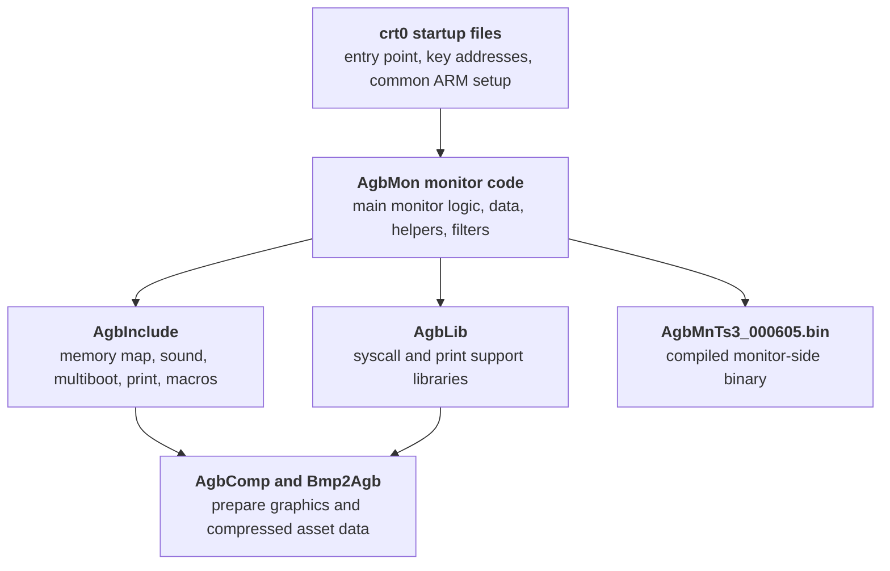
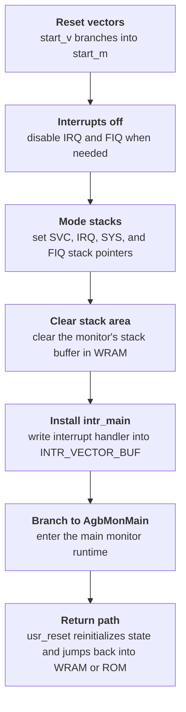
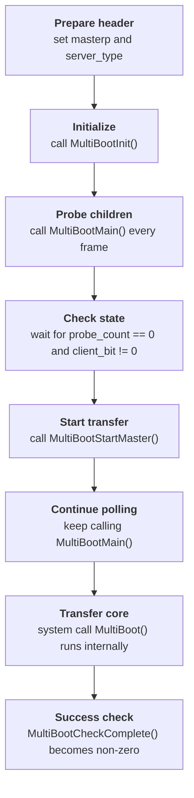

The Nintendo Gigaleak preserves the AGB boot ROM material in two useful forms.
Inside `other/agb_bootrom` it survives as a real Subversion repository, and separately the leak also includes `agb_bootrom_trunk.zip`, an extracted working tree that makes the source much easier to inspect.



---
## At a Glance
The AGB repository preserves:

* a real SVN history rather than just a loose source dump
* a compiled monitor binary at the trunk root
* monitor, startup, sound, and helper source under `build`
* shared headers, memory maps, and support libraries
* later PC-side tools like `AgbComp` and `Bmp2Agb`
* internal docs covering stack layout, joyboot, multiboot, and monitor behaviour

Repository | Revisions on disk | Earliest date | Latest date | Visible author
---|---|---|---|---
`agb_bootrom` | 7 revisions (`0` to `6`) | `24 April 2009` | `9 October 2009` | `nakasima`

---
## What the Revision History Shows
The visible revision sequence is unusually useful here because it shows how the repository was assembled:

Revision | Date | Author | Log message
---|---|---|---
`1` | `2009-04-24 01:45:30 UTC` | `nakasima` | empty
`2` | `2009-04-24 02:04:18 UTC` | `nakasima` | empty
`3` | `2009-10-08 07:08:52 UTC` | `nakasima` | `AgbComp追加。`
`4` | `2009-10-09 04:12:15 UTC` | `nakasima` | `AgbCompバイナリ追加。`
`5` | `2009-10-09 04:16:09 UTC` | `nakasima` | `Bmp2Agb追加。`
`6` | `2009-10-09 04:19:45 UTC` | `nakasima` | `HTMLリファレンスをAgbSDKからコピー。`

That gives the repository two clear phases.
Revision `2` looks like the main import of the low-level AGB working tree, while revisions `3` to `6` look more like an archival cleanup pass that added tools, binaries, and copied HTML reference material from `AgbSDK`.

---
## Trunk Structure


The AGB repository is easiest to read as one compiled monitor binary at the top, plus a `build` tree for source, libraries, and tools, and a `doc` tree for internal notes and SDK-related reference material.



- AgbMnTs3_000605.bin - Compiled AGB monitor-side binary
- build - Main low-level source and build tree
- build/AgbInclude - Hardware headers, macros, memory maps, and shared definitions
- build/AgbLib - Prebuilt syscall and print support libraries
- build/tools - Graphics and compression support tools
- doc - Internal notes, stack docs, and joyboot-related reference files




The separate `agb_bootrom_trunk.zip` export makes this repository much easier to work with because it preserves the extracted working tree directly.
That means the monitor, startup, and tool sources can be read as normal files instead of being reconstructed from raw Subversion storage.

---
## How the AGB Tree Fits Together
Once the file groups are laid out side by side, the AGB repository reads like a compact low-level development environment with four main layers:

* startup and runtime entry code in the `crt0*` files
* monitor logic in the `AgbMon*` source set
* reusable platform support in `AgbInclude` and `AgbLib`
* asset and preparation tools in `build/tools`

That reading also lines up well with the preserved `Arm.map` and `ArmDebug.map` files in the extracted `build` tree.
The repository is not just storing source files in isolation.
It preserves the pieces you would expect around a real buildable monitor environment: startup code, monitor code, libraries, map output, and the tools needed to prepare some of the input data.


Inside `build`, the repository splits into a broad support layout: include files, libraries, tools, and the main monitor/startup source files all sitting together in one low-level working tree.



- AgbInclude - Shared hardware headers, memory maps, and macros
- AgbLib - Prebuilt syscall and print libraries
- tools - PC-side graphics and compression tools
- AgbMon.c - Main monitor implementation
- AgbMonData.c - Monitor-side data tables
- AGBモニタ履歴.txt - Internal monitor version history
- AGBデバッガ対応方法.txt - Debugger hookup note
- AgbMnTs3_000605_Sum.txt - Checksum file for the preserved binary
- Arm.map - Main link map
- ArmDebug.map - Debug-oriented link map
- AgbSound.c - Sound support source
- AgbMPlay.c - Music or playback support source
- crt0Arm.s - Primary ARM startup file
- crt0IncludeArm.s - Shared startup include layer
- crt0KeyAddr.s - Key address definitions




---
## Core Source Files
The extracted working tree makes the key AGB files much more concrete:

File | What survives with it | What it appears to represent
---|---|---
`AgbMon.c` | `AgbMon.h`, `AgbMonData.c`, `AgbMonSub16.c`, `AgbMonSub32.c`, `AgbMonUncompFilt16.c`, `AgbMonUncompFilt32.c` | The main monitor-side runtime and helper layer
`crt0Arm.s` | `crt0ArmCst.s`, `crt0IncludeArm.s`, `crt0KeyAddr.s`, `crt0subArm.s`, `crt0subArmCommon.s`, `crt0subArmCst.s`, `crt0SinTable.s` | The ARM startup and bring-up path
`AgbComp.cpp` | `AgbComp.h`, `AgbComp.bpr`, `read_me.txt`, later `agbcomp.htm` and `AgbComp.exe` | A PC-side AGB data compression and filtering tool
`Bmp2Agb.cpp` | `Bmp2Agb.h`, `Bmp2Agb.bpr`, `Bmp2Agb.exe`, later `bmp2agb.htm` | A PC-side bitmap and palette conversion tool

### AgbMon and Its Helper Files
The extracted `AgbMon.c` file shows that the monitor was doing much more than exposing a bare debug loop.
It brings together RAM reset, pause handling, VBlank setup, joypad input, sound, music playback, logo data, and cartridge-type-dependent setup in one place.


- function|||AgbMonMain|||()
- global|||demomusic
- global|||demotrack|||[DEMO_TRACK_N]
- global|||demomusic2
- global|||demotrack2|||[DEMO_TRACK_SE_N]
- global|||demosound|||[2]
- table|||LogoDY|||[]
- extern|||sd_logo
- extern|||sd_piron
- extern|||sd_ok
- extern|||sd_cut
- extern|||sd_cancel








The visible globals are strongly multimedia-oriented, with `demomusic`, `demotrack`, `demomusic2`, `demotrack2`, `demosound`, and `LogoDY` all sitting near the top of the file.
So the monitor preserved here looks more like a small AGB bring-up environment with a built-in demo and support layer than a bare serial shell.

The actual `AgbMonMain()` body makes that much clearer.
It is not a simple "show logo and jump" routine.
The function resets RAM, enables the pause register, ramps sound bias, configures VBlank interrupts, checks for a CGB cartridge, initializes affine background state, sets up joypad/SIO handling, opens music players, then spends most of its runtime animating the `GAME BOY` logo with OAM, affine transforms, blending, and palette effects.

The later part of the function is just as revealing:

* it starts `sd_logo` and `sd_piron` during the title sequence
* it watches for `START + SELECT` as a cancel path
* on header failure, it does not simply hang forever; it stays in a loop that keeps joypad, sound, VBlank, and SIO-related state alive
* after the sequence finishes, it resets RAM again with different flags depending on whether it is returning to cartridge boot or preserving external RAM and SIO state for a downloaded program

That lines up with the monitor spec much better than the old "debug shell" mental model.
This is really a small boot presentation and handoff environment with serial-download support layered into it.

### What the Helper Files Add
The helper sources explain why `AgbMon.c` can be so high level.
The monitor is surrounded by its own small support layer rather than relying only on opaque external libraries.

Helper file | What is visible in the extracted tree | Why it matters
---|---|---
`AgbMonData.c` | `OamMonData` and other fixed monitor-side graphic data | Hardcoded logo/object layout for the animated boot presentation
`AgbMonSub.h` | `RomHeaderCheck`, `NintendoLogoSet`, `JoyMain_Init`, `JoyMain_Frame`, `RamInit`, `Agb2Cgb`, `PlttLinerSet`, and many BIOS-like helpers | Shows the monitor had its own private runtime layer around logo checks, input, memory, affine setup, and palette effects
`AgbMonSub16.c` | `NinLogoBak`, `OamBak`, `CharTmpBuf`, `WaveDataBuf`, `LogoCounter`, `LogoPosition`, and `LogoAffineSrc` | Preserves the working buffers and state for the logo animation and Nintendo-logo validation path
`AgbMonUncompFilt16.c` | `RLUnComp8`, `RLUnComp16`, `DiffUnFilter8_8`, `DiffUnFilter8_16`, `DiffUnFilter16_16` | Reimplements decompression and differential-filter helpers locally when syscall wrappers are not used
`AgbMonUncompFilt32.c` | `BitUnPack32`, `LZ77UnComp8`, `LZ77UnComp16`, `HuffUnComp32` | Confirms the monitor-side code could unpack the same compression formats used by Nintendo's toolchain

The helper layer is concrete enough to show directly from the extracted files.
It preserves fixed logo-layout data, runtime state buffers, affine helpers, and local decompression or filter routines side by side.


- table|||OamMonData[10][2]|||



- variable|||DacsCheck|||
- variable|||Cont|||
- variable|||Trg|||
- variable|||NinLogoBak[256]|||
- variable|||OamBak[128]|||
- variable|||LogoCounter[7]|||
- variable|||LogoPosition[7]|||
- variable|||LogoAffineSrc[7]|||
- function|||Agb2Cgb|||(void)
- function|||PlttLinerSet|||(s32 DataIndex, s32 LinerParam, s32 PlttStart)
- function|||NinLogoCopy|||(s32 BlockNo)
- function|||RegDataCheck|||(void)
- function|||GetSumData|||(u8 StartNo, u8 *Srcp, s32 Count)



- function|||OamSortSet16|||(u16 *Srcp, u16 *Destp, OamSortSetParam *Paramp)
- function|||BgAffineSet32|||(BgAffineSrcData *AffineSrcp, BgAffineDestData *AffineDestp, s32 ArrayNum)
- function|||ObjAffineSet32|||(ObjAffineSrcData *AffineSrcp, s8 *AffineDestp, s32 ArrayNum, u32 ParamAddrOffset)



- function|||CpuSet16_32|||(u8 *Srcp, u8 *Destp, u32 DmaCntData)
- function|||RLUnComp8|||(u8 *Srcp, u8 *Destp)
- function|||RLUnComp16|||(u8 *Srcp, u16 *Destp)
- function|||DiffUnFilter8_8|||(u8 *Srcp, u8 *Destp)
- function|||DiffUnFilter8_16|||(u8 *Srcp, u16 *Destp)
- function|||DiffUnFilter16_16|||(u16 *Srcp, u16 *Destp)



- function|||BitUnPack32|||(u8 *Srcp, u32 *Destp, BitUnPackParam *BitUnPackParamp)
- function|||LZ77UnComp8|||(u8 *Srcp, u8 *Destp)
- function|||LZ77UnComp16|||(u8 *Srcp, u16 *Destp)
- function|||HuffUnComp32|||(u32 *Srcp, u32 *Destp)












One easy-to-miss point in those files is that much of the implementation sits inside `#if 0` blocks.
So the tree is preserving local fallback or reference implementations of logo-copy, affine, checksum, decompression, and differential-filter routines even when the active build can route the same operations through the shared syscall layer instead.

The smaller helper headers fill in another useful part of the picture.
`AgbMonTypes.h` defines `PosData`, `AccelData`, `VectorData`, `BgScIncSetParam`, and `ObjAffineFuncParam`, which is a good match for the monitor's pseudo-3D logo movement and affine setup code.
`AgbMonMacro.h` then wraps `CpuSet16_32`, `CpuFastSet32`, trigonometric table access through `Sin256Tbl`, and a `MonRom2Ram()` macro that copies the boot image from address `0x00000000` to `0x00800000` before flipping `REG_ROMMAP`.
That is a strong hint that the monitor codebase was designed around both direct boot-ROM execution and an internal ROM-to-RAM execution path, even though the actual `MonRom2Ram()` call is commented out in `AgbMon.c`.

One subtle detail in `AgbMonSub.h` is especially useful.
The file can either map many of these helpers onto BIOS syscalls with `#define` wrappers, or compile local replacements instead.
That means the repository preserves both the API shape and the fallback implementation strategy.

### The crt0 Startup Path
The extracted `crt0Arm.s` source makes the startup path much clearer than the raw repository strings alone.
It contains vector entries, SWI dispatch, mode-specific stack setup, and the handoff into `AgbMonMain`.


- label|||start_v
- label|||fiq_v
- label|||start_m
- label|||irq_m
- label|||swi_m
- global|||swi_return
- global|||agb2cgb
- global|||halt
- global|||stop
- table|||sys_table
- stack|||usr_sp
- stack|||irq_sp
- stack|||svc_sp
- stack|||fiq_sp



- extern|||AgbMonMain
- extern|||intr_main
- extern|||RegisterRamReset32
- extern|||CpuSet16_32
- extern|||CpuFastSet32
- extern|||LZ77UnComp8
- extern|||LZ77UnComp16
- extern|||HuffUnComp32
- extern|||RLUnComp8
- extern|||RLUnComp16
- extern|||DiffUnFilter8_8
- extern|||DiffUnFilter8_16
- extern|||DiffUnFilter16_16
- extern|||SoundInit
- extern|||MPlayOpen
- extern|||MPlayStart
- extern|||MultiBootMain









The cards below highlight the most useful startup symbols and externs to read first.
Their footer counts reflect the full totals in `crt0Arm.s`, not only the smaller subset shown on the cards.

The visible startup code includes:

* the vector entries `start_v`, `undef_v`, `swi_v`, `irq_v`, and `fiq_v`
* a `start_m` path that disables interrupts, initializes stack state, stores `intr_main`, and branches into `AgbMonMain`
* explicit SWI dispatch through `sys_table`
* `agb2cgb`, `halt`, and `stop` system-call handlers
* stack pointers for user, IRQ, SVC, and FIQ modes

The actual vector table is more revealing than a generic "startup file" label suggests:

Vector | Branch target | What that means in practice
---|---|---
`start_v` | `start_m` | Reset entry goes straight into the main startup path
`undef_v` | `fiq_v` | Undefined instructions are funneled into the same monitor-side exception path
`swi_v` | `swi_m` | Software interrupts are decoded through the syscall table
`code_abort_v` | `fiq_v` | Prefetch aborts are redirected into the monitor exception path
`data_abort_v` | `fiq_v` | Data aborts are redirected the same way
`reserve_v` | `fiq_v` | Reserved vector is handled by the same monitor trap path
`irq_v` | `irq_m` | IRQs jump through the monitor's interrupt trampoline

That is a useful clue about the role of the file.
This is not a tiny retail-only boot stub.
It is a monitor-oriented bring-up layer that wants control of almost every exception class.

The stack and interrupt setup are also explicit in the source.
`start_m` and `bankreg_init_stack_clear` switch through `SVC`, `IRQ`, and `SYS` modes, assign dedicated stack pointers, clear the stack area in WRAM, disable `IME`, and install `intr_main` into `INTR_VECTOR_BUF` at the top of CPU WRAM.

That matches the shared memory-map headers cleanly:

* `INTR_CHECK_BUF` is defined as `CPU_WRAM_END - 0x8`
* `INTR_VECTOR_BUF` is defined as `CPU_WRAM_END - 0x4`
* `usr_sp`, `irq_sp`, `svc_sp`, and `fiq_sp` are all anchored relative to `WRAM_END`

So the startup path is not only initializing the CPU.
It is also laying out a small resident monitor workspace at the very top of internal WRAM for interrupt state and exception return handling.

The `sys_table` is especially rich.
It preserves `43` entries, which makes the file feel much closer to a BIOS-style service layer than a one-purpose loader.

Service range | Examples visible in `sys_table` | Why it matters
---|---|---
Reset and control | `usr_reset`, `RegisterRamReset32`, `halt`, `stop`, `restart_v`, `pause_reg_h_set` | The monitor exposes reset and pause control directly through SWI dispatch
Interrupt wait | `Intr_Wait`, `VBlankIntr_Wait` | Wait-for-interrupt behaviour is part of the system layer, not a game-side helper
Math | `DivS32`, `__16__rt_sdiv`, `SqrtU32`, `ArcTanS32`, `ArcTanS32_2` | The monitor bundles fixed math helpers alongside boot/runtime code
Graphics and transforms | `CpuSet16_32`, `CpuFastSet32`, `BgAffineSet32`, `ObjAffineSet32`, `BitUnPack32` | Core copy, unpack, and affine helpers are wired into the same service table
Decompression and filters | `LZ77UnComp8`, `LZ77UnComp16`, `HuffUnComp32`, `RLUnComp8`, `RLUnComp16`, `DiffUnFilter8_8`, `DiffUnFilter8_16`, `DiffUnFilter16_16`, `MonCheckSum32` | The boot monitor is directly tied to the same asset-processing formats seen elsewhere in the repo
Sound and music | `SoundBiasChange16`, `SoundInit`, `SoundMode`, `SoundMain`, `SoundVSync`, `SoundClearAll`, `SoundVSyncOff`, `SoundVSyncOn`, `MidiKey2fr`, `MPlayOpen`, `MPlayStart`, `MPlayStop`, `MPlayContinue`, `MPlayFadeOut`, `MPlyJmpTblCopy` | Audio bring-up and playback are treated as system services, not just app code
Link boot | `MultiBootMain` | Multiboot support is built into the same low-level runtime surface

The split across `crt0Arm.s`, `crt0ArmCst.s`, `crt0IncludeArm.s`, `crt0KeyAddr.s`, `crt0subArm.s`, `crt0subArmCommon.s`, and `crt0subArmCst.s` points to a maintained startup framework with shared constants, include fragments, helper routines, and table data rather than one single bootstrap file.

That split is also visible in the responsibilities of the nearby files:

* `crt0IncludeArm.s` carries a full GBA ROM header template, including the Nintendo logo block, maker code, device type byte, and header checksum field
* `crt0subArmCommon.s` contains the shared interrupt, wait, checksum, math, and decompression helpers
* `crt0subArm.s` and `crt0subArmCst.s` both preserve an `Agb2Cgb` routine, with the fuller version fading a bitmap-style screen and then calling the `agb2cgb` service
* `crt0KeyAddr.s` preserves a dense table of key-address words whose exact role still needs more decoding, but which clearly belongs to the startup support layer rather than user code

There are a few especially useful low-level details in that startup cluster:

* `crt0IncludeArm.s` embeds a full GBA cartridge header template, including the standard Nintendo logo bytes and fixed header fields at `0x080000A0` onward
* `crt0Arm.s` clears and lays out separate user, IRQ, SVC, and FIQ stack regions inside CPU WRAM before entering the monitor
* `crt0subArmCommon.s` installs `intr_main`, routes SIO interrupts to `JoyIntCommon`, and routes VBlank interrupts to `SoundVSync`
* the same file also preserves software implementations of division, square root, arctangent, interrupt wait, and checksum helpers
* `crt0subArm.s` contains `Agb2Cgb`, which builds a simple background/palette effect before branching into the lower-level `agb2cgb` routine

That makes the AGB side feel broader than the CGB package.
It is not only a boot monitor.
It is also carrying a real startup framework, interrupt framework, and a small library of low-level math and decompression support.

### AgbComp in More Detail
`AgbComp.cpp` is a self-contained Windows-side conversion utility with explicit file IO, option parsing, multiple compression back ends, and output-format handling.


- function|||usage|||(void)
- function|||argCheck|||(int argc, char *argv[])
- function|||optionCheck|||(int argc, char *argv[])
- function|||infileOpen|||(int argc, char *argv[])
- function|||outfileOpen|||()
- function|||imageReadWrite|||(FILE *fpi)
- function|||RawWriteBin|||(u8 **Srcpp, u32 SrcNum)
- function|||DiffFiltWrite|||(u8 **Srcpp, u32 SrcNum, u8 **Destpp)
- function|||RLCompWrite|||(u8 **Srcpp, u32 SrcNum, u8 **Destpp)
- function|||LZCompWrite|||(u8 **Srcpp, u32 SrcNum, u8 **Destpp)
- function|||HuffCompWrite|||(u8 **Srcpp, u32 SrcNum, u8 **Destpp)
- function|||MakeBinTree|||(u32 TableNo, u32 Bit, u32 CheckNodes)
- global|||outfileNamep
- global|||labelNamep
- global|||outFileType
- global|||lzSearchOffset
- global|||huffBitSize
- global|||diffBitSize








Its usage text and source show support for binary output, raw headers, differential filters, run-length encoding, LZ77, and Huffman packing.
That makes it look like a general AGB data-preparation utility rather than a one-purpose compressor.

### Bmp2Agb in More Detail
`Bmp2Agb.cpp` has its own argument parser, bitmap readers, output-path logic, and the same broad family of compression back ends seen in `AgbComp`.


- function|||usage|||(void)
- function|||argCheck|||(int argc, char *argv[])
- function|||optionCheck|||(int argc, char *argv[])
- function|||infileOpen|||(int argc, char *argv[])
- function|||infileParamsRead|||()
- function|||bmpParamRead|||(FILE *fp, s32 offset, int whence, void *ptr, size_t size)
- function|||paletteReadWrite|||()
- function|||bmp24bto16b|||(FILE *fpi)
- function|||IndexImage2Char|||(FILE *fpi)
- function|||IndexImage2Screen|||(FILE *fpi)
- function|||RGBImage2RawScreen|||(FILE *fpi)
- function|||DiffFiltWrite|||(u8 **Srcpp, u32 SrcNum, u8 **Destpp)
- function|||RLCompWrite|||(u8 **Srcpp, u32 SrcNum, u8 **Destpp)
- function|||LZCompWrite|||(u8 **Srcpp, u32 SrcNum, u8 **Destpp)
- function|||HuffCompWrite|||(u8 **Srcpp, u32 SrcNum, u8 **Destpp)
- global|||labelName
- global|||paletteName
- global|||indexFlipFlag
- global|||paletteWriteFlag
- global|||outType
- global|||outIndexOffset








The source and usage text show:

* `-bi` binary output, `-bm` bitmap mode, and `-c` character mode
* `-f` flip, `-np` no palette, and `-o offset` image shifting options
* bitmap readers and converters like `bmpParamRead()`, `bmp24bto16b()`, `IndexImage2Char()`, `IndexImage2Screen()`, and `RGBImage2RawScreen()`
* the same differential, run-length, LZ77, and Huffman back ends used elsewhere in the toolchain

So `Bmp2Agb` looks like the graphics-side companion to `AgbComp`, handling the conversion of PC bitmap data into AGB-friendly tile, screen, and palette resources.

---
## Headers, Libraries, and Docs
The `AgbInclude` directory is worth treating as its own layer rather than just a list of filenames.
It is effectively a compact low-level SDK surface that the startup and monitor code both depend on.


`AgbInclude` is an umbrella include layer rather than one single header dump.
It bundles the memory map, system-call prototypes, multiboot declarations, sound interfaces, print-debug hooks, and both C and assembly forms of the shared constants and macros.



- Agb.h - Umbrella include that pulls in the main AGB header set
- AgbDefine.h - Shared C constants and register bitfields
- AgbDefine.s - Shared assembly constants
- AgbDefineArm.s - ARMASM constants and bitfield definitions
- AgbMacro.h - C helper macros
- AgbMacro.s - Assembly helper macros
- AgbMacroArm.s - ARMASM helper macros
- AgbMemoryMap.h - C memory-map layout
- AgbMemoryMap.s - Assembly memory-map layout
- AgbMemoryMapArm.s - ARMASM memory-map layout
- AgbMultiBoot.h - Multiboot structures and limits
- AgbSound.h - Sound interfaces
- AgbSystemCall.h - SWI-facing system-call declarations
- AgbTypes.h - Shared type definitions
- IsAgbPrint.h - IS-AGB-EMULATOR print-debug interface




The top-level `Agb.h` file makes that intent explicit.
It is an umbrella include that pulls in `AgbTypes.h`, `AgbDefine.h`, `AgbMemoryMap.h`, `AgbMacro.h`, `AgbSystemCall.h`, `AgbSound.h`, `AgbMultiBoot.h`, and `IsAgbPrint.h`.
So the monitor code is sitting on top of a deliberate shared platform layer, not just ad hoc local headers.

A few of those include files are especially informative:

Header or include | What it contributes | Why it matters
---|---|---
`AgbMemoryMap.h` and `AgbMemoryMapArm.s` | `BOOT_ROM`, `EX_WRAM`, `CPU_WRAM`, `PLTT`, `VRAM`, `OAM`, ROM bank ranges, `INTR_CHECK_BUF`, `INTR_VECTOR_BUF`, and many hardware registers | Confirms the startup and monitor code are using a formal shared memory-map definition rather than magic addresses
`AgbSystemCall.h` | `SoftReset`, `RegisterRamReset`, `Halt`, `Stop`, `IntrWait`, `VBlankIntrWait`, math helpers, copy helpers, decompression helpers, and sound interfaces | Matches the services exported through `crt0Arm.s` `sys_table`
`AgbMultiBoot.h` | `MultiBootParam`, `MULTIBOOT_NCHILD = 3`, header size `0xc0`, and transfer-size limits from `0x100` to `0x40000` | Shows multiboot support was part of the same shared low-level environment
`IsAgbPrint.h` | Intelligent Systems `IS-AGB-EMULATOR` print-debug API using a buffer at `0x08fd0000` to `0x08fdffff` | Ties the repo directly to emulator-side debug tooling rather than only target-hardware code

`IsAgbPrint.h` is especially nice context because it is not just a generic logging stub.
It explicitly identifies itself as an `IS-AGB-EMULATOR` print debug library from Intelligent Systems, warns against using it inside tight main loops, and documents a dedicated host-visible print buffer range.
That gives the whole AGB repository a much clearer development-hardware flavor.

`AgbMemoryMap.s` is especially useful because it shows the monitor's expected global layout very plainly:

* boot ROM at `0x00000000`
* external WRAM at `0x02000000`
* CPU WRAM at `0x03000000`
* palette RAM at `0x05000000`
* VRAM at `0x06000000`
* OAM at `0x07000000`
* cartridge ROM banks from `0x08000000`

It also fixes the internal stack and system-buffer layout that the startup code is using, including `INTR_CHECK_BUF` and `INTR_VECTOR_BUF` near the top of CPU WRAM.

`AgbMultiBoot.h` is another strong clue about scope.
It preserves the full `MultiBootParam` structure, constants for the child-count and transfer-size limits, and named multiboot error codes.
So the serial-download path described by the monitor spec was not a vague idea.
The tree still contains the actual parameter structure Nintendo expected that path to use.

The `AgbLib` folder preserves several prebuilt libraries and associated `.alf` outputs:

* `libagbsyscall.a`
* `libagbsyscall154.a`
* `libagbsyscall98r2.a`
* `libisagbprn.a`
* `libagbsyscall_arm.alf`
* `libagbsyscall_arm154.alf`
* `libagbsyscall_arm99r1p2.alf`
* `libisagbprn_arm.alf`

The naming suggests reusable system-call and print-support layers, with multiple variants preserved for different toolchain or SDK revisions.

The `doc` tree adds useful workflow context through files like `AgbStack.txt`, joyboot images, multiboot notes, and GNUPro migration notes.


The `doc` folder is one of the most useful context dumps in the AGB tree because it mixes formal monitor specs, stack-layout notes, serial-boot material, and later workflow docs in one place.



- AGB－CPUモニタプログラム仕様書_000317.doc - Formal AGB CPU monitor specification created on 17 March 2000
- AgbStack.txt - CPU WRAM stack layout and interrupt-stack notes
- AGBシリアルブートマニュアル.doc - Serial boot manual
- 000209-agbマルチブート状態遷移図.jpg - Multiboot state-transition diagram
- joyboot-a.gif - Joyboot reference image
- joyboot-b.gif - Joyboot reference image
- AGB_ROM内登録データ案_040907.xls - Proposed ROM registration-data sheet
- AGB_ROM内登録データ (秘)_040907.xls - Internal ROM registration-data sheet
- 拡張モジュール判別手順.txt - Expanded module identification procedure
- GNUPro-98r2→GNUPro-99r1対応方法.txt - GNUPro migration note




The March 2000 monitor spec is especially useful because it confirms the overall boot design in plain language.
It says the program performs initialization, displays the `GAMEBOY / Nintendo` logo, checks cartridge registration data, and then starts the game.
It also explicitly says the monitor can launch software downloaded over serial communication, not just normal cartridge software.

The flowchart text in that same document matches the source closely:

* initialize RAM and registers
* ramp sound bias from `0` to `0x200`
* switch into CGB compatibility mode if a CGB cartridge is detected
* expand the logo display data into VRAM
* initialize SIO boot handling
* run the demo display while also accepting serial downloads
* continue SIO processing even if the cartridge checks fail
* start cartridge code from `0x08000000`
* start downloaded external-WRAM code from `0x02000000`

### Stack Layout and Monitor Save Conventions
`AgbStack.txt` is more than a rough memory sketch.
It documents how the monitor expected CPU WRAM to be partitioned during startup, IRQ handling, and nested system calls.

Address | Role in `AgbStack.txt` | Why it matters
---|---|---
`3007F00h` | `SP_usr` | Top of the user stack area
`3007FA0h` | `SP_irq` | Dedicated IRQ stack start
`3007FE0h` | `SP_svc` | Supervisor or system-call stack start
`3007FF4h` | sound buffer address | Confirms a fixed WRAM slot for sound-side state
`3007FFAh` | interrupt check flag | Matches the interrupt bookkeeping described in startup code
`3007FFBh` | `SoftReset()` return target | Shows soft reset was expected to return through a fixed CPU-WRAM slot
`3007FFCh` | interrupt handler address | The monitor calls the user interrupt routine through this saved vector

The same note also explains the monitor's save conventions.
Normal IRQ handling pushes `R0` to `R3`, `R12`, and `LR_irq` on the IRQ stack before branching through the handler slot at `3007FFCh`.
Nested IRQ handling then saves `SPSR_irq`, switches back into system mode, and continues on the user stack.
System calls use a parallel pattern on the SVC stack, saving `SPSR_svc`, `R11`, `R12`, and `LR_svc` before switching back to the user stack for the rest of the work.

That level of detail matters because it confirms the AGB monitor was designed as a resident runtime layer with documented stack discipline, not just a one-shot boot stub.

### Serial Boot and One-Cartridge Play
The separate `AGBシリアルブートマニュアル.doc` pushes the download side much further than the monitor spec alone.
It is version `1.0`, dated `9 April 2001`, and explains serial boot as a supported way to launch code on a GBA even with no cartridge inserted by downloading a program into external WRAM over the six-pin serial port.

The manual also makes the intended scale explicit:

* the maximum downloaded program size is `2 Mbit`, or `256 KB`
* the parent unit can boot up to three child units
* the same system was used for `1 cartridge play`, where only the parent needs the full game cartridge

That lines up neatly with the source-side definitions in `AgbMultiBoot.h`, where `MULTIBOOT_NCHILD` is `3`, the header size is `0xc0`, and the allowed transfer size ranges from `0x100` to `0x40000`.

The manual is especially useful because it explains what a downloaded child program had to do differently from a normal cartridge build:

* use `crt0_multi_boot.s` instead of the normal `crt0.s`
* place the `text` section at `0x02000000` instead of `0x08000000`
* avoid clearing the external-WRAM area that already contains the downloaded program
* still link a ROM-style registration header so the monitor can validate the image

The parent-side workflow is also described in enough detail to connect it back to the low-level monitor and syscall layer:

The same manual warns about a couple of failure cases that also help explain why this repository carries both monitor code and toolchain support around the feature:

* DMA must be stopped during transfer, including direct sound DMA
* an invalid source address or transfer size will fail the boot
* `MultiBootMain()` can return `0` even when nothing is connected, so the caller still has to inspect `client_bit`

Taken together, the manual, the monitor spec, the startup `sys_table`, and `AgbMultiBoot.h` all point to the same conclusion.
The AGB boot ROM repository is not only preserving the boot monitor itself.
It is also preserving Nintendo's intended software model for serial download and one-cartridge multiplayer boot.

### Build-Side Notes
Two of the most useful explanatory text files are actually in `build`, not `doc`: `AGBモニタ履歴.txt` and `AGBデバッガ対応方法.txt`.
Together they show how the monitor changed over time and how it was expected to cooperate with TS-era debugger setups.

The monitor history file is dense enough that a few milestones are worth pulling out directly:

Version | Visible change | Why it matters
---|---|---
`V0.30` | provisional title demo and a sound `BIAS` set or reset system call | Shows the monitor started life with explicit demo and audio bring-up behaviour
`V1.00` | provisional demo sound, provisional sound driver, system calls moved into assembler | Confirms the monitor and low-level service layer were being built together
`V1.20` | stack and system area moved into internal WRAM, with explicit `SP_usr`, `SP_irq`, `SP_svc`, and `SP_fiq` addresses | Lines up directly with `AgbStack.txt` and the `crt0` startup code
`V1.30` | inserted-cartridge identification flag flipped to `CGB=0` and `AGB=1` | Shows that cartridge-type detection was still being actively revised
`V1.54` | CGB compatibility-mode amplitude setting and register or RAM reset system call added | Ties the AGB monitor back to cross-generation compatibility handling
`V2.02` | forced `SIO` boot added with `START + SELECT` | Explains why the monitor spec and runtime keep talking about serial downloads
`V2.10` | debugger jump destinations changed for `1M-DACS`, `8M-DACS`, and no-`DACS` setups | Gives the debugger note more concrete historical context
`V5.00` | gamma correction, pause-register timing change, and Game Boy logo palette creation routine added | Shows the later monitor still had an active presentation layer, not just debug plumbing
`V5.11` | immediate jump to cartridge for `Sharp` evaluation use | A nice example of a hardware or testing-specific branch in the changelog

The debugger note is equally concrete once broken into steps:

Debugger step | What the note says | Why it matters
---|---|---
Setup | place debugger registration data at `8000000h` and write a 32-bit undefined instruction there | The debugger path is entered deliberately through an exception setup
Flagging | change `800009Ch` to `A5h` | Marks the cartridge image so the monitor knows to jump into debugger space
Exception save | save `SPSR_*`, `CPSR_*`, `R12_*`, and `LR_*` at `3007FE0h` onward | Matches the stack and WRAM conventions preserved elsewhere in the tree
Debugger jump | jump to `9FFC000h` or `9FE2000h` depending on the `d7` flag at `80000B4h` | Shows the monitor was built to support more than one debug-memory layout
Writable state | only `R12_*` and `SP_*` are modifiable by default because `LR_*` already stores the return path | Makes the debugger environment feel very controlled rather than ad hoc

That is enough to show the AGB package was not only a boot monitor plus tools.
It also preserves a fairly mature debugger-facing monitor environment with documented entry conditions and saved-state conventions.

### Project and Map Artefacts
The extracted `build` tree also preserves the glue around the source code itself.
`AgbMon.apj` is a project file full of readable configuration strings, while `Arm.map` and `ArmDebug.map` preserve the linked image layout down to the symbol level.

The map file is especially concrete.
It identifies the built image as `D:\Agb\AgbMonArm\Release\AgbMon.axf`, places the `Init` area from `crt0Arm.o` at base `0x00000000`, and then lays out the rest of the monitor image in order:

* `crt0subArm.o` and `crt0subArmCommon.o` as the startup and service core
* `AgbMPlay.o`, `AgbSound.o`, and `AgbMon.o` as the main runtime code
* `AgbSoundAsmArm.o`, `multi18_Arm.o`, and the `sd_*_arm.o` files as assembly-side support and audio assets
* `AgbLogoData.o` and `AgbMonData.o` as the fixed read-only monitor data
* zero-initialized runtime state for `AgbMonSub16.o` and `AgbMon.o` in CPU WRAM

`ArmDebug.map` goes even further by exposing the final linked addresses of the monitor services.
It shows `start_v` at `0x008000`, `AgbMonMain` at `0x0099f4`, `MultiBootMain` at `0x00aa82`, `sys_table` at `0x0081c8`, and `DacsCheck` at `0x03000000`.
That is a very useful cross-check against the prose in the page because it confirms the monitor's reset entry, runtime core, multiboot support, service table, and WRAM state are all present in the final linked image.

`AgbMon.apj` ties those files together as a real build workspace rather than a loose dump.
Its strings describe a `Thumb-ARM Interworking Image`, reference `AgbMon.axf`, include `Debug`, `DebugRel`, and `Release` configurations, and list the same `crt0`, `AgbMon`, `AgbSound`, `AgbMPlay`, helper, and `sd_*` sources seen in the extracted tree.
It also preserves linker options such as `-ro-base#0x8000`, `-rw-base#0x02000000`, `-map`, and `-first#crt0Arm.o(Init)`.

### The Preserved Monitor Binary
The repository also keeps the built output itself at the trunk root as `AgbMnTs3_000605.bin`.
That file is exactly `16,384` bytes, which is the expected `16 KB` size for the GBA boot ROM region defined in `AgbMemoryMap.h`.

The nearby `AgbMnTs3_000605_Sum.txt` file makes that output more useful because it preserves explicit checksum values for the built binary:

Checksum type | Value
---|---
Little-endian `8bit Check` | `0x0018f23a`
Little-endian `16bit Check` | `0x0da3ccc7`
Little-endian `32bit Check` | `0xbaae187f`
Big-endian `8bit Check` | `0x0018f23a`
Big-endian `16bit Check` | `0x0b675f73`
Big-endian `32bit Check` | `0xe5447ff5`

That small text file matters because it shows the binary was being tracked as a concrete build artifact, not just left as an orphaned output with no validation data around it.
It also lines up neatly with the monitor history, where the `NITRO-V0.01` note explicitly calls out a checksum change from `baae187f` to `baae1880`.

---
## What the AGB Side Preserves
Taken together, the AGB repository preserves a fairly complete low-level handheld support package rather than one narrow boot ROM source drop.
The pieces on disk point to:

* a real startup path
* a monitor program and its helper code
* shared hardware headers and macros
* versioned support libraries
* internal graphics and compression tools
* documentation tied to stack layout, joyboot, and SDK or toolchain context

