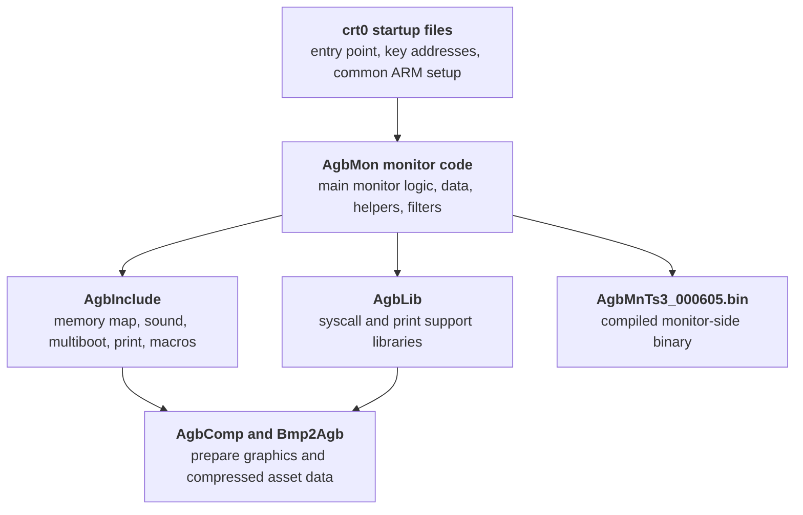

The Nintendo Gigaleak preserves the AGB boot ROM material in two useful forms.
Inside `other/agb_bootrom` it survives as a real Subversion repository, and separately the leak also includes `agb_bootrom_trunk.zip`, an extracted working tree that makes the source much easier to inspect.





---
## At a Glance
The AGB repository preserves:

* a real SVN history rather than just a loose source dump
* a compiled monitor binary at the trunk root
* monitor, startup, sound, and helper source under `build`
* shared headers, memory maps, and support libraries
* later PC-side tools like `AgbComp` and `Bmp2Agb`
* internal docs covering stack layout, joyboot, multiboot, and monitor behaviour

Repository | Revisions on disk | Earliest date | Latest date | Visible author
---|---|---|---|---
`agb_bootrom` | 7 revisions (`0` to `6`) | `24 April 2009` | `9 October 2009` | `nakasima`

---
## What the Revision History Shows
The visible revision sequence is unusually useful here because it shows how the repository was assembled:

Revision | Date | Author | Log message
---|---|---|---
`1` | `2009-04-24 01:45:30 UTC` | `nakasima` | empty
`2` | `2009-04-24 02:04:18 UTC` | `nakasima` | empty
`3` | `2009-10-08 07:08:52 UTC` | `nakasima` | `AgbComp追加。`
`4` | `2009-10-09 04:12:15 UTC` | `nakasima` | `AgbCompバイナリ追加。`
`5` | `2009-10-09 04:16:09 UTC` | `nakasima` | `Bmp2Agb追加。`
`6` | `2009-10-09 04:19:45 UTC` | `nakasima` | `HTMLリファレンスをAgbSDKからコピー。`

That gives the repository two clear phases.
Revision `2` looks like the main import of the low-level AGB working tree, while revisions `3` to `6` look more like an archival cleanup pass that added tools, binaries, and copied HTML reference material from `AgbSDK`.

---
## Trunk Structure


The AGB repository is easiest to read as one compiled monitor binary at the top, plus a `build` tree for source, libraries, and tools, and a `doc` tree for internal notes and SDK-related reference material.



- AgbMnTs3_000605.bin - Compiled AGB monitor-side binary
- build - Main low-level source and build tree
- build/AgbInclude - Hardware headers, macros, memory maps, and shared definitions
- build/AgbLib - Prebuilt syscall and print support libraries
- build/tools - Graphics and compression support tools
- doc - Internal notes, stack docs, and joyboot-related reference files




The separate `agb_bootrom_trunk.zip` export makes this repository much easier to work with because it preserves the extracted working tree directly.
That means the monitor, startup, and tool sources can be read as normal files instead of being reconstructed from raw Subversion storage.

---
## How the AGB Tree Fits Together
Once the file groups are laid out side by side, the AGB repository reads like a compact low-level development environment with four main layers:

* startup and runtime entry code in the `crt0*` files
* monitor logic in the `AgbMon*` source set
* reusable platform support in `AgbInclude` and `AgbLib`
* asset and preparation tools in `build/tools`

That reading lines up well with the preserved `Release.axf` map string.
The repository is not just storing source files in isolation.
It preserves the pieces you would expect around a real buildable monitor environment: startup code, monitor code, libraries, map output, and the tools needed to prepare some of the input data.


Inside `build`, the repository splits into a broad support layout: include files, libraries, tools, and the main monitor/startup source files all sitting together in one low-level working tree.



- AgbInclude - Shared hardware headers, memory maps, and macros
- AgbLib - Prebuilt syscall and print libraries
- tools - PC-side graphics and compression tools
- AgbMon.c - Main monitor implementation
- AgbMonData.c - Monitor-side data tables
- AgbSound.c - Sound support source
- AgbMPlay.c - Music or playback support source
- crt0Arm.s - Primary ARM startup file
- crt0IncludeArm.s - Shared startup include layer
- crt0KeyAddr.s - Key address definitions




---
## Core Source Files
The extracted working tree makes the key AGB files much more concrete:

File | What survives with it | What it appears to represent
---|---|---
`AgbMon.c` | `AgbMon.h`, `AgbMonData.c`, `AgbMonSub16.c`, `AgbMonSub32.c`, `AgbMonUncompFilt16.c`, `AgbMonUncompFilt32.c` | The main monitor-side runtime and helper layer
`crt0Arm.s` | `crt0ArmCst.s`, `crt0IncludeArm.s`, `crt0KeyAddr.s`, `crt0subArm.s`, `crt0subArmCommon.s`, `crt0subArmCst.s`, `crt0SinTable.s` | The ARM startup and bring-up path
`AgbComp.cpp` | `AgbComp.h`, `AgbComp.bpr`, `read_me.txt`, later `agbcomp.htm` and `AgbComp.exe` | A PC-side AGB data compression and filtering tool
`Bmp2Agb.cpp` | `Bmp2Agb.h`, `Bmp2Agb.bpr`, `Bmp2Agb.exe`, later `bmp2agb.htm` | A PC-side bitmap and palette conversion tool

### AgbMon and Its Helper Files
The extracted `AgbMon.c` file shows that the monitor was doing much more than exposing a bare debug loop.
It brings together RAM reset, pause handling, VBlank setup, joypad input, sound, music playback, logo data, and cartridge-type-dependent setup in one place.


- function|||AgbMonMain|||()
- global|||demomusic
- global|||demotrack|||[DEMO_TRACK_N]
- global|||demomusic2
- global|||demotrack2|||[DEMO_TRACK_SE_N]
- global|||demosound|||[2]
- table|||LogoDY|||[]
- extern|||sd_logo
- extern|||sd_piron
- extern|||sd_ok
- extern|||sd_cut
- extern|||sd_cancel








The visible globals are strongly multimedia-oriented, with `demomusic`, `demotrack`, `demomusic2`, `demotrack2`, `demosound`, and `LogoDY` all sitting near the top of the file.
So the monitor preserved here looks more like a small AGB bring-up environment with a built-in demo and support layer than a bare serial shell.

### The crt0 Startup Path
The extracted `crt0Arm.s` source makes the startup path much clearer than the raw repository strings alone.
It contains vector entries, SWI dispatch, mode-specific stack setup, and the handoff into `AgbMonMain`.


- label|||start_v
- label|||fiq_v
- label|||start_m
- label|||irq_m
- label|||swi_m
- global|||swi_return
- global|||agb2cgb
- global|||halt
- global|||stop
- table|||sys_table
- stack|||usr_sp
- stack|||irq_sp
- stack|||svc_sp
- stack|||fiq_sp



- extern|||AgbMonMain
- extern|||intr_main
- extern|||RegisterRamReset32
- extern|||CpuSet16_32
- extern|||CpuFastSet32
- extern|||LZ77UnComp8
- extern|||LZ77UnComp16
- extern|||HuffUnComp32
- extern|||RLUnComp8
- extern|||RLUnComp16
- extern|||DiffUnFilter8_8
- extern|||DiffUnFilter8_16
- extern|||DiffUnFilter16_16
- extern|||SoundInit
- extern|||MPlayOpen
- extern|||MPlayStart
- extern|||MultiBootMain









The visible startup code includes:

* the vector entries `start_v`, `undef_v`, `swi_v`, `irq_v`, and `fiq_v`
* a `start_m` path that disables interrupts, initializes stack state, stores `intr_main`, and branches into `AgbMonMain`
* explicit SWI dispatch through `sys_table`
* `agb2cgb`, `halt`, and `stop` system-call handlers
* stack pointers for user, IRQ, SVC, and FIQ modes

The split across `crt0Arm.s`, `crt0ArmCst.s`, `crt0IncludeArm.s`, `crt0KeyAddr.s`, `crt0subArm.s`, `crt0subArmCommon.s`, and `crt0subArmCst.s` points to a maintained startup framework with shared constants, include fragments, helper routines, and table data rather than one single bootstrap file.

### AgbComp in More Detail
`AgbComp.cpp` is a self-contained Windows-side conversion utility with explicit file IO, option parsing, multiple compression back ends, and output-format handling.


- function|||usage|||(void)
- function|||argCheck|||(int argc, char *argv[])
- function|||optionCheck|||(int argc, char *argv[])
- function|||infileOpen|||(int argc, char *argv[])
- function|||outfileOpen|||()
- function|||imageReadWrite|||(FILE *fpi)
- function|||RawWriteBin|||(u8 **Srcpp, u32 SrcNum)
- function|||DiffFiltWrite|||(u8 **Srcpp, u32 SrcNum, u8 **Destpp)
- function|||RLCompWrite|||(u8 **Srcpp, u32 SrcNum, u8 **Destpp)
- function|||LZCompWrite|||(u8 **Srcpp, u32 SrcNum, u8 **Destpp)
- function|||HuffCompWrite|||(u8 **Srcpp, u32 SrcNum, u8 **Destpp)
- function|||MakeBinTree|||(u32 TableNo, u32 Bit, u32 CheckNodes)
- global|||outfileNamep
- global|||labelNamep
- global|||outFileType
- global|||lzSearchOffset
- global|||huffBitSize
- global|||diffBitSize








Its usage text and source show support for binary output, raw headers, differential filters, run-length encoding, LZ77, and Huffman packing.
That makes it look like a general AGB data-preparation utility rather than a one-purpose compressor.

### Bmp2Agb in More Detail
`Bmp2Agb.cpp` has its own argument parser, bitmap readers, output-path logic, and the same broad family of compression back ends seen in `AgbComp`.


- function|||usage|||(void)
- function|||argCheck|||(int argc, char *argv[])
- function|||optionCheck|||(int argc, char *argv[])
- function|||infileOpen|||(int argc, char *argv[])
- function|||infileParamsRead|||()
- function|||bmpParamRead|||(FILE *fp, s32 offset, int whence, void *ptr, size_t size)
- function|||paletteReadWrite|||()
- function|||bmp24bto16b|||(FILE *fpi)
- function|||IndexImage2Char|||(FILE *fpi)
- function|||IndexImage2Screen|||(FILE *fpi)
- function|||RGBImage2RawScreen|||(FILE *fpi)
- function|||DiffFiltWrite|||(u8 **Srcpp, u32 SrcNum, u8 **Destpp)
- function|||RLCompWrite|||(u8 **Srcpp, u32 SrcNum, u8 **Destpp)
- function|||LZCompWrite|||(u8 **Srcpp, u32 SrcNum, u8 **Destpp)
- function|||HuffCompWrite|||(u8 **Srcpp, u32 SrcNum, u8 **Destpp)
- global|||labelName
- global|||paletteName
- global|||indexFlipFlag
- global|||paletteWriteFlag
- global|||outType
- global|||outIndexOffset








The source and usage text show:

* `-bi` binary output, `-bm` bitmap mode, and `-c` character mode
* `-f` flip, `-np` no palette, and `-o offset` image shifting options
* bitmap readers and converters like `bmpParamRead()`, `bmp24bto16b()`, `IndexImage2Char()`, `IndexImage2Screen()`, and `RGBImage2RawScreen()`
* the same differential, run-length, LZ77, and Huffman back ends used elsewhere in the toolchain

So `Bmp2Agb` looks like the graphics-side companion to `AgbComp`, handling the conversion of PC bitmap data into AGB-friendly tile, screen, and palette resources.

---
## Headers, Libraries, and Docs
The `AgbInclude` directory preserves a broad set of shared headers and assembly includes such as `AgbMemoryMap.*`, `AgbMultiBoot.h`, `AgbSound.h`, `AgbSystemCall.h`, `AgbTypes.h`, and `IsAgbPrint.h`.
That makes the repository feel SDK-adjacent rather than only ROM-specific.

The `AgbLib` folder preserves several prebuilt libraries and associated `.alf` outputs:

* `libagbsyscall.a`
* `libagbsyscall154.a`
* `libagbsyscall98r2.a`
* `libisagbprn.a`
* `libagbsyscall_arm.alf`
* `libagbsyscall_arm154.alf`
* `libagbsyscall_arm99r1p2.alf`
* `libisagbprn_arm.alf`

The naming suggests reusable system-call and print-support layers, with multiple variants preserved for different toolchain or SDK revisions.

The `doc` tree also adds useful workflow context through files like `AgbStack.txt`, joyboot images, multiboot notes, and GNUPro migration notes.

---
## What the AGB Side Preserves
Taken together, the AGB repository preserves a fairly complete low-level handheld support package rather than one narrow boot ROM source drop.
The pieces on disk point to:

* a real startup path
* a monitor program and its helper code
* shared hardware headers and macros
* versioned support libraries
* internal graphics and compression tools
* documentation tied to stack layout, joyboot, and SDK or toolchain context
