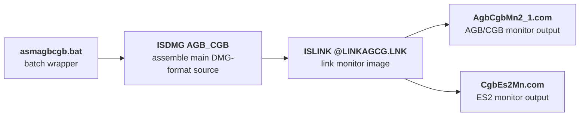
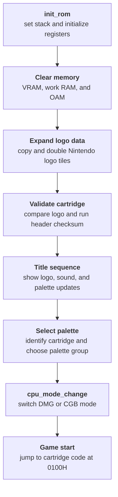
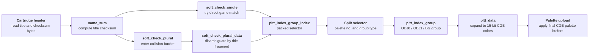
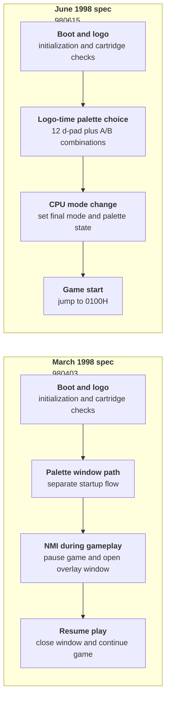

The Nintendo Gigaleak preserves the CGB boot ROM material in two useful forms.
Inside `other/agb_bootrom` it survives as a compact Subversion repository, and separately the leak also includes `cgb_bootrom_trunk.zip`, an extracted working tree that exposes the actual DMG-format source files directly.





---
## At a Glance
The CGB repository preserves:

* a compact SVN history rather than a single loose boot ROM dump
* two built monitor outputs at the root
* a tiny DMG-era `build` package with plaintext source files
* a batch wrapper that still preserves the old `ISDMG` and `ISLINK` flow
* two dated monitor specification documents from 1998

Repository | Revisions on disk | Earliest date | Latest date | Visible author
---|---|---|---|---
`cgb_bootrom` | 3 revisions (`0` to `2`) | `24 April 2009` | `24 April 2009` | `nakasima`

---
## What the Revision History Shows
The CGB repository is much smaller and simpler than the AGB one.
Its visible revision metadata shows a short one-shot import window rather than a later tool-enrichment phase.

Revision | What it appears to do | Why it matters
---|---|---
`1` | Creates the basic SVN layout with `trunk`, `branches`, and `tags` | Shows this was preserved as a real repository rather than a loose file dump
`2` | Imports the useful CGB working tree in one pass | Brings in the `.com` outputs, `build` folder, and dated monitor spec docs together

So unlike the AGB repository, the CGB side does not currently show later additions of tools or copied SDK reference material.
It feels more like a compact preserved handoff package.

---
## Trunk Structure


The CGB repository is much tighter than the AGB one: two built monitor binaries at the root, a very small `build` folder with DMG-format source inputs and a batch script, and two dated documents in `doc`.



- AgbCgbMn2_1.com - Built AGB/CGB monitor output
- CgbEs2Mn.com - Alternate ES2-targeted monitor output
- build - Small DMG-era build package
- build/agb_cgb.dmg - Main assembler input
- build/asmagbcgb.bat - Batch wrapper for the build
- build/cgb_es2.dmg - Alternate ES2 source branch
- build/cgbw6def.dmg - Smaller definitions/configuration source
- doc - Dated CGB notes from 1998
- doc/CGB－CPUモニタープログラム仕様書_980403.doc - Internal spec with filename `980403` (presumably 3rd April 1998) and an internal creation date of 26 March 1998
- doc/CGB－CPUモニタープログラム仕様書_980615.doc - Internal document dated 15 June 1998




The separate `cgb_bootrom_trunk.zip` export makes this repository much clearer because the three `build` files can be read directly.
That turns the CGB side from a vague inventory of filenames into a real small source package.

---
## Build Structure
The overall structure of the CGB repository is tight enough to summarize in one workflow:

* two final `.com` monitor binaries at the root
* three DMG-format build inputs plus a batch file in `build`
* two dated documents in `doc`


The CGB `build` folder is small enough to read almost as one batch-driven package: one wrapper script, two main DMG-format source inputs, and one smaller definitions file.



- asmagbcgb.bat - Batch wrapper for the DMG assembler and linker flow
- agb_cgb.dmg - Main assembler input
- cgb_es2.dmg - Alternate ES2 source branch
- cgbw6def.dmg - Smaller definitions/configuration source




### The Batch Build Wrapper
`asmagbcgb.bat` is only four lines long:

* `ISDMG AGB_CGB`
* `ISLINK @LINKAGCG.LNK`
* `PAUSE`
* `cvt.bat`

That small script is still very useful because it proves the package was built around one named main source file, one named linker command file, and a final conversion step.

The one obvious missing build artifact is `LINKAGCG.LNK` itself.
It is referenced directly by `asmagbcgb.bat`, but it does not survive in the extracted `cgb_bootrom_trunk` tree or the compact `other/agb_bootrom` repository snapshot.
So the overall build flow is preserved, but the exact linker command file still appears to be absent from the leaked CGB package.

---
## The Source Files
The extracted CGB working tree shows that all three `build` inputs are plaintext source files rather than opaque binary artifacts.

### The Main Monitor Source
`agb_cgb.dmg` is a full plaintext monitor source at `1428` lines.
It opens with `title monitor`, declares `BANK0 GROUP 0`, and includes `cgb_reg` plus `cgbw6def`.


- function|||init_rom
- function|||vram_clear
- function|||ram_clear
- function|||cp_hl2de
- function|||vblk_wait
- function|||set_cgb_pltt
- function|||init_sound
- function|||fade_out
- function|||cgb_sub
- function|||maker_check
- function|||select_palette
- function|||cpu_mode_change
- table|||hdma_data
- table|||title_key2pltt
- table|||nin_data
- table|||rdata
- table|||set_ninbg_soft








This is much more than a tiny jump into a final boot image.
The visible labels and data blocks show Nintendo logo and title-screen data, VRAM and OAM clearing paths, sound initialization, title sound timing, palette generation, maker checks, SGB checks, and CPU-mode changes.

The header comments are also especially revealing.
Unlike `cgb_es2.dmg`, this file carries later maintenance notes dated `21 August 1999` and `30 March 2000`, which makes it look like a maintained later branch built on top of the older monitor source.

### What the Monitor Actually Does
Reading through `agb_cgb.dmg` makes the overall flow much clearer than the filename alone would suggest.
The monitor is not just a minimal boot shim.
It spends most of its time on a staged logo, title, palette, and handoff sequence.

The top-level flow looks like this:

* set the stack and enter `init_rom`
* clear VRAM, work RAM, and OAM
* copy and double the Nintendo logo data into character memory
* compare the copied logo against the expected `nin_data` table
* run the header checksum
* switch into the title sequence with sound and palette updates
* detect cartridge metadata and choose a palette group
* switch into either the DMG compatibility path or the cartridge's color-capable mode and hand off to the inserted game

That is a useful distinction for readers expecting the retail CGB boot ROM to be "just the Nintendo logo plus a jump."
The source preserved here is very much a monitor-oriented implementation of that process, with a fair amount of staging, bookkeeping, and palette logic wrapped around it.

### The Compatibility Database
The later half of `agb_cgb.dmg` is especially revealing because it preserves a fairly large built-in compatibility database rather than a single hardcoded palette table.

At the source level, that database breaks down into:

* `SINGLE_SOFT_NUM = 64 + 1`
* `PLURAL_SOFT_NUM = 14`
* `SOFT_SUM_NUM = 93 + 1`
* `soft_check_single` as the main table of one-to-one title checks
* `soft_check_plural` and `soft_check_plural_data` for titles that need one more level of disambiguation
* `pltt_index_group_index` as the bridge from game identity to palette group
* `pltt_index_group` as the grouped `OBJ0`, `OBJ1`, and `BG` palette layout
* `pltt_data` as the actual color words used to build the final CGB palette buffers

That is a lot more structure than a simple "default palette" feature.
It shows Nintendo had turned the boot monitor into a small compatibility database that could classify cartridge headers, map them into palette groups, and then expand those groups into actual color data for the title and game handoff.

The source comments also make the database much easier to read once the file is decoded as Shift-JIS.
Some of the visible title abbreviations in `soft_check_single` and `soft_check_plural_data` include:

* `役満`
* `テニス`
* `テトリス`
* `ドクマリ`
* `カービィ`
* `ゼルタ`
* `ドンキー`
* `ポケ赤`
* `ポケ緑`
* `ポケ青`
* `ポケ黄`
* `KIRBY`
* `CHESS`
* `INVAD`
* `ASTRO`
* `WARI2`
* `SOCCR`
* `PKBOM`
* `G&W`

That list is only partial, but it is already enough to show what the table was doing in practice.
This was not a generic "DMG cartridge" palette system.
It was explicitly trying to recognize a long list of Nintendo-published or Nintendo-relevant games and attach a more suitable palette profile to each one.

A few especially recognizable entries line up like this:

Title label | Checksum byte | Packed selector | Palette no. | Group type | Evidence
---|---|---|---|---|---
`役満` | `$16` | `0*$20+18` | `18` | `0` | Checksum is explicit in `soft_check_single`; selector is matched by table position in `pltt_index_group_index`
`テニス` | `$D1` | `5*$20+2` | `2` | `5` | Checksum is explicit in `soft_check_single`; selector is matched by table position in `pltt_index_group_index`
`テトリス` | `$DB` | `0*$20+7` | `7` | `0` | Checksum is explicit in `soft_check_single`; selector is matched by table position in `pltt_index_group_index`
`ドクマリ` | `$3C` | `2*$20+11` | `11` | `2` | Checksum is explicit in `soft_check_single`; selector is matched by table position in `pltt_index_group_index`
`カービィ` | `$5C` | `5*$20+8` | `8` | `5` | Checksum is explicit in `soft_check_single`; selector is matched by table position in `pltt_index_group_index`
`ゼルタ` | `$70` | `5*$20+17` | `17` | `5` | Checksum is explicit in `soft_check_single`; selector is matched by table position in `pltt_index_group_index`
`ドンキー` | `$19` | `3*$20+6` | `6` | `3` | Checksum is explicit in `soft_check_single`; selector is matched by table position in `pltt_index_group_index`
`ポケ赤` | `$14` | `1*$20+16` | `16` | `1` | Checksum is explicit in `soft_check_single`; selector is matched by table position in `pltt_index_group_index`
`ポケ緑` | `$AA` | `1*$20+28` | `28` | `1` | Checksum is explicit in `soft_check_single`; selector is matched by table position in `pltt_index_group_index`
`ポケ黄` | `$15` | `0*$20+7` | `7` | `0` | Checksum is explicit in `soft_check_single`; selector is matched by table position in `pltt_index_group_index`

The interpretation is straightforward up to that point.
The checksum byte and packed selector are direct evidence from the source.
What each selector means aesthetically still depends on the later palette-group and palette-data expansion logic.

That is enough to see that the palette system is not only broad, but also quite uneven in its assignments.
Different games can land on very different group types even when they are broadly in the same first-party compatibility bucket.

The plural tables are just as revealing.
They preserve shorter secondary title fragments such as `ポケ青`, `WARI2`, `SOCCR`, `PKBOM`, `G&W`, `メトロ2`, `TET2`, `TETAT`, `ドンL`, and `ドンL2`.

That makes the lookup logic much easier to interpret.
The monitor was not only matching one checksum to one palette entry.
It also had a second-stage disambiguation path for collisions, where one checksum bucket could be split again by title fragment before the final palette selector was chosen.

So the compatibility logic looks like a three-step chain:

* check the cartridge header checksum
* fall back to a plural-title disambiguation table when needed
* unpack the final selector into palette number and palette-group type

### The Earlier ES2 Source
`cgb_es2.dmg` is another full plaintext source file at `1423` lines.
Its structure is almost the same, but the header is much simpler and only carries a `21 July 1998` date line.


- function|||init_rom
- function|||vram_clear
- function|||ram_clear
- function|||cp_hl2de
- function|||vblk_wait
- function|||set_cgb_pltt
- function|||init_sound
- function|||fade_out
- function|||cgb_sub
- function|||maker_check
- function|||select_palette
- function|||cpu_mode_change
- table|||hdma_data
- table|||title_key2pltt
- table|||nin_data
- table|||rdata
- table|||set_ninbg_soft








A quick diff between the two sources is revealing.
Most of the monitor is the same, but `agb_cgb.dmg` adds the later maintenance comment block, changes the flow around `init_rom2game`, inserts an extra `inc b` flag-setting step, and swaps one small-logo copy path from `ex_nindata` to `$ff80`.

So the best reading here is not "two totally different monitor programs."
It is "one older ES2-era source snapshot and one later maintained branch built on almost exactly the same codebase."

### Title, Logo, and Fade Sequence
One of the most interesting parts of the source is how much work goes into the title presentation itself.
The monitor does not just throw a fixed image at the screen.
It builds the title sequence out of several small helpers:

* `cp_nindata`, `cp_rdata`, and `chr2double` prepare the Nintendo logo and `R` mark character data
* `cp_ninbg`, `cp_cgblogo0_bg`, and `cp_cgblogo1_bg` populate the background tilemaps
* `init_sound` and `on_sound0_title` handle the short title audio path
* `fade_out` and `fade_out_sub` gradually walk the palette data toward white before clearing the title background

That makes the monitor feel much more like a small presentation program than a raw bootstrap.
It has a proper sequence of character conversion, tilemap writes, sound timing, per-frame waits, and palette fading.

The `fade_out` path is especially telling.
It loops for `19*2` steps, repeatedly calling `fade_out_sub`, waiting for VBlank, and re-uploading the updated title palette.
So even this small monitor source is doing a frame-by-frame effect, not just toggling a few registers once.

### Hardcoded Presentation Data
The title sequence is not only control flow.
It also depends on a small set of fixed data blocks and timing constants that survive directly in the source and definitions file.

Source item | What it appears to hold | Why it matters
---|---|---
`nin_data` | Expected Nintendo logo registration data | Used for the cartridge-logo comparison check
`rdata` | Small `R` mark or related title graphic data | Shows the title display was assembled from more than one graphic block
`hdma_data` | Small transfer setup block | Suggests a dedicated transfer setup for title or palette staging
`TITLE_SOUND_TIMING` | `22` | Controls when the title sound event is triggered
`TITLE_SOUND_COUNT_NUM` | `100 - TITLE_SOUND_TIMING` | Title-sequence sound counter setup
`TITLE_TIME_COUNT_NUM` | `68` | Overall title display timing constant

That is a nice reminder that the monitor is not just "logic plus a jump."
It also bundles fixed logo data, sound timing, and presentation-state constants for how the boot sequence should look and feel.

### The Definitions File
`cgbw6def.dmg` is only `103` lines, but it is a real source dependency rather than a mystery helper file.


- constant|||ex_nindata
- constant|||cpu_mode_data
- constant|||cgb_vram
- constant|||cgb_work_ram0
- constant|||cgb_work_ram1
- constant|||oam
- constant|||stack
- constant|||cgb_stack
- global|||name_sum
- global|||sel_pltt_flg
- global|||key_counter
- global|||pltt_grp_type








The top half defines the monitor's memory layout, including VRAM, work RAM banks, OAM, CPU work RAM, stack positions, and palette-buffer scratch areas.
The lower half defines palette IDs and small state bytes used while the monitor decides how to color the title sequence.

That second half is especially interesting because the palette constants name built-in presets like `CI_ZELDA_OBJ`, `CI_TETRIS`, `CI_METROID_OBJ`, `CI_CAMERA`, `CI_KIRBY_OBJ`, and `CI_GAMEWATCH_GB`.
So `cgbw6def.dmg` is also a compact data dictionary for the Game Boy Color boot monitor's built-in palette-selection system.

### The Working Memory Layout
`cgbw6def.dmg` is also the clearest place to see how the monitor expected to use CGB memory while it was running.

Region or buffer | Address | Role in the monitor
---|---|---
`ex_nindata` | `$0104` | Cartridge-side Nintendo logo registration data
`cpu_mode_data` | `$0143` | Cartridge CPU mode byte used during the final handoff
`cgb_vram` | `$8000` | VRAM base used for logo tiles, backgrounds, and palette staging
`cgb_work_ram0` | `$C000` | Main work RAM bank 0
`cgb_work_ram1` | `$D000` | Switchable work RAM bank region
`oam` | `$FE00` | Sprite attribute memory
`cpu_work_ram` | `$FF80` | CPU work RAM
`cpu_work_dma_proc` | `$FFC0` | OAM DMA transfer routine area
`stack` | `$FFFE` | Initial stack pointer
`cgb_stack` | `$DFFE` | Expanded monitor stack position
`oam_bak` | `$D100` | OAM build buffer
`bg_bak` | `$D600` | Background build buffer
`ocpd_bak` | `$D800` | OBJ palette buffer
`bcpd_bak` | `$D840` | BG palette buffer
`bcpd_win` | `$D8E0` | Window-specific BG palette area
`pltt_id_grp_mem` | `$D900` | Palette index-group buffer
`cgb_24Bpltt_mem` | `$DA00` | Expanded palette data
`cgb_24Bpltt_all_mem` | `$DD00` | Larger full palette expansion area

That layout makes the monitor feel very deliberate rather than improvised.
It has dedicated staging space for sprite data, background data, palette groups, expanded palette words, and even a DMA routine area inside CPU RAM.

### Named Palette Presets
The palette IDs in `cgbw6def.dmg` are easier to browse once they are grouped by the kind of job they appear to do.

Preset type | Examples | What they suggest
---|---|---
Generic tonal themes | `CI_SEPIA_4A`, `CI_SEPIA_4B`, `CI_BLUE_4A`, `CI_BLUE_4B`, `CI_GREEN_4A`, `CI_RED_4`, `CI_GRAY_4`, `CI_YELLOW_4` | Reusable fallback palettes for broad categories of monochrome games
Series or game-specific entries | `CI_ZELDA_OBJ`, `CI_TETRIS`, `CI_METROID_OBJ`, `CI_KIRBY_OBJ`, `CI_DONKEY_OBJ`, `CI_DONKEY_BG`, `CI_TENNIS_BG`, `CI_BASEBALL_BG`, `CI_PANEPON` | Named presets for especially recognizable first-party properties
Special visual themes | `CI_GAMEWATCH_GB`, `CI_RPG_BG`, `CI_CAMERA`, `CI_SPACE`, `CI_COOKIE` | Presets built around a specific visual style rather than one game series

That mix is one of the clearest hints that Nintendo was tuning the CGB boot monitor for appearance, not just compatibility.
The monitor had room for broad fallback color themes, but it also carried hand-labeled presets for well-known Nintendo properties.

### The Palette Selection System
The palette logic is one of the most revealing parts of the entire CGB package.
It shows that this monitor was carrying a built-in compatibility layer for many original Game Boy titles rather than one fixed default colorization.

The source splits that work into a few distinct data blocks:

* `soft_check_single` for `64 + 1` single-match title checks
* `soft_check_plural` and `soft_check_plural_data` for `14` more ambiguous cases
* `pltt_index_group_index` for `93 + 1` palette-group lookups
* `pltt_index_group` for grouped `OBJ0`, `OBJ1`, and `BG` palette combinations
* `pltt_data` for the actual color values

That matters because it makes the monitor's strategy very visible.
It is not just storing a few named preset palettes.
It is mapping cartridge header data to palette-group indices, then expanding those indices into grouped object and background palettes before uploading them into CGB palette memory.

The source also preserves a manual override path.
`KEY_CHECK_NUM` is `12`, and `key2pltt_table` maps those checks to palette choices, which lines up neatly with the four directional inputs multiplied across three button combinations.
So this is not only an automatic per-game palette system.
It also preserves the user-facing palette switcher Nintendo exposed on real hardware.

That input table is a nice example of how much practical behaviour survives in the source.
The palette system is not just data-driven in the abstract.
It preserves both the automatic lookup path and the exact small control surface Nintendo exposed to the player during boot.

The table itself is compact enough to summarize directly.
Each entry stores one input code and one packed palette selection value, where the low 5 bits are the palette number and the high 3 bits are the palette-group type:

Input code | Palette selector | Palette no. | Group type
---|---|---|---
`$40` | `0*$20+18` | `18` | `0`
`$41` | `5*$20+16` | `16` | `5`
`$42` | `3*$20+25` | `25` | `3`
`$20` | `5*$20+24` | `24` | `5`
`$21` | `5*$20+13` | `13` | `5`
`$22` | `0*$20+22` | `22` | `0`
`$80` | `0*$20+23` | `23` | `0`
`$81` | `0*$20+7` | `7` | `0`
`$82` | `5*$20+26` | `26` | `5`
`$10` | `0*$20+5` | `5` | `0`
`$11` | `3*$20+28` | `28` | `3`
`$12` | `0*$20+19` | `19` | `0`

Even without resolving every Japanese input comment perfectly, the structure is clear.
The manual selector is not choosing from arbitrary colors.
It is choosing from the same grouped palette system the automatic compatibility database uses.

With the Shift-JIS comments decoded, the inputs are clearer too:

* `$40`, `$41`, `$42` are `Up`, `Up+A`, and `Up+B`
* `$20`, `$21`, `$22` are `Left`, `Left+A`, and `Left+B`
* `$80`, `$81`, `$82` are `Down`, `Down+A`, and `Down+B`
* `$10`, `$11`, `$12` are `Right`, `Right+A`, and `Right+B`

So the manual palette switcher really is a compact 12-way menu built out of d-pad direction plus optional `A` or `B`.

### Cartridge Checks and DMG or CGB Handoff
The `maker_check`, `sgb_check`, `select_palette`, and `cpu_mode_change` cluster shows how the monitor decides what to do with the inserted cartridge.

At a high level it:

* reads cartridge header bytes around `$0143`, `$0144`, and `$014B`
* checks for the newer maker-code path versus the older style
* computes a title checksum into `name_sum`
* searches the single-title and plural-title tables for a palette match
* updates `curr_pltt_no` and `pltt_grp_type`
* waits for VBlank and then switches into either CGB or DMG mode

That helps explain why `cgbw6def.dmg` has both header-related constants and so many palette-related variables.
This is the logic that ties those pieces together.
The monitor is effectively doing a tiny bit of cartridge identification before it decides how the boot sequence should look.

One subtle detail in the source makes the handoff logic even clearer.
During the title loop, `select_palette` is only called when bit 7 of `cpu_mode_data` is clear.
Then `cpu_mode_change` checks the same byte again:

* if bit 7 is set, it writes the cartridge's mode byte straight into `KEY0` and follows the non-DMG path
* if bit 7 is clear, it forces DMG mode, adjusts `OPRI`, uploads the prepared CGB palette data for display, and conditionally resets the Nintendo background

So the manual palette selector is really a DMG-compatibility feature sitting inside the broader CGB monitor flow.
The source is not treating every cartridge the same way.
It branches early between "native color-capable cartridge" and "older monochrome cartridge that may need a compatibility palette."

### Palette Groups and Actual Color Data
The palette system becomes even more concrete once the decoded comments in `cgbw6def.dmg` and `agb_cgb.dmg` are lined up with the tables.

At the symbolic level, the monitor knows about palette entries such as:

* `CI_SEPIA_4A`
* `CI_SEPIA_4B`
* `CI_BLUE_4A`
* `CI_BLUE_4B`
* `CI_GREEN_4A`
* `CI_RED_4`
* `CI_GRAY_4`
* `CI_YELLOW_4`
* `CI_GAMEWATCH_GB`
* `CI_RPG_BG`
* `CI_ZELDA_OBJ`
* `CI_TETRIS`
* `CI_METROID_OBJ`
* `CI_CAMERA`

With the comments decoded, a few of those names are much clearer in plain Japanese too:

* `セピア4A` and `セピア4B`
* `ブルー4A` and `ブルー4B`
* `グリーン4A`
* `ゲームウォッチBG`
* `ゼルダOBJ`
* `テトリス`
* `メトロイドOBJ`
* `デバガメ`
* `宇宙`

Then `pltt_index_group` combines those symbolic entries into 30 grouped presets for `OBJ0`, `OBJ1`, and `BG`.
For example:

Group | OBJ0 | OBJ1 | BG
---|---|---|---
`0` | `CI_MOGURA_OBJ` | `CI_FLASH_1` | `CI_RPG_BG`
`7` | `CI_BLUE_4A` | `CI_FLASH_1` | `CI_TETRIS`
`17` | `CI_ZELDA_OBJ` | `CI_BLUE_4A` | `CI_RED_4`
`20` | `CI_METROID_OBJ` | `CI_GREEN_4A` | `CI_BLUE_4A`
`26` | `CI_CAMERA` | `CI_CAMERA` | `CI_CAMERA`

That is one of the nicest low-level details in the whole source.
Nintendo was not only choosing one palette per game.
It was often choosing coordinated object and background palette triples.

The final `pltt_data` table then resolves those symbolic names into actual 15-bit CGB color words.
A few examples:

Palette entry | Sample color words
---|---
`セピア4A` | `$7fff, $32bf, $00d0, $0000`
`ブルー4B` | `$7fff, $6e31, $454a, $0000`
`ゼルダOBJ` | `$7fff, $03e0, $0206, $0120`
`テトリス` | `$7fff, $03ff, $001f, $0000`
`メトロイドOBJ` | `$03ff, $001f, $000c, $0000`
`デバガメ` | `$7fff, $033f, $0193, $0000`

So the palette pipeline has three clear layers:

* identify a game
* map it to an `OBJ0` and `OBJ1` and `BG` group
* expand that group into concrete 15-bit CGB colors

Here are a few representative swatches generated from the actual `pltt_data` words:

Palette entry | Swatches | Direct evidence
---|---|---
`セピア4A` |     | Converted directly from `$7FFF, $32BF, $00D0, $0000`
`ブルー4B` |     | Converted directly from `$7FFF, $6E31, $454A, $0000`
`ゼルダOBJ` |     | Converted directly from `$7FFF, $03E0, $0206, $0120`
`テトリス` |     | Converted directly from `$7FFF, $03FF, $001F, $0000`
`メトロイドOBJ` |     | Converted directly from `$03FF, $001F, $000C, $0000`
`デバガメ` |     | Converted directly from `$7FFF, $033F, $0193, $0000`

That makes the palette story easier to grasp at a glance.
The source is not only naming palettes symbolically.
It is preserving the exact 15-bit color sets the monitor uploaded into CGB palette memory.

### Why the AGB_CGB Branch Matters
One subtle but useful detail is that the later `agb_cgb.dmg` branch is not only carrying the same broad logic as `cgb_es2.dmg`.
It also contains a few maintenance-era clues that make it feel like a live follow-on version of the same monitor:

* later header notes dated `1999-08-21` and `2000-03-30`
* a small `init_rom2game` flow change with three inserted `nop` instructions
* an extra `inc b` flag-setting step before `rombank_change`
* one small Nintendo-logo copy change from `ex_nindata` to `$ff80`

Those are all small edits, but together they make the relationship between the two source files easier to understand.
`cgb_es2.dmg` looks like the older baseline, while `agb_cgb.dmg` looks like a carefully carried-forward branch rather than a rewrite.

The actual source diff is also small enough to summarize cleanly:

Change area | `cgb_es2.dmg` | `agb_cgb.dmg`
---|---|---
Header block | single `1998-7-21` line | later `1999-8-21` and `2000-3-30` maintenance notes
Post-`fade_out` flow | direct `jr init_rom2game` | three `nop` instructions, then fall through
`init_rom2game` | no extra flag write | adds `inc b`
Small Nintendo logo copy | `ld de, ex_nindata` | `ld de, $ff80`

So the later branch changes are real, but still very tightly scoped.
They look like maintenance edits to a stable monitor rather than a substantial redesign.

---
## Outputs and Documents
The filenames at the root still tell a useful story.
`AgbCgbMn2_1.com` appears to combine `AGB`, `CGB`, and `Mn`, which likely stands for monitor.
`CgbEs2Mn.com` looks more specialized, with `Es2` strongly suggesting a hardware revision, engineering sample stage, or internal target variant.

The built outputs are also remarkably close to each other.
Both `AgbCgbMn2_1.com` and `CgbEs2Mn.com` are exactly `2304` bytes, and a byte-level comparison only shows `11` differing positions.
That fits very well with the source-level picture from `agb_cgb.dmg` and `cgb_es2.dmg`: these are two extremely closely related monitor builds rather than radically different binaries.

Those binary differences are tightly clustered too:

Offset | `AgbCgbMn2_1.com` | `CgbEs2Mn.com`
---|---|---
`0x0F3` | `00` | `18`
`0x0F4` | `00` | `02`
`0x0F6` to `0x0FC` | seven-byte changed block | seven-byte changed block
`0x40A` | `80` | `04`
`0x40B` | `FF` | `01`

That clustering matches the source-level story nicely.
Most of the binary is identical, with only one small early block and one tiny late block changing between the two monitor builds.

The `doc` folder survives as two files:

* `CGB－CPUモニタープログラム仕様書_980403.doc`
* `CGB－CPUモニタープログラム仕様書_980615.doc`


The `doc` folder is tiny, but it matters because both files are formal monitor specifications rather than loose notes.
Together they show how Nintendo's documented understanding of the CGB monitor changed between March and June 1998.



- CGB－CPUモニタープログラム仕様書_980403.doc - Earlier monitor specification with filename `980403` and an internal creation date of 26 March 1998
- CGB－CPUモニタープログラム仕様書_980615.doc - Revised monitor specification dated 15 June 1998




Those filenames translate naturally as `CGB CPU Monitor Program Specification`.
So the docs are not stray notes.
They are formal specification documents for the monitor package itself.

Document | Stored filename | Meaning | File size on disk
---|---|---|---
`26 March 1998` initial version | `CGB－CPUモニタープログラム仕様書_980403.doc` | Earlier specification snapshot; filename still carries `980403` | `261,120` bytes
`15 June 1998` initial version | `CGB－CPUモニタープログラム仕様書_980615.doc` | Later revised specification snapshot | `111,616` bytes

They survive as old Word documents, but `textutil` can still pull the main text out cleanly.
That makes them much more useful than raw metadata alone.

Both files identify themselves as `Microsoft Word for Windows 95` documents, both preserve the path `C:\Word Documents\cgb\CGB`, and the later `980615` revision still carries update-field names such as `UPDATETITLE`, `UPDATEITEMNAME`, `UPDATEMODELNUMBER`, and `UPDATEREEDITDAY`.

That confirms a few practical details before even getting into the actual monitor design:

* the spec docs were being edited in a mid-1990s Windows Word environment
* they appear to come from a project directory literally named `cgb`
* the later revision was structured enough to preserve formal update fields rather than being an informal note dump

The most useful improvement here is that the documents can now be read as real text rather than only metadata.
That changes the page quite a bit because the specifications now confirm several major behaviours directly.

The `980403` document describes a six-part structure:

* overview
* memory map
* bit layout
* initialization program flowchart
* color-palette selection program start flowchart
* color-palette selection operation

Its overview states that the program handles initialization, displays the Nintendo logo, checks the cartridge registration data, starts the game, and allows color-palette changes when a DMG cartridge is inserted.

The later `980615` document is even more revealing.
It reduces the contents to:

* overview
* memory map
* bit layout
* flowchart

More importantly, the flow description now matches the source very closely:

* clear OAM and VRAM banks 0 and 1
* expand `GAMEBOY` and `NINTENDO` logo data into VRAM
* initialize the logo display palettes
* identify the inserted cartridge and set palette parameters
* allow palette-parameter changes during the logo display
* support `12` palette choices using d-pad plus `A` or `B`
* clear VRAM except for the Nintendo-logo character data
* switch CPU mode and start the game from `0100H`

That is a strong confirmation that the source has been interpreted in the right direction.
The specification and the extracted assembly are clearly describing the same system.

The March and June revisions also show a real design shift rather than a cosmetic document refresh:

Revision | March `980403` | June `980615`
---|---|---
Structure | six-part document | four-part document
Palette-selection model | separate palette-selection startup flow and operation section | folded into one unified boot flow
Runtime behavior | describes a dedicated palette-selection window and NMI path during gameplay | describes palette changes during the boot-logo display only
Extra staging details | expands palette-window character data into VRAM bank 1 and builds palette-panel data | emphasizes OAM clear, logo expansion, palette changes during logo display, then VRAM clear except logo tiles
Overall feel | monitor-style palette utility layered on top of boot logic | closer to the familiar retail CGB logo-and-handoff flow

The March wording is especially revealing because it still documents a much more monitor-like palette system.
It describes a `カラーパレット選択ウィンドウ` overlay appearing on top of the running game, a palette-selection NMI path, and resuming play after the window closes.

By June that has been simplified into the now-familiar boot-time behavior:

* palette changes happen during logo display
* the player can choose from `12` combinations using the d-pad with `A` or `B`
* the chosen colors are reflected immediately in the logo display
* after header validation, the monitor clears VRAM except the Nintendo-logo tiles, switches CPU mode, and starts the game

---
## What the CGB Side Preserves
Taken together, the CGB repository preserves a compact low-level monitor package rather than a broad SDK-like environment.
The pieces on disk point to:

* two closely related monitor source snapshots
* a small DMG-era assembler and linker flow
* built `.com` monitor outputs
* a definitions file covering memory layout and palette IDs
* dated formal monitor specification documents from 1998

### What This Reveals About the Real CGB Boot Process
At this point the most useful overall conclusion is that the preserved CGB material is not just a dead boot ROM listing.
It is a monitor-oriented implementation of the real color-boot compatibility strategy Nintendo was using in the late Game Boy era.

The source, binaries, and specs all point to the same picture:

* the boot sequence was presentation-heavy, with staged logo display, sound timing, and palette fades
* the colorization path was data-driven, with a real compatibility database for many DMG titles
* Nintendo supported both automatic game-specific palette choice and a 12-way manual override
* the later `agb_cgb.dmg` branch was a maintenance pass on an already-stable monitor rather than a redesign

So the leak is valuable for more than just preserving one boot binary.
It shows how Nintendo structured the logic behind Game Boy Color boot-time palette compatibility at a very low level.
