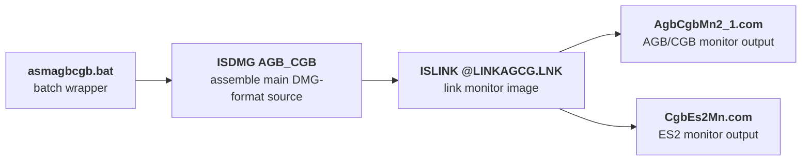

The Nintendo Gigaleak preserves the CGB boot ROM material in two useful forms.
Inside `other/agb_bootrom` it survives as a compact Subversion repository, and separately the leak also includes `cgb_bootrom_trunk.zip`, an extracted working tree that exposes the actual DMG-format source files directly.





---
## At a Glance
The CGB repository preserves:

* a compact SVN history rather than a single loose boot ROM dump
* two built monitor outputs at the root
* a tiny DMG-era `build` package with plaintext source files
* a batch wrapper that still preserves the old `ISDMG` and `ISLINK` flow
* two dated monitor specification documents from 1998

Repository | Revisions on disk | Earliest date | Latest date | Visible author
---|---|---|---|---
`cgb_bootrom` | 3 revisions (`0` to `2`) | `24 April 2009` | `24 April 2009` | `nakasima`

---
## What the Revision History Shows
The CGB repository is much smaller and simpler than the AGB one.
Its visible revision metadata shows a short one-shot import window rather than a later tool-enrichment phase.

Revision | What it appears to do | Why it matters
---|---|---
`1` | Creates the basic SVN layout with `trunk`, `branches`, and `tags` | Shows this was preserved as a real repository rather than a loose file dump
`2` | Imports the useful CGB working tree in one pass | Brings in the `.com` outputs, `build` folder, and dated monitor spec docs together

So unlike the AGB repository, the CGB side does not currently show later additions of tools or copied SDK reference material.
It feels more like a compact preserved handoff package.

---
## Trunk Structure


The CGB repository is much tighter than the AGB one: two built monitor binaries at the root, a very small `build` folder with DMG-format source inputs and a batch script, and two dated documents in `doc`.



- AgbCgbMn2_1.com - Built AGB/CGB monitor output
- CgbEs2Mn.com - Alternate ES2-targeted monitor output
- build - Small DMG-era build package
- build/agb_cgb.dmg - Main assembler input
- build/asmagbcgb.bat - Batch wrapper for the build
- build/cgb_es2.dmg - Alternate ES2 source branch
- build/cgbw6def.dmg - Smaller definitions/configuration source
- doc - Dated CGB notes from 1998
- doc/CGB－CPUモニタープログラム仕様書_980403.doc - Internal document dated 3 April 1998
- doc/CGB－CPUモニタープログラム仕様書_980615.doc - Internal document dated 15 June 1998




The separate `cgb_bootrom_trunk.zip` export makes this repository much clearer because the three `build` files can be read directly.
That turns the CGB side from a vague inventory of filenames into a real small source package.

---
## Build Structure
The overall structure of the CGB repository is tight enough to summarize in one workflow:

* two final `.com` monitor binaries at the root
* three DMG-format build inputs plus a batch file in `build`
* two dated documents in `doc`


The CGB `build` folder is small enough to read almost as one batch-driven package: one wrapper script, two main DMG-format source inputs, and one smaller definitions file.



- asmagbcgb.bat - Batch wrapper for the DMG assembler and linker flow
- agb_cgb.dmg - Main assembler input
- cgb_es2.dmg - Alternate ES2 source branch
- cgbw6def.dmg - Smaller definitions/configuration source




### The Batch Build Wrapper
`asmagbcgb.bat` is only four lines long:

* `ISDMG AGB_CGB`
* `ISLINK @LINKAGCG.LNK`
* `PAUSE`
* `cvt.bat`

That small script is still very useful because it proves the package was built around one named main source file, one named linker command file, and a final conversion step.

---
## The Source Files
The extracted CGB working tree shows that all three `build` inputs are plaintext source files rather than opaque binary artifacts.

### The Main Monitor Source
`agb_cgb.dmg` is a full plaintext monitor source at `1428` lines.
It opens with `title monitor`, declares `BANK0 GROUP 0`, and includes `cgb_reg` plus `cgbw6def`.


- function|||init_rom
- function|||vram_clear
- function|||ram_clear
- function|||cp_hl2de
- function|||vblk_wait
- function|||set_cgb_pltt
- function|||init_sound
- function|||fade_out
- function|||cgb_sub
- function|||maker_check
- function|||select_palette
- function|||cpu_mode_change
- table|||hdma_data
- table|||title_key2pltt
- table|||nin_data
- table|||rdata
- table|||set_ninbg_soft








This is much more than a tiny jump into a final boot image.
The visible labels and data blocks show Nintendo logo and title-screen data, VRAM and OAM clearing paths, sound initialization, title sound timing, palette generation, maker checks, SGB checks, and CPU-mode changes.

The header comments are also especially revealing.
Unlike `cgb_es2.dmg`, this file carries later maintenance notes dated `21 August 1999` and `30 March 2000`, which makes it look like a maintained later branch built on top of the older monitor source.

### The Earlier ES2 Source
`cgb_es2.dmg` is another full plaintext source file at `1423` lines.
Its structure is almost the same, but the header is much simpler and only carries a `21 July 1998` date line.


- function|||init_rom
- function|||vram_clear
- function|||ram_clear
- function|||cp_hl2de
- function|||vblk_wait
- function|||set_cgb_pltt
- function|||init_sound
- function|||fade_out
- function|||cgb_sub
- function|||maker_check
- function|||select_palette
- function|||cpu_mode_change
- table|||hdma_data
- table|||title_key2pltt
- table|||nin_data
- table|||rdata
- table|||set_ninbg_soft








A quick diff between the two sources is revealing.
Most of the monitor is the same, but `agb_cgb.dmg` adds the later maintenance comment block, changes the flow around `init_rom2game`, inserts an extra `inc b` flag-setting step, and swaps one small-logo copy path from `ex_nindata` to `$ff80`.

So the best reading here is not "two totally different monitor programs."
It is "one older ES2-era source snapshot and one later maintained branch built on almost exactly the same codebase."

### The Definitions File
`cgbw6def.dmg` is only `103` lines, but it is a real source dependency rather than a mystery helper file.


- constant|||ex_nindata
- constant|||cpu_mode_data
- constant|||cgb_vram
- constant|||cgb_work_ram0
- constant|||cgb_work_ram1
- constant|||oam
- constant|||stack
- constant|||cgb_stack
- global|||name_sum
- global|||sel_pltt_flg
- global|||key_counter
- global|||pltt_grp_type








The top half defines the monitor's memory layout, including VRAM, work RAM banks, OAM, CPU work RAM, stack positions, and palette-buffer scratch areas.
The lower half defines palette IDs and small state bytes used while the monitor decides how to color the title sequence.

That second half is especially interesting because the palette constants name built-in presets like `CI_ZELDA_OBJ`, `CI_TETRIS`, `CI_METROID_OBJ`, `CI_CAMERA`, `CI_KIRBY_OBJ`, and `CI_GAMEWATCH_GB`.
So `cgbw6def.dmg` is also a compact data dictionary for the Game Boy Color boot monitor's built-in palette-selection system.

---
## Outputs and Documents
The filenames at the root still tell a useful story.
`AgbCgbMn2_1.com` appears to combine `AGB`, `CGB`, and `Mn`, which likely stands for monitor.
`CgbEs2Mn.com` looks more specialized, with `Es2` strongly suggesting a hardware revision, engineering sample stage, or internal target variant.

The `doc` folder survives as two files:

* `CGB－CPUモニタープログラム仕様書_980403.doc`
* `CGB－CPUモニタープログラム仕様書_980615.doc`

Those filenames translate naturally as `CGB CPU Monitor Program Specification`.
So the docs are not stray notes.
They are formal specification documents for the monitor package itself.

Document | Stored filename | Meaning | Repository text size
---|---|---|---
`3 April 1998` version | `CGB－CPUモニタープログラム仕様書_980403.doc` | Earlier specification snapshot | about `53 KB`
`15 June 1998` version | `CGB－CPUモニタープログラム仕様書_980615.doc` | Later revised specification snapshot | about `26 KB`

They are stored as binary office-style documents rather than plain text, so they still need separate extraction to read properly.

---
## What the CGB Side Preserves
Taken together, the CGB repository preserves a compact low-level monitor package rather than a broad SDK-like environment.
The pieces on disk point to:

* two closely related monitor source snapshots
* a small DMG-era assembler and linker flow
* built `.com` monitor outputs
* a definitions file covering memory layout and palette IDs
* dated formal monitor specification documents from 1998
