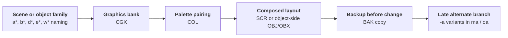
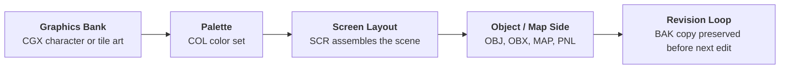

`NEWS_04.tar` is a 96 MB Nintendo NEWS workstation backup that preserves a large amount of graphics-side production material rather than source code.
Where [NEWS_05](/gigaleak-news-05) captures the Star Fox 2 3D toolchain, `NEWS_04` captures the more traditional 2D side of console production: character banks, palettes, screen layouts, object definitions, maps, and a huge number of backup revisions.

The archive is especially useful because it is not a clean, single-project handoff.
It is a live multi-user workstation snapshot with three home directories, several different projects, and visible evidence of iterative art work.




---

## At a Glance

`NEWS_04` is best understood as a **mixed graphics workstation backup**.
It preserves:

* **5,309 archive entries** under three user homes: `arimoto`, `sugiyama`, and `kakui`
* **2,297 `.BAK` files**, showing heavy iteration and local backup habits
* **991 `.SCR` files**, making screen and scene layout one of the dominant data types
* **876 `.CGX` files** and **431 `.COL` files**, pointing to SNES/GB graphics-bank and palette work
* **266 `.OBJ` files** and **108 `.MAP` files**, showing object/layout and map-side asset organization
* **One especially important late Star Fox 2 art workspace** under `home/arimoto/SF2`
* **Older Zelda and Game Boy Zelda art workspaces** under `home/arimoto/zelda` and `home/arimoto/GB-zelda`
* **A second artist-style workspace** under `home/sugiyama` with `fly`, `flyman`, `CAR`, `SIM`, `MARIO`, and `FX2`

Unlike `NEWS_05`, this archive contains almost no conventional program source.
Its value comes from file naming, layout formats, revision backups, and the way several projects coexist on one machine.

---

## Glossary of Key Terms

If you are new to Nintendo workstation graphics formats, this glossary will make the rest of the page much easier to follow.

* **CGX** - Character graphics or tile graphics data.
  In these archives, `.CGX` files look like graphics-bank or sprite/tile resources rather than source code.

* **COL** - Palette data.
  These files usually sit beside `.CGX` and `.SCR` assets and define the color sets used to display them correctly.

* **SCR** - Screen layout data.
  This typically represents how tiles or graphics are arranged into a scene, menu, background, or composed screen.

* **OBJ** - Object-side asset data.
  In `NEWS_04` this seems to refer to 2D object/sprite-side resources or layout groupings, not the 3D CAD object pipeline seen in `NEWS_05`.

* **OBX** - A related object-side format that appears beside `.OBJ` in some Star Fox 2 folders.
  It likely represents a companion state or variation format, but the exact structure still needs deeper reverse-engineering.

* **MAP** - Map or level-layout data.
  These files appear most strongly in the Zelda-related folders.

* **PNL** - Panel or tile-layout resource.
  These often look like intermediate layout assets used with map and screen files.

* **BAK** - Backup copy.
  The huge number of `.BAK` files is one of the strongest clues that this archive preserves active production work rather than a final handoff.

* **CBM** - A less common asset format present mainly in `sugiyama`'s workspace.
  Its exact meaning is unclear here, but it appears among other authored graphics-side files rather than code.

* **MD7** - Very likely Mode 7-related data.
  Its appearance inside `CAR` is notable because racing and pseudo-3D background work often depended on Mode 7 transformations.

* **NEWS workstation** - Sony NEWS Unix workstation hardware used in Japanese game development environments.
  Nintendo preserved several such workstation-side snapshots inside the Gigaleak.

---

## What NEWS_04 Actually Is

The top-level structure is simple but revealing.
The archive is almost entirely a `home` backup:


`NEWS_04` mostly preserves three user homes. One is nearly empty (`kakui`), while the real content sits under `arimoto` and `sugiyama`.



- home/arimoto - Largest and most important workspace, with `SF2`, `zelda`, `GB-zelda`, and `DELDA`
- home/sugiyama - Mixed older graphics workspace with `fly`, `flyman`, `CAR`, `SIM`, `MARIO`, and `FX2`
- home/kakui - Small account with only a few personal config files and almost no production data




At a high level, the archive breaks down like this:

Workspace | Files | Dominant types | Date range | Why it matters
---|---|---|---|---
`home/arimoto` | about `3,278` | `.BAK`, `.CGX`, `.SCR`, `.COL`, `.OBJ`, `.MAP` | `1991-05-23` to `1995-09-19` | Main late-production art workspace, especially for `SF2`
`home/sugiyama` | about `1,900` | `.SCR`, `.CGX`, `.COL`, `.BAK`, `.CBM`, `.OBJ` | `1989-10-13` to `1994-03-18` | Older multi-project graphics workspace with several prototype or pre-SF2 strands
`home/kakui` | `26` | Mostly shell/profile files | n/a | Personal workstation setup only

That date spread is important.
`NEWS_04` is not a single synchronized snapshot from one project phase.
It is a personal workstation backup carrying **several years of older project residue plus one clearly later Star Fox 2 branch**.

---

## File-Type Profile

The overall extension spread explains why `NEWS_04` feels so different from `NEWS_05`.
It is dominated by authored graphics assets and revision copies rather than code or CAD data.

Extension | Count | What it suggests
---|---|---
`.BAK` | `2297` | Heavy manual backup and revision churn
`.SCR` | `991` | Screen composition and layout were central tasks on this machine
`.CGX` | `876` | Graphics-bank and character/tile art production
`.COL` | `431` | Palette pairing was a routine part of the workflow
`.OBJ` | `266` | Object-side or sprite-side grouping data
`.MAP` | `108` | Map or room layout work, especially in Zelda folders
`.PNL` | `37` | Panel/layout intermediates
`.CBM` | `31` | Less common graphics-side authored resources
`.DAT` | `19` | General data sidecars or tool outputs
`.SFX` | `13` | Small sound-related resources
`.OBX` | `12` | Object-side companion files, mainly in `SF2`
`.MD7` | `3` | Probable Mode 7-related data in `CAR`

This tells us two things immediately:

* the archive was used heavily for **asset preparation and screen assembly**
* the preserved machine sat much closer to the **art/layout pipeline** than to the source-code or build-tool chain

---

## The Main Story: Arimoto's Workspace

Arimoto's home directory is the most important part of the archive.
It combines one late and unusually dense `SF2` workspace with several older Zelda-related branches.


Arimoto's home mixes a clearly late `SF2` branch with older `zelda`, `GB-zelda`, and `DELDA` directories. Together they show years of graphics-side production work carried forward on one machine.



- arimoto/SF2 - Large late Star Fox 2 2D art workspace
- arimoto/GB-zelda - Game Boy Zelda graphics, object, and map data
- arimoto/zelda - Earlier Zelda graphics and map workspace
- arimoto/DELDA - Small older Zelda-related branch
- arimoto/.CAD_SRD - Workstation-side tool/config residue




### Arimoto at a Glance

Project | Files | Dominant types | Date range | Reading
---|---|---|---|---
`SF2` | `1236` | `.BAK`, `.CGX`, `.SCR`, `.COL`, `.OBJ`, `.OBX` | `1993-07-01` to `1995-09-19` | The late, most active branch and the real centerpiece of `NEWS_04`
`GB-zelda` | `824` | `.BAK`, `.OBJ`, `.CGX`, `.MAP`, `.SCR`, `.PNL` | `1991-11-27` to `1994-08-02` | Game Boy Zelda visual and layout work, with stronger map/object emphasis
`zelda` | `545` | `.BAK`, `.CGX`, `.SCR`, `.COL`, `.MAP`, `.PNL` | `1991-05-23` to `1994-07-25` | Earlier Zelda screen/map art branch
`DELDA` | `213` | `.BAK`, `.CGX`, `.SCR`, `.COL` | `1991-05-23` to `1991-10-24` | Small early Zelda-related branch or internal variant

The important split is between:

* **older Zelda/GB-Zelda work** concentrated in `1991-1994`
* **late Star Fox 2 work** concentrated in `1995`

That makes Arimoto's home feel like a long-lived artist workstation where old materials were retained rather than cleaned out between projects.

---

## The Late Star Fox 2 Art Branch

Arimoto's `SF2` directory is the strongest and latest branch in the whole archive.
Its newest sampled files reach **19 September 1995**, which is later than the material we saw concentrated in `NEWS_05`.

This is also a very different side of Star Fox 2 from the CAD-heavy 3D workflow.
Instead of `.cad`, `.anm`, and `.nca`, `NEWS_04` keeps **2D graphics banks, palettes, screen layouts, and object-side resources**.
That suggests the archive captures the presentation and interface side of the project rather than the polygon authoring pipeline.

### SF2 Folder Profile

`arimoto/SF2` contains about `1236` files:

Extension | Count | Interpretation
---|---|---
`.BAK` | `686` | Very heavy iteration with many preserved prior states
`.CGX` | `189` | Graphics banks and character/tile art
`.SCR` | `140` | Screen/layout assemblies
`.COL` | `132` | Palette sets for those graphics/layouts
`.OBJ` | `83` | Object-side resources
`.OBX` | `6` | Object-side companion variants


The `SF2` directory is not one flat pile of files. It is broken into several compactly named buckets that appear to separate screen/layout batches, object-side resources, and later alternate revisions.



- SF2/t - Largest numbered screen-layout batch, mostly `.CGX`, `.COL`, `.SCR`
- SF2/s - Structured `a*` batch with tightly matched graphics, palette, and screen files
- SF2/m - Structured `b*` batch, again dominated by `.CGX`, `.COL`, `.SCR`
- SF2/ma - Late `m`-side alternate branch with `-a` suffixed variants
- SF2/o - Object and enemy-side branch with `.OBJ`, `.OBX`, `.CGX`, and late September 1995 edits
- SF2/oa - Small alternate object-side branch dominated by `-a` graphics variants
- SF2/obj - Dense object store with mostly `.OBJ` plus a few `.OBX` companions
- SF2/watanabe - Tiny shared subset with `obj-*`, `color-*`, and `spt_2`
- SF2/mt - One leftover `.OBX` file




The internal subfolders are much more informative once you add date ranges and extension balance:

Subfolder | Files | Date range | Dominant types | Reading
---|---|---|---|---
`t` | `325` | `1993-07-09` to `1995-06-03` | `.CGX`, `.COL`, `.SCR`, many `.BAK` | Large numbered screen/layout batch
`s` | `172` | `1993-08-27` to `1995-08-31` | `.COL`, `.SCR`, `.CGX` | Structured `a*` scene bank with regular triplets
`m` | `129` | `1993-10-15` to `1995-08-18` | `.SCR`, `.COL`, `.CGX` | Structured `b*` scene bank
`ma` | `47` | `1995-07-03` to `1995-08-30` | `.SCR`, `.CGX`, `.COL` | Explicit late alternate branch for `m`
`o` | `164` | `1993-11-19` to `1995-09-19` | `.OBJ`, `.CGX`, `.OBX`, small `.SCR`/`.COL` set | Main object/enemy-side branch and latest-edited area
`oa` | `25` | `1995-07-07` to `1995-09-19` | mostly `.CGX` | Explicit late alternate branch for `o`
`obj` | `96` | `1994-02-04` to `1995-06-26` | mostly `.OBJ` | Object library / object-store bucket
`watanabe` | `8` | `1994-03-16` to `1994-10-24` | `obj-*`, `color-*`, `spt_2` | Tiny handoff or shared sample subset
`mt` | `1` | `1994-11-21` | lone `.OBX` | Residual single-file bucket

That split is important.
`t`, `s`, and `m` look like long-running banked layout groups that started in `1993`.
`ma` and `oa` appear much later, only in mid-to-late `1995`, which strongly suggests explicit alternate or revised sub-branches created near the end of work.

### A Clearer SF2 Taxonomy

The naming prefixes are repetitive enough that they start to form a real internal taxonomy rather than a loose pile of files.

#### 1. t - Numeric layout banks

The `t` folder is dominated by numbered families such as `0-*`, `1-*`, `2-*`, `6-*`, `7-*`, `15-*`, and `16-*`.
Typical triplets include:

* `0-2.CGX`, `0-2.COL`, `0-2.SCR`
* `0-6.CGX`, `0-6.COL`, `0-6.SCR`
* `1-1.CGX`, `1-1.COL`

This looks like a broad **numbered scene or bank repository**.
It is graphics-heavy and layout-heavy, with only `.CGX`, `.COL`, `.SCR`, and backups.
So `t` is best read as a large screen/tile bank rather than an object store.

#### 2. s - a* scene group

The `s` folder is unusually consistent.
Its top prefixes are `a0`, `a1`, `a7`, `a10`, `a11`, `a14`, `a15`, `a16`, `a18`, `a27`, and `a28`.
Representative file groups include:

* `a0.CGX`, `a0.COL`, `a0.SCR`
* `a10.CGX`, `a10.COL`, `a10.SCR`
* `a15.CGX`, `a15.COL`, `a15.SCR`

This is one of the cleanest sections of the archive.
It looks like a **scene-set or stage-set bank** with a stable triplet workflow of graphics, palette, and composed screen files.

#### 3. m - b* scene group

`m` behaves very similarly to `s`, but its naming family is `b*` rather than `a*`.
Its heaviest prefixes are `b7`, `b1`, `b8`, `b9`, `b10`, `b14`, `b15`, and `b16`.
Representative file groups include:

* `b1.CGX`, `b1.COL`, `b1.SCR`
* `b10.CGX`, `b10.COL`, `b10.SCR`
* `b14.CGX`, `b14.COL`, `b14.SCR`

This strongly suggests `s` and `m` are parallel production buckets inside the same broad graphics system.
They may separate different screen families, gameplay contexts, or region/build groupings.

#### 4. ma - late alternate b* branch

`ma` is much smaller and much later.
Its files are concentrated in `1995-07` to `1995-08`, and almost everything carries a `-a` suffix:

* `b0-a.CGX`, `b0-a.COL`, `b0-a.SCR`
* `b7-a.CGX`, `b7-a.COL`, `b7-a.SCR`
* `b16-a.CGX`, `b16-a.SCR`

That makes `ma` look like an **alternate or adjusted branch of `m`**, not a separate independent system.
The naming is too close to be coincidence.

#### 5. o and obj - object-side branch

**`o` and `obj`** are where the archive becomes more object-heavy.
Representative filenames include:

* `e0-0.OBJ`, `e0-1.OBJ`, `e1-3.OBJ`
* `d0-1.OBJ`, `d1-1.OBX`, `d3-3.OBX`
* `cm.CGX`, `w0.CGX`, `pm.CGX`

The dominant prefixes inside `o` are `e3`, `w0`, `mm`, `e0`, `w2`, `e4`, `e1`, `d3`, and `d0`.
Inside `obj`, the heaviest families are `d3`, `d2`, `d4`, `w0`, and `d0`.

That split suggests a two-layer system:

* `obj` as a denser **object library bucket** with many `.OBJ` definitions
* `o` as a broader **working object branch** where those objects are paired with graphics, a few palettes, and occasional `.OBX` companions

The presence of `.OBX` beside `.OBJ` suggests paired object-state, alternate composition, or behavior-related companion data.
Whatever the exact format, this is clearly different from the pure scene-bank logic of `t`, `s`, and `m`.

#### 6. oa - late alternate object branch

`oa` looks like an alternate object-side graphics branch.
The repeated `-a` suffixes imply variants or adjusted revisions:

* `e0-a.CGX`
* `e3-a.CGX`
* `pm-a.CGX`
* `w0-a.CGX`

The date range matches late `1995`, and the naming mirrors `o` too closely to read any other way.
`oa` is best understood as an explicit **late alternate graphics branch for object families already present in `o`**.

#### 7. watanabe - tiny handoff subset

The `watanabe` folder contains only eight files:

* `color-date.CGX`, `color-date.COL`, `color-date.SCR`
* `obj-0.CGX`, `obj-0.COL`, `obj-1.CGX`
* `p_col.COL`
* `spt_2.cgx`

This is too small to be a real working branch.
It reads more like a **shared sample, handoff, or imported subset** tied to Watanabe's side of the Star Fox 2 workflow.

### How the Buckets Relate to Each Other

Taken together, the strongest interpretation is:

* `t`, `s`, and `m` are **structured screen/layout banks**
* `ma` is a **late alternate revision layer for `m`**
* `obj` is an **object-definition store**
* `o` is the **active object/enemy working branch**
* `oa` is a **late alternate revision layer for `o`**
* `watanabe` is a **tiny shared subset or handoff residue**

That is much more specific than simply saying the folder contains "art assets".
It suggests a real internal organization where scene banks and object banks were kept separate, then selectively forked into `-a` revision branches during late 1995 cleanup or adjustment work.

### What the Date Ranges Add

The date spread strengthens that reading:

* `t`, `s`, `m`, and `o` all begin in `1993`
* `obj` only starts showing up in `1994`
* `ma` and `oa` only appear in **mid-1995**, right near the latest visible Star Fox 2 edits
* `o` and `oa` carry the latest timestamps, both reaching **19 September 1995**

So the most plausible sequence is:

1. long-running scene and object banks are built from `1993` onward
2. an explicit object library (`obj`) stabilizes during `1994`
3. late `1995` creates focused alternate branches (`ma`, `oa`) for final adjustments
4. the object-side branch remains active slightly later than the scene-bank side

That last point matters because it hints that late visible work was not broad world-building anymore.
It looks more like **targeted object, enemy, presentation, and polish changes**.

### Inferred Workflow Inside SF2

The repeated file groupings imply a local workflow that looks something like this:

That is exactly the kind of detail that a clean source archive would normally erase.
`NEWS_04` preserves it because the machine was backed up in the middle of active production use.

### SF2 Filenames That Stand Out

A few filenames make the branch easier to interpret:

* `open-logo.CGX` and `open-logo-5.CGX` - very likely title or opening-logo work
* `logo.SCR` - direct evidence of composed logo layout
* `character-L.CGX`, `character-La1.CGX` - character-bank or portrait/state art
* `e9-96.CGX`, `e9-97.CGX` - late numbered revisions in September 1995
* `w0.CGX`, `w2.COL` - compact numbered assets tied to object-side folders

The timestamps are the most important part.
The densest and newest files cluster in **July-September 1995**, which makes this one of the latest visible Star Fox 2 graphics-side workspaces in the NEWS tape set.

---

## Zelda and Game Boy Zelda Material

Arimoto's home does not stop at Star Fox 2.
It also preserves two sizeable Zelda-related workspaces plus a smaller `DELDA` branch.

### The `zelda` Branch

The plain `zelda` folder contains about `545` files and is dominated by `.CGX`, `.SCR`, `.COL`, and `.MAP`.
Representative names include:

* `1g-1n.CGX`
* `1g-1n-nippon-V1.CGX`
* `1g-1n-nippon-V2.CGX`
* `1g-1n-nes.CGX`
* `1o-1v-V1.CGX` through `1o-1v-V4.CGX`
* `1w-2d.CGX`

These names suggest iterative regional or versioned graphics banks rather than a single clean export.
The explicit `nippon` and `nes` variants are especially interesting because they point to region- or format-specific art branches.

The extension mix is also telling:

Extension | Count | Reading
---|---|---
`.BAK` | `268` | Heavy revision history
`.CGX` | `84` | Graphics banks and tile art
`.SCR` | `77` | Screen compositions
`.COL` | `63` | Palette pairs
`.MAP` | `35` | Map/layout data
`.PNL` | `14` | Panel intermediates

This is a visual/layout workspace rather than a code tree.

### The `GB-zelda` Branch

`GB-zelda` is even larger at about `824` files, but its balance is different.
It has **far more `.OBJ` and `.MAP` material**, making it feel more object- and map-oriented than the SNES-side Zelda branch.

Extension | Count | Reading
---|---|---
`.BAK` | `469` | Again, a strong sign of iterative personal backup habits
`.OBJ` | `147` | Object-side structure is unusually prominent here
`.CGX` | `86` | Graphics-bank resources still matter, but less than object/layout organization
`.MAP` | `62` | Strong map focus
`.SCR` | `45` | Screen layouts present but not dominant
`.PNL` | `11` | Panel/layout side resources
`.COL` | `3` | Surprisingly sparse palette storage compared with other branches

The folder `GB-zelda/d` preserves a sequence like:

* `50.MAP` through `66.MAP`
* `d-a.MAP`, `d-a.PNL`
* `d1.CGX`
* `BGho-gan.SCR.BAK`

The top level also includes `Opening1.OBJ`, `Opening1.CGX.BAK`, and `Opening2.SCR.BAK`.
That combination makes this branch feel especially close to a working room/object/opening sequence asset directory rather than just a tile dump.

### `DELDA`

`DELDA` is smaller and earlier.
Its date range sits in `1991`, and its contents look like another Zelda-related visual branch rather than a distinct later project.
Because it is much smaller, it reads more like an older preserved side branch than a major late production workspace.

---

## Sugiyama's Mixed Graphics Workspace

Sugiyama's home is the second major component of the archive.
It feels older and broader than Arimoto's.
Where Arimoto's home is anchored by a late `SF2` branch, Sugiyama's side looks more like a long-lived graphics workstation with several unrelated or partially related projects.


Sugiyama's workspace preserves several older art and layout branches, including `fly`, `flyman`, `CAR`, `SIM`, `MARIO`, and `FX2`. The date ranges suggest earlier experimentation and production work carried forward into later years.



- sugiyama/fly - Graphics-heavy branch with boss and background naming
- sugiyama/flyman - Layout-heavy companion branch dominated by `.SCR`
- sugiyama/CAR - Screen-heavy branch with a few `.MD7` files
- sugiyama/SIM - Older project branch
- sugiyama/MARIO - Small Mario-related menu or logo art workspace
- sugiyama/FX2 - Small Wild Trax / Stunt Race FX-adjacent branch




### Sugiyama at a Glance

Project | Files | Dominant types | Date range | Reading
---|---|---|---|---
`flyman` | `429` | `.SCR`, `.BAK` | `1989-10-13` to `1991-05-07` | Layout-heavy older branch with many scene variants
`CAR` | `415` | `.SCR`, `.BAK`, `.CGX`, `.COL`, `.MD7` | `1991-04-05` to `1994-03-18` | Vehicle/racing-looking branch with possible Mode 7 ties
`fly` | `388` | `.CGX`, `.SCR`, `.COL`, `.BAK` | `1989-10-13` to `1994-03-18` | Boss/background-heavy graphics branch
`SIM` | `165` | mixed | `1990-11-27` to `1993-01-22` | Older project residue
`MARIO` | `77` | `.CGX`, `.SCR`, `.COL`, `.BAK` | `1993-04-08` to `1993-06-21` | Small Mario-related UI/menu/logo branch
`FX2` | `41` | `.CGX`, `.SCR`, `.COL`, `.BAK` | `1993-07-06` to `1993-12-08` | Small Stunt Race FX / Wild Trax-adjacent graphics branch

### `fly` and `flyman`

These two branches look related but not identical.
`fly` is graphics-heavy, while `flyman` is strongly layout-heavy.

`fly` contains names like:

* `BG-BASESHIP.CGX`
* `BG-ENEMYSHIP.CGX`
* `BG-FORTRESS.CGX`
* `BOSS-1.CGX`, `BOSS-2.CGX`, `BOSS-3.CGX`
* `CAMEL.CGX`, `CAMEL2.CGX`, `CAMEL3.CGX`

That feels like a project with strong enemy/base/boss theming.
The repeated `BG-` and `BOSS-` naming makes it one of the easiest folders in the archive to read at a glance.

`flyman`, by contrast, is dominated by `.SCR` files such as:

* `BGBG-HELI.SCR`
* `BONUS.SCR` through `BONUS4.SCR`
* `CHIKA-0.SCR` through `CHIKA-C2.SCR`

This looks much more like scene assembly and layout staging than raw art production.
So the two together may reflect a split between **graphics banks** and **screen composition** for the same broader project family.

### `CAR`

`CAR` is also layout-heavy and includes the only visible `.MD7` files in the archive.
Representative names include:

* `B1-0.SCR` through `B5-2.SCR`
* `ABC.CGX`

The `B#-#` naming looks like ordered screen/scene sets.
The presence of `.MD7` makes `CAR` especially interesting because it hints at **Mode 7-style racing or pseudo-3D background work**.
That fits the project name much better than a conventional platform game interpretation.

### `MARIO`

The small `MARIO` directory is not huge, but it is readable.
It contains names like:

* `GAMESELECT.CGX`, `GAMESELECT.COL`, `GAMESELECT.SCR`
* `GAMESELECT-N.*`
* `GAMESELECT-P.*`
* `MA-ROGO-OBJ.CGX`
* `2PR-S1.*`

This looks like **menu, logo, or mode-selection artwork**, not a full game asset repository.
The explicit `GAMESELECT` naming is unusually direct for this archive.

### `FX2`

The `FX2` branch is small but useful because it confirms another Wild Trax / Stunt Race FX-adjacent strand on this machine.
Representative names include:

* `cpt-1.CGX`, `cpt-1.COL`, `cpt-1.SCR`
* `cpt-2.CGX`, `cpt-2A.SCR`
* `p-select.CGX`, `p-select.COL`, `p-select.SCR`
* `test-1.OBJ`

This is much smaller than the `FX2` material in `NEWS_05`, but it still helps place Sugiyama's machine in the same broad development ecosystem.

---

## A Practical Graphics Workflow Hiding in the File Types

One of the most useful things about `NEWS_04` is that it preserves the **shape of a 2D asset workflow**.
The repeated file groupings make the likely pipeline much clearer than any single file would.

That pattern appears over and over again:

* a `.CGX` graphics file
* a matching `.COL` palette file
* a matching `.SCR` composed layout
* sometimes an `.OBJ`, `.MAP`, or `.PNL` companion file
* then a `.BAK` copy of one or more of them

So even without a formal tool manual, the workstation backup shows how artists likely worked in practice:

* create or update a graphics bank
* pair it with the correct palette
* compose it into a screen or layout
* save a manual backup before the next round of changes

That is exactly the kind of process evidence that polished source archives usually erase.

---

## Why NEWS_04 Matters Beside the Other NEWS Tapes

Each big NEWS tape now has a different role:

Archive | Main value
---|---
`NEWS_04` | Mixed **2D graphics and layout workstation** snapshot across several projects, with a particularly late `SF2` branch
`NEWS_05` | **Star Fox 2 3D CAD and toolchain** snapshot with source code and animation pipeline
`NEWS_09` | Yoshi's Island supplementary art workspace
`NEWS_11` | Larger and richer late Yoshi's Island art/archive workspace

That makes `NEWS_04` the missing complement to `NEWS_05`.
If `NEWS_05` tells us how Nintendo built Star Fox 2's polygon assets, `NEWS_04` helps show how the same broader development environment handled **2D banks, screen composition, UI, and sprite/layout-side resources**.

It also matters because it preserves **older project residue** rather than only one final branch.
The mixed `zelda`, `GB-zelda`, `MARIO`, `CAR`, `fly`, and `FX2` folders make it feel like a real artist workstation that stayed in use across multiple productions.

---

## What Seems Most Important to Study Next

The archive is already legible at a high level, but several areas deserve deeper follow-up.

### 1. The SF2 Screen and Object Taxonomy
The `SF2` folder almost certainly contains a meaningful internal grouping system.
A careful comparison of `t`, `s`, `m`, `ma`, `o`, `oa`, and `obj` could reveal exactly how Nintendo separated:

* screen banks
* menu/title elements
* object banks
* alternate revisions
* region or build variants

### 2. The Zelda and GB-Zelda Relationship
The `zelda`, `GB-zelda`, and `DELDA` branches likely preserve different generations or target platforms of the same broader art workflow.
The explicit `nippon`, `nes`, and `Opening*` names make them good candidates for a dedicated cross-comparison.

### 3. Sugiyama's `CAR` and `fly` Branches
These branches are older but may be historically valuable.
The `.MD7` files in `CAR` and the strong `BG-` / `BOSS-` naming in `fly` suggest real, identifiable production work rather than random scratch directories.

### 4. Exact Toolchain Recovery
`NEWS_04` does not preserve much code, but the file groupings are regular enough that it should be possible to reconstruct the tool expectations for `.CGX`, `.COL`, `.SCR`, `.OBJ`, `.MAP`, and `.PNL`.
That would make the archive far more usable for preservation and visualization.

---

## Working Conclusion

`NEWS_04` is not the most glamorous archive in the NEWS tape set.
It does not have the source-code shock value of `NEWS_05`, and it is messier than the Yoshi tapes.
But it is still one of the most **workshop-like** snapshots in the leak.

Its real value is that it preserves **how graphics work accumulated on a live Nintendo workstation**:

* old project folders kept for years
* hundreds of incremental `.BAK` revisions
* tightly grouped graphics/palette/screen triples
* separate object and map-side resources
* one especially late Star Fox 2 graphics branch sitting beside much older Zelda material

So `NEWS_04` fills an important gap.
It does not tell us how Nintendo wrote the games.
It tells us how developers **assembled their visual assets on the floor of production**.
