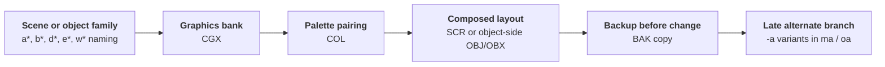
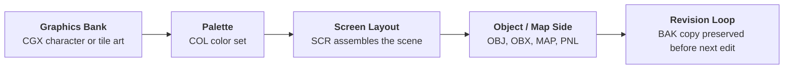

`NEWS_04.tar` is a 96 MB Nintendo NEWS workstation backup that preserves a large amount of graphics-side production material rather than source code.
Where [NEWS_05](/gigaleak-news-05) captures the Star Fox 2 3D toolchain, `NEWS_04` captures the more traditional 2D side of console production: character banks, palettes, screen layouts, object definitions, maps, and a huge number of backup revisions.

The archive is especially useful because it is not a clean, single-project handoff.
It is a live multi-user workstation snapshot with three home directories, several different projects, and visible evidence of iterative art work.




---

## At a Glance

`NEWS_04` is best understood as a **mixed graphics workstation backup**.
It preserves:

* **5,309 archive entries** under three user homes: `arimoto`, `sugiyama`, and `kakui`
* **2,297 `.BAK` files**, showing heavy iteration and local backup habits
* **991 `.SCR` files**, making screen and scene layout one of the dominant data types
* **876 `.CGX` files** and **431 `.COL` files**, pointing to SNES/GB graphics-bank and palette work
* **266 `.OBJ` files** and **108 `.MAP` files**, showing object/layout and map-side asset organization
* **One especially important late Star Fox 2 art workspace** under `home/arimoto/SF2`
* **Older Zelda and Game Boy Zelda art workspaces** under `home/arimoto/zelda` and `home/arimoto/GB-zelda`
* **A second artist-style workspace** under `home/sugiyama` with `fly`, `flyman`, `CAR`, `SIM`, `MARIO`, and `FX2`

Unlike `NEWS_05`, this archive contains almost no conventional program source.
Its value comes from file naming, layout formats, revision backups, and the way several projects coexist on one machine.

---

## Glossary of Key Terms

If you are new to Nintendo workstation graphics formats, this glossary will make the rest of the page much easier to follow.

* **CGX** - Character graphics or tile graphics data.
  In these archives, `.CGX` files look like graphics-bank or sprite/tile resources rather than source code.

* **COL** - Palette data.
  These files usually sit beside `.CGX` and `.SCR` assets and define the color sets used to display them correctly.

* **SCR** - Screen layout data.
  This typically represents how tiles or graphics are arranged into a scene, menu, background, or composed screen.

* **OBJ** - Object-side asset data.
  In `NEWS_04` this seems to refer to 2D object/sprite-side resources or layout groupings, not the 3D CAD object pipeline seen in `NEWS_05`.

* **OBX** - A related object-side format that appears beside `.OBJ` in some Star Fox 2 folders.
  It likely represents a companion state or variation format, but the exact structure still needs deeper reverse-engineering.

* **MAP** - Map or level-layout data.
  These files appear most strongly in the Zelda-related folders.

* **PNL** - Panel or tile-layout resource.
  These often look like intermediate layout assets used with map and screen files.

* **BAK** - Backup copy.
  The huge number of `.BAK` files is one of the strongest clues that this archive preserves active production work rather than a final handoff.

* **CBM** - A less common asset format present mainly in `sugiyama`'s workspace.
  Its exact meaning is unclear here, but it appears among other authored graphics-side files rather than code.

* **MD7** - Very likely Mode 7-related data.
  Its appearance inside `CAR` is notable because racing and pseudo-3D background work often depended on Mode 7 transformations.

* **NEWS workstation** - Sony NEWS Unix workstation hardware used in Japanese game development environments.
  Nintendo preserved several such workstation-side snapshots inside the Gigaleak.

---

## What NEWS_04 Actually Is

The top-level structure is simple but revealing.
The archive is almost entirely a `home` backup:


`NEWS_04` mostly preserves three user homes. One is nearly empty (`kakui`), while the real content sits under `arimoto` and `sugiyama`.



- home/arimoto - Largest and most important workspace, with `SF2`, `zelda`, `GB-zelda`, and `DELDA`
- home/sugiyama - Mixed older graphics workspace with `fly`, `flyman`, `CAR`, `SIM`, `MARIO`, and `FX2`
- home/kakui - Small account with only a few personal config files and almost no production data




At a high level, the archive breaks down like this:

Workspace | Files | Dominant types | Date range | Why it matters
---|---|---|---|---
`home/arimoto` | about `3,278` | `.BAK`, `.CGX`, `.SCR`, `.COL`, `.OBJ`, `.MAP` | `1991-05-23` to `1995-09-19` | Main late-production art workspace, especially for `SF2`
`home/sugiyama` | about `1,900` | `.SCR`, `.CGX`, `.COL`, `.BAK`, `.CBM`, `.OBJ` | `1989-10-13` to `1994-03-18` | Older multi-project graphics workspace with several prototype or pre-SF2 strands
`home/kakui` | `26` | Mostly shell/profile files | n/a | Personal workstation setup only

That date spread is important.
`NEWS_04` is not a single synchronized snapshot from one project phase.
It is a personal workstation backup carrying **several years of older project residue plus one clearly later Star Fox 2 branch**.

---

## File-Type Profile

The overall extension spread explains why `NEWS_04` feels so different from `NEWS_05`.
It is dominated by authored graphics assets and revision copies rather than code or CAD data.

Extension | Count | What it suggests
---|---|---
`.BAK` | `2297` | Heavy manual backup and revision churn
`.SCR` | `991` | Screen composition and layout were central tasks on this machine
`.CGX` | `876` | Graphics-bank and character/tile art production
`.COL` | `431` | Palette pairing was a routine part of the workflow
`.OBJ` | `266` | Object-side or sprite-side grouping data
`.MAP` | `108` | Map or room layout work, especially in Zelda folders
`.PNL` | `37` | Panel/layout intermediates
`.CBM` | `31` | Less common graphics-side authored resources
`.DAT` | `19` | General data sidecars or tool outputs
`.SFX` | `13` | Small sound-related resources
`.OBX` | `12` | Object-side companion files, mainly in `SF2`
`.MD7` | `3` | Probable Mode 7-related data in `CAR`

This tells us two things immediately:

* the archive was used heavily for **asset preparation and screen assembly**
* the preserved machine sat much closer to the **art/layout pipeline** than to the source-code or build-tool chain

---

## The Main Story: Arimoto's Workspace

Arimoto's home directory is the most important part of the archive.
It combines one late and unusually dense `SF2` workspace with several older Zelda-related branches.


Arimoto's home mixes a clearly late `SF2` branch with older `zelda`, `GB-zelda`, and `DELDA` directories. Together they show years of graphics-side production work carried forward on one machine.



- arimoto/SF2 - Large late Star Fox 2 2D art workspace
- arimoto/GB-zelda - Game Boy Zelda graphics, object, and map data
- arimoto/zelda - Earlier Zelda graphics and map workspace
- arimoto/DELDA - Small older Zelda-related branch
- arimoto/.CAD_SRD - Workstation-side tool/config residue




### Arimoto at a Glance

Project | Files | Dominant types | Date range | Reading
---|---|---|---|---
`SF2` | `1236` | `.BAK`, `.CGX`, `.SCR`, `.COL`, `.OBJ`, `.OBX` | `1993-07-01` to `1995-09-19` | The late, most active branch and the real centerpiece of `NEWS_04`
`GB-zelda` | `824` | `.BAK`, `.OBJ`, `.CGX`, `.MAP`, `.SCR`, `.PNL` | `1991-11-27` to `1994-08-02` | Game Boy Zelda visual and layout work, with stronger map/object emphasis
`zelda` | `545` | `.BAK`, `.CGX`, `.SCR`, `.COL`, `.MAP`, `.PNL` | `1991-05-23` to `1994-07-25` | Earlier Zelda screen/map art branch
`DELDA` | `213` | `.BAK`, `.CGX`, `.SCR`, `.COL` | `1991-05-23` to `1991-10-24` | Small early Zelda-related branch or internal variant

The important split is between:

* **older Zelda/GB-Zelda work** concentrated in `1991-1994`
* **late Star Fox 2 work** concentrated in `1995`

That makes Arimoto's home feel like a long-lived artist workstation where old materials were retained rather than cleaned out between projects.

---

## The Late Star Fox 2 Art Branch

Arimoto's `SF2` directory is the strongest and latest branch in the whole archive.
Its newest sampled files reach **19 September 1995**, which is later than the material we saw concentrated in `NEWS_05`.

This is also a very different side of Star Fox 2 from the CAD-heavy 3D workflow.
Instead of `.cad`, `.anm`, and `.nca`, `NEWS_04` keeps **2D graphics banks, palettes, screen layouts, and object-side resources**.
That suggests the archive captures the presentation and interface side of the project rather than the polygon authoring pipeline.

### SF2 Folder Profile

`arimoto/SF2` contains about `1236` files:

Extension | Count | Interpretation
---|---|---
`.BAK` | `686` | Very heavy iteration with many preserved prior states
`.CGX` | `189` | Graphics banks and character/tile art
`.SCR` | `140` | Screen/layout assemblies
`.COL` | `132` | Palette sets for those graphics/layouts
`.OBJ` | `83` | Object-side resources
`.OBX` | `6` | Object-side companion variants


The `SF2` directory is not one flat pile of files. It is broken into several compactly named buckets that appear to separate screen/layout batches, object-side resources, and later alternate revisions.



- SF2/t - Largest numbered screen-layout batch, mostly `.CGX`, `.COL`, `.SCR`
- SF2/s - Structured `a*` batch with tightly matched graphics, palette, and screen files
- SF2/m - Structured `b*` batch, again dominated by `.CGX`, `.COL`, `.SCR`
- SF2/ma - Late `m`-side alternate branch with `-a` suffixed variants
- SF2/o - Object and enemy-side branch with `.OBJ`, `.OBX`, `.CGX`, and late September 1995 edits
- SF2/oa - Small alternate object-side branch dominated by `-a` graphics variants
- SF2/obj - Dense object store with mostly `.OBJ` plus a few `.OBX` companions
- SF2/watanabe - Tiny shared subset with `obj-*`, `color-*`, and `spt_2`
- SF2/mt - One leftover `.OBX` file




The internal subfolders are much more informative once you add date ranges and extension balance:

Subfolder | Files | Date range | Dominant types | Reading
---|---|---|---|---
`t` | `325` | `1993-07-09` to `1995-06-03` | `.CGX`, `.COL`, `.SCR`, many `.BAK` | Large numbered screen/layout batch
`s` | `172` | `1993-08-27` to `1995-08-31` | `.COL`, `.SCR`, `.CGX` | Structured `a*` scene bank with regular triplets
`m` | `129` | `1993-10-15` to `1995-08-18` | `.SCR`, `.COL`, `.CGX` | Structured `b*` scene bank
`ma` | `47` | `1995-07-03` to `1995-08-30` | `.SCR`, `.CGX`, `.COL` | Explicit late alternate branch for `m`
`o` | `164` | `1993-11-19` to `1995-09-19` | `.OBJ`, `.CGX`, `.OBX`, small `.SCR`/`.COL` set | Main object/enemy-side branch and latest-edited area
`oa` | `25` | `1995-07-07` to `1995-09-19` | mostly `.CGX` | Explicit late alternate branch for `o`
`obj` | `96` | `1994-02-04` to `1995-06-26` | mostly `.OBJ` | Object library / object-store bucket
`watanabe` | `8` | `1994-03-16` to `1994-10-24` | `obj-*`, `color-*`, `spt_2` | Tiny handoff or shared sample subset
`mt` | `1` | `1994-11-21` | lone `.OBX` | Residual single-file bucket

That split is important.
`t`, `s`, and `m` look like long-running banked layout groups that started in `1993`.
`ma` and `oa` appear much later, only in mid-to-late `1995`, which strongly suggests explicit alternate or revised sub-branches created near the end of work.

### A Clearer SF2 Taxonomy

The naming prefixes are repetitive enough that they start to form a real internal taxonomy rather than a loose pile of files.

#### 1. t - Numeric layout banks

The `t` folder is dominated by numbered families such as `0-*`, `1-*`, `2-*`, `6-*`, `7-*`, `15-*`, and `16-*`.
Typical triplets include:

* `0-2.CGX`, `0-2.COL`, `0-2.SCR`
* `0-6.CGX`, `0-6.COL`, `0-6.SCR`
* `1-1.CGX`, `1-1.COL`

This looks like a broad **numbered scene or bank repository**.
It is graphics-heavy and layout-heavy, with only `.CGX`, `.COL`, `.SCR`, and backups.
So `t` is best read as a large screen/tile bank rather than an object store.

#### 2. s - a* scene group

The `s` folder is unusually consistent.
Its top prefixes are `a0`, `a1`, `a7`, `a10`, `a11`, `a14`, `a15`, `a16`, `a18`, `a27`, and `a28`.
Representative file groups include:

* `a0.CGX`, `a0.COL`, `a0.SCR`
* `a10.CGX`, `a10.COL`, `a10.SCR`
* `a15.CGX`, `a15.COL`, `a15.SCR`

This is one of the cleanest sections of the archive.
It looks like a **scene-set or stage-set bank** with a stable triplet workflow of graphics, palette, and composed screen files.

#### 3. m - b* scene group

`m` behaves very similarly to `s`, but its naming family is `b*` rather than `a*`.
Its heaviest prefixes are `b7`, `b1`, `b8`, `b9`, `b10`, `b14`, `b15`, and `b16`.
Representative file groups include:

* `b1.CGX`, `b1.COL`, `b1.SCR`
* `b10.CGX`, `b10.COL`, `b10.SCR`
* `b14.CGX`, `b14.COL`, `b14.SCR`

This strongly suggests `s` and `m` are parallel production buckets inside the same broad graphics system.
They may separate different screen families, gameplay contexts, or region/build groupings.

#### 4. ma - late alternate b* branch

`ma` is much smaller and much later.
Its files are concentrated in `1995-07` to `1995-08`, and almost everything carries a `-a` suffix:

* `b0-a.CGX`, `b0-a.COL`, `b0-a.SCR`
* `b7-a.CGX`, `b7-a.COL`, `b7-a.SCR`
* `b16-a.CGX`, `b16-a.SCR`

That makes `ma` look like an **alternate or adjusted branch of `m`**, not a separate independent system.
The naming is too close to be coincidence.

#### 5. o and obj - object-side branch

**`o` and `obj`** are where the archive becomes more object-heavy.
Representative filenames include:

* `e0-0.OBJ`, `e0-1.OBJ`, `e1-3.OBJ`
* `d0-1.OBJ`, `d1-1.OBX`, `d3-3.OBX`
* `cm.CGX`, `w0.CGX`, `pm.CGX`

The dominant prefixes inside `o` are `e3`, `w0`, `mm`, `e0`, `w2`, `e4`, `e1`, `d3`, and `d0`.
Inside `obj`, the heaviest families are `d3`, `d2`, `d4`, `w0`, and `d0`.

That split suggests a two-layer system:

* `obj` as a denser **object library bucket** with many `.OBJ` definitions
* `o` as a broader **working object branch** where those objects are paired with graphics, a few palettes, and occasional `.OBX` companions

The presence of `.OBX` beside `.OBJ` suggests paired object-state, alternate composition, or behavior-related companion data.
Whatever the exact format, this is clearly different from the pure scene-bank logic of `t`, `s`, and `m`.

#### 6. oa - late alternate object branch

`oa` looks like an alternate object-side graphics branch.
The repeated `-a` suffixes imply variants or adjusted revisions:

* `e0-a.CGX`
* `e3-a.CGX`
* `pm-a.CGX`
* `w0-a.CGX`

The date range matches late `1995`, and the naming mirrors `o` too closely to read any other way.
`oa` is best understood as an explicit **late alternate graphics branch for object families already present in `o`**.

#### 7. watanabe - tiny handoff subset

The `watanabe` folder contains only eight files:

* `color-date.CGX`, `color-date.COL`, `color-date.SCR`
* `obj-0.CGX`, `obj-0.COL`, `obj-1.CGX`
* `p_col.COL`
* `spt_2.cgx`

This is too small to be a real working branch.
It reads more like a **shared sample, handoff, or imported subset** tied to Watanabe's side of the Star Fox 2 workflow.

### How the Buckets Relate to Each Other

Taken together, the strongest interpretation is:

* `t`, `s`, and `m` are **structured screen/layout banks**
* `ma` is a **late alternate revision layer for `m`**
* `obj` is an **object-definition store**
* `o` is the **active object/enemy working branch**
* `oa` is a **late alternate revision layer for `o`**
* `watanabe` is a **tiny shared subset or handoff residue**

That is much more specific than simply saying the folder contains "art assets".
It suggests a real internal organization where scene banks and object banks were kept separate, then selectively forked into `-a` revision branches during late 1995 cleanup or adjustment work.

### What the Date Ranges Add

The date spread strengthens that reading:

* `t`, `s`, `m`, and `o` all begin in `1993`
* `obj` only starts showing up in `1994`
* `ma` and `oa` only appear in **mid-1995**, right near the latest visible Star Fox 2 edits
* `o` and `oa` carry the latest timestamps, both reaching **19 September 1995**

So the most plausible sequence is:

1. long-running scene and object banks are built from `1993` onward
2. an explicit object library (`obj`) stabilizes during `1994`
3. late `1995` creates focused alternate branches (`ma`, `oa`) for final adjustments
4. the object-side branch remains active slightly later than the scene-bank side

That last point matters because it hints that late visible work was not broad world-building anymore.
It looks more like **targeted object, enemy, presentation, and polish changes**.

### Inferred Workflow Inside SF2

The repeated file groupings imply a local workflow that looks something like this:

That is exactly the kind of detail that a clean source archive would normally erase.
`NEWS_04` preserves it because the machine was backed up in the middle of active production use.

### SF2 Filenames That Stand Out

A few filenames make the branch easier to interpret:

* `open-logo.CGX` and `open-logo-5.CGX` - very likely title or opening-logo work
* `logo.SCR` - direct evidence of composed logo layout
* `character-L.CGX`, `character-La1.CGX` - character-bank or portrait/state art
* `e9-96.CGX`, `e9-97.CGX` - late numbered revisions in September 1995
* `w0.CGX`, `w2.COL` - compact numbered assets tied to object-side folders

The timestamps are the most important part.
The densest and newest files cluster in **July-September 1995**, which makes this one of the latest visible Star Fox 2 graphics-side workspaces in the NEWS tape set.

---

## Zelda and Game Boy Zelda Material

Beyond Star Fox 2, Arimoto's home preserves three distinct Zelda-related workspaces.
They are not all the same game or the same moment.
Reading them in chronological order tells a story about how a Nintendo workstation accumulated Zelda history over a nearly three-year window.

### Three Zelda Projects in One Machine

Project | Files | Date range | Dominant types | Reading
---|---|---|---|---
`DELDA` | `213` | `1991-05-23` → `1991-10-24` | BAK, CGX, SCR, COL | Five-month early prototype; likely the first Zelda work on this machine
`zelda` | `545` | `1991-05-23` → `1994-07-25` | BAK, CGX, SCR, COL, MAP | Long-running SNES-side Zelda branch spanning three-plus years
`GB-zelda` | `824` | `1991-11-27` → `1994-08-02` | BAK, OBJ, CGX, MAP, SCR | Game Boy Zelda branch; largest of the three; strong localization evidence

The dates tell the first part of the story: `DELDA` and `zelda` both open on the same day — **1991-05-23** — suggesting the workstation was set up or first used for this project in late May 1991.
`GB-zelda` follows six months later in November 1991.
`DELDA` closes in October 1991.
`zelda` and `GB-zelda` both continue into mid-1994.


Arimoto's three Zelda folders span platforms and years. `DELDA` appears to be the earliest prototype layer, predating the platform split. `zelda` runs as a long SNES-side workspace. `GB-zelda` is the largest folder and carries clear Game Boy-targeted structure, including localized assets.


- arimoto/DELDA - 213 files 1991-05-23 to 1991-10-24; subdirs: soto m d i; earliest layer
- arimoto/zelda - 545 files 1991-05-23 to 1994-07-25; subdirs: d khn m spl atari i w obj
- arimoto/GB-zelda - 824 files 1991-11-27 to 1994-08-02; subdirs: z s o m d y p and deep object sub-trees



---

### DELDA: The Earliest Prototype

`DELDA` is the smallest and shortest-lived of the three Zelda folders.
Its five-month window — May to October 1991 — makes it a snapshot of the very first phase of Zelda work on this machine.

Subdir | Files | Date range | Dominant types | Reading
---|---|---|---|---
`soto` | `66` | `1991-05-23` only | BAK, COL, SCR, MAP | Outdoor / field tile work (`soto` = outside/exterior in Japanese)
`m` | `51` | `1991-05-23` → `1991-10-24` | BAK, CGX | Tile art; runs the full five-month span
`d` | `23` | `1991-10-21` → `1991-10-23` | CGX, BAK | Dungeon-side tiles; concentrated in the final two days of the folder's life
`i` | `1` | `1991-05-23` only | BAK | Single residual file

The `soto` subfolder's name (外 = outside) points to outdoor/overworld tile sets.
The `m` subfolder runs the whole five months, suggesting it was the active tile art store.
The `d` subfolder has almost all its files dated to October 21-23, which looks like a concentrated push — possibly porting or adapting dungeon tiles right before the project reorganised into the main `zelda` tree.

`DELDA` does not contain `.OBJ` files and has almost no `.MAP` data.
That makes it feel like a pure tile-painting phase: the team was building raw graphics assets before the broader map and object infrastructure was established.

---

### zelda: The Long-Running SNES Branch

The `zelda` folder runs for over three years and is the richest Zelda workspace on the machine.

Subdir | Files | Date range | Dominant types | Reading
---|---|---|---|---
`d` | `170` | `1991-05-23` → `1994-07-25` | BAK, CGX, COL, SCR | Dungeon and overworld area tile banks; **latest files in the whole zelda tree**
`khn` | `72` | `1991-05-23` → `1991-11-07` | BAK, SCR | Room/screen layouts; active in the first six months
`m` | `89` | `1991-05-23` → `1992-04-28` | MAP, CGX, COL, SCR | Map-side data with a special `tmp` sub-snapshot
`spl` | `10` | `1991-05-23` only | SCR, BAK | Early sprites and panels (kabe = wall, osr = enemy/contact)
`atari` | `8` | `1991-06-11` → `1991-08-09` | BAK, CGX | Collision data (`atari` = hit/contact in Japanese game dev — not the company)
`i` | `14` | `1991-05-23` only | BAK, SCR | Interior room screens (h-1 through h-a2)
`w` | `9` | `1991-05-23` only | SCR, BAK, COL | Simple early screens (1, 2, 3, 4)
`obj` | `1` | `1991-05-23` only | CGX | Single early object tile

#### The d Subfolder: Dungeon Areas Named

The `d` subfolder is by far the most interesting part of the `zelda` tree.
Its files are named by dungeon or overworld area — and the area names are directly readable:

Name | Japanese reading | Likely area
---|---|---
`0-osiro` | お城 — castle | Hyrule Castle or Light World castle zone
`1-tika` | 地下 — underground | Underground passage tiles
`10-nukemichi` | 抜け道 — shortcut passage | Hidden passage or cave area
`11-kajiya` | 鍛冶屋 — blacksmith | Blacksmith or village tile set
`12-sabaku` | 砂漠 — desert | Desert region tiles
`13-pyramid` | pyramid | Pyramid dungeon exterior

These names map well to the dungeon and overworld vocabulary of *A Link to the Past*.
The numbered prefix (`0-`, `1-`, `10-`, `11-`, `12-`, `13-`) is almost certainly an area ID scheme that matches the game's internal map numbering.

The `d` subfolder also contains the **newest files in the entire `zelda` tree** — as late as `1994-07-25`.
That is nearly three years after the game shipped in Japan (November 1991).
This strongly suggests `zelda/d` was actively used for follow-up work — potentially the eventual SNES remake, regional port, or a successor project — long after the original title was complete.

#### The m/tmp Sub-Snapshot

The `m` subfolder contains a nested `tmp` folder dated entirely to `1992-12-01`.
Its 34 files carry named tile types rather than numbered IDs:

* `hokora` — wayside shrine (祠)
* `kumo` — cloud (雲)
* `kyokai` — border / church (境界 or 教会)
* `machi` — town (町)
* `mori` — forest (森)
* `caddata` — likely a raw CAD tool export
* `op-ed` — opening / ending sequence tiles
* `op-ed-nes` — NES variant of the opening/ending tiles

This `tmp` snapshot reads like a world-map tile palette capture: terrain types (forest, town, shrine, cloud) alongside an opening/ending sequence set.
The `op-ed-nes` file is especially notable because it preserves a **NES-format tile set alongside the SNES assets** — suggesting the team was still referencing the NES original in late 1992 when designing or revising world-map terrain art.

---

### GB-zelda: The Game Boy Zelda Branch

`GB-zelda` is the largest of the three folders and structurally the most distinct.
Its extension profile is strikingly different from `zelda`:

Extension | zelda | GB-zelda | Implication
---|---|---|---
`.BAK` | `268` | `469` | More revision history in the GB branch
`.OBJ` | `2` | `147` | Object focus is far heavier on the Game Boy side
`.CGX` | `84` | `86` | Similar tile bank count
`.MAP` | `35` | `62` | More map data in GB-zelda
`.SCR` | `77` | `45` | Fewer raw screen layouts; objects replace them
`.COL` | `63` | `3` | Almost no palette files — GB palette system is simpler

The steep drop in `.COL` makes sense for Game Boy hardware where the palette space is trivially small.
The surge in `.OBJ` reflects a more object-composed screen architecture.

#### Localization Evidence

The `s` subfolder contains screen layout files with explicitly localised names:

* `gameover`
* `gameover1`
* `gameover-France`
* `gameover-Germany`
* `gameover-usa`
* `fue-neiro` — likely 「フエ音色」, a flute/ocarina sound timbre reference

Three named regional variants of the game-over screen (France, Germany, USA) are strong evidence that this branch was being prepared for a multi-region release.
*Link's Awakening* shipped in Japan in June 1993, in North America in August 1993, and in Europe in December 1993.
The GB-zelda branch date range (1991-11-27 → 1994-08-02) brackets the entire localisation window exactly.

#### Object Taxonomy

The `o` folder and its sub-trees form a clear object classification system:

Sub-tree | Files | Date range | Reading
---|---|---|---
`o` (top level) | `84` | `1991-11-29` → `1993-07-01` | General objects; `clear`, numbered variants
`o/cbos` | `21` | `1992-09-18` → `1993-02-27` | C-type boss objects (numbered 1-11)
`o/dbos` | `47` | `1992-08-07` → `1993-04-12` | Dungeon boss objects (numbered 1-6, with 6-1 and 6-2 variants)
`o/f` | `28` | `1992-04-15` → `1993-03-16` | Field objects (f1-f12 + `f-gomi` = discarded field data)
`o/h` | `33` | `1992-12-03` → `1993-03-17` | House/hero objects (h1-h13)
`o/d` | `57` | `1992-04-09` → `1993-02-25` | Dungeon objects (d1-d13 + `d-gomi` = discarded dungeon data)
`o/s` | `2` | `1992-07-07` → `1992-11-04` | Small: `op-2`, `s1`
`o/y` | `1` | `1993-02-12` only | Single residual: `ygomi` (discarded)

The `-gomi` suffix (ゴミ = garbage/junk) marks explicitly discarded or superseded files.
`f-gomi` and `d-gomi` are named junk heaps — earlier object definitions that were replaced but not deleted, which is consistent with the cautious personal-backup pattern seen across the whole archive.

The `cbos` / `dbos` naming (c-type boss / dungeon boss) sets up a clear enemy taxonomy.
Boss objects were separated from general field and dungeon objects and given their own numbered sequences.

#### The Panel and Transition System

The `p` subfolder and its sub-trees handle room transitions:

Sub-tree | Files | Date range | Reading
---|---|---|---
`p` (top level) | `26` | `1992-03-04` → `1993-03-04` | Staircase/step transitions (`dan` = stairs; `dan-irekae` = stair-swap variants)
`p/f` | `38` | `1992-09-10` → `1993-04-08` | Teleport/warp transitions (`irekae-tenso` = transfer/warp swap sequences)
`p/d` | `10` | `1992-11-26` → `1993-02-09` | Dungeon-specific transition data
`p/y` | `4` | `1992-12-15` → `1993-03-16` | Y-type transitions

Key vocabulary:
* `dan` — 段 (steps / stairs)
* `irekae` — 入れ替え (swap or replacement)
* `tenso` — 転送 (transfer or teleport)

So `irekae-tenso` = "swap-teleport" = warp-point transition screen.
This is a named internal convention for the room-transition pipeline, not just a label someone chose at random.

---

### How the Three Branches Relate

The simplest reading of the timeline:

1. **May 1991**: `DELDA` and `zelda/d` both start the same day — the workstation is set up for Zelda work
2. **Oct 1991**: `DELDA` closes; tile work has moved fully into the main `zelda` tree
3. **Nov 1991**: `GB-zelda` opens — a parallel Game Boy-targeted branch begins
4. **Nov 1991**: *A Link to the Past* ships in Japan; SNES work in `zelda` continues
5. **1992–1993**: Both SNES and GB branches active; `m/tmp` world-tile snapshot dated Dec 1992; GB localization screens appear 1992-mid-1993
6. **Jun 1993**: *Link's Awakening* ships in Japan; `GB-zelda` continues through mid-1994 (localization and maintenance)
7. **Jul 1994**: Last file in `zelda/d` — the SNES branch is still being touched three years after the original ship date, suggesting active follow-up or reuse

`DELDA` predates the platform split.
`zelda` is almost certainly the SNES Zelda workspace — its dungeon area names, NES-reference tile sets, and multi-year span all fit a project that started as *A Link to the Past* development and continued into follow-up work.
`GB-zelda` is the most likely *Link's Awakening* workspace, given the regional game-over screens, object taxonomy depth, and date bracket.

---

## Sugiyama's Mixed Graphics Workspace

Sugiyama's home is the second major component of `NEWS_04`.
It is older than Arimoto's, broader in scope, and reads like a workstation that served multiple productions over five years rather than one focused project.


Sugiyama's workspace spans 1989 to 1994 and covers at least four identifiable productions. `fly` and `flyman` are the art and layout halves of an early SNES flight game (possibly a Pilotwings-era prototype) that started October 1989 — among the earliest SNES dev work visible in any leaked Nintendo archive. `CAR` contains `MARIO-CAR`, `JUGEM`, `DOKAN`, `POLE`, and `SLOT` files that confirm it as **Super Mario Kart** development material. `SIM` contains scenario-select, town, and map-select screens consistent with **SimCity SNES**. `MARIO` and `FX2` are smaller late branches.


- sugiyama/fly - 388 files 1989-10-13 to 1994-03-18; flat dir; art for early flight game; 47 M7-prefixed Mode 7 files; BOSS/FORTRESS/UFO combat naming alongside SKYDIVE/HANG/PARA flight disciplines
- sugiyama/flyman - 429 files 1989-10-13 to 1991-05-07; flat dir; MAP1-8 stage layouts for same flight game; closed ~6 months after Pilotwings shipped
- sugiyama/CAR - 415 files 1991-04-05 to 1994-03-18; flat dir; Super Mario Kart; MARIO-CAR, JUGEM, DOKAN, POLE, SLOT; 3 x 32KB Mode 7 map files
- sugiyama/SIM - 165 files 1990-11-27 to 1993-01-22; scenario-select, town, map-select screens; likely SimCity SNES (released Aug 1991)
- sugiyama/MARIO - 77 files 1993-04-08 to 1993-06-21; GAMESELECT, MA-ROGO, 2PR screens; Mario mode-select or menu art
- sugiyama/FX2 - 41 files 1993-07-06 to 1993-12-08; Wild Trax / Stunt Race FX player-select and cup art



### Sugiyama at a Glance

Project | Files | Dominant types | Date range | Likely game
---|---|---|---|---
`flyman` | `429` | SCR `286`, BAK `139` | `1989-10-13` → `1991-05-07` | Pilotwings-era prototype (unconfirmed)
`fly` | `388` | BAK `137`, CGX `102`, SCR `78`, COL `69` | `1989-10-13` → `1994-03-18` | Pilotwings-era prototype (art side; 1994 date = tape restore)
`CAR` | `415` | BAK `198`, SCR `148`, CGX `38`, MD7 `3` | `1991-04-05` → `1994-03-18` | **Super Mario Kart** ✓
`SIM` | `165` | SCR, OBJ, CGX, SFX | `1990-11-27` → `1993-01-22` | **SimCity SNES** (probable)
`MARIO` | `77` | CGX, SCR, COL, BAK | `1993-04-08` → `1993-06-21` | Mario title TBD
`FX2` | `41` | CGX, SCR, COL, BAK | `1993-07-06` → `1993-12-08` | **Wild Trax / Stunt Race FX** ✓

The "status at backup" column matters.
Of the six Sugiyama projects, only **`fly` and `CAR`** were still receiving changes in March 1994 — the same date.
`flyman` was last touched in May 1991 — nearly three years dormant.
Everything else falls between.

---

### fly and flyman: An Early Flight Game — Possibly a Pilotwings Prototype

`fly` and `flyman` start on the **same date** — `1989-10-13` — and share enough naming vocabulary to be two directories for the same project.
The layout side (`flyman`) closed in May 1991.  The art side (`fly`) continued to 1994-03-18 — the backup date.

Folder | File count | Dominant type | Role
---|---|---|---
`fly` | `388` | CGX `102`, SCR `78`, COL `69` | Art production: tile banks, palettes, sprites
`flyman` | `429` | SCR `286`, BAK `139` | Screen assembly: stage layouts from the art in `fly`

#### The Pilotwings Hypothesis

The fly/flyman vocabulary divides into two distinct groups that sit in tension with each other.

**Group A — flight disciplines (matching Pilotwings)**:

File | Reading
---|---
`SKYDIVE.CGX/COL` | Skydiving — Pilotwings discipline
`HANG.CGX/COL`, `HANG-L.CGX` | Hang gliding — Pilotwings discipline
`PARA.CGX/COL/SCR`, `PARA-L.CGX` | Parachuting — Pilotwings skydiving phase
`ROCKET.CGX/COL` | Rocket Belt — Pilotwings discipline
`PLANE.CGX/COL` | Light Plane — Pilotwings discipline
`HELI.CGX/COL`, `HELI-L.CGX` | Helicopter/Gyrocopter — Pilotwings later missions
`ROKETMAN.CGX` | Rocket Belt character sprite
`MYSHIP.CGX`, `MY.SHIP.CGX` | Player vehicle / craft

These six disciplines match *Pilotwings* (SNES, released November 1990 in Japan) almost exactly.

**Group B — combat elements (NOT in Pilotwings as shipped)**:

File | Reading
---|---
`BG-FORTRESS.CGX`, `BG-ENEMYSHIP.CGX`, `BG-BASESHIP.CGX` | Enemy base/ship/fortress stage backgrounds
`BOSS.CGX`, `BOSS-1/2/3.CGX/COL` | Boss sprites — three numbered bosses
`CHIKABOSS-01.OBJ`, `CHIKABOSS-02.OBJ` | Underground boss (two-part object)
`UFO-0/1/2.CGX` | UFO enemy type (three variants)
`CAMEL.CGX`, `CAMEL2.CGX`, `CAMEL3.CGX` | Camel-type enemy (three variants)
`CORE-1/2/3/4.CGX/COL` | Destructible core enemies
`OBJ-BOMB.CGX`, `OBJ-BOMB-2.CGX` | Bomb objects

Pilotwings has no enemies, no bosses, and no combat.

**English localization files confirm Western release intent** across both groups:
`LICENSE-ENG.CGX`, `ROGO-ENG.CGX`, `CON-ENG.CGX`, `PAUSE-ENG.CGX`, `LINE-ENG.CGX`.

#### The Most Likely Reading

The simplest explanation that fits all the data:

> **`fly`/`flyman` is a prototype of what eventually became Pilotwings, at an earlier development stage when combat/enemy elements were still part of the design.**

Pilotwings was in development from approximately 1989 — exactly when this folder opened.
The project's layout side (`flyman`) was closed six months after Pilotwings shipped (November 1990 + ~6 months = May 1991).
If `flyman` represented the shipping branch, the six-month tail is consistent with post-ship polish, documentation, or internal archival.

Alternatively, this could be a **parallel unreleased game** using the same Mode 7 flight framework but with a combat layer that was never completed — a direction Nintendo tried alongside Pilotwings and then abandoned.

The `fly` art folder remaining active until 1994 (the backup date) is most likely explained by the tape restore itself refreshing file timestamps.

#### Mode 7 Landscape Architecture in fly

The 47 `M7-*` files form the most detailed Mode 7 art system in the archive:

File group | Reading
---|---
`M7-BG-L.CGX`, `M7-BG-L-NIGHT.CGX` | Mode 7 landscape tile banks (standard and night variants)
`M7-BG-RACE.CGX`, `M7-BG-JUMP.CGX` | Race-stage and jump-stage Mode 7 tiles
`M7-BG-HELI.CGX`, `M7-BG-DESERT.CGX` | Helicopter-stage and desert-stage tiles
`M7-BG-BONUS.CGX` | Bonus-stage Mode 7 tile bank
`M7-BG-C0.CGX`, `M7-BG-C00.CGX`, `M7-BG-C01.CGX` | Course-specific tile banks (3 courses)
`M7-L-FINE/GRASS/ISLAND/NIGHT/RACE/RAIN/SNOW/SUNSET/DESERT.COL` | Nine weather/terrain **palette variants** for the Mode 7 ground
`M7-CHIKA/CHIKA-B/C/FORTRESS.COL` | Underground and fortress-stage Mode 7 palettes
`M7-METER.SCR`, `M7-METER-B.SCR` | HUD meter drawn against the Mode 7 plane

Nine named weather-palette variants (Fine, Grass, Island, Night, Race, Rain, Snow, Sunset, Desert) is a strong hallmark of a Pilotwings-style flight sim, where the ground appearance changes with conditions.
No SNES shooter or action game from this era used nine weather-palette variants for a Mode 7 ground plane.

#### The flyman Stage Structure

`flyman` is dominated by `MAP`-prefixed screen files:

Stage group | Files | Reading
---|---|---
`MAP1` through `MAP8` | 4–64 per group | Eight numbered lesson/mission stages
`CHIKA-*` | `~20` | Underground stage screens (BG-CHIKA-A/B/C variants)
`BONUS` / `BONUS1-4` | `5` | Bonus stage layouts
`POOL1` / `POOL2` / `POOL3` | `5` each | Water stage screens
`DESERT1` | `~5` | Desert stage layouts
`JUMP1` / `JUMP2` / `JUMP3` | `7` each | Jump-sequence screens
`RACE1` | `4` | Race-course screens
`BGBG-HA`, `BGBG-HELI`, `BGBG-PA`, `BGBG-PL`, `BGBG-RO` | `5` | Double-layer background composites

`MAP6` holds 39 files and `MAP7` holds 64 — suggesting those were the most complex or iterated missions.
The `BGBG-` (background-over-background) composites are a layering technique not seen in the other projects in this archive.
The suffix abbreviations `HA` (hang?), `HELI`, `PA` (para?), `PL` (plane?), `RO` (rocket?) match the flight disciplines named in `fly`.

---

### CAR: Super Mario Kart

CAR's identification is **not ambiguous**.
Five files make the project unmistakable:

File | Why it matters
---|---
`MARIO-CAR.CGX`, `MARIO-CAR.OBJ` | Literally the Mario Kart vehicle sprite sheet and object
`JUGEM.CGX`, `JUGEM.OBJ` | Jugem (ジュゲム) is Lakitu — the cloud-riding character who lifts fallen racers and waves the start flag in Super Mario Kart
`DOKAN.CGX`, `DOKAN.COL`, `DOKAN.SCR` | Dokan (土管) = pipes; warp-pipe obstacles that line the Mario Kart courses
`POLE.CGX`, `POLE.OBJ` | The finish-line goal pole
`SLOT.CGX` | The item-box roulette drum

No other Nintendo game combines `JUGEM`, `DOKAN`, `POLE`, and `SLOT` as distinct race-side objects.
This is *Super Mario Kart* (released Japan August 1992, North America September 1992, Europe January 1993).



#### Mario Kart UI Screens Preserved

The non-track content is equally direct:

File | Reading
---|---
`CAR-SELECT.SCR`, `CAR-SELECT2.SCR`, `CAR-SELECT3.SCR` | Kart / character selection screens (three iterations)
`CAR-SELECT2-ENG.SCR` | English localisation of the car-select screen
`MAP-SELECT.SCR`, `MAP-SELECT2.SCR` | Course/cup selection screens
`MAP-SELECT-ENG.COL` | English colour set for the map-select screen
`RESULT.SCR`, `RESULT2.SCR` | Race result screens
`RESULT-ENG.SCR`, `RESULT2-ENG.SCR` | English race result screens
`D-POINT.SCR`, `D-POINT-ENG.SCR` | Death/danger-point screen (when you fall off)
`REGI.SCR` | High-score / ranking register screen
`SROT-DRAM.SCR` | Sort drum — the animated item-roulette scroll sequence
`DEMO-MOJI.CGX` | Demo-mode text graphics
`END-MOJI.CGX` | Ending-sequence text
`HATA.CGX`, `HATA.SCR` | Racing flag art
`BG-ITEM.CGX` | Item-box background tile sheet

#### Track Structure

The track coding system uses single-letter family prefixes, each with four segment views (`#-0` through `#-3`):

Family | Tracks | Special files | Most likely reading
---|---|---|---
`STAR` | 1 | `STAR-B.CGX`, `STAR.CGX/COL` | Star Cup — named explicitly
`B` | B1–B6 | — | Six B-course prototypes (most fully realised family)
`C` | C1–C4 | `C1-B.CGX`, `C1.CGX/COL`, `C.MD7`, `CCC1.MD7` | C-courses + two 32 KB Mode 7 map tables
`D` | D1–D3 | `D1-B.CGX`, `D1.CGX/COL` | D-courses
`G` | G1–G3 | `G1-B.CGX`, `G1.CGX/COL` | G-courses
`H` | H1–H3 | `H1-B.CGX`, `H1.CGX/COL`, `H1-Z.COL` | H-courses; Z variant = special palette
`K` | K1–K3 | `K1-B.CGX`, `K1.CGX/COL` | K-courses
`S` | S1–S2 | `S1-B.CGX`, `S1.CGX/COL`, `S1-Z.COL`, `S.MD7` | S-courses + one 32 KB Mode 7 map table
`W` | W1–W2 | `W1-B.CGX`, `W1.CGX/COL`, `W1-B.SCR` | W-courses

The three **32,768-byte `.MD7` files** (`C.MD7`, `CCC1.MD7`, `S.MD7`) are raw SNES Mode 7 background maps: 128 × 128 entries × 2 bytes = exactly 32 KB.
Each one is a complete race-track ground-plane bitmap.
The companion `C.DAT` and `CCC1.DAT` files (117 bytes each) are likely track parameter tables (lap count, speed, scroll indices).

`B1–B6` is the most fully developed family with six courses, each having four segment views.
The final *Super Mario Kart* has 20 tracks (16 race + 4 battle) across four cups — the prototype in `CAR` has more distinct family codes than the final game, consistent with a development phase where courses were still being created and culled.

#### English Localization Evidence

Super Mario Kart shipped in all three major markets within its first year.
`CAR` shows at least two rounds of English title art:

* `TITLE-ENG.CGX/SCR` — English title screen (first revision)
* `TITLE-ENG2.CGX/SCR`, `TITLE2-ENG.SCR` — English title screen (second revision)
* `SELECT-ENG.CGX`, `OBJ-MOJI-ENG.OBJ`, `MOJI-ENG.CGX` — English text art for menus and object labels

#### CAR, MARIO, and FX2 as a Production Timeline

With the identification confirmed, the three Sugiyama racing/Nintendo projects form a coherent timeline:

Project | Date range | Game | Notes
---|---|---|---
`CAR` | `1991-04-05` → `1992+` | **Super Mario Kart** | Mode 7 track maps; development started ~16 months before Japanese release
`MARIO` | `1993-04-08` → `1993-06-21` | Mario title TBD | Game-select screen art; short engagement
`FX2` | `1993-07-06` → `1993-12-08` | **Wild Trax / Stunt Race FX** | Player/cup select art; the last Sugiyama project before the backup

---

### MARIO and SIM: Two More Identifiable Fragments

The `MARIO` directory (77 files, ~10 weeks mid-1993) is a short engagement:

* `GAMESELECT.CGX`, `GAMESELECT.COL`, `GAMESELECT.SCR` — game-select screen art
* `GAMESELECT-N.*`, `GAMESELECT-P.*` — N (Nintendo?) and P (Player?) variants
* `MA-ROGO-OBJ.CGX` — Mario logo object tile sheet
* `2PR-S1.*` — two-player layout variant

This is **game-select and mode-select artwork** for a Mario-branded title.
The `2PR` (2-player) flag and N/P variants suggest a versus or multiplayer mode game, but the small scope and short timeline make it hard to identify conclusively.

The `SIM` directory (165 files, November 1990 → January 1993) has a different character altogether:

* `SELECT-SCENARIO.SCR`, `SELECT-SCENARIO-2.SCR`, `SCENARIO.OBJ` — scenario selection screens
* `MAP-SELECT.SCR`, `MAP-SELECT2.SCR` — map selection screens
* `TOWN.SCR`, `TOWN2.SCR` — town view screens
* `LEVEL1.SCR`, `LEVEL2.SCR` — level screens
* `INPUT.OBJ`, `INPUT-BG.CGX`, `INPUT1.SCR`, `INPUT2-KEY.SCR` — data-entry / controller-input screens
* `icon_p.CGX`, `icon_p-F/G.CGX`, `iconpd.CGX`, `optishd.CGX` — UI icons (F/G = flag/green variants?)
* `.SFX` files paired with each main screen (a screen-effects or screen-state format)

The date range (Nov 1990 → Jan 1993) brackets the Japanese release of **SimCity for SNES** (August 1991, published by Nintendo).
The vocabulary — `SELECT-SCENARIO`, `TOWN`, `MAP-SELECT`, `LEVEL` — matches SimCity's UI structure almost exactly.
The `.SFX` format is distinctive and not seen elsewhere in this archive, suggesting a different toolset used specifically for the SimCity UI layer.

### FX2: Wild Trax / Stunt Race FX

`FX2` (41 files, July–December 1993) confirms Sugiyama's involvement in the **Wild Trax / Stunt Race FX** project:

* `cpt-1.CGX`, `cpt-1.COL`, `cpt-1.SCR` — cup / captain art (note lower-case naming vs. all other Sugiyama projects)
* `cpt-2.CGX`, `cpt-2A.SCR`
* `p-select.CGX`, `p-select.COL`, `p-select.SCR` — player-select screen
* `test-1.OBJ`

The lower-case naming is unusual and may reflect a later tool version or a different artist's convention applied at handoff.
Wild Trax shipped July 1994 — exactly seven months after `FX2` went quiet on this machine.



---

### Sugiyama's Project Timeline at a Glance

With identifications in place, the complete Sugiyama timeline becomes readable:

Period | Project | Status
---|---|---
`1989-10-13` | `fly` + `flyman` open together | Early SNES flight game begins (Pilotwings-era prototype?)
`1990-11` | *Pilotwings* ships | Layout side (`flyman`) winds down toward May 1991
`1990-11-27` | `SIM` opens | Likely *SimCity SNES* UI/art work begins
`1991-04-05` | `CAR` opens | *Super Mario Kart* development begins
`1991-05-07` | `flyman` last modified | Layout side of early flight game finalised
`1991-08` | *SimCity SNES* ships | `SIM` continues until Jan 1993 (post-ship polish or localization)
`1992-08` | *Super Mario Kart* ships (Japan) | `CAR` continues — localization and follow-up work
`1993-01-22` | `SIM` last modified | SimCity work ends
`1993-04-08` | `MARIO` opens | Brief Mario title UI engagement begins
`1993-06-21` | `MARIO` last modified | Mario UI work ends
`1993-07-06` | `FX2` opens | Wild Trax / Stunt Race FX art begins
`1993-12-08` | `FX2` last modified | Wild Trax art ends on Sugiyama's machine
`1994-03-18` | Tape backup | `fly` and `CAR` show this date — almost certainly the restore timestamp, not active edits

`fly` and `CAR` sharing the **exact same March 18, 1994 timestamp** is most simply explained by the tape-restore process itself refreshing modification times for files that were open or had been accessed during the archive restore.
The project timelines — `fly`/`flyman` centred on 1989–1991 and `CAR` on 1991–1992 — do not otherwise overlap.

---

## A Practical Graphics Workflow Hiding in the File Types

One of the most useful things about `NEWS_04` is that it preserves the **shape of a 2D asset workflow**.
The repeated file groupings make the likely pipeline much clearer than any single file would.

That pattern appears over and over again:

* a `.CGX` graphics file
* a matching `.COL` palette file
* a matching `.SCR` composed layout
* sometimes an `.OBJ`, `.MAP`, or `.PNL` companion file
* then a `.BAK` copy of one or more of them

So even without a formal tool manual, the workstation backup shows how artists likely worked in practice:

* create or update a graphics bank
* pair it with the correct palette
* compose it into a screen or layout
* save a manual backup before the next round of changes

That is exactly the kind of process evidence that polished source archives usually erase.

---

## Why NEWS_04 Matters Beside the Other NEWS Tapes

Each big NEWS tape now has a different role:

Archive | Main value
---|---
`NEWS_04` | Mixed **2D graphics and layout workstation** snapshot across several projects, with a particularly late `SF2` branch
`NEWS_05` | **Star Fox 2 3D CAD and toolchain** snapshot with source code and animation pipeline
`NEWS_09` | Yoshi's Island supplementary art workspace
`NEWS_11` | Larger and richer late Yoshi's Island art/archive workspace

That makes `NEWS_04` the missing complement to `NEWS_05`.
If `NEWS_05` tells us how Nintendo built Star Fox 2's polygon assets, `NEWS_04` helps show how the same broader development environment handled **2D banks, screen composition, UI, and sprite/layout-side resources**.

It also matters because it preserves **older project residue** rather than only one final branch.
The mixed `zelda`, `GB-zelda`, `MARIO`, `CAR`, `fly`, and `FX2` folders make it feel like a real artist workstation that stayed in use across multiple productions.

---

## What Seems Most Important to Study Next

The main project layers are now mapped and three of six Sugiyama projects are identified.

### 1. Identify the fly/flyman Game Definitively

The case for a Pilotwings-era prototype is strong but not proven.\
The most useful next step would be:

* Comparing the `fly` Mode 7 palette set (Fine, Grass, Island, Night, Rain, Snow, Sunset, Desert) against the landscape backgrounds in the Pilotwings ROM
* Checking whether the `ROKETMAN`, `MYSHIP`, `HANG`, `PARA` sprites match any assets visible in Pilotwings debug or prototype builds
* Looking at whether the `flyman` MAP1-8 structure matches Pilotwings' lesson/mission numbering
* Searching other Nintendo Gigaleak archives for a project name matching `FLY` or the 1989 development start

### 2. The zelda/d Area ID Scheme

The `d` subfolder in `zelda` names areas by number: `0-osiro`, `1-tika`, `12-sabaku`, `13-pyramid`.
A full catalogue could map directly onto *A Link to the Past*'s internal area list — or diverge, pointing to a follow-up or prototype.

### 3. The Super Mario Kart Track Families

`CAR` has more track families than the final game.
Matching B, C, D, G, H, K, S, W to their final SMK equivalents (or confirming which were cut) is tractable:
the three 32 KB `.MD7` files can be parsed as raw Mode 7 background tables to reconstruct actual track layouts.

### 4. Exact Toolchain Recovery

The `.CGX` → `.COL` → `.SCR` → `.OBJ`/`.MAP`/`.PNL` pipeline is consistent across every project on this machine.
Matching it to known Nintendo SNES dev tools (or other archived tool documentation from the Gigaleak) would make the whole file set far more navigable.

---

## Working Conclusion

`NEWS_04` is not the most glamorous archive in the NEWS tape set.
It does not have the source-code shock value of `NEWS_05`, and it is messier than the Yoshi tapes.
But it is one of the most **workshop-like** snapshots in the leak — and, on examination, one of the most historically rich.

Its real value is that it preserves **how graphics work accumulated on a live Nintendo workstation**:

* old project folders kept for years — some untouched since 1991
* hundreds of incremental `.BAK` revisions showing the iteration rhythm
* tightly grouped graphics/palette/screen triples throughout every project
* three distinct Zelda layers — early prototype, long SNES branch, and localised Game Boy branch — on the same machine
* **Super Mario Kart** development material including Mode 7 track map tables, `JUGEM`, `DOKAN`, `POLE`, and `SLOT` files
* an early SNES flight game (possibly a Pilotwings prototype) from **October 1989** — among the earliest SNES development work visible in any Nintendo archive
* probable **SimCity SNES** UI work bracketing its August 1991 Japanese release
* one especially late Star Fox 2 graphics branch from 1995 sitting beside all of the above

So `NEWS_04` fills an important gap.
It does not tell us how Nintendo wrote the games.
It tells us how one developer's workstation **accumulated half a decade of visual asset history** — from early SNES hardware exploration in 1989 all the way through to the final Star Fox 2 art push in 1995.
