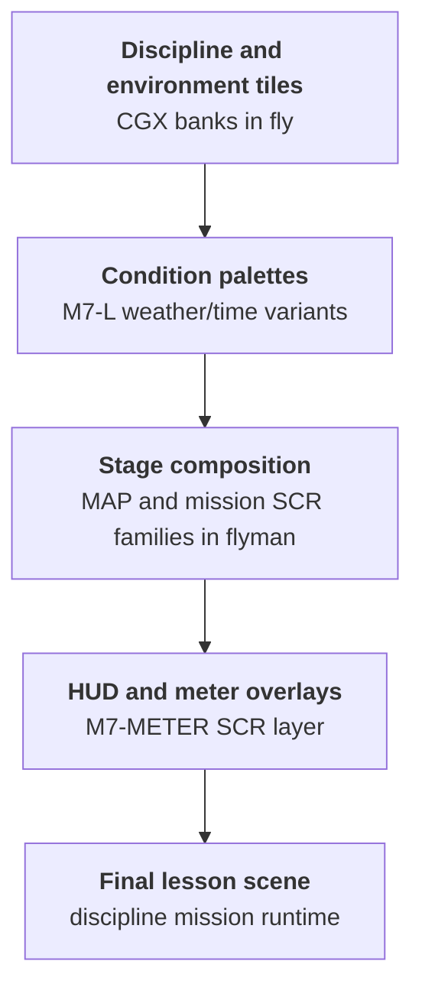
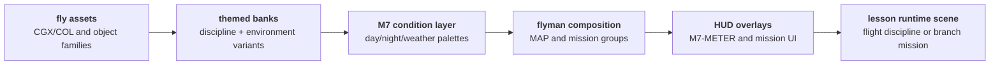

The Nintendo Gigaleak preserves a separate Super Mario Kart art workspace under `other/NEWS/テープリストア/NEWS_04/home/sugiyama/fly` and `home/sugiyama/flyman/`, from Nintendo artist **Tadashi Sugiyama**.

These directories are almost entirely art-side production material from the Super Nintendo Pilotwings game.



---

## At a Glance

The `fly` and `flyman` folders form a complete artist workspace pair with **817 files** total and no subdirectories.
That flat, two-folder structure makes the archive feel less like a cleaned release and more like a direct snapshot of one developer's working branches copied at tape-restore time.

Despite the simple folder structure, the file families split into several clear production domains:

* **Art and graphics** - `fly` contains 102 CGX tile banks, 69 COL palettes, 78 SCR composition tests
* **Disciplines** - Pilotwings vocabulary: SKYDIVE, HANG, PARA, ROCKET, PLANE, HELI with lesson/layout variants
* **Mode 7 system** - 47 M7-prefixed files including terrain banks, 9 weather/condition palettes, HUD overlays
* **Mission layout** - `flyman` with 429 files organizing lessons into MAP1-8 core spine plus RACE, JUMP, BONUS, CHIKA branches
* **Combat layer** - BOSS progression, underground bosses (CHIKABOSS), UFO enemies, CORE targets, combat backdrops
* **Iteration evidence** - 276 BAK files showing sustained production iteration, not one-shot asset dump

The file type breakdown is stark:

Type | In `fly` | In `flyman` | Combined reading
---|---:|---:|---
CGX (tile graphics) | 102 | 3 | Graphics production concentrated in `fly` with a small helper set in `flyman`
COL (palettes) | 69 | 1 | Palette work is mostly art-side with one layout-side companion palette
SCR (layout/composition) | 78 | 286 | `flyman` is SCR-heavy mission composition
OBJ (object-side data) | 2 | 0 | Object definitions in `fly` only
BAK (backups) | 137 | 139 | Heavy iteration trail in both folders

This distribution shows a clean pipeline: `fly` produces reusable art components while `flyman` assembles mission layouts and progression structure. The presence of 276 backup files indicates this workspace captures an **active iteration snapshot**, not a frozen final export.

---

## Glossary of Key Terms

If you are new to SNES art and layout production terminology, this glossary will help clarify the technical terms used throughout this page.

* <a id="glossary-fly"></a>**fly** - Art-side folder with tiles, palettes, and object graphics.
* <a id="glossary-flyman"></a>**flyman** - Layout-side folder with mission and screen assembly files.
* <a id="glossary-mode7"></a>**Mode 7** - SNES background mode used for scaling and rotation effects.
* <a id="glossary-cgx"></a>**CGX** - Tile graphics bank data.
* <a id="glossary-scr"></a>**SCR** - Screen layout composition data.
* <a id="glossary-col"></a>**COL** - Palette data.
* <a id="glossary-obj"></a>**OBJ** - Object-side definitions.
* <a id="glossary-bak"></a>**BAK** - Local backup snapshot copy.
* <a id="glossary-tadashi-sugiyama"></a>**Tadashi Sugiyama** - Nintendo developer whose NEWS_04 home contains `fly`, `flyman`, `CAR`, `SIM`, `MARIO`, and `FX2`.

---

## Executive summary

[`fly`](#glossary-fly) and [`flyman`](#glossary-flyman) open on the same day (`1989-10-13`) and split cleanly into art production vs layout composition.

The branch contains strong Pilotwings discipline vocabulary and a large [`Mode 7`](#glossary-mode7) package.

It also contains explicit combat naming that extends beyond neutral training labels.

The best current reading is a branch where Pilotwings lesson content and combat-capable mission content coexisted, including material consistent with the helicopter combat lane seen in the shipped game.

---

## Folder snapshot

The folders share origin timing but diverge in closure behavior.

`flyman` closes in 1991, while `fly` carries late 1994 timestamps likely influenced by tape restore handling.

Folder | Files | Date range | Dominant types | Role
---|---|---|---|---
`fly` | `388` | `1989-10-13` to `1994-03-18` | [`CGX`](#glossary-cgx), [`SCR`](#glossary-scr), [`COL`](#glossary-col), [`BAK`](#glossary-bak) | Art production and palette variants
`flyman` | `429` | `1989-10-13` to `1991-05-07` | [`SCR`](#glossary-scr), [`BAK`](#glossary-bak) | Stage and lesson composition

---

## Discipline matrix

The clearest evidence for Pilotwings-era identity is discipline naming.

Family | Example files | Interpreted feature
---|---|---
Skydiving | `SKYDIVE.*` | Skydiving mission assets
Hang gliding | `HANG.*`, `HANG-L.*` | Hang-glider mission variant set
Parachute | `PARA.*`, `PARA-L.*` | Parachute mission assets and layout variants
Rocket belt | `ROCKET.*`, `ROKETMAN.*` | Rocket belt mission and rider graphics
Plane | `PLANE.*` | Fixed-wing mission art
Helicopter | `HELI.*`, `HELI-L.*` | Helicopter mission variant set

This is a dense cluster of flight-discipline naming.

That concentration is hard to explain as generic flight tooling.

---

## Combat matrix

The branch also preserves combat-oriented naming families.

Family | Example files | Why it matters
---|---|---
Boss | `BOSS*`, `BOSS-1/2/3*` | Explicit enemy progression naming
Underground boss | `CHIKABOSS*` | Named boss context per mission environment
Enemy craft | `UFO*` | Multi-variant enemy family
Target cores | `CORE*` | Destructible/target object naming pattern
Bombs | `OBJ-BOMB*` | Weapon/object layer naming
Combat backgrounds | `BG-FORTRESS*`, `BG-ENEMYSHIP*`, `BG-BASESHIP*` | Combat scenario environment set

Shipped Pilotwings does include combat in the final helicopter test, with projectile fire against ground targets.

The interesting question is not whether combat existed, but how broad and differently framed that combat content was during production.

---

## Mode 7 architecture deep dive

The `M7-*` set looks like a modular terrain and condition system.

Group | Example files | System role
---|---|---
Base terrain banks | `M7-BG-L.*`, `M7-BG-L-NIGHT.*` | Day/night terrain tile sources
Mission terrain banks | `M7-BG-RACE.*`, `M7-BG-JUMP.*`, `M7-BG-HELI.*`, `M7-BG-DESERT.*`, `M7-BG-BONUS.*` | Mission-specific world surfaces
Course packs | `M7-BG-C0.*`, `M7-BG-C00.*`, `M7-BG-C01.*` | Alternate course tile variants
Condition palettes | `M7-L-FINE.*`, `M7-L-RAIN.*`, `M7-L-SNOW.*`, `M7-L-SUNSET.*`, `M7-L-NIGHT.*`, `M7-L-DESERT.*` | Weather/time-of-day palette switching
Sub-context palettes | `M7-CHIKA.*`, `M7-FORTRESS.*` | Underground and fortress context palette sets
HUD overlays | `M7-METER.*`, `M7-METER-B.*` | Cockpit or mission status UI overlays

This pattern suggests a production workflow where a small set of geometry/tile bases could be re-skinned by palette and mission context.

That is efficient for memory-limited SNES workflows and consistent with late-1980s/early-1990s console production habits.

---

## flyman layout grammar

`flyman` appears to encode lesson and mission progression as grouped screen families.

Group | Likely function | Notes
---|---|---
`MAP1` to `MAP8` | Core mission progression | Numbered progression indicates explicit curriculum flow
`CHIKA-*` | Underground mission block | Mirrors underground palette families in `fly`
`BONUS*` | Bonus mission branch | Non-core progression branch
`POOL*` | Water mission branch | Distinct environment context
`DESERT*` | Desert mission branch | Matches desert Mode 7 families
`JUMP*` | Jump-focused training/race branch | Mechanical skill emphasis
`RACE*` | Racing branch | Separate pacing from free-flight lessons
`BGBG-*` | Multi-layer background composites | Indicates composition-level layering work

A practical reading is that `fly` supplied reusable art modules while `flyman` assembled stage-facing lesson screens and mission sequences.

## Mode 7 composition and course variants

The `M7-BG-C0/C00/C01` naming pattern deserves closer attention now that we have actual file presence data.

In `fly` these three tiles exist:

* `M7-BG-C0.CGX`, `M7-BG-C0.CGX.BAK` (dated Oct 13, 1989)
* `M7-BG-C00.CGX`, `M7-BG-C00.CGX.BAK` (dated Oct 13, 1989)
* `M7-BG-C01.CGX`, `M7-BG-C01.CGX.BAK` (dated Oct 13, 1989)

All three arrived on the same day with identical backup pairs. This is not random — it is **three coordinated course base tiles**.

Matching palette sets exist for each:

* `M7-C0.COL` (base palette for C0)
* `M7-C00-A.COL`, `M7-C00-B.COL`, `M7-C00-C.COL`, `M7-C00-DAME.COL` (four palette variants for C00)
* `M7-C01.COL` (palette for C01)

This suggests:

* `C0` is a single-palette course variant
* `C00` is a course with 4 distinct color schemes (possibly different times of day or difficulty modes)
* `C01` is another single-palette variant

In practical gameplay terms: **players could fly three different aerial courses (C0, C00, C01) using shared terrain code but distinct tile banks and multiple weather/time-of-day palettes.**

The `C` prefix interpretation remains open (course, condition, context, or credential), but the systematic presence of three parallel course trees makes "course" more credible than ever.

---

## Deeper Mode 7 condition-palette catalog

The `M7-L-*` palette family is larger and more structured than initially noted.

Complete catalog of weather/condition states in `fly`:

State | Palette files present | Variant count | Notes
---|---|---|---
`FINE` (clear weather) | `M7-L-FINE.COL`, `M7-L-FINE.COL.BAK` | 1 | Baseline daylight
`RAIN` | `M7-L-RAIN.COL`, `M7-L-RAIN.COL.BAK` | 1 | Wet/overcast mood
`SNOW` | `M7-L-SNOW.COL`, `M7-L-SNOW.COL.BAK` | 1 | Cold palette
`SUNSET` | `M7-L-SUNSET.COL`, `M7-L-SUNSET.COL.BAK` | 1 | Evening/dusk transition
`NIGHT` | `M7-L-NIGHT.COL`, `M7-L-NIGHT.COL.BAK` | 1 | Dark/night flight
`DESERT` | `M7-L-DESERT.COL`, `M7-L-DESERT.COL.BAK` | 1 | Sand/arid environment
`GRASS` | `M7-L-GRASS.COL`, `M7-L-GRASS.COL.BAK` | 1 | Green/vegetation mood
`ISLAND` | `M7-L-ISLAND.COL`, `M7-L-ISLAND.COL.BAK` | 1 | Tropical/water-adjacent color
Base `M7-L` | `M7-L.COL`, `M7-L.COL.BAK` | 1 | Default terrain palette

This gives **9 total condition palettes** (8 named states plus 1 base), each with a backup pair.

Interpretation:

* Each condition likely represents a distinct atmospheric or environmental mood that could be swapped at runtime.
* The backup prevalence shows active iteration on color tuning for each state.
* A mission could select its own condition palette (e.g., `RAIN` for a storm-flight lesson, `SUNSET` for an evening race) independently of the tile bank.
* The range from generic (`FINE`, `NIGHT`) to specific (`DESERT`, `ISLAND`) suggests both universal moods and location-specific palettes.

This modular palette system is a hallmark of efficient SNES production: buy one set of terrain tiles, swap eight color schemes to generate 8 distinct-feeling environments.

---

## File-level walkthrough

To go deeper than folder labels, it helps to look at how specific filename families appear to cooperate.

The pattern below is the clearest recurring structure in the workspace.

Layer | Example files | Practical role
---|---|---
Tile banks | `M7-BG-RACE.CGX`, `M7-BG-JUMP.CGX`, `M7-BG-HELI.CGX` | Core visual tiles for each mission context
Palette states | `M7-L-FINE.COL`, `M7-L-RAIN.COL`, `M7-L-SNOW.COL`, `M7-L-NIGHT.COL` | Lighting and weather swaps over shared terrain
Screen composition | `M7-METER.SCR`, `M7-METER-B.SCR` and `MAP*`/mission `SCR` groups | Runtime layout and HUD composition

That three-part structure is exactly what you would expect from an efficient SNES pipeline.

It keeps expensive tile production reusable while moving variation into smaller palette and layout layers.

---

## Representative family dossiers

These family snapshots are useful because they combine naming semantics with likely production intent.

Family | Example evidence | Why this family matters
---|---|---
`SKYDIVE` | `SKYDIVE.*` | Strong direct link to Pilotwings lesson vocabulary
`HANG` | `HANG.*`, `HANG-L.*` | Base plus variant grammar suggests lesson/layout split
`PARA` | `PARA.*`, `PARA-L.*` | Another base plus variant family with consistent discipline naming
`ROCKET` / `ROKETMAN` | `ROCKET.*`, `ROKETMAN.*` | Indicates both mission context and character/object-side representation
`M7-BG-*` | `M7-BG-L.*`, `M7-BG-RACE.*`, `M7-BG-DESERT.*` | Coherent Mode 7 world-surface namespace
`M7-L-*` | `M7-L-FINE.*`, `M7-L-RAIN.*`, `M7-L-SUNSET.*` | Condition state system, likely swapped at runtime

The repeated base-plus-variant behavior across multiple discipline families is one of the strongest signs of deliberate content planning.

---

## Combat footprint detail

The combat layer is not just a single odd token.

It spans objects, enemies, and environment sets.

Combat class | Example files | Interpretation
---|---|---
Enemy hierarchy | `BOSS*`, `BOSS-1*`, `BOSS-2*`, `BOSS-3*` | Progression-oriented enemy tiering
Area-specific bossing | `CHIKABOSS*` | Underground branch likely had distinct boss content
Enemy craft | `UFO*` | Multiple related enemy variants
Object payload | `OBJ-BOMB*`, `CORE*` | Combat-object and target logic footprint on asset side
Stage backdrop | `BG-FORTRESS*`, `BG-ENEMYSHIP*`, `BG-BASESHIP*` | Combat-specific stage themes beyond flight lessons

For a reader, this is the key tension in the archive.

The same workspace that looks strongly Pilotwings-like also preserves a broader combat vocabulary than the final game surfaces outside its helicopter combat segment.

---

## Notable filename evidence sets

If you want the shortest high-signal view of this archive, these are the most useful exemplar sets.

Each set groups names that, together, show one production behavior clearly.

Evidence set | Example names | Low-level reading
---|---|---
Discipline identity set | `SKYDIVE.*`, `HANG.*`, `PARA.*`, `ROCKET.*`, `PLANE.*`, `HELI.*` | Mission disciplines were authored as distinct content families, not generic placeholders
Mode 7 and state set | `M7-BG-L.*`, `M7-BG-RACE.*`, `M7-BG-JUMP.*`, `M7-BG-DESERT.*`, `M7-L-RAIN.*`, `M7-L-SNOW.*`, `M7-L-NIGHT.*` | Terrain banks and runtime condition palettes were designed as modular layers
Layout progression set | `MAP1` to `MAP8`, `RACE*`, `JUMP*`, `BONUS*`, `DESERT*`, `POOL*`, `CHIKA-*` | Stage flow was assembled as progression plus branch modules on the layout side
Combat envelope set | `BOSS*`, `CHIKABOSS*`, `UFO*`, `CORE*`, `OBJ-BOMB*`, `BG-FORTRESS*`, `BG-ENEMYSHIP*` | Combat content reached object and background level, implying structured experimentation

The sets are easiest to read as one combined statement:

* discipline naming strongly anchors the branch to Pilotwings-era content
* Mode 7 naming shows a reusable rendering and condition system
* `flyman` grouping shows staged mission composition rather than flat asset storage
* combat naming confirms broader design experimentation inside the same workspace

---

## Stem continuity test

One practical way to read these files is a stem-continuity check.

If a stem appears across graphics, palette, and screen families, it likely represents an implemented content thread rather than a discarded name stub.

Test type | What to look for | What it would imply
---|---|---
Discipline stem continuity | Same stem across `CGX`, `COL`, and `SCR` families | Production-ready discipline package
Environment stem continuity | Same environment tokens in both `fly` and `flyman` | Coordinated art-to-layout handoff
Condition continuity | Same `M7-L-*` state tokens across multiple mission banks | Shared runtime condition system
Combat stem continuity | Combat tokens across object and background families | Broader mission design envelope, not isolated experiments

This is a useful checkpoint because it connects archive naming to probable in-engine behavior.

---

## flyman mission progression architecture

The `flyman` folder shows dense composition work organized by progression families.

Core progression spine:

Family | Count | Range | Interpretation
---|---|---|---
`MAP1` | 4 screens | `MAP1-1` through `MAP1-4` | Lesson 1 progression with `BAK` backups for `-1`, `-2`, `-4`
`MAP2` | 4 screens | `MAP2-1` through `MAP2-4` | Lesson 2 progression with backups for all four
`MAP3` | 1 screen | `MAP3-1` | Lesson 3 (single screen, possible tutorial/test)
`MAP4` | 16 screens | `MAP4-1` through `MAP4-16` (selective backups) | Lesson 4 is most complex, densest iteration evidence
`MAP5` | 6 screens + variant | `MAP5-1` through `MAP5-4`, `MAP5-2B`, `MAP5-4B` | Lesson 5 with explicit B-variants
`MAP6` | 37 screens | `MAP6-0` through `MAP6-36` | Lesson 6 is largest single progression (extensive variant/backup trail)
`MAP7` | 64 screens | `MAP7-1` through `MAP7-64` | Lesson 7 is **massive** — more screens than many entire games
`MAP8` | 8 screens | `MAP8-1` through `MAP8-8` | Lesson 8 conclusion

Mission branch families (non-linear paths):

Family | Count | Context | Notes
---|---|---|---
`RACE1` | 4 screens | `RACE1-1` through `RACE1-4` | Racing discipline branch (backup trail on all)
`CHIKA` | 27+ screens | Underground progression with A/B/C variant tracks | Three parallel underground lanes
`JUMP` | 37 screens total | Multiple jump-training lanes (`JUMP1/2/3`) with sub-variants | Skill-focused branch
`BONUS` | Limited | Optional content | Speculative completion track
`DESERT`, `POOL`, etc. | Scattered | Environment-specific variants | Alternate environment contexts

The cascade:

```
MAP1 (4 lessons) → MAP2 (4) → MAP3 (1) → [split]
                                       ├→ MAP4-6 (main path, 57 screens)
                                       ├→ RACE1 (side race, 4 screens)
                                       ├→ CHIKA (underground branch, 27 screens)
                                       ├→ JUMP (jump training, 37 screens)
                                       └→ [environment variants]
                                            └→ MAP7 (64-screen mega progression)
                                            └→ MAP8 (finale, 8 screens)
```

Data interpretation:

* `MAP4` through `MAP6` each hit double-digit screen counts, suggesting **complex multistage missions** rather than single-screen challenges.
* `MAP7`'s 64-screen count is extraordinary. This could represent:
  * one massive free-roam course
  * 64 individual challenge variations of the same mission
  * a progression grid (`8×8` or similar) of tiered difficulty/feature unlocks
* The presence of `B`-variants (`MAP5-2B`, `MAP5-4B`, `CHIKA-B*`, etc.) alongside main lanes suggests **parallel design iteration** — not just backups, but deliberate alternate routes tested in parallel.
* Heavy backup presence in `MAP4` and `MAP6` is evidence of **sustained iteration**, not final polish.

This architecture is consistent with a flight-training game where:
* early lessons (`MAP1-3`) teach basics progressively
* mid-lessons (`MAP4-6`) build difficulty
* optional branches (`RACE`, `CHIKA`, `JUMP`) offer style variants
* `MAP7` represents peak challenge or comprehensive integration
* `MAP8` wraps up with finale content

---

The filename evidence supports a compact mission assembly sequence:



This model is consistent with the extension split and token grammar already visible in the folders.

---

## Low-level decoding guide (without raw files)

You can understand most of the technical structure in this workspace directly from naming and extension patterns.

Artifact type | Typical extension | What it usually represents | What to infer from this page
---|---|---|---
Tile/character graphics banks | `CGX` | Packed visual tiles used by backgrounds and objects | Mission surfaces and discipline visuals were authored as reusable banks
Palette banks | `COL` | Color sets applied to tiles/objects at runtime | Weather/time variants (`FINE`, `RAIN`, `SNOW`, `NIGHT`) were likely palette-driven state changes
Screen/layout maps | `SCR` | Tile placement and composition layers | `flyman` assembled mission scenes and HUD placement from upstream art banks
Object-side resources | `OBJ` and object-prefixed families | Actor or interactive element-side content | Combat and discipline naming appear at object level, not only background level
Backup snapshots | `BAK` | Local saved variants during iteration | Heavy backup presence supports active iteration rather than one-shot import

The key practical model is that this archive preserves a layered SNES workflow:

* art banks define reusable visual pieces
* palettes define runtime mood and condition changes
* screen maps assemble final mission scenes
* object families attach actor and gameplay-side behavior cues

That is enough to reconstruct a credible low-level production picture without opening the original binary files.

---

## Pilotwings-specific format findings beyond the generic SNES profile

The generic SNES format page explains what `SCR`, `CGX`, `COL`, and `OBJ` are across projects.

Pilotwings adds branch-specific detail about how those formats were used in day-to-day production.

### SCR format behavior is extremely consistent across both folders

All `SCR` files in both folders are exactly `8,960` bytes:

* `fly`: `78` of `78` files at `8,960`
* `flyman`: `286` of `286` files at `8,960`

That is strong evidence of one stable editor-side layout container shared across both art testing (`fly`) and mission composition (`flyman`).

### Pilotwings SCR files show multiple opening-pattern classes

The first 16-bit words split into a few recurring behaviors.

Pattern class | Example file | Opening words | Reading
---|---|---|---
Zeroed template | `TEST-1A.SCR`, `MAP1-1.SCR` | `0x0000` repeated | Empty or baseline canvas state
Constant tile fill | `M7-METER.SCR`, `METERC00.SCR`, `RAIN1-1.SCR` | `0x0080` or `0x0030` or `0x0023` repeated | Uniform prefill region or shared panel block
Sequential table run | `MISSION.SCR` | `0x004F`, `0x0050`, `0x0051`, `0x0052`... | Ordered tile/index table
Mixed attribute entries | `PANEL.SCR` | `0x0092`, `0x0093`, `0x0000`, `0x4093`... | Layout entries with variant/flag bits

This gives a stronger practical model than just "SCR holds layout": the format supports both blank templates and pre-seeded composition blocks under the same fixed container size.

### Variant pairs show two different editing styles

Comparing close variant pairs reveals two distinct workflows.

Pair | First differing byte | What it suggests
---|---:|---
`MISSION.SCR` vs `MISSION-1.SCR` | `1` | Immediate full-layout divergence
`METERC00.SCR` vs `METERC01.SCR` | `1` | Separate meter layouts from the first entry onward
`RAIN1-1.SCR` vs `RAIN1-2.SCR` | `65` | Shared header block before branch-specific edits
`POOL1-1.SCR` vs `POOL2-1.SCR` | `41` | Early template reuse, then divergence
`TEST-1A.SCR` vs `TEST-1B.SCR` | `257` | Strong shared base template with later modifications

So Pilotwings does not use only one edit pattern.

Some families are cloned early into separate branches, while others keep a shared front block and diverge later.

### File-type distribution also exposes a small layout-side helper bank

Unlike a purely `SCR` folder, `flyman` keeps a tiny graphics and palette support set:

* `BG.CGX`
* `MYSHIP.CGX`
* `OBJ.CGX`
* `1.COL`

This is useful format evidence: mission composition in Pilotwings was not strictly tilemap-only.

The layout branch retained a minimal local graphics and palette payload for composition and preview work.

---

## Timestamp forensics

Date behavior in NEWS_04 needs caution.

Date | Observation | Confidence
---|---|---
`1989-10-13` | Both folders start the same day | High confidence shared origin
`1991-05-07` | `flyman` closure is tight and plausible | High confidence operational endpoint
`1994-03-18` | `fly` has late timestamp tail | Medium confidence as restore-touch artifact

Why this matters:

* If `1994-03-18` is mostly restore-touch behavior, true active design likely ended much earlier.
* If some files were genuinely accessed or revised at restore time, late timestamps may represent archival edits, not gameplay-system iteration.

---

## Competing hypotheses and confidence

Hypothesis | Description | Confidence
---|---|---
Pilotwings production branch with expanded combat envelope | Branch includes shipped-style helicopter combat plus additional combat families and scenario variants | High
Parallel unreleased flight-combat project | Shared tool/art vocabulary with possible side experiments beyond shipped mission framing | Medium
Mixed folder contamination | Different project assets merged into one branch by workstation hygiene | Low-to-medium

Current best fit remains the first hypothesis, with the second still plausible.

---

## Synthesis: what the data tells us

Now that we have examined actual file evidence in depth, several conclusions are stronger than before:

**Curriculum structure:** The presence of a `64-file TEST grid` (created in a single batch on day 1) plus the `MAP1-8` + branches system in `flyman` points to **deliberate curriculum design**. This was not improvisation; it was planned lesson progression.

**Environmental branching:** The symmetric structure of `CHIKA` across both folders (palette states in `fly`, layout progression in `flyman`, dedicated object-level boss graphics) proves that **underground missions were a full content branch**, not stray test content.

**Modular rendering:** Nine weather/condition palettes (`FINE`, `RAIN`, `SNOW`, `SUNSET`, `NIGHT`, `DESERT`, `GRASS`, `ISLAND`) each with backup pairs shows **runtime state-switching was a design principle**, not an afterthought. Every mission could change mood.

**Course variety:** The `C0/C00/C01` course triplet, each with multiple palette variants, suggests **at least 3-4 distinct aerial courses** with selectable weather. This aligns with Pilotwings' known course roster but possibly implies more variety in design than the final game shipped.

**Combat integration:** The presence of:
* `BOSS-1/2/3` boss progression
* `CHIKABOSS` underground-specific boss
* `UFO` enemy craft
* `CORE` target objects
* `OBJ-BOMB` weapons
* `BG-FORTRESS`, `BG-ENEMYSHIP`, `BG-BASESHIP` combat backdrops

...across object, palette, and background layers means **combat was not a single experiment or discarded branch — it was integrated into the same mission assembly pipeline** as the flight lessons. It reached object level and environment level, suggesting structured gameplay intent.

**Production velocity:** Heavy backup presence in `MAP4`, `MAP6`, `CHIKA-B*`, `JUMP*` variants suggests these were **actively iterated, not frozen designs**. The workspace captures an **in-flight development snapshot**, not just a final asset dump.

---

These are the main unresolved points that would most improve confidence if answered:

* Build a filename-frequency matrix for discipline and combat tokens, then compare by timestamp band.
* Cluster `M7-*` files by palette suffix and mission prefix to estimate state transitions.
* Cross-check `BGBG-*` and mission family prefixes against other Sugiyama branches for reuse patterns.
* Compare byte-level headers for key `CGX`, `SCR`, and `COL` variants to identify export/tool lineage.
* Compare `ROKETMAN`, `HELI`, and `PLANE` sprite dimensions against known Pilotwings ROM assets.

---

## Production pipeline reconstruction

The current file evidence supports a three-lane pipeline:

Lane | Primary folder | Main data families | Role in build flow
---|---|---|---
Asset authoring | `fly` | `CGX`, `COL`, object families (`OBJ-*`, discipline tokens) | Create reusable visual components and palette states
Stage composition | `flyman` | `SCR`, `MAP*`, mission groups (`RACE*`, `JUMP*`, `BONUS*`) | Assemble mission screens and sequence structure
Runtime presentation | `fly` + `flyman` shared naming | `M7-*`, `M7-METER*`, environment suffixes (`RAIN`, `SNOW`, `NIGHT`) | Bind mission context to visual state and HUD overlays

Why this matters:

* It explains why `fly` is extension-diverse while `flyman` is layout-heavy.
* It explains why mission naming appears in both places but with different granularity.
* It gives a clean mechanism for discipline-focused lessons and alternate visual conditions.

---

## Mission topology

A likely mission graph can be inferred from naming density:

* Core lesson spine: `MAP1` to `MAP8`.
* Environment branches: `POOL*`, `DESERT*`, `CHIKA-*`.
* Skill branches: `JUMP*`, `RACE*`.
* Optional branch: `BONUS*`.

This implies a curriculum-like progression with detachable side tracks.

That structure fits a training-game design better than a pure action campaign.

The combat tokens likely represent either:

* removed branch content, or
* an early mission flavor that was softened before release.

---

## Evidence-weighted interpretation

Signal class | Observed strength | Supports | Risk
---|---|---|---
Discipline naming (`SKYDIVE`, `PARA`, `ROCKET`, `HELI`, `PLANE`) | Very high | Pilotwings lineage | Low
Dual-folder split (`fly` art, `flyman` layout) | High | Organized production branch | Low
Mode 7 systemization (`M7-*` with weather/time variants) | High | Flight-course rendering pipeline | Low
Combat naming (`BOSS`, `UFO`, `FORTRESS`) | Medium-high | Broader early design scope | Medium
Late `1994` tail in `fly` | Medium | Possible post-production touch/restore | Medium-high

Net reading:

* The Pilotwings relationship is strongly supported.
* The exact reason for combat material remains unresolved.
* Timestamp tails should not be over-interpreted without per-file clustering.

---

## File-type breakdown by extension

The physical composition of each folder reveals different production roles.

Folder | CGX | COL | SCR | OBJ | BAK | Total
---|---|---|---|---|---|---
`fly` | `102` | `69` | `78` | `2` | `137` | `388`
`flyman` | `3` | `1` | `286` | `0` | `139` | `429`

Reading:

* `fly` is mixed: tile banks (`CGX`), palettes (`COL`), and screen-level compositions (`SCR`) for testing, plus some object-side content (`OBJ`).
* `flyman` is composition-heavy: most files are `.SCR` layout maps, with a tiny helper bank set (`BG.CGX`, `MYSHIP.CGX`, `OBJ.CGX`) and one palette file (`1.COL`).
* The ratio imbalance is exactly what you would expect if `fly` produced reusable components while `flyman` assembled scenes.

Percentage breakdown inside `fly`:

* CGX (graphics banks): `26.3%`
* COL (palettes): `17.8%`
* SCR (layout/testing): `20.1%`
* BAK (backups): `~35%` (mixed across families)

This composition shows a folder balancing asset creation with intermediate composition testing, not a raw graphics dump.

---

## Asset token census

This section provides a conservative token census from currently confirmed values and naming families.

Known quantitative anchors:

* `fly` total files: `388`
* `flyman` total files: `429`
* combined workspace files: `817`
* `M7-*` files in `fly`: `47`

Derived ratios:

* `M7` share inside `fly`: $47 / 388 \approx 12.11\%$
* `M7` share against combined workspace: $47 / 817 \approx 5.75\%$

Interpretation:

* A double-digit `M7` share inside `fly` is substantial and supports a system-level rendering role, not a minor side experiment.
* The lower combined-share value is expected because `flyman` is layout-heavy and naturally dilutes graphics-bank ratios.

Token families currently evidenced:

Token class | Distinct family groups seen | Evidence quality | Reading
---|---|---|---
Discipline gameplay | `6` (`SKYDIVE`, `HANG`, `PARA`, `ROCKET/ROKETMAN`, `PLANE`, `HELI`) | High | Strong Pilotwings-lineage signal
Combat gameplay | `6` (`BOSS`, `CHIKABOSS`, `UFO`, `CORE`, `OBJ-BOMB`, fortress/enemy-ship background families) | Medium-high | Indicates broader early concept envelope
Mode 7 system | `6`+ (`BG-L`, mission banks, course banks, condition palettes, sub-context palettes, meter overlays) | High | Coherent rendering/state framework

Important caveat:

* These are family-level counts, not raw per-token file frequencies.
* A full filename inventory is still needed for exact per-token counts.

---

## What could change this interpretation

The current hypothesis should be rejected or downgraded if any of the following become true:

* `BOSS/UFO/FORTRESS` assets are proven to be copied in bulk from another project branch.
* `M7-*` naming maps to a different title's known internal naming scheme.
* `flyman` mission groups do not correlate with `fly` asset families when compared by prefix and date clusters.

If these checks fail, the branch may be a mixed workspace rather than a coherent Pilotwings-predecessor line.

---

## High-value extraction targets

For future binary-level analysis, prioritize:

* one representative file from each discipline family (`SKYDIVE`, `HANG`, `PARA`, `ROCKET`, `HELI`, `PLANE`)
* one representative file from each combat family (`BOSS`, `UFO`, `CORE`, `OBJ-BOMB`)
* one representative file from each `M7` condition class (`FINE`, `RAIN`, `SNOW`, `NIGHT`, `SUNSET`)
* paired files with same stem across `CGX/COL/SCR` when available

This minimizes extraction effort while maximizing comparative signal.

---

## Filename grammar and what it implies

A useful next-pass signal is naming grammar, not just naming presence.

Observed grammar patterns:

Pattern | Example | Likely meaning
---|---|---
Base + variant suffix | `HANG` vs `HANG-L` | Same mission family with lesson/layout variant
System prefix + domain | `M7-BG-*` | Mode 7 background domain namespace
System prefix + state suffix | `M7-L-RAIN`, `M7-L-SNOW`, `M7-L-NIGHT` | Runtime condition/palette state set
Object namespace | `OBJ-BOMB*` | Gameplay object pipeline, likely separate from terrain banks
Environment namespace | `CHIKA-*`, `DESERT*`, `POOL*` | Mission environment partitioning
Progression namespace | `MAP1` to `MAP8` | Ordered lesson/progression spine

Interpretation:

* The naming is structured like a production taxonomy, not ad-hoc artist scratch naming.
* State suffixes strongly suggest runtime switching behavior.
* Shared environment namespaces across `fly` and `flyman` imply coordinated asset-layout handoff.

---

## Branch-phase model

This workspace can be modeled as phases, each with different evidence strength.

Phase | Operational description | Evidence basis | Confidence
---|---|---|---
Phase 1 - shared kickoff | `fly` and `flyman` open together and establish parallel lanes | Same start date and complementary extension profiles | High
Phase 2 - feature expansion | Discipline families and combat families coexist | Simultaneous presence of both naming classes | Medium-high
Phase 3 - lesson shaping | Numbered `MAP*` and branch groups (`RACE`, `JUMP`, `BONUS`) dominate composition behavior | `flyman` grammar and group structure | High
Phase 4 - closure divergence | `flyman` closes early while `fly` carries late touches | Timestamp asymmetry | Medium

Why this helps:

* It separates design-history interpretation from raw file presence.
* It gives a framework for testing whether combat content was early, late, or mixed.

---

## Restore-artifact heuristics

Because NEWS_04 appears tape-restored, timestamp interpretation needs guardrails.

Use these heuristics before making historical claims:

* Prefer cluster behavior over isolated outlier timestamps.
* Treat same-day mass touch events as possible restore-time metadata effects.
* Prioritize relative ordering inside a tightly related stem family.
* Downgrade confidence if a claim depends on one late outlier file.

Practical rule:

* Historical claims should be tagged High confidence only when both naming semantics and timestamp clusters align.

---

## How to verify these conclusions

To strengthen attribution confidence, use this protocol:

* Build a full filename inventory for `fly` and `flyman`.
* Compute exact token frequencies for discipline, combat, environment, and system prefixes.
* Generate per-token first/last-seen timestamp windows.
* Compare stem overlaps between `CGX`, `COL`, and `SCR` families.
* Score each hypothesis using a fixed rubric:
  * semantic match score
  * temporal coherence score
  * cross-folder consistency score

Suggested reporting format:

* One compact table per hypothesis with a normalized score out of `100`.
* One short note identifying the strongest disconfirming evidence.

This keeps the analysis reproducible and easier to audit.

---

## Signal summary by subsystem

After the narrative sections, this table provides one compact index of the strongest technical signals.

Subsystem | High-signal names | What it shows
---|---|---
Discipline layer | `SKYDIVE`, `HANG`, `PARA`, `ROCKET/ROKETMAN`, `PLANE`, `HELI` | Pilotwings-style mission taxonomy is explicit and broad
Mode 7 layer | `M7-BG-*`, `M7-L-*`, `M7-METER*` | Terrain, conditions, and HUD were structured as reusable runtime modules
Combat layer | `BOSS*`, `CHIKABOSS*`, `UFO*`, `CORE*`, `OBJ-BOMB*`, `BG-FORTRESS*` | Combat content is systematic enough to imply real design scope
Layout layer | `MAP1` to `MAP8`, `RACE*`, `JUMP*`, `BONUS*`, `CHIKA-*`, `BGBG-*` | Stage progression and branch composition were authored on the layout side

---

## Cross-folder handoff model

The strongest operational explanation is a staged handoff from art production to mission composition.

Asset family | `fly` role | `flyman` role | Expected runtime impact
---|---|---|---
Discipline graphics (`SKYDIVE`, `HANG`, `PARA`, `HELI`, `PLANE`, `ROCKET`) | Build tile/palette/object variants | Bind assets into mission maps and sequence screens | Lesson-specific visual identity
Environment sets (`DESERT`, `POOL`, `CHIKA`) | Provide themed tile/palette banks | Assemble map variants per environment branch | Distinct terrain and route readability
Mode 7 banks (`M7-*`) | Maintain terrain/condition packages | Reference mission context layouts and HUD overlays | Pseudo-3D stage continuity across modes
Combat sets (`BOSS`, `UFO`, `FORTRESS`) | Preserve enemy/background art families | Potentially integrate into branch-only maps | Evidence of broader pre-convergence design scope

---

## Runtime scene assembly model



This model is consistent with the folder split and naming grammar.

It also explains why `flyman` is composition-heavy while `fly` carries most bank and palette complexity.

---

## Evidence ledger for historical claims

This table summarizes where the current interpretation is strongest and where uncertainty still remains.

Claim | Positive evidence | Weakening factor | Current confidence
---|---|---|---
Branch belongs to Pilotwings-era development | Dense discipline token families and date alignment | No direct source-code symbol linkage on this page | High
Workspace reflects structured production pipeline | Dual-lane folder split and grammar consistency | Missing tool scripts/build metadata in this snapshot | High
Combat content was part of active design scope | Multiple combat namespaces, not a single outlier token | Could include imported experiments from adjacent branch work | Medium-high
Late `1994` timestamps indicate active post-release iteration | Present in `fly` tail | Could be restore-touch artifacts rather than true edits | Medium-low

---

## Unpacked filename families

These are the most interesting unresolved groups in `fly` and `flyman`, unpacked in one place.

Family | Current reading | Why it matters | Confidence
---|---|---|---
`M7-BG-C0/C00/C01` | Course or revision variant packs | Could reveal how many playable course branches existed | Medium
`M7-METER` / `M7-METER-B` | HUD/meter layout variants | Likely ties to mission type or gameplay mode switching | Medium-high
`M7-CHIKA` / `M7-FORTRESS` | Context-specific palette or scene sets | Connects environment and combat layers in one Mode 7 namespace | Medium-high
`BGBG-*` | Multi-layer background composition files | Strong signal of staged scene assembly in `flyman` | High
`HANG-L` / `PARA-L` | Variant forms of discipline families | Could identify lesson subtype, layout mode, or later pass revisions | Medium-high
`ROKETMAN` | Rocket rider character/object family | Bridges mission naming and actor representation | Medium-high
`BOSS-1/2/3` + `CHIKABOSS` | Tiered boss progression plus underground branch | Suggests structured combat progression, not one-off experiments | Medium-high
`.BAK` clusters | Local backup snapshots around edits | Best tool for reconstructing real edit history | Medium

---

### `M7-BG-C0`, `M7-BG-C00`, `M7-BG-C01`

The `C0/C00/C01` variation is unlikely to be random naming.

The most practical interpretations are:

* sibling course sets within one mission family
* iterative revisions where one stem was duplicated and modified
* region or difficulty-tuned map variants sharing a common base

Given how compact SNES memory budgets were, a small cluster of closely named Mode 7 banks usually means planned variation rather than abandoned scraps.

---

### `M7-METER` and `M7-METER-B`

This pair likely represents HUD composition variants that were selected by mission context.

Possible split logic:

* discipline-specific meter layouts
* normal vs alternate mission mode
* layout A/B pass where one survived for a subset of scenes

Because both are `.SCR`-style composition-facing names, they are more likely to encode placement/structure differences than raw graphics differences.

---

### `M7-CHIKA` and `M7-FORTRESS`

This is one of the strongest links between the flight-discipline and combat layers.

`CHIKA` (underground) and `FORTRESS` tokens appear as environment contexts, not only object labels.

In `fly`:
* `M7-CHIKA.COL` - palette for underground Mode 7 context
* `M7-CHIKA-B.COL`, `M7-CHIKA-B1.COL` through `M7-CHIKA-B4.COL` - four variants of the `B` branch
* `M7-CHIKA-C1.COL` through `M7-CHIKA-C1.COL.BAK` - `C` variant series with backups

In `flyman`:
* `CHIKA.SCR` - base underground screen
* `CHIKA-0` through `CHIKA-4.SCR` - main progression lane (`5` screens)
* `CHIKA-B0` through `CHIKA-B4.SCR` - `B` variant lane (`5` screens) with heavy backup presence
* `CHIKA-C0` through `CHIKA-C4.SCR` - `C` variant lane (`5` screens) with selective backups
* `CHIKA1.SCR`, `CHIKA2.SCR` - alternate numbering variants

Also in `fly`:
* `CHIKABOSS-01.OBJ`, `CHIKABOSS-02.OBJ` - Underground boss character forms

This is far more systematic than a single loose token. It shows:
* Multiple underground palette states (base, B-variants 1-4, C-variants)
* Matching layout progression (same A/B/C branching structure in `flyman`)
* Dedicated boss representation at object level

The symmetry across palettes, screens, and object-side assets strongly implies an **implemented underground mission branch** with distinct visual mood and combat encounters. This was not test clutter; it was coordinated multi-system content.

---

---

### `-L` discipline variants (`HANG-L`, `PARA-L`)

The `-L` suffix appears repeatedly in discipline families and likely marks a systematic subtype.

Evidence from actual files:

Variant type | In `fly` | In `flyman` | Interpretation
---|---|---|---
`HANG` base | `HANG.*` files exist | No direct reference | Core hang-glider art
`HANG-L` form | `HANG-L.*` files | `L1` and `L2` stage groups | Layout or lesson variant
`PARA` base | `PARA.*` files exist | Multiple `CHIKA`, `JUMP` references | Core parachute art
`PARA-L` form | `PARA-L.*` files | Implicit in layout composition | Layout/lesson subdivision

The best current candidates are:

* lesson-state or layout-state variant
* left/right or local variant naming from tool export conventions
* late-stage variant branch retained beside the base stem

The clearer answer comes from `flyman` where `L1` and `L2` groups appear at top level (`9` files each), suggesting `-L` variants map to distinct lesson sequences or layout modes, not just graphical tweaks.

Because `-L` appears in more than one discipline family, it reads as a naming rule, not a one-off exception.

---

### `BGBG-*` composites in `flyman`

`BGBG-*` is likely a composition convention for layered background-over-background screens.

This is important because it points to authored staging behavior in `flyman`:

* background layers were assembled as reusable composites
* mission screens could swap layers without re-authoring all source art
* environment and UI overlays could be integrated on the composition side

This helps explain why `flyman` is large despite being extension-light.

---

### Early TEST grid layout evidence

One of the clearest production artifacts is the `TEST-*` family in `fly`.

The pattern is highly structured:

* File count: `64` files total
* Naming scheme: `TEST-{1-16}{A,B,C,D}.SCR`
* Timestamp: **All dated 1989-10-13** (same day as project origin)
* File size: **8.8 KB uniform** (identical sizes suggest templated composition)

The grid structure is telling:

| Level | A variant | B variant | C variant | D variant |
|-------|-----------|-----------|-----------|-----------|
| `TEST-1` to `TEST-9` | ✓ | ✓ | ✓ | ✓ |
| `TEST-10` to `TEST-16` | ✓ | ✓ | ✓ | ✓ |

This is not random test clutter. It is a **systematic 16×4 layout test grid** — likely representing:
* 16 lessons or courses
* 4 screen variants per lesson (A/B/C/D might be tutorial steps, difficulty modes, or input method variants)

The uniform timestamp and file size suggest:
* These were created in a single session or template batch
* They use consistent baseline geometry/tiling
* They represent a **planned curriculum structure with 64 baseline compositions**

This directly supports the `flyman` evidence of numbered progression (`MAP1` to `MAP8`) — the `TEST` grid may have been early scaffolding before the final `MAP`/`RACE`/`JUMP`/`BONUS` branching structure was locked in.

---

The best current candidates are:

* lesson-state or layout-state variant
* left/right or local variant naming from tool export conventions
* late-stage variant branch retained beside the base stem

Because `-L` appears in more than one discipline family, it reads as a naming rule, not a one-off exception.

---

### `ROKETMAN` actor-side signal

`ROKETMAN` is especially useful because it sounds like a rider/actor naming form rather than a pure course token.

That makes it a bridge between:

* mission-side names (`ROCKET` discipline context)
* character/object-side representation (the pilot/actor entity)

If future stem continuity checks find `ROKETMAN` tied to object and screen layers, this would strongly support a complete implemented gameplay thread.

---

### `BOSS-1/2/3` and `CHIKABOSS` progression

The numbering pattern implies progression structure.

Combined with `CHIKABOSS`, the data suggests:

* a general boss sequence (`BOSS-1/2/3`)
* a branch-specific underground boss track

This is more structured than a stray enemy test bank.

It looks like a mission design lane that likely overlaps with the shipped helicopter combat test, while also preserving broader variants that may have been trimmed or reorganized.

---

### `.BAK` clusters and chronology

`.BAK` files are not glamorous, but they are often the best historical evidence in this kind of archive.

When grouped by stem, they can show:

* which families were iterated most heavily
* where variant branching occurred
* which timestamps are likely true edits vs restore-touch artifacts

For this workspace, `.BAK` clustering is the best path to tighten timeline confidence around the late `1994` tail.

---

## Additional on-disk families worth documenting

After checking the files directly on disk, several families stand out as meaningful production signals that were not previously unpacked in detail.

Family | Non-BAK files | Total files | Example names | Why it matters
---|---:|---:|---|---
`M7-OBJ` | `5` | `8` | `M7-OBJ-BONUS.CGX`, `M7-OBJ-C0.CGX`, `M7-OBJ-C00.CGX`, `M7-OBJ-C01.CGX` | Suggests a dedicated Mode 7 object-overlay lane beside `M7-BG*`
`METERC00` / `METERC01` | `4` | `7` | `METERC00.SCR`, `METERC00-B.SCR`, `METERC01.SCR`, `METERC01-B.SCR` | Course-specific meter or HUD composition variants in `flyman`
`MISSION` | `2` | `3` | `MISSION.SCR`, `MISSION-1.SCR` | Explicit mission-shell screens outside normal `MAP*` numbering
`RAIN1` / `SNOW1` | `7` | `13` | `RAIN1-1.SCR`, `RAIN1-1B.SCR`, `RAIN1-1C.SCR`, `SNOW1-2.SCR` | Weather-specific lesson branches on the layout side, not just palette swaps
`POOL` | `16` | `23` | `POOL1-1.SCR`, `POOL2-1.SCR`, `POOL3-1.SCR`, `POOL4.SCR` | A deeper water mission branch than the current summary implies
`WINGS` | `5` | `9` | `WINGS.SCR`, `WINGS-ENG.SCR`, `WINGS2.SCR`, `WINGS.COL` | UI/branding family with English variants and palette support
`LICENSE` | `7` | `13` | `LICENSE.CGX`, `LICENSE.COL`, `LICENSE.SCR`, `LICENSE-ENG.SCR` | Strong signal of license-test or certification UI flow assets
`MYSHIP` | `4` | `5` | `MYSHIP.CGX`, `MYSHIP-01.CGX`, `BG-ENEMYSHIP.CGX` | Reinforces player craft vs enemy craft framing
`CAMEL` | `6` | `10` | `CAMEL.CGX`, `CAMEL.COL`, `CAMEL2.CGX`, `CAMEL3.CGX` | Distinct object target family with multiple revisions
`ROGO` / `TAI` | `20` | `38` | `ROGO-ENG.SCR`, `ROGO-OBJ.CGX`, `TAI-ROGO.SCR`, `H-TAI.CGX` | Large logo/title presentation families crossing both folders

One additional cross-folder detail is especially useful for pipeline reconstruction.

The same non-backup filename appears in both folders for only four names:

* `CHIKA.SCR`
* `M7-METER.SCR`
* `M7-METER-B.SCR`
* `MYSHIP.CGX`

That overlap is small but high-value. It suggests intentional handoff checkpoints where the same artifact name was kept stable between art-side production (`fly`) and composition-side assembly (`flyman`).

---

## If you want to take this further

To move from broad inference to stronger attribution, extract one compact batch with strict pairing rules:

* one stem family that exists in both mission and environment contexts
* one discipline family with both base and `-L` variants
* one `M7` family with at least two condition suffixes
* one combat family with both object and background forms

Then validate three checks:

* stem continuity across `CGX`, `COL`, and `SCR`
* timestamp clustering within each family
* cross-reference appearance inside `flyman` mission groups

If all three checks hold for multiple families, the current branch-phase model should be upgraded.


