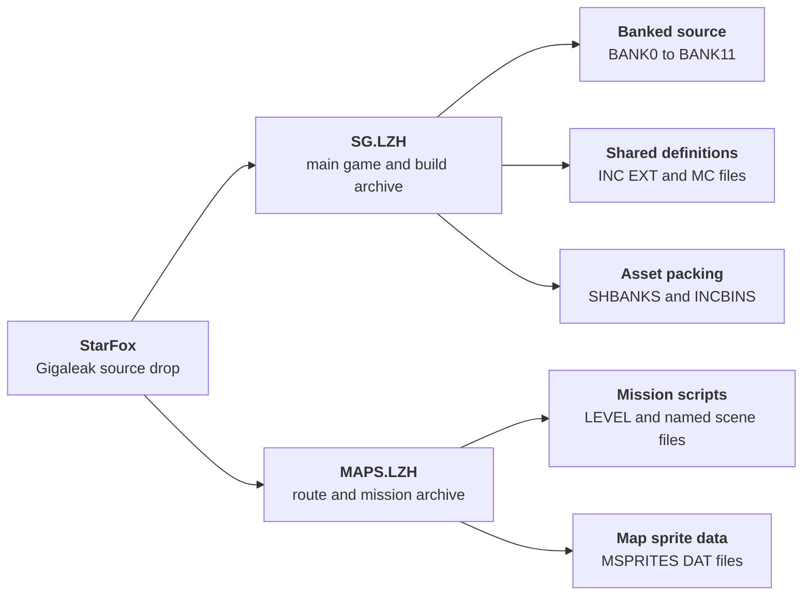
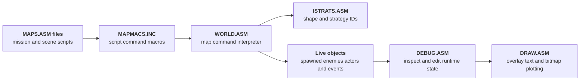

The Nintendo Gigaleak preserves a compact but very revealing Star Fox source drop under `other/SFC/ソースデータ/StarFox`.

Unlike the F-Zero leak, this one is not laid out as loose source folders from the start.
It survives as two separate LZH archives: one for the main game/build tree and one for the map package that the main makefile expects to assemble into the final ROM.



---
## At a Glance
The big takeaways from this Star Fox drop are:

* the main code and the route/map package survive as two separate archives rather than one extracted tree
* `SG.LZH` looks like the core build tree, with banked assembly, include files, strategy modules, data lumps, and sound banks
* `MAPS.LZH` looks like the level and route package that `MAKEFILE` expects for the heavier map banks
* the build uses `SASMX` as the assembler and `SL` as the linker
* the makefile targets `finished.sg` and `sg.rom`
* `MAIN.ASM` still exposes game-side variables such as `fox`, `frog`, `bunny`, `cock`, `pepper`, and `andorf`
* the archive preserves a lot of the surrounding production data too, including palettes, fonts, route scripts, sprite packs, and many binary sound banks

What makes this leak special is that it preserves both the banked Super FX code structure and the separately packed mission/map layer.
You can see not just "the Star Fox source", but also how its banks, routes, shapes, and data payloads were expected to come together at build time.

This high-level split is easier to see visually:

---
## Glossary of Key Terms
This page uses several project-specific build terms that are worth defining up front:

* **SG** - The label used by the main build products such as `finished.sg` and `sg.rom`.
* **SOB** - The assembled object output produced by `SASMX` before final linking.
* **INC** - Include files containing shared constants, macros, structures, and declarations.
* **EXT** - Public symbol/export definition files used across the banked build.
* **MC** - Macro or support source files used heavily by the main engine and rendering side of the project.
* **Super FX** - Nintendo and Argonaut's 3D coprocessor family used by Star Fox and other SNES games.

---
# Root Directory (SFC.7z/ソースデータ/StarFox)
At the top level the Star Fox leak is tiny.
Everything is packed into just two timestamped archives from February 1993.


The split between the two archives is the first important thing to notice.
`SG.LZH` is the main game/build tree, while `MAPS.LZH` looks like the route and mission package that the main build expects to pull in.



- SG.LZH - Main Star Fox source and build archive (`1,181,921` bytes, `15 February 1993`)
- MAPS.LZH - Route/map archive plus sprite data (`178,925` bytes, `15 February 1993`)




The fact that the map package is separate matters because the main `MAKEFILE` inside <a href="#glossary-sg">SG</a> explicitly references `maps\*.asm`.
So this is not a random extra archive beside the game.
It looks like part of the normal build input.

---
## How Complete This Looks
This looks much closer to a near-complete working source snapshot than a token code sample.

The strongest signs in its favour are:

* `SG.LZH` contains the build scripts, bank sources, include files, exported symbol files, binary sound banks, and large data payloads
* `MAPS.LZH` contains the route and mission source files that `MAKEFILE` clearly expects
* `STDFILES.LOG` inside `SG.LZH` lists the standard build set, including `*.inc`, `*.ext`, the bank files, `shbanks.asm`, and `incbins.asm`

It is still safest to call this a **near-complete source snapshot** rather than a guaranteed fully self-contained rebuild package.

The missing or uncertain pieces are:

* the actual assembler and linker executables, `SASMX` and `SL`, are referenced but not bundled
* there are no surviving `.sob` outputs or final linked binaries in the leak folder itself
* some SDK or workstation assumptions may still have lived outside these archives

So the important distinction is:
the leak appears to preserve most of the real Star Fox source and its route package, but it should not be described as a fully self-contained rebuild set unless a clean build has actually been demonstrated.

---
## SG.LZH - Main Game and Build Archive
`SG.LZH` is the heart of the leak.
It holds the banked game source, the build logic, the shared include files, the strategy/object modules, and the bulk of the binary asset payloads.


The archive mixes several different layers of the project:

* bank assembly such as `BANK0.ASM` through `BANK11.ASM`
* shared include and export files such as `HEADER.INC`, `MACROS.INC`, and `MAIN.EXT`
* main engine/gameplay modules such as `MAIN.ASM`, `GAME.ASM`, `WORLD.ASM`, `PLANETS.ASM`, and `SOUND.ASM`
* data and binary payload folders such as `DATA` and `SND`
* macro-heavy support files such as the `.MC` rendering and utility sources



- Build files - `MAKEFILE`, `SYMSON.MAK`, `FLIST`, `STDFILES.LOG`
- Include files - `32` `.INC` headers for constants, macros, structures, weapons, and sound definitions
- Export files - `48` `.EXT` symbol/public definition files
- Bank source - `BANK0.ASM` to `BANK11.ASM`, plus `SHBANKS.ASM` and `INCBINS.ASM`
- Core modules - `MAIN.ASM`, `GAME.ASM`, `WORLD.ASM`, `PLANETS.ASM`, `SOUND.ASM`, `NMI.ASM`, `IRQ.ASM`, `DRAW.ASM`
- Macro/support files - `23` `.MC` files such as `MOBJ.MC`, `MCLIP.MC`, `MPLANET.MC`, and `MHUD.MC`
- DATA - palettes, fonts, compressed resources, shapes, and graphics source lumps
- SND - `43` `.BIN` music and sound banks




The archive is dense enough that a quick count is useful:

File type | Count | What it suggests
---|---|---
`.ASM` | `77` | A heavily banked assembly codebase rather than a tiny sample
`.INC` | `32` | Lots of shared macro/structure/header logic
`.EXT` | `48` | Broad use of exported/public symbol definition files
`.MC` | `23` | A substantial support layer for engine, rendering, and utility logic
`.BIN` | `43` | Many prebuilt music and sound payloads expected at final build time

### How the Main Build Works
The first big clue comes from `MAKEFILE`.
It uses `SASMX` as the assembler and `SL` as the linker, and builds a set of <a href="#glossary-sob">`.sob`</a> objects that are then linked into either `finished.sg` or `sg.rom`.

Output | Role
---|---|
`finished.sg` | Default linked build target
`sg.rom` | Explicit ROM output target
`bank0.sob` to `bank11.sob` | Main assembled bank objects
`shbanks.sob` | Shared or shape-bank build product
`incbins.sob` | The bank that pulls in large binary payloads and packed assets

The bank structure is also revealing.
The makefile has explicit rules for `bank0`, `bank1`, `bank2`, `bank4` through `bank11`, plus `shbanks` and `incbins`.
That kind of layout is exactly what you would expect from a large SNES game with a coprocessor-heavy runtime and lots of banked asset data.

---
### What the Build Dependencies Reveal
The makefile is more than a compile script.
It acts like a table of contents for the project.

Some of the most revealing dependency groups are:

* `bank2.sob` pulls in `MAIN.ASM`, `GAME.ASM`, `WORLD.ASM`, `PLANETS.ASM`, `SOUND.ASM`, `DRAW.ASM`, `NMI.ASM`, and many graphics/color assets
* `bank5.sob` pulls in a huge run of `maps\*.asm` route files, which is the clearest proof that `MAPS.LZH` is part of the normal build
* `shbanks.sob` pulls in many `SHAPES*.ASM` files plus a cluster of BGM binaries
* `incbins.sob` pulls in a massive set of `.CCR`, `.PCR`, `.COL`, `.PAC`, `.CGX`, and `.BIN` resources

That makes `SG.LZH` feel much more like a real live source tree than a curated code sample.
It still expects to build against all the mission data, shape banks, palette packs, and sound banks that sit beside it.

---
### What MAIN.ASM Reveals
`MAIN.ASM` is a good example of how direct and readable the surviving code can be.
Right at the start it initializes variables named `fox`, `frog`, `bunny`, `cock`, `pepper`, and `andorf`, then calls routines such as `playerstart_init_l` and `initplanets_l`.

That does two useful things for the page:

* it confirms the archive is clearly Star Fox from the inside, not just from the folder name
* it shows the code is not just low-level engine scaffolding - it still exposes high-level game state and character-specific names

The same file also contains the higher-level game startup and loop structure:

* `initialise_l` does the early setup and palette unpack/copy work
* `initgame_l` resets the level state, initializes lists and map pointers, and creates the first objects
* `initgame3d_l` sets up the 3D/rendering side
* `gamestart` and `gameloop2` drive the main loop, pause checks, transfer step, messages, and level-finished/game-over flow

That makes `MAIN.ASM` a strong entry point for anyone who wants to study how the leaked project actually boots into gameplay.

---
### What SHBANKS.ASM and INCBINS.ASM Reveal
Two files make the asset side of the build especially easy to read: `SHBANKS.ASM` and `INCBINS.ASM`.

`SHBANKS.ASM` is the cleaner of the two.
It groups shape banks and selected BGM payloads together into banks `12`, `14`, `15`, `16`, and `17`, with entries such as `incshapes shapes.asm`, `incshapes kshapes.asm`, and `incbinfile snd\sgbgmm.bin`.

That tells us the Star Fox build was not only splitting logic into banks.
It was also deliberately grouping 3D shape data and music payloads into dedicated late banks that could be swapped or reused by the runtime.

`INCBINS.ASM` is even more revealing because it acts like a master packing script for the rest of the binary data.
It pulls in:

* `MSPRITES` sprite packs such as `sprites3.dat`, `sprites4.dat`, and `spritesg.dat`
* compressed background and object resources via `inccru`
* face and UI data such as `face.cgx`
* large palette packs such as `data\gfx\allcols.pac`
* the full run of sound and BGM binaries from `snd\sgsound0.bin` through the many `sgbgm*.bin` tracks

It also contains region and build-condition switches.
There are explicit `IFEQ GERMAN`, `IFEQ PAL`, and `IFEQ CONTEST` blocks that swap different art and sound payloads in or out while logging the alternatives with `fileslog`.

That is one of the most useful low-level details in the whole archive.
The leak is not just preserving source code and loose assets.
It preserves the actual pack-in script that decides which compressed backgrounds, sprites, face graphics, and sound banks become part of the final ROM for different builds.

---
### What SOUND.ASM Reveals
`SOUND.ASM` shows that the audio side of the game was organized as a table-driven APU download system rather than a handful of hardcoded song calls.

At the top of the file there is a run of entry points such as `do_bgm_title`, `do_bgm_training`, `do_bgm_map`, `do_bgm_intro`, `do_bgm_endseq`, `do_bgm_staff`, and `do_bgm_gameover`.
Each one resolves to a `bootapu` call with a specific sound-set label.

That matters because it exposes how the game thought about sound at a high level.
There are explicit states for title, map, training, black-hole, continue, staff roll, and special scenes rather than one undifferentiated music table.

The next layer is `sndtbl`.
That table ties symbolic names like `intro`, `title`, `training`, `map`, `continue`, `bhole`, `10`, `23`, `33`, `endseq`, and `staff` to concrete sound payload groups such as `sound1`, `bgmm`, `bgmo`, `bgml`, `bgma`, `bgm7`, `bgmc`, and `sounda`.

So the sound system is doing two jobs at once:

* picking the logical music/effect set for the current game situation
* describing which binary payloads have to be pushed to the APU for that set

The file then drops into the low-level transfer code.
Routines like `sbootapu`, `boot_repeat`, and the `apu_port0` to `apu_port3` handshake loops show the 65816 actively streaming sound data across to the SNES audio side rather than just flipping a single "play track" register.

That is a very useful leak detail because it preserves both halves of the system:
the high-level scene/music naming and the low-level upload protocol.

---
### What the Sound Binaries Show
The `SND` folder survives almost intact, and its naming lines up with the code surprisingly well.

The archive keeps:

* effect and support banks such as `SGSOUND0.BIN` through `SGSOUND9.BIN` and `SGSOUNDA.BIN`
* many BGM banks such as `SGBGM1.BIN` through `SGBGM11.BIN`
* lettered BGM payloads such as `SGBGMA.BIN`, `SGBGMB.BIN`, `SGBGMC.BIN`, `SGBGMD.BIN`, `SGBGME.BIN`, `SGBGMF.BIN`, `SGBGMG.BIN`, `SGBGMH.BIN`, `SGBGMI.BIN`, `SGBGMJ.BIN`, `SGBGMK.BIN`, `SGBGML.BIN`, `SGBGMM.BIN`, `SGBGMN.BIN`, `SGBGMO.BIN`, and `SGBGMP.BIN`
* regional alternates such as `PSGSND2.BIN`, `PSGSND5.BIN`, `PSGSNDA.BIN`, and `PSGBGMM.BIN`
* a German-specific alternate in `GSGSNDA.BIN`

That fits neatly with what `INCBINS.ASM` and `SHBANKS.ASM` are doing.
The project is not treating audio as one monolithic block.
It is packing music and sound content into named banks, then swapping some of those banks for PAL or German builds when needed.

`SOUNDEQU.INC` adds another useful layer.
It exposes named effect IDs such as `se_pauseon`, `se_playerdamage`, `se_gateofring`, `se_missilenear`, `se_movingwallleft`, `se_lasercentre`, and `se_dopcentre`, plus higher-level BGM IDs like `bgm_map`, `bgm_boss`, `bgm_mapselect`, `bgm_allclear`, and `bgm_transmit`.

That makes the sound archive much easier to read.
The leak is not only preserving the raw SPC-side binaries, but also the symbolic interface the gameplay code used to trigger them.

---
### What WORLD.ASM Reveals
`WORLD.ASM` is one of the most useful files in the whole archive because it shows how the route scripts are actually executed at runtime.

At the top of the file, `update_objects_l` advances `mapcnt` against the player's movement and drops into `newobjs_l` when the next scripted event should fire.
From there, `newobjex` reads the control value from the active map stream and jumps through a large dispatch table named `mapjmp`.

That table lines up directly with the control codes from `MAPMACS.INC`.
It contains handlers such as `mapobjdo`, `mapenddo`, `maploopdo`, `mapjsrdo`, `mapgotodo`, `setbgdo`, `setbgmdo`, `mapsendmessage`, `mapcodejsl`, `mapdobjdo`, and `mapsetpathdo`.

So the leak does not only preserve the map authoring language.
It also preserves the interpreter that turns those route-script commands into actual gameplay state changes, object spawns, background swaps, and message triggers.

That is a rare amount of context for a 16-bit game source leak.
You can read the mission scripts in `MAPS.LZH`, then read `WORLD.ASM` to see exactly how the engine steps through them.

The runtime relationship between those files is one of the nicest things about this leak:

---
### What PLANETS.ASM Reveals
`PLANETS.ASM` is not just some menu helper.
Its own file header describes it as the `PLANET SELECTION SCREEN`, and the surviving source makes that very literal.

The file sets up display layout constants, background transfer sizes, viewport positions, sprite limits, and temporary variables for the route-select scene.
It also contains the setup routine `initplanets_l`, which initializes lives, credits, default routes, stage state, and map mode before the player reaches the planet-selection flow.

One especially revealing detail is that the default route setup is explicit.
`initplanets_l` seeds `routes` with offsets like `stagepaths.path12-stagepaths`, `stagepaths.path7-stagepaths`, `stagepaths.path2-stagepaths`, and `stagepaths.path19-stagepaths`.

That tells us the route system is not just an abstract world map.
The code is actively storing and manipulating path choices in a form the game can later consume.

The file is also full of build-condition logic such as `planetcheat`, `debuginfo2`, and `cesdemo`.
That makes it look like the planet-select code was a live development surface where debug, contest, and demo configurations could all change how the screen behaved.

Taken together, `PLANETS.ASM` gives the page something important that the build files alone do not:
proof that this archive still preserves the high-level campaign flow, not just low-level rendering and object code.

---
### What DEBUG.ASM Reveals
`DEBUG.ASM` is not a token leftover or a few hidden strings.
It is a proper in-game strategy debugger for live object inspection.

The file builds an `aliendebugtable` with labeled fields such as `worldx`, `worldy`, `worldz`, `rotx`, `roty`, `rotz`, and `tx`, then `stratdebug_l` renders those values on screen and lets the developer move through objects and fields with pad input.

The controls are especially revealing.
The code handles:

* stepping between live objects with left and right input
* moving up and down through debug fields
* editing values in small or large steps with `A` and `Y`
* duplicating the current alien/object with `SELECT`
* freezing or resuming strategy updates
* changing camera position and distance with `X`, `B`, and the D-pad

That means this leak preserves a real internal inspection tool for the running game.
It was not just possible to watch Star Fox run.
Developers could stop on a specific strategy object, inspect its live coordinates and rotation, change values in memory, and even duplicate it to test behavior.

For anyone interested in how official SNES games were actually debugged, that is one of the best details in the archive.

---
### How the Debug Overlay Connects to DRAW.ASM and ISTRATS.ASM
`DEBUG.ASM` also makes two other files easier to understand.

`DRAW.ASM` contains the small rendering and text-printing helpers that make the overlay possible.
Functions like `clip_plot`, `plot`, `printt_l`, and `printchar` show the game writing text and pixel data directly into the bitmap buffers through tables like `pyoftab`, `pxoftab`, and `bitmapbase`.

So the debug view is not relying on some external monitor.
It is using the same in-game drawing path as the rest of Star Fox to render labels and values into the live frame buffer.

`ISTRATS.ASM` fills in the other half of the picture.
That file defines the `is_*` strategy IDs and `sh_*` shape mappings that the map scripts rely on, using macros like `def_istrat` and `def_shape`.

That makes the overall chain much clearer:

* `MAPS/*.ASM` names shapes and strategy behaviors through macros
* `ISTRATS.ASM` assigns those names their runtime IDs
* `WORLD.ASM` interprets the route commands and creates the live objects
* `DEBUG.ASM` lets developers inspect and tweak those live objects
* `DRAW.ASM` provides the low-level text and plotting support that makes the debugger visible on screen

Taken together, those files make the Star Fox leak unusually complete as a development snapshot.
It preserves not just game logic and data, but also part of the internal tooling chain used to observe and manipulate the running simulation.

---
## MAPS.LZH - Route and Mission Archive
`MAPS.LZH` looks like the missing second half of the build.
It is overwhelmingly made of map and route assembly, plus three `MSPRITES` data files.


The route archive splits neatly into two layers:

* `MAPS` - path data, mission scripts, route lists, planet/scene maps, and campaign flow
* `MSPRITES` - three sprite data packs used by the map side of the build



- MAPS - `125` `.ASM` files plus `MAPS.EXT` and `MAPLIST.EXT`
- MSPRITES - `SPRITES3.DAT`, `SPRITES4.DAT`, and `SPRITESG.DAT`




The file count alone makes the point:

File type | Count | What it suggests
---|---|---
`.ASM` | `125` | A very large mission/route layer, not a token collection of map examples
`.EXT` | `2` | Export/public definitions for the map package itself
`.DAT` | `3` | Packed sprite data accompanying the route archive

### What MAPLIST.ASM Reveals
`MAPS/MAPLIST.ASM` is the cleanest overview of how the route archive is organized.
It defines:

* `courses` in the order `course2`, `course1`, `course3`
* the level chains inside each course, such as `level1_1` through `level1_6`
* a long run of `INCMAP` inclusions for specific route/scene files

That is important because it shows `MAPS.LZH` is not just a stash of loose stage files.
It has a proper top-level route list and campaign structure.

---
### What the Route Files Look Like
A file like `MAPS/LEVEL1_1.ASM` makes the format feel very game-like rather than abstract.
It contains script-style map commands such as:

* `initlevel`
* `mapwait`
* `setvar`
* `mapjsr`
* `mapplayermode`
* `mapobj`
* `pathobj`
* `maploop`
* `mapend`

Those commands read much more like a mission scripting language than raw coordinate tables.
The route files place objects, trigger fades, switch player modes, attach path objects, and jump into submaps.

That makes the Star Fox map archive especially valuable.
It is preserving not just level geometry, but the actual mission-script layer that orchestrated encounters and transitions.

`LEVEL1_1.ASM` is a strong example because it starts with presentation and pacing, not geometry.
It turns meters on and off, waits for fades, switches the player into `ExitBase` and then `onplanet` mode, spawns Arwing wingmen with `pathobj`, drops in enemy objects with `mapobj`, and uses `mapjsr cl_ground` to hand control to another map routine.

That reads less like "here are some coordinates" and more like a stage-direction script.
The file is telling the engine when to fade, when to spawn Falco and Slippy, when to place background traffic, and when to transition into the playable route.

---
### How the Map Scripting Language Works
The route files become much clearer once you look at `MAPMACS.INC` in the main archive.
That file defines the control-byte layer behind the macros, with entries such as `ctrlmapobj`, `ctrlmapwait`, `ctrlsetbg`, `ctrlmapjsr`, `ctrlmapgoto`, `ctrlsendmessage`, `ctrlmapcspecial`, and `ctrlmapsetpath`.

That matters because it shows the map files were not just free-form assembly source.
They were written in a purpose-built mission language that compiled down into a compact command stream for the game to interpret.

Some of the macros are straightforward:

* `mapwait` advances time
* `setbg` and `waitsetbg` control background changes
* `setfadeup`, `setfadedown`, and `mapwaitfade` handle screen transitions
* `mapjsr`, `maprts`, and `mapgoto` give the route scripts subroutine and jump-style flow control

Others are closer to object scripting:

* `mapobj` spawns a normal object entry
* `mapqobj` and `mapqobj2` are compact object forms that pack position and frame data more tightly
* `mapdobj` is a denser object form used when the shape and strategy mapping allow it
* `pathobj` attaches scripted movement/path behavior to an object rather than just dropping it into space

That mix is one of the strongest signs that `MAPS.LZH` is a gameplay authoring layer.
It let designers or programmers describe timing, camera state, messages, object waves, fades, and scripted movement in one file format instead of scattering them across many unrelated tables.

---
### Training, Intro, and Credits as Scripted Scenes
Once the macro layer is visible, some of the named files in `MAPS.LZH` stand out even more.

`TRAINING.ASM` is not a tiny special case.
It is a long looping tutorial script that uses `pathobj` to place ring sequences, `mapobj` to place towers, pillars, robots, and bases, and `mapmsg 123` to trigger tutorial messaging.

The file is full of commented-out test material too.
There is an entire disabled "MSG TEST" block with many `mapmsg` calls, plus traces of helper routines like `skillfly_set`.
That makes the training map feel like an active sandbox for testing message flow and flight drills, not just a final polished stage script.

`INTRO.ASM` shows that the same language was used for cinematic presentation.
It disables player control, sets the intro background, spawns the "Presented by Nintendo" text with `textpath`, drops in enemy and player-intro objects, and then loops forever with `mapgoto`.

`CREDITS.ASM` pushes that even further.
It sets up a dedicated credits background, disables normal play, calls `actualcreds`, and then uses repeated `textpath` commands to stage the names and roles of Nintendo and Argonaut staff in sequence.

So the mission package is broader than "maps".
The same route-script system drives training scenarios, intro presentation, and the full end credits flow.

---
### What Survives in the Map Package
The filenames alone show how broad the package is.
Alongside generic stage files like `LEVEL1_1.ASM` and `LEVEL2_4.ASM`, it also preserves more specific named content such as:

* `ARMSMAP.ASM`
* `AIRLOCK1.ASM`
* `CASTANET.ASM`
* `TRUCKER.ASM`
* `WEBMONST.ASM`
* `MOTHERS.ASM`
* `BHOLE.ASM`
* `TRAINING.ASM`
* `CREDITS.ASM`
* `INTRO.ASM`
* `TITLE.ASM`

So `MAPS.LZH` is not only "the stage data".
It also preserves special encounters, route scenes, intro/title flow, training content, and credits-related map scripting.

There are also a few smaller clues worth calling out:

* `MAPS.EXT` and `MAPLIST.EXT` show the route package had its own exported/public symbol layer rather than being treated like raw data
* the archive includes both route files like `LEVEL3_1.ASM` and helper files like `PATHDATA.ASM`, `EPATHDAT.ASM`, `DPATHDAT.ASM`, and `KPATHDAT.ASM`
* names such as `CL_WARP`, `CL_EARTH`, `CL_CHASE`, `CL_UNDER`, and `CL_DIVE` suggest entire cinematic or transition sequences were implemented in the same mission-script format as gameplay sections

Taken together, that makes `MAPS.LZH` feel like a campaign and encounter package, not just a map folder.
