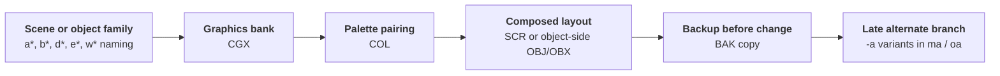

## Archive Source
This article analyzes the **Star Fox 2 2D art and graphics workspace** preserved in the [Gigaleak](/gigaleak) - specifically from the `NEWS_04` archive, a 96 MB Nintendo NEWS workstation backup.

**Path in archive:** `NEWS_04.tar → home/arimoto/SF2/`

The `arimoto` home directory belongs to **Masanao Arimoto**, a graphics engineer who maintained multiple active projects on this machine. His directory contains three major Zelda workspaces and one Star Fox 2 branch. This SF2 folder represents the **presentation and interface side of the project** - 2D graphics banks, palettes, screen layouts, and object definitions - rather than the 3D polygon authoring workflow (which is preserved in `NEWS_05`).




---
## Glossary

**SF2** - The internal codename for Star Fox 2 used across the NEWS_04 archive. Found in the `arimoto/SF2` workspace directory, containing approximately 1236 files spanning 2D graphics, screen layouts, object definitions, and palettes. The `SF2` directory preserves work from July 1993 through September 1995, making it one of the latest visible Star Fox 2 graphics-side workspaces in the Gigaleak.

**Watanabe, Tsuyoshi** - Graphics supervisor on Star Fox 2. Born March 13, 1968. Previously worked on *A Link to the Past*, where he contributed to Dark World art and intro cinematics. Within the SF2 workspace, a tiny `watanabe` subfolder (8 files) contains `obj-*`, `color-*`, and `spt_2` assets, suggesting a shared sample or handoff subset tied to his polygon design work on the 3D side (preserved in NEWS_05).

**Arimoto, Masanao** - Graphics engineer and workstation owner. Home directory (`arimoto/`) in the NEWS_04 backup contains the SF2 2D workspace, three separate Zelda project folders (DELDA, zelda, GB-zelda), and Sugiyama's multi-project overlay. Known for early NES-era graphics work on *The Legend of Zelda* and *Super Mario Bros.* Likely served as a senior graphics authority coordinating both 2D and 3D asset pipelines during Star Fox 2 production.

**CAD** - Computer-aided design file format (`.cad` extension). Found extensively in NEWS_05 Star Fox 2 workspace, representing 3D polygon models and assemblies. Absent from NEWS_04 SF2 folder, confirming the split between 2D presentation-side and 3D polygon-authoring workflows.

**CGX** - Character and graphics bank format. The dominant graphics asset type in SF2 workspace (189 files total). Typically paired with `.COL` (palette) and `.SCR` (screen/layout) files in triplet workflows. Used for sprite sheets, tile art, character portraits, and object-side graphics.

**SCR** - Screen or layout assembly format. Contains composed arrangements of graphics and palettes (140 files in SF2). Likely represents level screens, menus, HUD elements, and game-state visualizations that combine multiple `.CGX` banks with palette data.

**COL** - Palette or color set format. Maps color values to graphics assets (132 files in SF2). Used to control the appearance and variation of `.CGX` and `.SCR` data. Late `-a` variants suggest region-specific or gameplay-phase-specific palette adjustments.

**OBJ** - Object-side or enemy-side asset definition (83 files in SF2). Distinct from `.OBX`, likely representing behavioral or structural data for interactive game elements, enemies, projectiles, and animated sprites. Concentrated in `obj` and `o` subfolders.

**OBX** - Object-side companion or variant format (6 files in SF2). Paired with `.OBJ` files, possibly representing alternate object states, behavior layers, or composition variants. Rare in the archive, suggesting specialized use cases.

**BAK** - Backup or prior-state file (686 files, 55% of SF2 total). Heavy prevalence indicates aggressive iteration with preserved older versions. Allows reconstruction of design evolution within specific graphics families. Most common in the `t` subfolder (screen layouts).

**Gigaleak** - Large archive of Nintendo internal documentation, source code, and workstation backups released in 2020. Includes NEWS tape sets (NEWS_04, NEWS_05, etc.), source code repositories, and design documentation spanning NES, SNES, Game Boy, and other platforms. The SF2 workspace is one of the most detailed preserved views of late-stage SNES game production.

**NEWS_04** - A 96 MB Nintendo NEWS workstation backup tape containing primarily graphics-side material. Preserved in the Gigaleak. Contains three Zelda project folders (DELDA, zelda, GB-zelda) and the Star Fox 2 2D workspace (SF2). Represents a snapshot of mixed multi-project workstation usage, likely from mid-1995.

**NEWS_05** - Companion workstation backup to NEWS_04, focusing on Star Fox 2 3D polygon authoring. Contains `.cad` (CAD models), `.anm` (animation), and `.nca` (model/animation containers). Complements the 2D presentation-side data preserved in NEWS_04 SF2 folder.

**Triplet workflow** - The repeated pattern of three paired file types: `.CGX` (graphics) + `.COL` (palette) + `.SCR` (layout). Dominant in `s` and `m` subfolders. Suggests a stable production pipeline where scene or stage assets were assembled from graphics banks, colorized, and composed into game-ready layouts.

**Alternate branch** - Subfolder with `-a` suffix variants (e.g., `ma` for `m`, `oa` for `o`). Concentrated in mid-to-late 1995 (July–September). Indicates explicit revision or alternate versions of screen/object assets, possibly for regional variation, build iteration, or late-stage polish.

---
## Overview
Masanao Arimoto's `SF2` directory is the strongest and latest branch in the whole NEWS_04 archive.
Its newest sampled files reach **19 September 1995**, which is later than the material we saw concentrated in `NEWS_05`.

This is also a very different side of Star Fox 2 from the CAD-heavy 3D workflow.
Instead of `.cad`, `.anm`, and `.nca`, this workspace preserves **2D graphics banks, palettes, screen layouts, and object-side resources**.
That suggests the archive captures the presentation and interface side of the project rather than the polygon authoring pipeline.

### SF2 Folder Profile
`arimoto/SF2` contains about `1236` files:

Extension | Count | Interpretation
---|---|---
`.BAK` | `686` | Very heavy iteration with many preserved prior states
`.CGX` | `189` | Graphics banks and character/tile art
`.SCR` | `140` | Screen/layout assemblies
`.COL` | `132` | Palette sets for those graphics/layouts
`.OBJ` | `83` | Object-side resources
`.OBX` | `6` | Object-side companion variants


The `SF2` directory is not one flat pile of files. It is broken into several compactly named buckets that appear to separate screen/layout batches, object-side resources, and later alternate revisions.



- SF2/t - Largest numbered screen-layout batch, mostly `.CGX`, `.COL`, `.SCR`
- SF2/s - Structured `a*` batch with tightly matched graphics, palette, and screen files
- SF2/m - Structured `b*` batch, again dominated by `.CGX`, `.COL`, `.SCR`
- SF2/ma - Late `m`-side alternate branch with `-a` suffixed variants
- SF2/o - Object and enemy-side branch with `.OBJ`, `.OBX`, `.CGX`, and late September 1995 edits
- SF2/oa - Small alternate object-side branch dominated by `-a` graphics variants
- SF2/obj - Dense object store with mostly `.OBJ` plus a few `.OBX` companions
- SF2/watanabe - Tiny shared subset with `obj-*`, `color-*`, and `spt_2`
- SF2/mt - One leftover `.OBX` file




The internal subfolders are much more informative once you add date ranges and extension balance:

Subfolder | Files | Date range | Dominant types | Reading
---|---|---|---|---
`t` | `325` | `1993-07-09` to `1995-06-03` | `.CGX`, `.COL`, `.SCR`, many `.BAK` | Large numbered screen/layout batch
`s` | `172` | `1993-08-27` to `1995-08-31` | `.COL`, `.SCR`, `.CGX` | Structured `a*` scene bank with regular triplets
`m` | `129` | `1993-10-15` to `1995-08-18` | `.SCR`, `.COL`, `.CGX` | Structured `b*` scene bank
`ma` | `47` | `1995-07-03` to `1995-08-30` | `.SCR`, `.CGX`, `.COL` | Explicit late alternate branch for `m`
`o` | `164` | `1993-11-19` to `1995-09-19` | `.OBJ`, `.CGX`, `.OBX`, small `.SCR`/`.COL` set | Main object/enemy-side branch and latest-edited area
`oa` | `25` | `1995-07-07` to `1995-09-19` | mostly `.CGX` | Explicit late alternate branch for `o`
`obj` | `96` | `1994-02-04` to `1995-06-26` | mostly `.OBJ` | Object library / object-store bucket
`watanabe` | `8` | `1994-03-16` to `1994-10-24` | `obj-*`, `color-*`, `spt_2` | Tiny handoff or shared sample subset
`mt` | `1` | `1994-11-21` | lone `.OBX` | Residual single-file bucket

That split is important.
`t`, `s`, and `m` look like long-running banked layout groups that started in `1993`.
`ma` and `oa` appear much later, only in mid-to-late `1995`, which strongly suggests explicit alternate or revised sub-branches created near the end of work.

---
## A Clearer SF2 Taxonomy
The naming prefixes are repetitive enough that they start to form a real internal taxonomy rather than a loose pile of files.

### t - Numeric layout banks
The `t` folder is dominated by numbered families such as `0-*`, `1-*`, `2-*`, `6-*`, `7-*`, `15-*`, and `16-*`.
Typical triplets include:

* `0-2.CGX`, `0-2.COL`, `0-2.SCR`
* `0-6.CGX`, `0-6.COL`, `0-6.SCR`
* `1-1.CGX`, `1-1.COL`

This looks like a broad **numbered scene or bank repository**.
It is graphics-heavy and layout-heavy, with only `.CGX`, `.COL`, `.SCR`, and backups.
So `t` is best read as a large screen/tile bank rather than an object store.

### s - a* scene group
The `s` folder is unusually consistent.
Its top prefixes are `a0`, `a1`, `a7`, `a10`, `a11`, `a14`, `a15`, `a16`, `a18`, `a27`, and `a28`.
Representative file groups include:

* `a0.CGX`, `a0.COL`, `a0.SCR`
* `a10.CGX`, `a10.COL`, `a10.SCR`
* `a15.CGX`, `a15.COL`, `a15.SCR`

This is one of the cleanest sections of the archive.
It looks like a **scene-set or stage-set bank** with a stable triplet workflow of graphics, palette, and composed screen files.

### m - b* scene group
`m` behaves very similarly to `s`, but its naming family is `b*` rather than `a*`.
Its heaviest prefixes are `b7`, `b1`, `b8`, `b9`, `b10`, `b14`, `b15`, and `b16`.
Representative file groups include:

* `b1.CGX`, `b1.COL`, `b1.SCR`
* `b10.CGX`, `b10.COL`, `b10.SCR`
* `b14.CGX`, `b14.COL`, `b14.SCR`

This strongly suggests `s` and `m` are parallel production buckets inside the same broad graphics system.
They may separate different screen families, gameplay contexts, or region/build groupings.

### ma - late alternate b* branch
`ma` is much smaller and much later.
Its files are concentrated in `1995-07` to `1995-08`, and almost everything carries a `-a` suffix:

* `b0-a.CGX`, `b0-a.COL`, `b0-a.SCR`
* `b7-a.CGX`, `b7-a.COL`, `b7-a.SCR`
* `b16-a.CGX`, `b16-a.SCR`

That makes `ma` look like an **alternate or adjusted branch of `m`**, not a separate independent system.
The naming is too close to be coincidence.

### o and obj - object-side branch
**`o` and `obj`** are where the archive becomes more object-heavy.
Representative filenames include:

* `e0-0.OBJ`, `e0-1.OBJ`, `e1-3.OBJ`
* `d0-1.OBJ`, `d1-1.OBX`, `d3-3.OBX`
* `cm.CGX`, `w0.CGX`, `pm.CGX`

The dominant prefixes inside `o` are `e3`, `w0`, `mm`, `e0`, `w2`, `e4`, `e1`, `d3`, and `d0`.
Inside `obj`, the heaviest families are `d3`, `d2`, `d4`, `w0`, and `d0`.

That split suggests a two-layer system:

* `obj` as a denser **object library bucket** with many `.OBJ` definitions
* `o` as a broader **working object branch** where those objects are paired with graphics, a few palettes, and occasional `.OBX` companions

The presence of `.OBX` beside `.OBJ` suggests paired object-state, alternate composition, or behavior-related companion data.
Whatever the exact format, this is clearly different from the pure scene-bank logic of `t`, `s`, and `m`.

### oa - late alternate object branch
`oa` looks like an alternate object-side graphics branch.
The repeated `-a` suffixes imply variants or adjusted revisions:

* `e0-a.CGX`
* `e3-a.CGX`
* `pm-a.CGX`
* `w0-a.CGX`

The date range matches late `1995`, and the naming mirrors `o` too closely to read any other way.
`oa` is best understood as an explicit **late alternate graphics branch for object families already present in `o`**.

### watanabe - tiny handoff subset
The `watanabe` folder contains only eight files:

* `color-date.CGX`, `color-date.COL`, `color-date.SCR`
* `obj-0.CGX`, `obj-0.COL`, `obj-1.CGX`
* `p_col.COL`
* `spt_2.cgx`

This is too small to be a real working branch.
It reads more like a **shared sample, handoff, or imported subset** tied to <a id="glossary-watanabe">Watanabe</a>'s side of the Star Fox 2 workflow.

---
## How the Buckets Relate to Each Other
Taken together, the strongest interpretation is:

* `t`, `s`, and `m` are **structured screen/layout banks**
* `ma` is a **late alternate revision layer for `m`**
* `obj` is an **object-definition store**
* `o` is the **active object/enemy working branch**
* `oa` is a **late alternate revision layer for `o`**
* `watanabe` is a **tiny shared subset or handoff residue**

That is much more specific than simply saying the folder contains "art assets".
It suggests a real internal organization where scene banks and object banks were kept separate, then selectively forked into `-a` revision branches during late 1995 cleanup or adjustment work.

---
## What the Date Ranges Tell Us
The date spread strengthens that reading:

* `t`, `s`, `m`, and `o` all begin in `1993`
* `obj` only starts showing up in `1994`
* `ma` and `oa` only appear in **mid-1995**, right near the latest visible Star Fox 2 edits
* `o` and `oa` carry the latest timestamps, both reaching **19 September 1995**

So the most plausible sequence is:

* long-running scene and object banks are built from `1993` onward
* an explicit object library (`obj`) stabilizes during `1994`
* late `1995` creates focused alternate branches (`ma`, `oa`) for final adjustments
* the object-side branch remains active slightly later than the scene-bank side

That last point matters because it hints that late visible work was not broad world-building anymore.
It looks more like **targeted object, enemy, presentation, and polish changes**.

---
## Inferred Workflow Inside SF2
The repeated file groupings imply a local workflow that looks something like this:

That is exactly the kind of detail that a clean source archive would normally erase.
`NEWS_04` preserves it because the machine was backed up in the middle of active production use.

---
## Notable Filenames
A few filenames make the branch easier to interpret:

* `open-logo.CGX` and `open-logo-5.CGX` - very likely title or opening-logo work
* `logo.SCR` - direct evidence of composed logo layout
* `character-L.CGX`, `character-La1.CGX` - character-bank or portrait/state art
* `e9-96.CGX`, `e9-97.CGX` - late numbered revisions in September 1995
* `w0.CGX`, `w2.COL` - compact numbered assets tied to object-side folders

The timestamps are the most important part.
The densest and newest files cluster in **July-September 1995**, which makes this one of the latest visible Star Fox 2 graphics-side workspaces in the NEWS tape set.

---
## What Remains to Study
* **Scene bank mapping**: Matching the `a*` and `b*` families to specific Star Fox 2 gameplay contexts or level sets
* **Object taxonomy**: Building a catalogue of the `e*`, `d*`, `w*`, and `c*` prefixes and their in-game roles
* **palette variation analysis**: Understanding the late `-a` palette swaps and what they signify
* **revision history**: Using `.BAK` files to reconstruct iteration timelines within specific families
