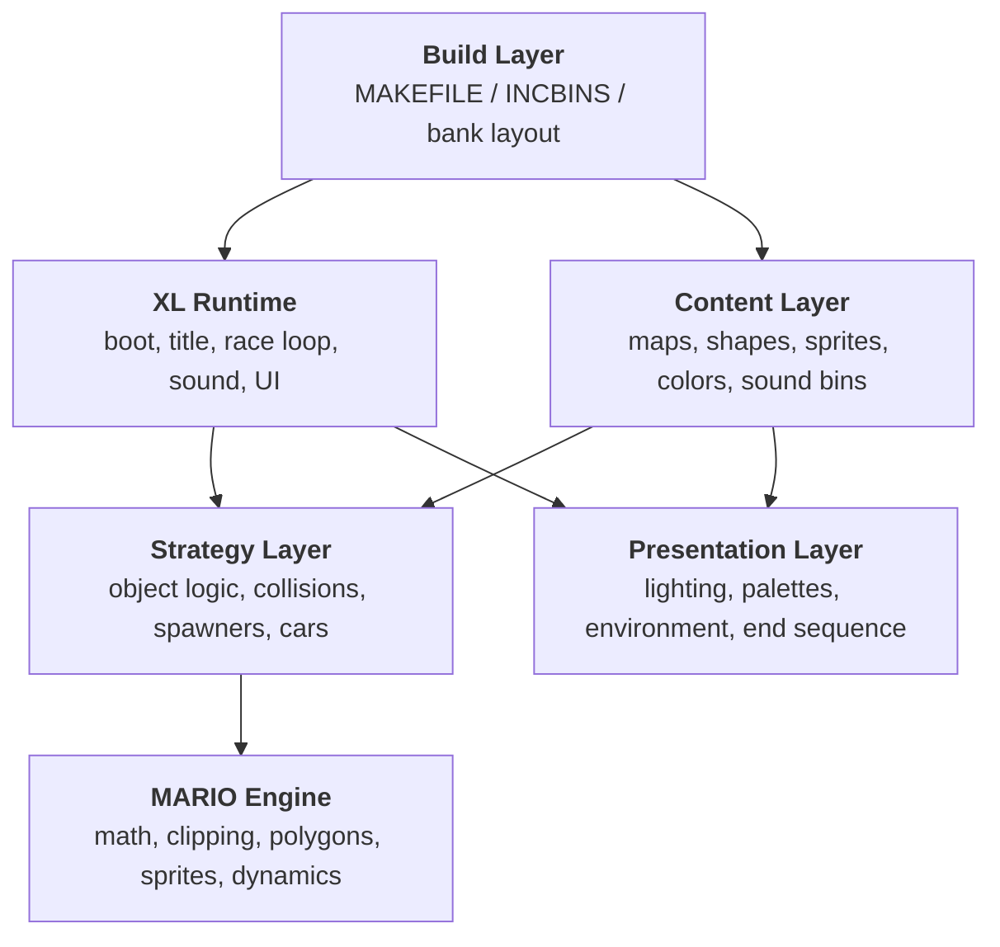
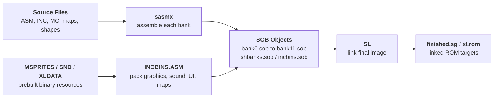
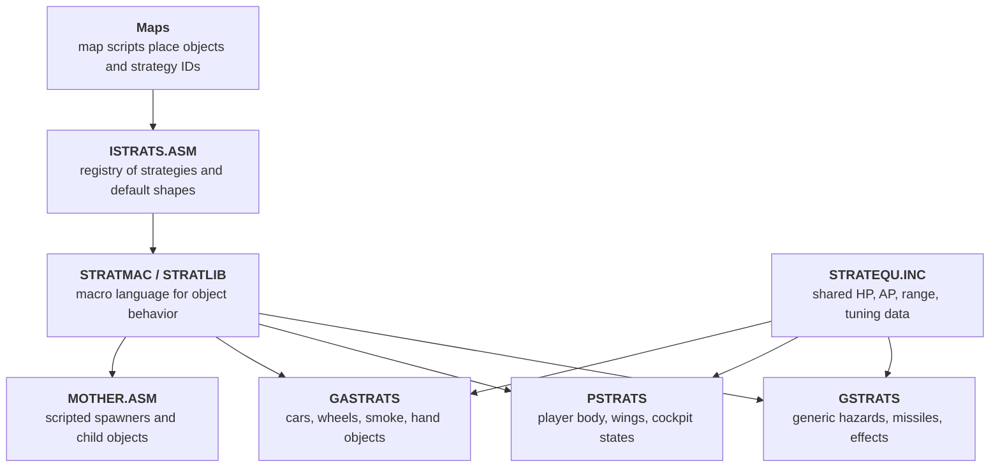
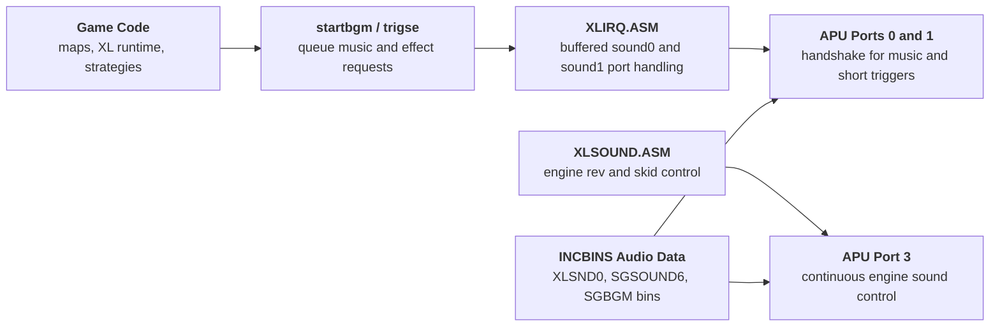

The Nintendo Gigaleak preserves a large Super Famicom source tree under `other/SFC/ソースデータ/ワイルドトラックス`.

This is the Japanese `Wild Trax` project, better known in the west as `Stunt Race FX`.
What makes the archive especially useful is that it does not look like a neat final-source export.
It looks like a real working 1993 [Super FX](#glossary-superfx) tree, with banked assembly, compressed asset bundles, map scripts, sound binaries, and a lot of older Argonaut and Star Fox naming still left in place.



---
## At a Glance
The big takeaways from this folder are:

* it preserves a near-complete banked SNES game tree rather than a token code sample
* the `MAKEFILE` builds `13` main `.sob` objects and links them into `finished.sg` or `xl.rom`
* the current snapshot is configured as a Japanese build, with `janglish equ 1` in `VARS.INC`
* English-region assets are still preserved beside the Japanese ones, including `TI-3-US` and `CP-US`
* Kimura's `XL` startup, title, and game modules are dated February 1993
* many headers and symbols still expose older `StarGlider`, `Star Fox`, and `Argonaut` lineage
* the current source enables both `debuginfo` and `debuginfo2`, so it was not archived as a stripped retail build

Unlike the F-Zero leak, there is no surviving `TITLE.DOC` here.
The timeline has to be inferred from file headers and timestamps spread across the tree.

> What makes this leak special is not just that Nintendo source survived.
> It preserves the whole shape of a working Super FX game: build scripts, runtime code, object strategies, track pieces, test maps, and developer shortcuts all in one place.

---
## Glossary of Key Terms
This page uses several project-specific formats and build terms that are worth defining up front:

* **SOB** - The assembled object output produced by `sasmx` before final linking.
* **CCR / PCR** - Compressed resource files packed into ROM with `inccru`. In this tree they are mainly background, screen, and course-related assets.
* **PCG / PCO / PSC** - Title and UI asset files in the `XLDATA` folder. They appear to represent graphics, color, and screen-layout resources.
* **Super FX** - The Argonaut/Nintendo 3D coprocessor family used by games such as Star Fox and Wild Trax.
* **XL** - The label used by Kimura's 1993 startup and title modules, which form the higher-level race and front-end layer of this build.
* **janglish** - A build flag in `VARS.INC` that switches between Japanese and English-facing asset choices.

---
# Root directory (SFC.7z/ソースデータ/ワイルドトラックス)
This folder is much busier than the F-Zero leak.
It has `183` files at the top level alone, plus several asset-heavy subdirectories.


The top level mixes bank assembly, engine headers, Argonaut strategy files, and the main asset folders used by the final link step.



- Main source files - Banked SNES assembly, include files, strategy headers, and linker inputs
- DATA - Compressed backgrounds, palettes, fonts, face graphics, and shared ROM assets
- MAPS - Map scripts, course lists, and test maps
- MSPRITES - Two large sprite-data archives
- SND - Music and sound-effect binaries
- XLDATA - Title-screen, panel, font, and UI resources for the XL front-end
- XLSND - The XL sound bank used by the front-end layer




The split between those folders already says a lot about the production process.
This was not just "game code plus final graphics".
It was a banked build that still expected to assemble code, then pull in large prebuilt art and sound payloads during the final ROM-pack stage.

Folder | File count | What it preserves
---|---|---
Top level | `183` | Main assembly, includes, bank layout, and build scripts
`DATA` | `44` | Shared compressed graphics, palettes, fonts, and raw data
`DATA/GFX` | `28` | `.COL` and `.PAC` color resources
`MAPS` | `9` | Course lists, map glue, and four explicit test maps
`MSPRITES` | `2` | Packed sprite-data banks
`SND` | `28` | BGM and sound-effect binary payloads
`XLDATA` | `12` | Title/UI graphics, color, screen, and font assets
`XLSND` | `1` | `XLSND0.BIN`

---
## How Complete This Looks
This archive looks much closer to a real working source snapshot than a partial teaser.

The strongest signs in its favour are:

* the root contains the bank sources, shared include files, and the main `MAKEFILE`
* the asset side is still present instead of being stripped down to code only
* `INCBINS.ASM` shows the exact ROM-pack stage that pulls compressed art, map resources, face data, and sound banks into the final image
* the project still preserves map scripts, title assets, and Super FX-facing support code in the same tree

It is still safest to call it a **near-complete working source tree** rather than a guaranteed self-contained rebuild package.

The missing or uncertain pieces are:

* the assembler and linker themselves, `sasmx` and `SL`, are referenced but not bundled here
* there are no surviving final `.sob`, map, or symbol outputs in the folder
* some external SDK macros or tool assumptions may still have lived outside this copied tree

So the practical conclusion is that the leak preserves most of the interesting source-side and asset-side material, but not quite enough to promise a clean rebuild without recreating its original tool environment.

> The safest reading is that this is a near-complete working source snapshot, not a perfectly self-contained rebuild kit.

---
## What the Build System Shows
The `MAKEFILE` is one of the most important files in the archive because it exposes the whole bank layout.

The build flow is:

* assemble each `.asm` file into a [`SOB`](#glossary-sob) object with `sasmx`
* link those objects with `SL`
* produce either `finished.sg`, `xl.rom`, or an `info` link report

Build target | Output | Role
---|---|---
`all` | `finished.sg` | Main linked image target
`xl.rom` | `xl.rom` | Alternate ROM output target
`info` | linker listing | Diagnostic link information

The bank layout is more revealing than the target names.
The project does not build one source file per ROM bank in a tidy sequence.
Several banks are grouped together inside wrapper modules.

Bank target | What it pulls together | What that suggests
---|---|---
`bank0.sob` | boot code, `sgtabs.asm`, `sgdata.asm`, trigonometry data, and the main shape headers | early boot plus foundational engine tables
`bank1.sob` | many `.MC` math and draw modules | a dense low-level rendering/math layer
`bank2.sob` | `xlirq.asm`, `xlmain.asm`, `xltrans.asm`, `game.asm`, `windows.asm`, `light.asm`, `obj.asm`, `world.asm`, `debug.asm`, `draw.asm`, `endseq.asm` | the main race/gameplay bank cluster
`bank5.sob` | `MAPS/TEST1-4.ASM`, `MAPLIST.ASM`, `MAPP.ASM`, and compressed map data | map scripting and course glue
`bank7.sob` | `xlstart.asm`, `xltitle.asm`, `xlinit.asm`, `xlsound.asm`, `xlmes.asm`, plus `XLDATA` assets | title, UI, startup, and front-end layer
`shbanks.sob` | banks `12-17` and `22` worth of shape data and related assets | bulk 3D model/track-piece storage
`incbins.sob` | banks `18-31` worth of compressed assets and sound bins | late-stage ROM packing rather than hand-authored code

Two smaller details make the snapshot even more interesting:

* `symson.mak` leaves `SYMSON` blank, so symbol emission was optional at this point
* `INCBINS.ASM` contains a hard ROM-size guard that aborts the build if more than `8` megabits are used

That last check makes the source feel very real.
This is a shipping-era ROM budget, not a cleaned-up teaching sample.

> `INCBINS.ASM` is the closest thing this archive has to a ROM packing manifest.
> It shows exactly where late-stage graphics, sound, and other binary resources were expected to land in the final cartridge image.

---
## The XL Runtime Layer
The clearest "current game" code in the tree sits in the [`XL`](#glossary-xl) files written by Masato Kimura in early February 1993.

File | Dated header | What it does
---|---|---
`XLSTART.ASM` | `05/02/1993` | hardware startup, RAM clear, APU init, vector setup, code transfer, title handoff
`XLMAIN.ASM` | `04/02/1993` | core game initialization, palette unpack, pause logic, and 3D setup
`XLTITLE.ASM` | `03/02/1993` | title sequence, player-mode setup, fade logic, and hidden debug shortcuts

`XLSTART.ASM` is effectively the front door of the current build.
It disables interrupts, clears RAM, initializes the APU, copies vectors into low memory, and then DMA-transfers the extended code block from ROM bank `2` into WRAM before jumping into the title sequence.

That startup flow is a strong hint that the archive is preserving a live Super FX game rather than only a static code dump.
The front-end is still orchestrating code upload, sound init, and the transition from boot to title to gameplay.

`XLTITLE.ASM` is also clearly a development snapshot.
It keeps `titleselect equ 1`, which causes the code to skip the normal title sequence entirely and jump straight through the debug path.
The same file still has a hidden map-selection shortcut tied to controller input, plus an explicit `playerselect` toggle for one- or two-player setup.

`XLMAIN.ASM` goes further and shows the gameplay side wiring itself together.
It seeds player and object state, uncrunches `ALLCOLS.PAC` into palette memory, initializes the 3D game state, and contains the pause routine and other race-loop support code.

So even without a title sheet, the `XL` modules give a good snapshot of where the active game-specific layer sat in early 1993.

> If you want the "this is the live game branch" evidence, the `XL` files are it.
> They preserve the boot path, title logic, race loop, sound control, and split-screen scheduling as one active gameplay layer.

---
### How the XL Layer Is Split Up
Once you look past the three obvious startup files, the `XL` side is actually a fairly clean subsystem split.

File | Lines | What role it seems to play
---|---|---
`XLIRQ.ASM` | `1498` | display timing, controller scan, bitmap/OAM transfer, and one-player versus two-player IRQ scheduling
`XLTRANS.ASM` | `1845` | per-frame transfer loop, strategy update, bitmap swap, race-state flow, and main gameplay handoff
`XLINIT.ASM` | `1616` | race setup, VRAM/OAM load, palette and background unpack, one-player/two-player init
`XLSOUND.ASM` | `528` | APU boot, engine sound control, skid calls, and race sound dispatch
`XLMES.ASM` | `508` | lap messages, goal-in text, countdown messaging, and timed HUD feedback
`WINDOWS.ASM` | `263` | color-window fades, flashes, blackout states, and other screen effects

That tells us the 1993 snapshot was not just one big "main loop" file.
The runtime had already been split into the same kind of subsystems you would expect in a real shipping-era game: startup, frame transfer, IRQ/display control, sound, messages, and screen effects.

---
### Startup and Race Initialization
`XLSTART.ASM` and `XLINIT.ASM` work together to get the game from boot into a playable race state.

The startup sequence in broad terms is:

* disable interrupts and blank the screen
* clear zero page, work RAM, and extended RAM
* initialize the APU with `XLSND0.BIN`
* copy interrupt vectors into low memory
* DMA-transfer the extended code block from bank `2` into WRAM
* jump into the title flow, then on into race initialization

`XLINIT.ASM` is where the asset side meets the live runtime.
It calls `InitVRAM_l`, opens the hand-sprite data, transfers object graphics, chooses the correct background character and screen data based on `map_number`, decompresses the selected color set, and then configures OAM differently for one-player and two-player modes.

That file is especially useful because it shows how many of the packed assets from `BANK7.ASM` and `INCBINS.ASM` were actually consumed:

* `hand` is decompressed and copied into sprite memory
* race object graphics are loaded into VRAM
* map-specific background character and screen data are selected by index
* color data is decompressed separately from the graphics
* one-player and two-player layouts then diverge from that shared setup

So the initialization layer confirms that the split seen elsewhere in the archive is real.
The code was working with precompressed graphics, color sets, and panel resources as separate payloads, not as one merged blob.

---
### The IRQ Display Schedule
`XLIRQ.ASM` is one of the most revealing files in the whole project because it shows how the game divided its display work across timed interrupt phases.

The file keeps an `IRQ_table` with eight states:

* `title_01`
* `title_02`
* `game1p_01`
* `game1p_02`
* `game2p_01`
* `game2p_02`
* `game2p_03`
* `game2p_04`

That is a very strong clue that the game was running different display schedules for title, one-player gameplay, and split-screen gameplay rather than just using one generic VBlank routine.

The broad pattern looks like this:

Mode | First phase | Second phase | Extra phases
---|---|---|---
Title | restore brightness, set next timer, count frames | blank the screen, enable HDMA, scan controller, transfer sprites, run APU | none
One-player race | restore brightness and schedule next interrupt | blank, enable HDMA, set scroll, transfer bitmap, run sound, scan controller | none
Two-player race | brightness and first timer | lower-screen setup and scroll | upper-screen timing and second bitmap/scroll pass

The two-player path is the standout detail here.
Instead of one render/update pass, `game2p_01` through `game2p_04` step through lower-screen setup, then upper-screen setup, with separate scroll adjustments via `set_scroll2lower` and `set_scroll2upper`.

That makes the split-screen implementation feel much more concrete.
The source is not just toggling a two-player mode flag in game logic.
It is actively running a more complex interrupt schedule to move the display window, change name-table settings, and present the upper and lower race views cleanly.

---
### Frame Transfer and Race Control
`XLTRANS.ASM` is where the live frame seems to come together.

Its `transfer_l` routine does a lot of the work you would expect from a "one game tick" function:

* mark the screen-transfer state active
* run strategy updates
* execute the `mdo_dynamics` Mario-side routine block
* update input history
* recalculate palette fades
* clear per-frame object visibility state
* recalculate the view and background scroll
* run the 3D display path
* swap between two bitmap buffers
* update frame-rate counters
* run engine sound, message control, and overall game control

That is a very useful confirmation that the project was double-buffering its bitmap output.
`swapbitmap` flips between `bitmap1` and `bitmap2`, updates the render base, and changes the active screen base accordingly.

The race state machine also sits here.
`racetable` switches between:

* `initdemo`
* `demo`
* `countdown`
* `racing`
* `clearrace`
* `gameoverrace`
* `timeup`

So the gameplay layer was already structured as a compact dispatch table rather than a single procedural blob.
That matches the rest of the tree well: even the live race loop is banked, state-driven, and fairly modular.

---
### Sound, Messages, and Screen Effects
The supporting `XL` files fill in the rest of the runtime picture.

`XLSOUND.ASM` shows the sound layer is not just "play sound effect X".
It boots the APU from `XLSND0.BIN`, drives engine pitch directly from car state, and has separate calls for skid, engine mode, and starting-grid behavior.

`XLMES.ASM` does the same for UI feedback.
It contains the lap and goal-in messaging flow, minute countdown handling, zoom tables for message animation, and the sound triggers that go with those states.
That makes the front-end feel much less passive than a static HUD overlay.

`WINDOWS.ASM` rounds the system out with the color-window and fade effects.
It manages black fades, white fades, red damage flashes, turquoise hit flashes, and other full-screen presentation effects through the SNES color-window hardware rather than drawing them into the gameplay bitmap itself.

Taken together, those three files are a good reminder that this leak is preserving more than the 3D track renderer.
It preserves a whole late-stage game runtime with sound control, lap messaging, and screen-effect plumbing all still visible as separate systems.

---
## The Engine Basement
Below the `XL` gameplay layer, the source still preserves a much older and lower-level engine stack.
This is where the archive starts to look less like "one game's code" and more like a reusable Argonaut/Nintendo Super FX software platform.

---
### BANK0 as Boot and Data Glue
`BANK0.ASM` is surprisingly compact, but it does several foundational jobs at once.

It pulls together:

* the startup jump into `ProgramEntry`
* the SNES reset and interrupt vectors
* `SGTABS.ASM` and `SGDATA.ASM`
* `DATA/ARCTAN.ASM`
* `ISTRATS.ASM`
* the header pass over every `*SHAPES.ASM` file
* one early compressed payload, `AND.PCR`

That means bank `0` is not "gameplay" in the usual sense.
It is the glue bank that establishes the boot path, loads shared math/table data, and builds the global shape-header catalog the rest of the engine uses.

The shape-header pass is especially important.
With `Do_HDR = 1`, the file runs through `SHAPES.ASM`, `ASHAPES.ASM`, `AFSHAPES.ASM`, `AWSHAPES.ASM`, and the other shape files just to emit the header/index layer before switching `Do_HDR` back off.

So the modular track-piece system described later on is not merely a content naming convention.
It is wired directly into the engine startup and lookup path.

The other odd but useful detail is still the ROM header string at the end of the bank.
Even at this low level, the internal header still says `STAR FOX`, which reinforces how much older engine identity survived into the Wild Trax snapshot.

---
### BANK1 as the MARIO Code Bank
`BANK1.ASM` is only `73` lines long, but it is one of the most revealing files in the project.

It enables `mario on` and then pulls in a whole stack of `.MC` modules:

Module | What it appears to cover
---|---
`MVARS.MC`, `MMACS.MC`, `MSHTAB.MC` | core variables, macros, and shared tables
`MMATHS.MC` | fixed-point math helpers such as square root, divide, arctangent, and vector normalization
`MWROT.MC`, `MWCROT.MC` | rotation/matrix work
`MOBJ.MC`, `MCLIP.MC` | object and clipping support
`MDRAWC.MC`, `MDRAWP.MC`, `MDRAWLIS.MC` | polygon scan conversion, polygon drawing, and draw-list work
`MSPRITE.MC`, `MDSPRITE.MC` | sprite projection and sprite drawing
`MPART.MC` | particles
`MDYNAMIC.MC` | car and wheel dynamics, plus meter and HUD-side drawing hooks
`MAI.MC` | higher-level driver glue for the MARIO block

That is probably the clearest high-level summary of the 3D engine in the whole archive.
`XL` is the game/runtime layer, but `BANK1` is where the reusable rendering, clipping, sprite, and physics machinery actually lives.

The `mario` label is easy to misread if taken out of context.
In this tree it does not mean "Super Mario content".
It looks much more like the name of the low-level coprocessor-side engine code family that Wild Trax is linking against.

---
### Shared Tables and Lookup Data
The small `SGTABS.ASM` and large `SGDATA.ASM` files are the data side of that engine basement.

`SGTABS.ASM` is minimal but important.
It imports `ETABS.DAT` and then exposes a set of lookup-table pointers:

* `alogtab8ul`
* `alogtab8uh`
* `logtab8u`
* `logtab8s`
* `alogtab8s`
* `alogtab8sl`
* `nalogtab8s`
* `nalogtab8sl`
* `muldivtab`

That is a strong hint that the engine relied heavily on table-driven math rather than doing everything through slower general-purpose arithmetic at runtime.

`SGDATA.ASM` is much larger at `2167` lines.
Even the first part of the file already shows several kinds of low-level support data:

* `bg2ptrs` and `bg2tab1` through `bg2tab6` for scroll/depth/background stepping
* bit-mask tables such as `st_lineM` and `ed_lineM`
* packed pixel/offset tables such as `pbittab`, `pbittabn`, `pxoftab`, and `pyoftab`
* color and packed-pixel helper tables such as `colourtab0` through `colourtab23`

So the engine basement is not just code plus shapes.
It also preserves the precomputed lookup infrastructure that made the renderer practical on the original hardware.

---
### Fixed-Point Math and Polygon Drawing
`MMATHS.MC`, `MDRAWC.MC`, and `MDRAWP.MC` give a very clear picture of the rendering stack.

`MMATHS.MC` is explicitly described as a `Maths library` by Peter Warnes for the `MARIO` codebase.
Its documented routines include:

* `msqrt16`
* `msqrt32`
* `mdivs3216`
* `mdivu3216`
* `mdivu3115`
* `marctan16`
* `mnormalise16`

That is exactly the sort of support layer you would expect underneath a real-time 3D game using fixed-point vectors and rotation math.

`MDRAWC.MC` and `MDRAWP.MC` then pick up from there.
They are not vague "draw" files.
Their comments and labels show a fairly standard software-rendering pipeline:

* polygon scan conversion
* texture-mapped polygon drawing
* line drawing
* 2D polygon clipping
* clipped polygon buffer handling
* trapezoid and horizontal-line drawing loops

The file names actually map well onto the split:

* `MDRAWC.MC` focuses on scan conversion and clipping
* `MDRAWP.MC` focuses on polygon draw loops and textured polygon paths

So the engine stack preserved here is not a black box around the Super FX.
It is still exposing the low-level software side of how polygons were clipped, stepped, and written out.

---
### Sprite Projection and Scaling
`MSPRITE.MC` is just as revealing for the sprite side.

Its own comments describe it as the sprite module for the `MARIO` code, and the exported routines are not simple OAM helpers.
They are scaled and rotated sprite renderers.

The file documents and implements:

* scaled rotated sprite drawing via `mshowspr`
* sprite clipping and trivial reject paths
* scaling/rotation matrix calculation
* multiple draw loops for `16x16` and `256`-sized sprite data
* alternative `m7*` sprite paths that appear to be tied to another rendering mode

That matters because Wild Trax is often remembered mainly for its chunky polygon tracks and vehicles.
This file shows the rendering stack was broader than that.
It also had a fairly capable projected-sprite layer with scaling, rotation, and per-size draw paths sitting beside the polygon renderer.

---
### Car Dynamics and the XLR8 Layer
`MDYNAMIC.MC` is one of the richest files in the whole archive.
At `5638` lines, it is effectively its own subsystem.

The top comment calls it `CAR DYNAMICS FOR XLR8` and credits Giles Goddard.
That already makes it stand out from the more general-purpose render and math files.

The file includes several different layers of work:

Layer | Evidence in the file
---|---
Memory management | `minit_mem`, `malloc_mem`, `mfree_mem`, `munfrag_mem`
Main dynamics entry | `mdo_dynamics`
Generic object dynamics | `mdo_OBJ`
Car-specific dynamics | `mdo_CAR`
Wheel-specific dynamics | `mdo_wheels`, `mwheel_dynamic`
Matrix generation | comments for engine-power and full car rotation matrices
HUD/debug drawing | `mdrawspeed`, `mdrawmeters`, `mdrawdamage`, `mdrawwhldam`

That combination makes `MDYNAMIC.MC` more than a physics file.
It is a bridge between the simulation layer and the presentation layer.
It handles car and wheel behavior, but it also contains the routines that draw speed, meters, and damage indicators back onto the screen.

This is also one of the best examples of how deep the leak goes.
It is not stopping at menu code or stage scripts.
It preserves the actual low-level car and wheel update logic, matrix generation, force rotation, and the HUD-side readout code that turns those states into something visible.

Taken together, `BANK0`, `BANK1`, the `SG*` data files, and the `.MC` modules show that the Wild Trax leak is preserving three layers at once:

* a game/runtime layer in the `XL` files
* a map-and-shape content layer in the `MAPS` and `*SHAPES` files
* a lower-level Argonaut/Nintendo rendering and dynamics layer in the `MARIO` code bank

That layered view is probably the most useful way to understand the whole archive.

> The easiest way to read the source tree is as three stacked layers:
> `XL` for the game/runtime, the map-and-shape files for content, and the `MARIO` bank for the lower-level render and dynamics engine.

---
## The Strategy System
One of the biggest remaining questions in the archive is how all of those maps, shapes, hazards, cars, and scripted events were actually tied together at runtime.
The answer is that Wild Trax still uses a very explicit Argonaut-style strategy framework.

This is not just one helper file.
It is a full behavior layer made up of:

* a registry of strategy IDs and default shapes
* a huge macro language for object logic
* shared gameplay constants for damage, health, firing, and range
* several large behavior banks for generic objects, player logic, and Wild Trax-specific vehicle systems

That makes the source much more interesting than a simple "spawn object type `X`" setup.
The game appears to have been authored as data plus behavior scripts.

---
### What a Strategy Is in This Engine
`ISTRATS.ASM` is only `152` lines long, but it is one of the most important glue files in the project.
Its own header says it contains the `Definitions for istrats referenced in the maps`.

The two key macros are:

Macro | What it registers | Why it matters
---|---|---
`def_istrat` | strategy ID, code pointer, and optional default shape | lets map scripts name behavior slots instead of hardcoding routine addresses
`def_shape` | shape ID and shape pointer | keeps the map-facing shape lookup separate from raw geometry files

That explains why `BANK0.ASM` pulls `ISTRATS.ASM` into the foundational boot/data bank.
The engine needs this registry early because the map layer is clearly written in terms of strategy IDs, not direct subroutine calls.

`ISTRATS.ASM` also tracks `number_of_map_istrats` and `number_of_map_shapes`, which makes it feel less like a random include and more like a formal authoring interface.
In other words, this is the contract between the map scripts and the live object system.

---
### The Macro Language Behind the Behaviors
The real heart of the framework sits in `STRATMAC.INC` and `STRATLIB.INC`.

`STRATMAC.INC` is enormous at `8348` lines.
It is not one or two convenience helpers.
It is effectively a domain-specific language for object behavior.

Even the commented index at the top gives away how broad it is.
The macros are grouped into families for:

Macro family | Examples from the file | What they control
---|---|---
Object creation and lifetime | `s_make_obj`, `s_remove_obj`, `s_kill_obj`, `s_set_strat`, `s_set_collstrat`, `s_set_expstrat` | creating objects and wiring their main, collision, and explosion logic
Movement and chase logic | `s_goto_obj`, `s_goto_WP`, `s_circle_obj`, `s_face_player` | steering, following targets, and scripted movement
Collision and combat | `s_docoll`, `s_docollAP`, `s_obj2collide`, `s_fire_weapon` | health loss, weapon spawning, and impact handling
State and variables | `s_set_alvar`, `s_add_alvar`, `s_copy_alvar2var`, `s_cmp_alvars`, `s_set_var` | per-object state, counters, timers, and state-machine values
Presentation and debris | `s_damagesmoke`, `s_damagefire`, `s_make_smoke`, `s_make_splash`, `s_particle_data` | visible effects and damage feedback

`STRATLIB.INC` adds another `1161` lines of higher-level helpers on top of that lower-level macro layer.
This is where the strategy system starts to look like a full authoring toolkit rather than raw assembly shorthand.

The standout additions include:

* `s_implode`, which rewires an object into the shared implode behavior
* `s_bemother`, which hands an object over to the `MOTHER.ASM` scripted spawner system
* `s_set_path`, which ties an object to one of the path definitions exported elsewhere in the tree
* `s_text_obj` and `s_sprite_obj`, which suggest message and sprite-driven objects could be authored through the same framework
* several child-object helpers such as `s_make_childobjrotpos`, `s_rotpos_allchildren`, and `s_jmp_childrendead`
* boss-health helpers like `s_set_bossmaxHP` and `s_add_bossHP`

So the strategy layer is not just about enemies.
It is wide enough to drive attachments, boss HUD values, text objects, child-object hierarchies, and reusable spawner behavior.

---
### Shared Object Stats and Tuning Data
`STRATEQU.INC` is the data side of that same framework.
At `1007` lines, it acts like the common stat sheet for everything the strategy files manipulate.

The file groups values into broad families such as:

* static neutral objects
* weapons
* moving enemies
* boss enemies

Within those groups it defines values like:

* `tunnelHP`, `hardAP`, and `rockhardAP`
* `missile1AP`, `hmissile1HP`, `elaserAP`, and `playerbeamAP`
* `fighterHP`, `walkerHP`, `tank2HP`, `meteorAP`, and `beamboxHP`
* distance and firing values such as `MOTHERDIST`, `TURRETDIST`, `flyFC`, and `saucer1DIST`

That is one of the clearest hints that the strategy system was inherited from a broader object-action engine rather than invented just for racing obstacles.
The same shared constant layer can describe walls, tunnels, missiles, walkers, turrets, bosses, and helper objects.

For Wild Trax specifically, that matters because it shows how much older Argonaut object logic was still present under the surface.
Even if not every enemy-like constant was used by the final racer, the behavior framework itself was still designed to support a much wider range of object types.

---
### The Three Main Strategy Banks
Once the registry and macro language are in place, the actual behavior code fans out into three large source files.

File | Lines | What it mostly covers
---|---|---
`GSTRATS.ASM` | `3200` | generic object logic, hazards, missiles, collision handlers, and shared effect behaviors
`PSTRATS.ASM` | `3243` | player-specific logic, body and wing objects, cockpit transitions, and player collision states
`GASTRATS.ASM` | `3806` | Wild Trax-specific car, wheel, smoke, truck, hand, and game-over object behaviors

That split is useful because it means Wild Trax was not trying to cram all object logic into one monolith.
The archive still preserves a generic engine-level behavior bank, a player bank, and a game-specific vehicle bank.

---
### GSTRATS as the Generic Behavior Library
`GSTRATS.ASM` is labeled `GILES' STRATEGY ROUTINES`, and it really does read like the general-purpose behavior library for the whole engine.

It contains setup and support code such as `initgame_strats_l` and `init_strats_l`, then fans out into a large collection of reusable strategies:

* hard-surface and collision handlers such as `hard_Istrat`, `rockhard_Istrat`, `collide_Istrat`, and `misscol_Istrat`
* relative-position and movement helpers such as `stayrel_Istrat`, `staydist_Istrat`, and `boost_Istrat`
* effect behaviors such as `hitflash_Istrat`, `splash_Istrat`, `sparky_Istrat`, `fire_Istrat`, and `smokeP_Istrat`
* a whole projectile family including `laser_Istrat`, `elaser_Istrat`, `Pbeam_Istrat`, `Pelaser_Istrat`, `nuke_Istrat`, and several missile variants
* homing and relative-speed behaviors such as `hmissile1_Istrat`, `hmissile2_Istrat`, `hmissile3_Istrat`, `homingflat_Istrat`, and `Yhoming_Istrat`

This is one of the strongest signs that the strategy system sits between the low-level engine and the game-specific code.
It gives the rest of the project a ready-made catalog of "what this object does" behaviors without having to rewrite chasing, homing, hit flashes, smoke, or weapon logic every time.

---
### PSTRATS as the Player Object Layer
`PSTRATS.ASM` is explicitly the `PLAYER'S STRATEGIES` file, but even that title undersells how much structure is preserved here.

The player does not appear to be one simple object.
The file splits the player into linked behavior pieces such as:

* `pBody_Istrat`
* `pLWing_Istrat`
* `pRWing_Istrat`
* several player-environment modes like `playerInSpace_Istrat`, `playerOnPlanet_Istrat`, `playerOnWater_Istrat`, and `playerInNucleus_Istrat`
* cockpit transition logic such as `playerintocock_Istrat`, `cockpit_Istrat`, `playeroutofcock_Istrat`, and `cockpitout_Istrat`

`pBody_Istrat` is a good worked example.
Its init path sets collision and explosion behaviors, assigns player body HP and AP values, disables rear removal, and records the body object pointer in a shared variable.
Its collision side then triggers screen flashes, hitflash timers, and separate body-collision state flags.

That is much richer than a simple "car hit wall" function.
It shows the player object was part of the same general strategy framework as everything else, with dedicated collision strategies, side flags, and linked sub-objects.

The wing strategies reinforce that point.
`pLWing_Istrat` and `pRWing_Istrat` are not cosmetic leftovers.
They are real behavior blocks with their own collision flow and their own transitions into later player-state handlers.

---
### GASTRATS as the Wild Trax-Specific Layer
If `GSTRATS.ASM` is the inherited generic library and `PSTRATS.ASM` is the player layer, `GASTRATS.ASM` is where Wild Trax's specific vehicle game really comes into focus.

The file announces itself with `XLR 8`, and the top-level defines already shift the tone from older shooter logic toward racing logic:

* `numlives = 3`
* `maxdamage = 128`
* `smokedamage = 115`
* `poly_wheels = 0`

The best example is `explode_car_l`.
Instead of just removing the player car, it decrements lives, switches engine sound state, then spawns a sequence of body fragments and four separate wheel pieces.
It even changes the explosion sound depending on whether the current crash is the last remaining life.

That one routine shows how the generic strategy system was bent toward Wild Trax-specific spectacle.
The same object-creation macros now drive car chunks, wheel debris, smoke, and post-crash cleanup rather than only enemies and missiles.

`car1_Istrat` and its follow-up logic push that even further.
The file handles:

* player car setup and state flags
* wheel creation through `makewheels_l`
* shadow and helper-object spawning
* car damage thresholds and smoke behavior
* wheel-position updates and wheel animation
* support objects like trucks, hand/grab interactions, sparks, and game-over props

So `GASTRATS.ASM` is not just "the car file".
It is the point where the older Argonaut object framework is clearly being used to build a full racing-game object ecology.

---
### The Mother System and Scripted Spawners
`MOTHER.ASM` is smaller at `446` lines, but it explains an important piece of the larger authoring story.

Its header says it contains `The routines to deal with the mother objects`.
What that means in practice is a tiny script interpreter for object spawning.

The file implements command handlers for:

* `motherobj`
* `motherloop`
* `motherend`
* `motherrnd`
* `mothergoto`
* `motherwait`
* `mothercount`
* `motherjump`

Those commands let one live object point at a command list, then create children, wait, loop, branch, count shapes in the world, and jump conditionally.
That is far more flexible than hand-placing every moving object in code.

The connection back to the macro layer is direct.
`STRATLIB.INC` exposes `s_bemother`, so any strategy can effectively turn an object into one of these scripted controllers.

That makes the whole system feel very modern in spirit.
Maps and strategies define behavior at a fairly high level, and then the mother-object framework handles repeated or conditional spawning patterns on top.

---
### What This Reveals About Authoring
Taken together, the strategy files make the Wild Trax source tree look much less like "some assembly plus a few map files" and much more like a real content-authoring environment.

The clearest pattern is:

* maps point at strategy IDs through `ISTRATS.ASM`
* strategies are written in a large object-behavior macro language
* common health, damage, and range values live in shared equate files
* generic effects and projectiles live beside player and game-specific logic
* higher-level spawner objects can run their own little command lists

That layered design is also why the older Star Fox and Argonaut lineage stayed so visible.
Wild Trax did not replace the older framework with a clean racing-only engine.
It adapted an existing object/strategy system so it could handle cars, wheels, smoke, hands, split-screen state, and track hazards inside the same long-lived Super FX codebase.

> This is one of the headline details in the whole leak.
> Wild Trax was not authored as hardcoded object types over a track.
> It was built on top of a reusable Argonaut strategy framework that could spawn, steer, collide, branch, and script objects at a much higher level.

---
## The Presentation and Environment Layer
By this point the archive already shows how Wild Trax was built, simulated, and scripted.
The next useful question is how all of that was actually turned into something readable on screen.

Several files fill that gap:

File | Lines | What it appears to do
---|---|---
`COLTABS.ASM` | `2104` | shared colour-table library for textures, lamps, animated colour sets, and sprite palette bindings
`LIGHT.ASM` | `237` | precomputed shade ramps for multiple lighting modes and bit depths
`DEFSPR.ASM` | `492` | sprite/texture address catalog for the packed `MSPRITES` banks
`WORLD.ASM` | `2144` | map command interpreter and environment toggles for scroll, snow, pollen, tunnels, and other course-side effects
`ENDSEQ.ASM` | `1636` | ending/demo sequence player that reuses the live renderer and strategy system
`DRAW.ASM` | `475` | mostly debug and low-level plot/text helpers rather than a main gameplay renderer

Taken together, these files show that the game's "look" was not buried inside one opaque graphics blob.
It was split across explicit tables for colours and shading, explicit sprite-address catalogs, and explicit map-time switches for environmental effects.

---
### COLTABS as the Colour Lookup Library
`COLTABS.ASM` is much larger than its name first suggests.
At over `2100` lines, it is not just a tiny palette list.
It is the game's central colour-lookup library.

The file mixes several different kinds of data:

Colour block | Examples | What it seems to handle
---|---|---
Named base tables | `HYPER_C`, `WHITE_C`, `BLACK_C`, `RED_C`, `DEFAULT_C` | reusable colour sets and defaults
Animated colour groups | `DEFAULT_A1`, `AN_RAD_LAMP`, `AN_YELLOW_LAMP`, `AN_BLUE_LAMP` | cycling or pulsing lights and animated palette effects
Texture-linked colour entries | `COLTEXT SPARK1_SPR`, `STARWARS1_SPR`, `ricecrispies1_SPR` | linking texture/sprite definitions to colour behaviour
Large indexed banks | `ID_0_FC`, `ID_0_C` and many later blocks | per-object or per-scene colour lookup tables

The macro names tell the story well:

* `COLLITE` looks like a lit colour mapping
* `COLNORM` looks like a normal, non-highlighted mapping
* `COLANIM` points at an animated colour sequence
* `COLTEXT` ties a colour entry back to a named sprite/texture definition

That makes `COLTABS.ASM` feel less like a classic SNES palette file and more like a bridge between the renderer, the sprite catalog, and the scene logic.
The source is not only storing "which colours exist".
It is storing how those colours behave under light, animation, and texture assignment.

The lamp blocks are especially useful evidence.
Entries like `AN_RAD_LAMP`, `AN_YELLOW_LAMP`, and `AN_BLUE_LAMP` suggest the game had named, reusable animated light styles instead of one-off hardcoded blinking sequences.

---
### LIGHT as the Shading Ramp File
`LIGHT.ASM` is only `237` lines, but it is one of the clearest renderer-support files in the archive.

Almost the entire file is made of `shades*_*` tables such as:

* `shades0_0` through `shades0_14`
* `shades1_0` through `shades1_14`
* `shades2_0` through `shades2_14`
* `shades3_0` through `shades3_14`

Each row contains ten byte values, and the file preserves several alternate blocks:

* the main active tables
* an older `256`-colour data block
* an older `16`-colour data block

That is a strong hint that the renderer was using precomputed shade ramps rather than deriving all lighting steps on the fly.
In practical terms, this looks like the lookup material that let the game map one base colour family to several brightness levels cheaply during rendering.

The preservation detail here is especially nice because it shows iteration.
The final snapshot still carries the older shade-table experiments beside the active ones, so the file does not just show the end result.
It also shows earlier lighting/table layouts that were kept in the source.

---
### DEFSPR as the Texture Address Catalog
`DEFSPR.ASM` is one of the most mechanically revealing files in the whole presentation side.

Its macros such as `defspr`, `defspr16`, `defspr64`, `defspr_hi`, and `defsprabs_hi` calculate addresses into the packed sprite banks rather than storing free-form metadata.
This is effectively the address book for everything inside the `MSPRITES` archives.

The file does three important jobs:

Role | Evidence | Why it matters
---|---|---
Sprite address generation | `defspr*` macros compute offsets from `msprites1`, `msprites2`, and `msprites3` | packed sprite archives were being treated as structured atlases, not loose files
Named texture catalog | entries like `wheel0` through `wheel1b`, `smoke1-6`, `hand1-3`, `treetop`, `superfx`, `grill1`, `eye1-12` | the runtime could refer to named visual parts rather than raw offsets
Palette binding | `texturepaltab` assigns values like `$20`, `$70`, `$a0`, `$b0`, `$d0`, `$e0` per texture | sprite shapes and palette choice were kept as separate data

The named entries are a good cross-check against the rest of the game:

* wheel frames match the heavy wheel logic in `GASTRATS.ASM`
* smoke, brown puff, and white puff match the damage/explosion behaviors
* `hand1`, `hand2`, and `hand3` match the grabbing/hand support objects
* `treestump`, `treetop`, `bush1`, and `bumpy` tie the file back to course-side scenery
* `superfx` and the numbered `eye*` entries show the same mix of branding and presentation assets seen elsewhere in the tree

So `DEFSPR.ASM` is not just a convenience include.
It is the formal contract between the packed sprite data and the runtime systems that wanted to use those sprites.

---
### WORLD as the Environment Script Layer
`WORLD.ASM` is easy to overlook because it does not have the obvious glamour of the render or strategy files, but it is one of the clearest links between maps and on-screen atmosphere.

The file preserves both the low-level map command interpreter and several environment toggles driven by `levelinfo` and map opcodes.
Useful examples include:

* `inatunnel` feeding `tunnelscroll`
* `if_snow` and `if_pollen` switching planet-star style particle fields
* `setvofson` and `setvofsoff` toggling vertical offset mode and changing `bgmode`
* `sethofson` and `sethofsoff` controlling horizontal offset effects
* `setothmusdo` changing the alternate music value from map script data
* `setnodotsdo` clearing the background dot/star field

That means the course scripts were not only placing objects and track pieces.
They were also controlling background scroll modes, tunnel presentation, weather-like particle behavior, and even music changes.

This is one of the more interesting architectural details in the whole archive because it shows that "environment" was authored in the same banked scripting world as everything else.
The map layer was directly telling the renderer and background hardware how to behave as the race progressed.

---
### ENDSEQ as a Reused 3D Demo Player
`ENDSEQ.ASM` is also more interesting than its name suggests.
Rather than being a simple credit scroller, it looks like a boss-demo and ending-sequence driver built on top of the same live rendering stack.

The setup code:

* builds ordered `boss_seq` tables for several level groups
* initializes BG scroll positions and VRAM resources
* starts background music
* clears input and state flags
* marks the end of the boss-demo list with `-1`

The runtime path is the really revealing part.
Its `endtrans` flow still calls:

* `dostratlist`
* `getview_l`
* `showview_l`
* `build_drawlist_l`
* `generate_collist_l`

So even the ending/demo logic is not a separate one-off presentation engine.
It is driving the normal strategy update and 3D draw pipeline in a controlled sequence.

That matters because it confirms the renderer and strategy system were broad enough to support race gameplay, object demos, and end-sequence presentation without switching to a wholly separate mode.

---
### DRAW as a Smaller Debug-Side Helper
`DRAW.ASM` is the least central file in this group.
Much of its low-level plotting code is wrapped in disabled conditionals, and the live parts lean heavily toward helper routines like `printt`, `printb`, and signed/unsigned byte/word print helpers.

So while it is still useful as evidence for debugging and on-screen diagnostic text, it does not look like the main gameplay renderer.
That role belongs much more clearly to the `MARIO` `.MC` modules, the colour/shade tables, and the map-driven environment controls described above.

> The important visual takeaway is that colours, lighting, sprite atlases, and environment effects were all data-driven.
> The source does not hide the look of the game inside one magic renderer file.

---
## The Sound System
The audio side of the archive is smaller than the map or strategy code, but it is still surprisingly legible.
The leaked files preserve both the packed sound data and a fair amount of the runtime control logic that drove the SNES APU ports.

The high-level split looks like this:

Sound piece | What survives | What it seems to do
---|---|---
Front-end XL sound driver | `XLSOUND.ASM` plus `XLSND/XLSND0.BIN` | startup, engine-rev control, skid calls, and the race/front-end sound layer
Shared effect bank | repeated `sound0` through `sounda` imports from `SND/SGSOUND6.BIN` | reusable sound-effect trigger data
Music banks | `SND/SGBGM1.BIN` through `SND/SGBGMP.BIN` | many small BGM command/data payloads imported individually into ROM
Shared control definitions | `SOUNDEQU.INC`, `SOUND.EXT`, `MACROS.INC`, `XLIRQ.ASM` | symbolic BGM IDs, trigger macros, and the port-handshake logic

One small archival wrinkle is that `MAKEFILE` still references `sound.asm`, but that source file itself does not appear to be present in this leak.
Even so, the surviving includes, macros, driver-facing symbols, and binary payloads are enough to reconstruct the sound architecture fairly well.

---
### What the Sound Folders Actually Contain
The raw file split is already informative.

Folder | Files | What stands out
---|---|---
`SND` | `28` files | `27` `SGBGM*` music binaries plus one shared `SGSOUND6.BIN`
`XLSND` | `1` file | `XLSND0.BIN`, a much larger `57740`-byte sound blob dated `1 June 1993`

The file sizes make the distinction clearer:

* `XLSND0.BIN` is by far the largest audio payload in the tree at `57740` bytes
* `SGSOUND6.BIN` is much smaller at `3868` bytes
* most `SGBGM*` files are tiny by comparison, ranging from a few hundred bytes up to a few kilobytes
* the largest of the music bins is `SGBGMP.BIN` at `5681` bytes

That strongly suggests the XL front-end was carrying a substantial resident driver or sample/control blob, while the per-track BGM files were lightweight song-specific payloads loaded or triggered through that system.

---
### How INCBINS Packs the Audio Data
`INCBINS.ASM` gives the clearest map of how those binaries were laid into the final ROM.

The important block is:

* `incsnd xlsnd0,xlsnd\xlsnd0.bin`
* `incsnd sound0` through `incsnd sounda`, all pointing to `snd\sgsound6.bin`
* `incsnd bgma`, `bgmb`, `bgmc`, `bgmo`, `bgme`, `bgmf`, `bgmg`, `bgmh`, `bgmi`, `bgmk`, `bgmp`
* `incsnd bgm1`, `bgm4`, `bgm5`, `bgm6`, `bgm8`, `bgm9`, `bgm10`

That matters for two reasons.

First, the `incsnd` macro in `MACROS.INC` is not just a raw `incbin`.
It tracks a moving `musicsize`, computes `sndbank` and `sndoffset`, emits the data into the correct ROM position, and records the file in the build log.

Second, `SGSOUND6.BIN` is imported over and over under different symbolic names.
That makes it look less like one unique one-shot effect file and more like a shared effect/control payload that could be addressed through several runtime channels or trigger tables.

So the archive is not preserving a loose pile of music files.
It is preserving a deliberate banked sound pack stage with named imports and stable symbolic entry points.

---
### Music IDs and Symbolic Track Names
`SOUNDEQU.INC` provides the main symbolic BGM constants that the rest of the code uses.

The surviving names include:

* `bgm_map`
* `bgm_planet`
* `bgm_space`
* `bgm_boss`
* `bgm_fanfare`
* `bgm_mapselect`
* `bgm_mapselectshort`
* `bgm_allclear`
* `bgm_fadeout`
* `bgm_transmit`

That is a very nice clue because it shows the music system was addressed by gameplay role, not by raw file number.
The code could ask for "boss music" or "map select music", and the macro layer handled the port-side handoff.

`SOUND.EXT` goes even further and exposes many named entry points:

* `do_bgm_map`
* `do_bgm_intro`
* `do_bgm_endseq`
* `do_bgm_title`
* `do_bgm_training`
* route-specific calls like `do_bgm_10`, `do_bgm_20`, `do_bgm_30`, `do_bgm_11`, `do_bgm_21`, and so on

So the codebase preserves both abstract role names and more specific course/sequence entry points.
That fits the rest of the tree well: Wild Trax keeps a high-level symbolic authoring layer on top of very banked low-level data.

---
### How Music Was Actually Started
The control path in `MACROS.INC` is especially revealing.

Two macros are the core of it:

Macro | What it does | Why it matters
---|---|---
`startbgm` | writes a music ID into `bgm_music` and clears `bgmcnt` | schedules a music start through the IRQ-side handshake
`startbgmi` | writes directly to `apu_port0` and waits for acknowledgement | immediate start path when IRQs are disabled

The later `startmus` macro then shows the actual handshake:

* if `bgmcnt` is zero, it writes `bgm_music` to `apu_port0`
* it waits for the APU side to echo the value back
* once acknowledged, it clears the port and advances the counter

That is a great low-level detail.
The sound system was not just writing arbitrary bytes to the APU and hoping for the best.
It was using a staged handshake so the CPU and APU stayed in sync when starting music.

`WORLD.ASM` plugs directly into this.
Its `setbgmdo` map command writes a new value into `bgm_music` and clears `bgmcnt`, which means map scripts could trigger music changes as part of the same scripted environment flow that handled tunnels, scrolling, and weather flags.

---
### How Effects and Short Triggers Were Queued
`XLIRQ.ASM` fills in the next part of the story.
Its `checksound` logic processes queued trigger buffers for `sound0` and `sound1` and pushes those values out through `apu_port0` and `apu_port1`.

The mechanism is explicit:

* `sound0buffer` and `sound1buffer` hold queued trigger values
* `sound0number` and `sound1number` count how many pending triggers remain
* `sound0pointer` and `sound1pointer` track the circular queue position
* `sound0stock` and `sound1stock` remember the current in-flight value until the APU side has acknowledged it

That means the runtime had a proper buffered trigger system, not just one volatile "play this effect now" byte.
It could queue multiple short sound commands and feed them out safely over the port handshake.

This is also where the repeated `trigse` usage across the strategy files starts to make sense.
Object behaviors such as missiles, lasers, damage flashes, and impacts were not talking to the APU directly.
They were enqueueing symbolic effects into this small buffered trigger layer.

---
### Engine Sound as Its Own Special Case
The most game-specific sound logic survives in `XLSOUND.ASM`.

The file is explicitly titled `Sound Control Program for XL`, credited to Masato Kimura and dated `11/05/1993`.
It shows that Wild Trax treated the continuous engine tone differently from one-shot effects and BGM.

The key pieces are:

* `apu_initialize`, which boots the APU from `xlsnd0`
* `engine_sound`, which reads live car-rev state and writes a scaled value to APU port `2143h`
* separate engine mode calls such as `nomal_engine_call`, `core_engine_call`, and `tunnel_engine_call`
* skid helpers like `call_skid01` through `call_skid04`

This is an important distinction.
The game does not seem to model engine audio as a sequence of ordinary triggered effects.
Instead, it has a dedicated continuous control path where car revs are sampled, clamped, shifted, and streamed into sound port `3`.

`SOUNDEQU.INC` reinforces that split with:

* `enginesnd_off`
* `enginesnd_normal`
* `enginesnd_core`
* `enginesnd_tunnel`

So the engine sound is really its own subsystem layered on top of the general effect/BGM infrastructure.

---
### What This Reveals About the Audio Architecture
The sound side ends up matching the rest of the source tree surprisingly well.
It is not one monolithic "audio engine" hidden behind a couple of API calls.

Instead, the leak preserves several distinct layers:

* packed BGM and effect payloads imported into ROM by name
* symbolic music IDs and effect constants in shared include files
* a buffered APU-port handshake for short triggers
* a separate scheduled path for music start and transition
* a dedicated XL-side engine-rev controller for the continuous car sound

That layered design is one of the reasons the tree feels so complete.
Even without the missing `sound.asm`, the surviving files still show how map scripts, strategies, IRQ code, and front-end runtime logic all met in the audio system.

> The sound side mirrors the rest of the project nicely:
> symbolic high-level triggers on top, banked binary payloads underneath, and a very explicit port-handshake layer in the middle.

---
## Developer and Test Material
One of the nicest things about this snapshot is that it was clearly not cleaned up before it was copied out.
The tree still preserves active debug flags, explicit test maps, strategy-inspection code, and title-screen shortcuts that make it feel like a real working branch rather than a ceremonial final dump.

---
### The Build Was Left in a Debug-Friendly State
Some of the strongest clues are the global build flags.

`VARS.INC` keeps both:

* `debuginfo equ 1`
* `debuginfo2 equ 1`

That matters because several files are gated on those switches.
`DEBUG.ASM`, `DRAW.ASM`, and many of the helper/debug macros in `MACROS.INC` all key off those flags, so this is not a stripped retail-style configuration.

It is also consistent with the other developer-facing details already visible elsewhere:

* `XLTITLE.ASM` keeps `titleselect equ 1`
* the title code comments explicitly say this skips the title sequence
* `playerselect equ 0` keeps the debug fast path aimed at one-player mode

So even before looking at the dedicated debug code, the current build settings already look like a branch left in a friendly developer/test state.

---
### DEBUG.ASM Preserves a Real Object Inspector
`DEBUG.ASM` is not just a stub or a couple of trace prints.
Its own header calls it `STRATEGY DEBUGGING ROUTINES`, and that description is accurate.

The file builds an `aliendebugtable` that lists the live object fields the debugger can inspect on screen, including:

* `worldx`
* `worldy`
* `worldz`
* `rotx`
* `roty`
* `rotz`
* `tx`

Those entries are not just labels.
Each one carries size/type metadata and a target screen address, which means the debugger was designed to lay out a structured per-object readout rather than dump raw memory.

The runtime side is even better.
`stratdebug_l` can:

* freeze strategies with `freezestrats`
* select a live object via `debugalien`
* highlight the current field with `selected`
* duplicate the current object through `dup_alien`
* rotate the camera
* zoom in and out
* move the view position
* step field selection up and down
* alter the selected field value in small or large increments
* single-step back out through `singlestep`

That is far more than "print some debug text".
It is a real in-engine object inspector and manipulator for the strategy system.

---
### The Title Code Still Exposes Shortcuts
`XLTITLE.ASM` was already useful for the page, but in the context of the wider debug material it stands out even more.

The file comments are unusually blunt:

* `titleselect=1 then skip title seqence`
* `debug mode !!!!`

That is not just commentary.
The active code path really does short-circuit the normal title flow, and the same file keeps extra checks that route into the debug mode and map-selection logic instead of behaving like a polished retail title sequence.

Together with the music IDs in `SOUNDEQU.INC`, including `bgm_mapselect` and `bgm_mapselectshort`, this makes the front-end feel very much like a developer workspace build that still expected rapid cycling through tracks and modes.

---
### What the Explicit Test Maps Were For
The four dedicated map files on Disk 1 are also more interesting than simple placeholders.

Test map | What it does | Why it matters
---|---|---
`TEST1.ASM` | builds a repeated straight road from `AF20_00`, drops one `GA_00C` object, then loops forever | looks like a quick track-piece and object-placement sandbox
`TEST2.ASM` | includes `ces2.asm` and loops | preserved pointer to a separate test/prototype course script
`TEST3.ASM` | includes `ces3.asm` and loops | same pattern for another prototype/test script
`TEST4.ASM` | includes `ces4.asm` and loops | same again for a fourth script

`TEST1.ASM` is the most concrete.
It is not trying to simulate a whole shipped course.
It repeatedly places the same road segment, then spawns one object and jumps back to the start.

That makes it feel like a stripped-down geometry or object testbed rather than a hidden finished track.

`TEST2` through `TEST4` are smaller, but the important detail is that they all survive as explicit looping harnesses rather than being folded into the main course list invisibly.
So the archive preserves a clear testing habit: keep a reusable wrapper map, swap in the target script, and loop it continuously.

---
### Other Prototype-Looking Leftovers
A few smaller details reinforce the same picture:

* `MAPLIST.ASM` and `MAPLIST2.ASM` still export `testmap1` through `testmap4`
* `MAPLIST2.ASM` also preserves a separate `training` include
* `SHAPES.EXT` still exposes several explicitly named `test` track pieces such as `an_test`, `test1`, `test2`, `test3`, and `testc`
* `INCBINS.EXT` still names `bgetestccr`, `bgetestpcr`, `bgetest2ccr`, and `bgetest2pcr`
* `MAKEFILE` still references files like `data/demo.ccr`, `data/e-test.ccr`, `data/e-test2.ccr`, and matching `.pcr` and `.col` variants

Individually, none of those would be a huge revelation.
Together, they show a pattern: the tree still has test art, test maps, test shape names, and test build references all sitting beside the main game data.

---
### Why This Matters
These debug and test leftovers are easy to treat as side notes, but they are actually some of the most valuable preservation details in the leak.

They show that Wild Trax was not only authored as a banked 3D racer.
It was also developed with:

* explicit reusable test harnesses
* a live object/strategy inspector
* field-edit and duplication tools
* title-screen shortcuts for faster iteration
* separate training and map-select logic

That is the kind of day-to-day development texture that usually disappears from later source releases.
Here, it is still visible enough to show how the team actually worked.

> The debug leftovers are not just curiosities.
> They show the developers had live tools for inspecting objects, duplicating them, tweaking values, and jumping straight into test setups without going through the normal front-end flow.

---
## Argonaut and Star Fox DNA
This source tree is nominally `Wild Trax`, but it is full of older names from related Argonaut and Star Fox-era code.

The strongest examples are below:

File | What survives inside it
---|---
`BANK0.ASM` | The SNES internal ROM header string is still `STAR FOX`
`DEBUG.ASM`, `WORLD.ASM`, `GSTRATS.ASM`, `PSTRATS.ASM`, `ENDSEQ.ASM` | Header banners still say `StarGlider` and `Argonaut Software`
`MDATA.MC` | Credits strings include `ARGONAUT SOFTWARE` and `SUPER FX STAFF`
`XLMAIN.ASM` | Variables such as `fox`, `frog`, `bunny`, `cock`, `pepper`, and `andorf` are still initialized during startup
`GAMEMSGS.INC` | Large chunks of English and Japanese Star Fox dialogue are still present
`VARS.INC` | The current build keeps `janglish equ 1`, `debuginfo equ 1`, and `debuginfo2 equ 1`

One of the most human details is in `GAME.ASM`.
Giles Goddard leaves a blunt comment explaining that two large camera/view hacks were added rather than disturbing Pete Warnes's code.
It is the kind of day-to-day engineering compromise that rarely survives in official source releases.

The cleanest way to read all of this is not "this folder is secretly Star Fox".
The map scripts, track-piece libraries, title flow, two-player handling, and the folder name itself all point toward Wild Trax.

What the leak shows instead is that Wild Trax was built on top of an Argonaut/Super FX codebase that still carried older project names, staff labels, message tables, and engine conventions well into 1993.

---
### Active System or Historical Leftover?
Once the rest of the architecture is clear, the old names fall into a few different buckets.

Type | What survives | How to read it
---|---|---
Header/branding leftovers | `StarGlider` banners, `Argonaut Software` credits, `STAR FOX` ROM header | inherited identity from an older shared codebase
Live variable and path names | `fox`, `frog`, `bunny`, `cock`, `pepper`, `andorf`, `path_dstarfox`, `path_mes_andross1` | older gameplay/message conventions still embedded in active systems
Live content tables | `GAMEMSGS.INC`, `ENDSEQ.ASM`, `COLTABS.ASM`, `DEFSPR.ASM` | Star Fox-era dialogue, boss labels, and screen assets still present as usable content
Strategy/engine scaffolding | `MOTHER.ASM`, `STRATEQU.INC`, `PSTRATS.ASM`, `GSTRATS.ASM` | reusable Argonaut object and strategy framework carried into the newer game

That split matters because not all leftovers mean the same thing.
Some are just old comments or labels.
Others are clearly still plugged into code paths the current build can execute.

---
### The Message and Scenario Layer
The strongest evidence that this was more than casual leftover naming is in the message files.

`GAMEMSGS.INC` is not a tiny test stub.
It contains `142` message lines.
Those lines still reference a full Star Fox cast and setting:

Name or place | Matches in `GAMEMSGS.INC`
---|---
`fox` | `58`
`falcon` | `33`
`rabbit` | `31`
`frog` | `31`
`pepper` | `7`
`andross` | `16`
`venom` | `5`
`arwings` | `5`
`corneria` | `3`
`macbeth` | `3`

That is far too much content to dismiss as a stray test string.
The file preserves a real scenario/message layer, complete with Japanese text alongside the English lines.

There is also a second variant file, `GAMSMSGS.INC`, with `77` message entries.
Comparing the two makes the archive look even more like an active workspace:

* some lines are shorter or rewritten
* some hint text changes slightly
* boss guidance lines differ
* the files preserve two nearby revisions of the same Star Fox-style message bank rather than one frozen final text asset

`ENDSEQ.ASM` reinforces that this material was not isolated to one text file.
It still contains strings such as `CORNERIA`, `VENOM`, and `NAME   - ANDROSS...`, so the older scenario layer reaches into the ending and presentation code too.

---
### Variables, Paths, and Control Names
The same thing happens one layer down in the active variable and path definitions.

`ALCS.INC` still allocates live variables named:

* `fox`
* `bunny`
* `cock`
* `frog`
* `pepper`
* `foxyfoxy`

Those are not comments.
They are memory allocations in the active runtime layout.

`PATHS.EXT` shows the same pattern on the scripting side.
It exports names like:

* `path_dstarfox`
* `path_frog1_1`
* `path_falcon3_1`
* `path_frog_lv1`
* `path_mes_andross1`
* `path_mes_andross2`

That is especially useful because it shows the older naming is not confined to presentation.
It is also baked into path and event systems that likely drove scene or object behavior.

So when the page says the Wild Trax tree still carries Star Fox DNA, it is not just talking about comments in headers.
It extends into active runtime memory layout and event/path naming as well.

---
### Strategy and Object Framework
Several of the old Argonaut-labelled files also still look like living subsystems rather than dead archive baggage.

`MOTHER.ASM` is a good example.
It still has a full `StarGlider`/`Argonaut Software` banner, but the code itself is a live object-management system for "mother" objects that can spawn or control other objects according to scripted lists.

That fits neatly with the wider structure of the game:

* `STRATEQU.INC` defines large banks of object and weapon HP/AP values
* `GSTRATS.ASM`, `PSTRATS.ASM`, and related files implement the strategy side
* `MOTHER.ASM` handles a reusable object-control pattern inside that same framework

This makes the older strategy layer feel much more like a carried-forward engine subsystem than a one-off Star Fox artifact.
Wild Trax appears to be inheriting a mature object/strategy architecture and then layering its own track-race gameplay over the top.

---
### What This Most Likely Means
Taken together, the evidence points to a source tree that had not been cleanly renamed or stripped between projects.

The most plausible reading is:

* an Argonaut/Nintendo Super FX codebase already existed with StarGlider and Star Fox-era names embedded throughout it
* Wild Trax reused substantial parts of that codebase, especially the rendering, strategy, and support layers
* by early 1993, the game-specific `XL` and map/track systems had moved the project firmly into Wild Trax territory
* but the underlying engine, message, path, and object infrastructure still carried a great deal of its earlier identity

So the interesting point is not merely that the tree has a few funny names.
It is that the leak preserves the transition state between projects, where the new game is clearly real, but the older Super FX engine lineage is still visible almost everywhere you look.

---
## Assets, Maps, and Track Pieces
`INCBINS.ASM` is where the archive really turns from "source code" into a full production snapshot.
It is effectively the ROM packing manifest for the whole game.

---
### What INCBINS.ASM Actually Does
At a high level, `INCBINS.ASM` is not hand-written gameplay logic at all.
It is the stage that takes already-prepared assets and assigns them to ROM banks.

The file is only `219` lines long, but it references a huge amount of content:

* `2` raw sprite banks via `incbinfile`
* `72` compressed resource imports via `inccru`
* `30` sound imports via `incsnd`
* `1` explicit color-file import via `inccolfile`
* `32` `fileslog` entries for alternate or diagnostic assets

The banking is also very deliberate:

ROM bank | What goes into it
---|---
`18` | `SPRITES1.DAT`
`19` | `SPRITES2.DAT`
`20` | `MDATA.MC` plus a first block of compressed screens and test assets
`21` | another block of compressed backgrounds and map resources
`22` | more background/screen assets behind an always-enabled `ifeq 1` block
`23` | region-switching UI assets, face graphics, the big `ALLCOLS.PAC` color archive, and more compressed resources
`24+` | `XLSND0.BIN`, repeated `SGSOUND6.BIN` sound slots, and the numbered `SGBGM*` music banks

That is a very different picture from a simple "art folder".
The source is preserving the exact point where finished assets stopped being editable files on disk and became named ROM payloads in a banked Super FX cartridge.

---
### Shared Resource Families
The packed asset side breaks down into a few clear families:

Asset area | What is inside
---|---
`DATA` | [`CCR/PCR`](#glossary-ccr) files, `FACE.CGX`, `MAP-OBJ.CGX`, `MOJI_2.FON`, `NINTENDO.PAL`, and raw tables such as `ETABS.DAT`
`DATA/GFX` | `28` color resources including `BG2-A.COL` through `BG2-G.COL`, `CP.COL`, `CP-US.COL`, `LIGHT.COL`, `SPACE.COL`, and `ALLCOLS.PAC`
`XLDATA` | [`PCG/PCO/PSC`](#glossary-pcg) title and UI resources such as `TITLE.PCG`, `TITLE.PCO`, `TITLE.PSC`, `GAME.PCO`, `OBJ.PCG`, `BGPANEL.PCG`, and `FONT.BMP`
`MSPRITES` | `SPRITES1.DAT` and `SPRITES2.DAT`
`SND` | `28` music and sound binaries including `SGBGM1` through `SGBGMP` and repeated `SGSOUND6.BIN` loads
`XLSND` | `XLSND0.BIN`

Some of the more revealing names inside those banks are:

* `FACE.CGX` loaded as `facedata`, with an explicit `0,360` range in `inccolfile`
* `ALLCOLS.PAC` loaded as `allcolscru`, which `XLMAIN.ASM` later uncrunches into palette memory
* `MAP-OBJ.CGX` and the many `.CCR` / `.PCR` pairs, which look like the background and object-side visual building blocks for tracks and menus
* `TITLE.PCG`, `TITLE.PCO`, and `TITLE.PSC`, which show the title art was already split into graphics, color, and screen-layout payloads before linking

There is also a nice distinction between front-end data and in-race data.
`BANK7.ASM` pulls in the `XLDATA` title/UI files for the `XL` layer, while `INCBINS.ASM` handles the much larger shared background, map, sprite, and sound bundles.

---
### Region and Language Switching
The language switch is especially clear here.
`INCBINS.ASM` uses [`janglish`](#glossary-janglish) to choose between Japanese and English-facing asset variants, and the current snapshot is set to Japanese with `janglish equ 1` in `VARS.INC`.

The switch points preserved on disk include:

Asset role | Japanese-selected path | Alternate preserved path
---|---|---
Continue screen | `CONT.CCR` / `CONT.PCR` | `CONT-2.CCR` / `CONT-2.PCR`
Title/UI graphic set | `TI-3.CCR` / `TI-3.PCR` | `TI-3-US.CCR` / `TI-3-US.PCR`
Object graphic bundle | `OBJ-2.CCR` | `OBJ-3.CCR`
Color data | `CP.COL` | `CP-US.COL`

That means the source is not simply a Japanese-only dump.
It is a Japanese-selected build snapshot that still keeps the alternate region assets in the same workspace.

`fileslog` makes this even clearer.
The inactive variants are not deleted or hidden.
They are still recorded explicitly, which suggests the same build tree was expected to flip between regional combinations rather than branching into completely separate directory copies.

---
### The Map Scripting Layer
The map side is more sophisticated than a list of finished stages.
`MAPS/MAPLIST.ASM` and `MAPS/MAPLIST2.ASM` together define the map catalog that the rest of the build can pull from.

The two files reference at least `90` named map includes in total:

* `34` entries in `MAPLIST.ASM`
* `56` entries in `MAPLIST2.ASM`

Those includes are not all "courses" in the retail sense.
They mix several different kinds of content:

Type | Examples
---|---
Numbered course chunks | `map2_3a`, `map2_6d`, `map3_4a`, `map3_7d`
Level scripts | `level1_1` through `level3_7`
Environment/transition pieces | `cl_warp`, `cl_ship`, `cl_earth`, `cl_chase`, `cl_under`, `cl_dive`, `cl_turn`, `cl_bridg`, `cl_warpo`
Special maps | `training`, `credits`, `intro`, `title`, `special`
Exit/bridge helpers | `mexitmap`, `lexitmap`, `bhole`
Demo or show-floor variants | `cmap3_1b`, `cmap3_2`, `clevel1_1`, plus the `cesdemo` switch

That structure suggests the map language was doing more than sequencing a few race tracks.
It was also handling transitions, menu scenes, special-case maps, and CES/demo variants inside the same scripting system.

The macros visible in the map files are useful clues too:

* `mapdef` declares named map entry points
* `coursedef` appears to describe higher-level course groupings, though the obvious retail groups are commented out in this snapshot
* `incmap` pulls in a map script file
* `printroulen` looks like a diagnostic length/output helper for specific route chunks

So the current tree feels like a working course-lab snapshot rather than a final polished course table.

---
### The Test Maps
The four explicit test maps are especially revealing because they are tiny and easy to read.

`TEST1.ASM` is the clearest worked example.
Its enabled path is basically a loop of repeated `road AF20_00,n3` and `road AF20_00,n2` pieces, followed by `obj GA_00C,00,0,0` and a `mapgoto .lp1` loop.

That tells us several nice low-level details at once:

* maps were written as assembly-like scripts rather than stored only as opaque binaries
* a `road` macro places named track pieces with variant parameters such as `n2` and `n3`
* `obj` injects a placed object into the route
* `mapgoto` can loop the script, so these files are executable route descriptions rather than static editor exports

`TEST2.ASM`, `TEST3.ASM`, and `TEST4.ASM` are even simpler.
They just include `ces2.asm`, `ces3.asm`, and `ces4.asm`, then loop forever.
That makes them look less like standalone levels and more like quick wrappers for repeatedly running show-floor or debug route variants.

`MAPP.ASM` is useful for a different reason.
It defines a minimal player/object map with `mapobj 100,0,-10,0,nullshape,car1_Istrat`, and still has commented-out references to `pBody_Istrat`, `pLWing_Istrat`, and `pRWing_Istrat`.
That is another small but telling piece of evidence for how much older Argonaut/Star Fox actor structure was still hanging around inside the Wild Trax tree.

---
### The Track Piece Library
`SHAPES.EXT` and the many `*SHAPES.ASM` files define the reusable geometry library the map scripts refer to.

The exported catalog is very large.
`SHAPES.EXT` alone declares `467` `deftrack` entries.

Those entries are not random.
They break into recognizable families:

Family | Count in `SHAPES.EXT` | Examples
---|---|---
Named bank pieces | `11` | `bank_1`, `bank_2`, `bank_8c`, `bank_9c`
Slope pieces | `7` | `slope`, `slope2`, `slope3`, `slo_22_1`
Loop pieces | `2` | `loop_1c`, `loop_2c`
Gut/channel pieces | `3` | `gut_1c`, `gut_2c`, `gut_3c`
Test pieces | `5` | `test`, `test1`, `test2`, `test3`, `testc`
`AJ*` family | `36` | `aj12_12c`, `AJ21_16`
`AF*` family | `94` | `AF10_01`, `af11_13`
`A211/A212/A213` family | `65` | `a211_00`, `A213_17`
`A111/A112/A113` family | `65` | `A111_00`, `A113_13`
Other named pieces | `179` | `tree`, `tyres`, `wavec`, `hollow`, `trk_1_1`

That is one of the strongest clues in the whole archive that Wild Trax was assembled from a large modular shape vocabulary rather than a small set of handcrafted whole-course meshes.

`AWSHAPES.ASM` shows what one of those shape files actually looks like.
Each piece is split into a header and a geometry body:

* `trackhdr` names the piece and gives dimensions and metadata
* `PointsXb` defines the point list
* `Vizis` and `Viz` define visible relationships
* `Faces` and `Face4` / `Face6` define the polygon faces

That means the `*SHAPES.ASM` files are not just symbol tables.
They are the actual low-level 3D model descriptions for track parts and objects.

The shape names also line up nicely with the map scripts.
When `TEST1.ASM` places repeated `AF20_00` road pieces, it is almost certainly instantiating one of these modular shape-family definitions rather than referencing a monolithic prebuilt course.

That combination is probably the best low-level clue in the whole folder for how Wild Trax was assembled.
The game was not built around a few fixed track files.
It combined executable map scripts, a huge reusable track-piece library, compressed background resources, and per-region front-end assets inside one banked Super FX build.
