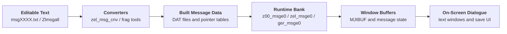
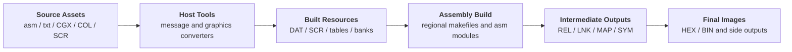

The Nintendo Gigaleak preserves a large Super Famicom Zelda source archive under `other/SFC/ソースデータ/ゼルダの伝説神々のトライフォース`.

This is the Japanese game better known in the West as **The Legend of Zelda: A Link to the Past**.

What makes this archive especially useful is that it is not just one source branch.
It preserves a whole family of regional worktrees: a large Japanese Ver3 branch, a US `NES_Ver2` branch, separate English/French/German PAL branches, and an extra French `N_F_asm` path.



---
## At a Glance
This archive is useful because it preserves several different layers of the project at once:

* the main Japanese `日本_Ver3` branch with source, asset tools, converters, and message workspaces
* regional English, French, and German localisation trees with their own build outputs and branch-specific asm
* linked outputs such as `.hex`, `.lnk`, `.map`, `.sym`, `.cnf`, `.trace`, and many `.rel` objects
* message-production folders that keep both compiled `.DAT` resources and editable `.txt` scripts
* graphics and screen-edit data spread across `char`, `scr`, and branch-local asm folders

One quick way to read the archive is by branch size and purpose:

Branch | Approx. file count | What it mainly looks like
---|---|---
`日本_Ver3` | 619 | Main Japanese source snapshot with tools, asset converters, and message build workspace
`英語_PAL` | 736 | Largest localisation branch, with many compiled `.rel` objects and a very large `pal_char` asset set
`フランス_PAL` | 290 | French PAL worktree with extra `*_fra.asm` overlays and a custom message-processing toolset
`ドイツ_PAL` | 289 | German PAL branch with both `ger_*` and `zel_*` naming layers plus full build outputs
`NES_Ver2` | 196 | US branch, oddly named, with a near-complete `us_asm` game tree and linked outputs
`フランス_NES` | 99 | Smaller French branch that tracks the US-style layout more closely than the PAL one

---
### Quick Glossary
This page uses a lot of build and asset terms, so it helps to pin down a few of the recurring ones early.

Term | Meaning in this archive
---|---
`REL` | Intermediate relocatable object file produced before final linking
`LNK` | Linker output or linked image descriptor used to produce final outputs like `.hex`
`MAP` | Link map showing where code/data ended up in memory
`SYM` | Symbol file used for debugging or inspection
`CGX` | Character or graphics source data used in Nintendo's asset pipeline
`DAT` | Built data payload, used here for messages, maps, and other converted resources
`SDM` | Project/debug-support side file that survives beside several program variants
`MGARTBL` | Message address table used by the runtime message system

---
### Quick Branch Comparison
The broad pattern becomes clearer when the main folders are compared directly:

Branch | Main code folder | Other notable folders | What stands out
---|---|---|---
`日本_Ver3` | `asm` | `bin`, `char`, `com`, `msg`, `scr` | Feels like the main production branch, not just a release export
`NES_Ver2` | `us_asm` | `us_char`, `us_msg`, `us_scr` | US release path with both game code and test/title fragments
`英語_PAL` | `pal_asm` | `pal_char`, `pal_msg`, `pal_scr` | Preserves a large object-heavy build state with many `.rel` outputs and `.BAK` edits
`フランス_PAL` | `Fra_asm`, `Fra_asm1` | `Fra_char`, `Fra_msg`, `Fra_scr` | Extra French-specific overlays and localisation helper C code
`ドイツ_PAL` | `Ger_asm`, `Ger_asm1` | `Ger_char`, `Ger_msg` | German-specific `ger_*` program names mixed with broader `zel_*` content
`フランス_NES` | `N_F_asm` | none at top level beyond the asm tree | Smaller French branch closer to the US layout than the PAL one

---
# Root Directory (SFC.7z/ソースデータ/ゼルダの伝説神々のトライフォース)
At the top level, the archive is already organised by release branch rather than by one shared engine folder.


This is not one clean master directory.
It looks more like a preserved family of regional working trees, with the Japanese branch as the broadest source snapshot and the PAL branches carrying their own localised code, assets, and message data.



- 日本_Ver3 - Main Japanese Ver3 branch with source, assets, converters, message scripts, and helper tools
- NES_Ver2 - US branch despite the odd folder name, with `us_asm`, `us_char`, `us_msg`, and `us_scr`
- 英語_PAL - English PAL branch with `pal_asm`, `pal_char`, `pal_msg`, and `pal_scr`
- フランス_PAL - French PAL branch with dual asm trees and French-specific overlays
- ドイツ_PAL - German PAL branch with dual asm trees and German-specific message modules
- フランス_NES - Smaller French branch that mirrors the US-style layout more closely




The split matters because it shows localisation as a real source-management problem.
Nintendo was not just storing translated strings in one side folder.
These branches carry different asm modules, different build products, and in some cases their own helper programs.

---
## How Complete This Looks
This archive looks much closer to a **working multi-region source snapshot** than a token sample dump.

The strongest signs in its favour are:

* several branches preserve linked outputs such as `.hex`, `.lnk`, `.map`, `.sym`, and `.cnf`
* the PAL branches also keep many individual `.rel` object files, which means the intermediate assembly stage survived as well
* the Japanese branch keeps both source and support tooling under `bin` and `com`, rather than only the game-side asm
* the message folders preserve editable `.txt` source alongside compiled `.DAT` resources, which is exactly the kind of day-to-day content pipeline that often disappears from later archives

The main caveat is that the archive is uneven rather than perfectly uniform.

Some branches are clearly fuller than others:

* `日本_Ver3` looks like the broadest internal work branch
* `英語_PAL` looks like the most object-heavy build snapshot
* `フランス_PAL` and `ドイツ_PAL` look like active localisation branches
* `フランス_NES` looks more compact, closer to a reduced regional derivative

So the safest description is that this is a **near-complete family of regional source branches**, not a single self-contained rebuild package for every version.

---
# The Main Japanese Ver3 Branch
`日本_Ver3` is the branch that feels most like a live production workspace.

It is wider than the regional folders in two important ways.
First, it keeps not only source and build outputs but also a large collection of support binaries and conversion tools.
Second, it preserves the message and screen-production side of the project much more explicitly.


The Japanese branch is not just `asm`.
It is a broader working environment with code, converters, graphics assets, message sources, and screen-edit data all living side by side.



- asm - Main Japanese asm tree with `z00_*` game modules, `tl_*` side program files, and linked outputs
- bin - Utility executables and small helper programs such as `zel_msg_cnv`, `nzel_msgcnv`, `chr-cnv1`, and `ovl_err.c`
- com - Another large tool and command workspace with `.TBL`, `.DBG`, `.BAK`, `.sdm`, and multiple `zel*.make` scripts
- char - Character and graphics resources
- msg - Message-production workspace with editable text and compiled data under `msg/bun`
- scr - Screen and map-edit resources




---
## The Japanese Assembly Tree
The Japanese `asm` folder is not arranged quite like the PAL branches.

Instead of one mostly uniform `zel_*` naming scheme, it mixes several naming layers:

* `z00_*` modules for the main game code, maps, enemies, ending logic, and world data
* `tl_*` and `tl1_*` modules that look like a smaller side program, likely title or front-end related
* helper data such as `ENNO.DAT`, `KUSA.DAT`, `SHI.COL`, and `msg.DAT`
* linked outputs such as `tl_main.hex`, `tl_main.map`, `tl_main.sym`, `tl_main.lnk`, and the matching `tl_main1.*` set

One interesting detail here is that `asm/Makefile` is only a generic sample template.
The real project build scripts seem to live elsewhere, especially in the Japanese `com` folder and the PAL regional `zel.make` files.

That suggests the `asm` folder was not a neat standalone build root.
It was one part of a larger working environment.

---
### What z00_play.asm Shows About the Naming Shift
One of the clearest ways to see the Japanese branch's naming transition in practice is to compare `z00_play.asm` against the English PAL `zel_play.asm`.

These are not just loosely related files.
They are extremely close.

The Japanese `z00_play.asm` is **19,366 lines**.
The English PAL `zel_play.asm` is **19,370 lines**.
A line-level similarity check puts them at roughly **99.71% similar**.

Most of what differs is not a full gameplay rewrite.
The biggest obvious change right at the top is the header label:

* Japanese branch - `ZELDA-3`
* English PAL branch - `PAL_ZELDA-3`

Beyond that, the same large player-control structure survives in both places:

* the same `PLMOVE` top-level entry point
* the same `PLMVSB` dispatcher
* the same large `PLMVTBL` state table
* the same normal, swimming, jumping, dashing, rabbit, item, and scripted movement handlers

That matters because it helps explain what the `z00_*` versus `zel_*` split really is.
At least for major files like this one, it does not look like two unrelated codebases.
It looks like the same game logic surviving under two naming conventions while the branch structure shifted around it.

So the Japanese `z00_*` family is best read as a core production code line, not a separate experimental branch.
The PAL `zel_*` tree still sits very close to it.

---
### The Title and Ending Code
The Japanese branch also preserves the two other giant pieces you would hope to see beside gameplay logic: the title/front-end code and the ending/staff-roll code.

Those survive as:

* `z00_title.asm` at **8,842 lines**
* `z00_ending.asm` at **5,916 lines**

Taken together, they show that the leak is not only preserving the core overworld/dungeon loop.
It also preserves the more theatrical parts of the game that are usually harder to reconstruct from a ROM alone.

`z00_title.asm` is especially rich.
It exports the whole front-end family:

* `TITLE0`
* `PLSELCT`
* `PLCOPY`
* `PLKILL`
* `PLTORK`
* `OPDEMO`

That one export block already tells a story.
The title module is not just a static splash-screen routine.
It owns the title screen, the file-select flow, copy/delete/registration actions, and the opening demo path.

Inside `TITLE0`, the code dispatches through a staged front-end state table with routines such as:

* `TILINT0`
* `TILINT1`
* `POLGNIT`
* `TRYFS00`
* `TILFDIN`
* `TILWAIT`
* `TILPLAY`

So the title side is built much like the gameplay side: as an explicit state machine with RAM init, screen init, polygon init, fade handling, waiting, and live interaction stages.

One especially nice detail is how much front-end spectacle is wired directly into the code.
`z00_title.asm` imports polygon support symbols like `INITIAL_POLYGON`, `rotate_angle_x`, `rotate_angle_y`, `object_size`, and `transfer_flag`, while also calling message, character-buffer, and CG setup helpers.
That makes the title module feel like a hybrid of menu code, graphics setup, and presentation scripting.

`z00_ending.asm` shows the same kind of explicit scene choreography for the back half of the game.
Its `ENDDATA` table steps through a long sequence of named ending scenes, including:

* village and overworld locations
* Zora and magic-shop scenes
* blacksmith and forest scenes
* a staff-roll init and move phase
* several terminal `ENDEND*` states

It also keeps explicit coordinate tables like `SCCVDT`, `SCCHDT`, and `SCVADDT`, which strongly suggests the ending sequence was being staged as a series of controlled camera/scroll setups rather than as one passive cutscene blob.

So between `z00_title.asm`, `z00_play.asm`, and `z00_ending.asm`, the Japanese branch preserves the whole dramatic arc of the game: front-end presentation, real-time player control, and the ending/staff-roll scripting.

---
## The Japanese Tool Folders
The `bin` and `com` folders are some of the most revealing material in the whole archive.

The `bin` folder alone contains dozens of small helper programs and converters.
Just from the filenames you can see tools for text conversion, character conversion, error checking, dump utilities, and Zelda-specific resource processing:

* `zel_msg_cnv`, `zel_msg_add_cnv`, `nzel_msgcnv`, `nzel_msgcnv3`, `nzel_msgcnv4`
* `chr-cnv1`, `chr-cnv4`, `zcor-cnv`, `zel_hen_cnv`
* `ovl_err.c` beside built helper binaries such as `ovl_err`
* `textcp`, `txt_bin`, `txt_bin2`, `word_byte`
* `zel_enmy_bg_chk`

The `com` folder looks even more like a toolbox-and-scripts area than a normal build output directory.
It mixes:

* multiple `zel.make`, `zel0.make`, `zel1.make`, `zel2.make`, and `zel3.make` scripts
* `.TBL` conversion tables such as `f_zel_screen_cnv.TBL`
* debugging leftovers such as `fzmap.DBG`, `zld.DBG`, and `zlch.dam`
* many Zelda-named helper binaries like `zlmap`, `zlcg`, `zlch`, `zld`, `zlend3`, and `zlcom`
* backup files for active tools such as `fzcg.BAK`, `fzch.BAK`, `gzch.BAK`, `pzch.BAK`, and `rmgtx.BAK`

That combination makes `日本_Ver3` feel like a real internal production tree rather than a simple source backup.

---
### The Workstation Executables
One detail that is easy to miss at first is that many of the Japanese helper tools are preserved as real host-side executables, not just shell wrappers or source stubs.

Files such as `zel_msg_cnv`, `zel_msg_add_cnv`, `nzel_msgcnv`, `chr-cnv1`, `chr-cnv4`, `zcor-cnv`, `zel_hen_cnv`, and `ovl_err` all identify as **big-endian 32-bit `a.out` executables**.

That matters because it means the archive is preserving part of the workstation environment around Zelda, not only the SNES-side program source.
These are the kind of utilities a team would run on the development machine to prepare data before the game build even started.

The sizes also suggest several distinct tool families rather than one catch-all converter:

Tool | Size | What it most likely handled
---|---|---
`zel_msg_cnv` | 24,576 bytes | Main Zelda message conversion
`zel_msg_add_cnv` | 24,576 bytes | Additional message-table or append-stage conversion
`nzel_msgcnv` | 24,576 bytes | Another Zelda message conversion variant
`chr-cnv1` | 49,152 bytes | Larger character/graphics conversion pass
`chr-cnv4` | 24,576 bytes | Smaller graphics conversion variant
`zcor-cnv` | 32,768 bytes | Likely Zelda color or correction-oriented resource conversion
`zel_hen_cnv` | 24,576 bytes | Zelda-specific conversion helper, probably text or character related
`ovl_err` | 24,576 bytes | Overlap/error checking tool for build outputs

Even when the binaries are not easy to reverse immediately, their filenames and clustering are already useful.
They show that text, graphics, and validation were being handled by separate dedicated utilities.

---
### What ovl_err.c Shows
`ovl_err.c` is especially valuable because it gives one of those utilities to us in plaintext C rather than only as a binary.

The program reads a file passed on the command line, skips the title header, parses rows into arrays like `f_name1`, `f_name2`, `f_seg`, `f_sadd`, and `f_eadd`, then sorts the entries by start address before checking for problems.

From the code, its job is straightforward:

* verify that a module does not cross from one bank into another unexpectedly
* compare each module's end address against the next module's start address
* flag overlapping address ranges
* emit errors before the final `.hex` output is trusted

That is a strong clue about the wider workflow.
The Zelda build was not just "assemble everything and hope".
There was at least one dedicated post-link validation step checking bank boundaries and overlap in the produced layout.

---
### The Makefile Variants
The `com` folder is also where the broader Japanese branch starts to look like multiple named build configurations rather than one static project.

Alongside the base `zel.make`, it keeps `zel0.make`, `zel1.make`, `zel2.make`, and `zel3.make`.
Each one changes `NAME` to build a different top-level image such as `zel_main0`, `zel_main1`, `zel_main2`, or `zel_main3`.

What makes these scripts more interesting is the way they swap module families around:

* `zel.make` is mostly built from `zel_*` modules
* `zel1.make` starts mixing in `z00_enmy*`, `z00_play`, `z00_ply1`, `z00_pysb`, and `z00_end2`
* `zel2.make` leans much harder into `z00_*` modules for major systems like `vma`, `data0`, `code`, `dmap`, `dsub`, `char*`, `grnd`, `gmap`, `title`, and `ending`
* `zel3.make` continues that trend but with another slightly different mix of `zel_*` and `z00_*` components

That pattern looks less like simple backup clutter and more like a branch transition in progress.
The Japanese tool area was keeping several build recipes around while parts of the codebase moved between the older `zel_*` naming and the `z00_*` family seen in `asm`.

---
### The Message Conversion Family
The message-related tool names also make more sense once they are viewed together rather than as isolated binaries.

Across `bin`, `msg`, and the regional folders, the archive preserves:

* editable `msgXXXX.txt` source files
* compiled `msgXXXX.DAT` resources
* aggregate files such as `Zlmsgall`
* converters like `zel_msg_cnv`, `zel_msg_add_cnv`, and `nzel_msgcnv`

`strings` output from `zel_msg_add_cnv` is sparse, but it still exposes a few useful clues:

* the tool expects a table-like input argument, shown as `zel_msg_add_cnv <TBL name>`
* it emits data in `BYTE` form with `%03XH` formatting
* it references a symbol named `MGARTBL`

That lines up well with the rest of the archive.
Nintendo was not storing the final dialogue as one opaque blob.
It was passing text through a table-driven conversion stage that turned editable script material into assembler-friendly byte tables.
---
## The Message Workspace
The Japanese `msg/bun` folder is one of the clearest preservation wins in the archive.

It does not just keep finished binary message resources.
It keeps the editable text that fed into them.

The broad shape is:

* `Zlmsgall` and `Zlmsgall.BAK` as aggregate message sources
* hundreds of paired `msgXXXX.DAT` and `msgXXXX.txt` files
* `Mkfile`, `README`, and helper files such as `iwa`
* an older backup file `04c2.BAKUP`

That means the archive preserves both the localised message source and the compiled per-block message payloads.
For anyone studying how Nintendo handled text on the SNES, this is much more useful than a final ROM alone.

---
### What z00_msge0.asm Reveals About Message Handling
The source-side message pipeline becomes much clearer once `z00_msge0.asm` is opened.

At **3,181 lines**, this is not just a data include.
It is a real runtime message-system module.

The top-level exports already show its job:

* `MSGE_I`
* `MSGETNP`
* `MSGADST`

It also imports `MGARTBL`, which is the message address table that the Japanese text conversion tools were clearly building toward.

The high-level flow is:

* `MSGE_I` enters the banked message handler
* `MSGE_I2` dispatches between init, program, and save-screen paths
* `MSGINI` resets message-side state and window variables
* `MSG_TENKAI` expands the selected message into a working buffer for display

`MSG_TENKAI` is the most revealing routine in the file.
It takes the current message number, looks up its pointer through `MGARTBL`, and then walks the source bytes while classifying them into at least three broad categories:

* ordinary hiragana or space-like values below `0xFD`
* explicit `0xFD` kanji-prefixed values
* higher control-code style entries, including `0x7F` as an end marker after a command byte

That means the message data on disk was not being stored as plain text.
It was an encoded script format with inline control codes and a distinct path for kanji handling.

The save-screen path is useful too.
`MSGSVE` hardcodes message number `3`, sets up the message window address, and then repeatedly calls the message program path.
So even something like the save UI was flowing through the same general message engine rather than being drawn completely separately.

This is one of the best pieces of evidence in the archive for how the text pipeline connected together:

* editable `msgXXXX.txt` files in `msg/bun`
* conversion tools like `zel_msg_cnv`
* a pointer table `MGARTBL`
* a runtime expansion layer in `z00_msge0.asm`
* message/window buffers that the game then turns into visible dialogue

That is exactly the sort of low-level implementation detail a final ROM alone does not explain cleanly.

---
### What a Real Message Source File Looks Like
The paired `.txt` and `.DAT` files in `msg/bun` are useful because they show both the editable source side and the compiled in-game form.

Two small examples are especially clear:

File | Editable text size | Built data size | What it shows
---|---|---|---
`msg0000` | 9 bytes | 1 byte | A tiny sentinel-style message entry rather than a full spoken line
`msg05b3` | 121 bytes | 47 bytes | A short real dialogue entry with inline control markers and visible compression/encoding

`msg0000.txt`, when decoded as CP932, is simply:

* `＠ｆｂ＠`

Its matching `msg0000.DAT` is only one byte long: `0xFB`.

That makes it a useful sanity check.
The source-side marker language is not decorative.
At least some tiny message files are effectively just wrappers around one control-style value.

A fuller file like `msg05b3.txt` is more representative.
Decoded as CP932, it reads as a short dialogue block with embedded command markers such as:

* `＠ｆ８＠`
* `＠ｆ９＠`
* `＠ｆｅ，６ａ＠`
* `＠ｆｂ＠`

So the editable text was not plain prose with no structure.
It was a script-like source format where visible inline tokens controlled pacing, line flow, or other message behavior before the converter packed everything down into the smaller `.DAT` form.

That lines up very neatly with what `z00_msge0.asm` is doing at runtime.
The source text keeps the human-editable markers.
The converter turns them into compact encoded bytes.
The runtime bank loader then expands those bytes back into message/window buffers for display.

---
## The Japanese Asset Pipeline
The Japanese branch is also where the art and screen-edit side is easiest to see as a real workflow rather than a pile of output files.

The `char` and `scr` folders still preserve both editable resources and the converter-side scaffolding around them.

---
### The char Folder
`日本_Ver3/char` is much richer than a normal graphics dump.
It mixes raw art groupings, palette data, conversion tables, intermediate notes, and a few obvious experiments.

Some of the main file families are:

* grouped `.CGX` sets like `1g-1n.CGX`, `1o-1v.CGX`, `2e-2l.CGX`, `3c-3j.CGX`, and `4a-4h.CGX`
* simpler numbered sets like `1.CGX`, `2.CGX`, `3.CGX` with matching `.DAT` and `.TXT` companions
* palette and color files such as `1.COL`, `M7-L.COL`, `mapcolor.COL`, `player.COL`, `siro.COL`, `soto.COL`, and the long `color-rom-a.COL` through `color-rom-p.COL` run
* converter configuration files like `chr-cnv.TBL`, `chr-cnv1.TBL`, `chr-cnv4.TBL`, and `cnr-cnv.TBL`
* Mode 7 or presentation experiments like `M7-BG-HELI.CGX`, `M7-BG-HELI.CH7`, `test-modo7-bg.CGX`, `test-modo7-obj.CGX`, and `cnvmode7`

That file mix says a lot.
The folder is not only storing finished tile graphics.
It is storing the converter inputs and control tables that turned art into game-ready data.

The repeated `.TXT` and `.BAK` pairs are useful too.
Files like `1.TXT`, `1.TXT.BAK`, and the conversion `.TBL.BAK` files make this look like an active editing area rather than a final export cache.

One particularly nice detail is the coexistence of ordinary map/character assets with obviously special-purpose material such as `ABC.CGX`, `moji-1.CGX`, `moji-2.CGX`, `map-obj.CGX`, `smap.CGX`, `tikamap.CGX`, and `kawauso.CGX`.
That makes the folder feel like a broad graphics workbench covering fonts, maps, mode-specific art, and special object sets all together.

---
### The scr Folder
The `scr` folder is smaller, but it is just as revealing.

Its contents combine:

* compiled map data such as `MAP.DAT`, `MAP1.DAT`, `MAP2.DAT`, `MAP3.DAT`, and `MAPDAT1.DAT` through `MAPDAT6.DAT`
* palette files `color-rom-a.COL` through `color-rom-p.COL`
* screen resources like `m-1.SCR` and `m-2.SCR`
* editable text-side resources such as `zel_mpd0.txt`, `zel_mpd01.txt`, `zel_mpd1.txt`, `zel_mpd11.txt`, and `zel_sut0.txt` through `zel_sut3.txt`
* backup copies like `zel_sut1.txt.BAK` and `zel_sut3.txt.BAK`

That combination is important because it mirrors the pattern seen later in the PAL branches.
Nintendo was keeping text-editable map or setup inputs right beside the built `.DAT` and `.SCR` outputs that the game actually consumed.

So the Japanese `scr` folder looks like the upstream version of the same screen-data pipeline that later shows up in `pal_scr`.
It is one more sign that the archive preserves the production process, not just the end result.

---
## The tl Side Program
The Japanese `asm` tree also preserves something stranger than the main `z00_*` gameplay code: a whole `tl_*` mini-program family.

This is not just one leftover file.
The branch keeps:

* source files such as `tl_main.asm`, `tl_msg0.asm`, `tl_ram.asm`, `tl_main1.asm`, `tl1_main.asm`, `tl1_msg0.asm`, and `tl1_data.asm`
* build scripts like `tlmake`, `tlmake1`, and `tl1make`
* side resources such as `tl.sdm`, `tlchr`, and `tlchr0`
* linked outputs including `tl_main.hex`, `tl_main.map`, `tl_main.sym`, `tl_main.lnk`, `tl_main1.hex`, and `tl_main1.lnk`

The German branch carries part of the same family again.
`Ger_asm` still has `tl_main.asm`, `tl_msg0.asm`, `tl_ram.asm`, `tlmake`, `tl.sdm`, and a full `tl_main.*` output set.

That recurring footprint matters.
It makes `tl_*` look like a real auxiliary program that travelled with multiple regional Zelda workspaces, not a one-off scratch file.

---
### What tl_main.asm Is
`tl_main.asm` is a compact standalone SNES program at **1,391 lines**.

Structurally, it looks much more like a small utility application than a normal piece of the game engine:

* it boots from `ORG 008000H`
* it has its own reset routine and native-mode transition
* it dynamically generates OAM clear and OAM-sub update code into RAM
* it installs its own NMI routine, DMA setup, and VRAM writes
* it runs a tiny mode dispatcher called `MOVE`

That `MOVE` table is especially revealing.
It only switches between a handful of high-level states:

* `RESTIN` - clear RAM and reset state
* `GMPLAY1` - call `NOINPUT`
* `GMINIT1` - call `LOADSUB`
* `GMPLAY` - call `KEYINPT`

So this is not trying to be full Zelda gameplay.
It looks more like a small front-end or utility shell for text/input work.

---
### What tl_msg0.asm Is Doing
The companion file `tl_msg0.asm` is even more explicit.
At **1,975 lines**, it exports four routines that `tl_main.asm` calls directly:

* `MSGINIT`
* `KEYINPT`
* `NOINPUT`
* `LOADSUB`

Those names describe the program surprisingly well.

`MSGINIT` clears three large working buffers:

* `DOTBUF`
* `CHRBUF`
* `MOJBUF`

It then sets `NOKORI` and flips `VRAMSH`, which makes it look like a message/font editing or preview workspace preparing its working memory before display.

`KEYINPT` is not ordinary game movement code.
It reads the `KEYWK*` keyboard/controller buffers and translates bit patterns into character-like values, cursor movement, delete/insert toggles, and other editor-style actions.

`NOINPUT` is even more specific.
It builds a decimal-like file number from sequential key entries, stores the digits in `INPTDT`, derives a `SAVENO` value, compares it against `FILENO`, and then calls `INPUTDT` to write the chosen value into VRAM/OAM-backed display structures.

So `tl_msg0.asm` looks less like a gameplay module and more like a small **text- and file-selection utility layer**.
It is the clearest sign that the `tl_*` family was built around message or title-side data handling rather than normal in-game action code.

---
### What tl_ram.asm Shows
`tl_ram.asm` is only **380 lines**, but it explains the whole program's memory model.

In addition to ordinary SNES-side state like `NMIFLG`, `FRCNT`, OAM buffers, and controller registers, it defines the message- and input-specific work areas:

* `FILENO` at `07E1FFEh`
* `CHRBUF` at `07E8000H`
* `DOTBUF` at `07EC000H`
* `MOJBUF` at `07EE000H`
* input-side fields like `INPTNO`, `INPTDT`, `SAVENO`, `DELFLG`, and `INSFLG`

That layout supports the reading above.
This little program was keeping separate buffers for characters, dot/pixel data, and message work while also tracking explicit file-number input state.

---
### The Strange Header Clues
The oddest part of the `tl_*` family is not the code.
It is the metadata left in the file headers and ROM header area.

Three different identities show up:

* `tl_main.asm` says `title name : "tensai BAKABON"`
* `tl_ram.asm` repeats the same `tensai BAKABON` label
* `tl_msg0.asm` instead says `title name : "ZELDA-3 NES messege porgram"`
* the ROM header bytes embedded near the end of `tl_main.asm` literally spell `SUPER MARIOWORLD`

That combination is too inconsistent to treat as a clean Zelda-specific title program.

The most likely explanation is that `tl_*` was built from an older internal utility framework or sample shell that had already been reused across multiple projects.
By the time it sat inside this Zelda workspace, some labels had been updated for Zelda message work, while others still preserved names from earlier code origins or template headers.

That kind of residue is exactly the sort of thing source leaks are unusually good at preserving.
A finished ROM would never show this much of the internal reuse story.

---
# The US and PAL Branches
The regional branches are not all just translations of one Japanese tree.

They preserve different layouts and different levels of build-state detail.
Some are close to full game branches.
Others look more like localisation overlays built on top of a common source base.

---
## The US Branch
The oddly named `NES_Ver2` branch is the clearest US path because its main code folder is `us_asm`.

That folder preserves:

* a nearly full `zel_*` source set with modules like `zel_main.asm`, `zel_code.asm`, `zel_enmy*.asm`, `zel_play.asm`, and `zel_title.asm`
* linked outputs such as `zel_main.hex`, `zel_main.lnk`, `zel_main.map`, and `zel_main.sym`
* side material like `msgtbl.TBL`, `item.txt`, `endata.txt`, and `msg.DAT`
* a smaller `tes_*` program with its own `tes.make`, `tes.sdm`, and `tes_main.*` outputs
* sound build outputs like `zldsound0.hex`, `zldsound1.hex`, and `zldsound2.hex`

That extra `tes_*` block is a nice clue that this branch was doing more than just preparing a final release ROM.
It still carried side programs and test-like material in the same workspace.

---
### The tes Side Build in the US Branch
The `tes_*` files in `us_asm` are worth treating as their own little build family rather than a footnote.

The branch keeps:

* `tes_main.asm`
* `tes_init.asm`
* `tes_int0.asm`
* `tes_char0.asm`
* `tes.make`
* `tes.sdm`
* `tes_main.cnf`, `tes_main.hex`, `tes_main.lnk`, `tes_main.map`, and `tes_main.sym`

That is a complete enough cluster to show intent.
This was not just one abandoned source file.
It was a named auxiliary program with its own makefile and linked outputs.

`tes.make` is the strongest clue.
It builds `tes_main`, but it does not do so from a tiny self-contained test harness.
Instead it links the small `tes_*` modules together with a very large spread of normal Zelda objects:

* `zel_code`, `zel_sub0`, `zel_bgwt`, `zel_dmap`, `zel_dsub`, `zel_gsub`, and `zel_gmap`
* `zel_title`, `zel_ending`, `zel_gover`, and `zel_play`
* message banks `zel_msge0` through `zel_msge3`
* enemy and effect modules like `zel_enmy*`, `zel_exst`, `zel_bms1`, and `zel_bms2`
* object graphics modules like `zel_obj_poly`, `zel_obj_grph`, and `zel_obj_data`

So `tes_main` is not a toy sample.
It is a small front-end or variant program that still stands on top of a substantial slice of the real game.

`tes_main.asm` itself reinforces that reading.
At **2,046 lines**, it is much smaller than the full game-side modules, but it still behaves like a complete SNES program:

* it has its own reset and NMI flow
* it clears RAM and OAM
* it dispatches through a `MAIN_P` state table
* it exposes many of the same mode constants seen in the normal game, such as title, player-select, init, game, fade, game-over, title-demo, ending, and restart-point-select states

That makes the `tes_*` family feel less like a debugging micro-tool and more like a specialised boot path or reduced program shell for testing front-end/game-mode transitions.

One especially nice detail is the `DEBUGMD` stub inside `tes_main.asm`.
It sits directly in the controller-read path and is currently just `RTS`, which suggests the file was built with a convenient debug hook point already wired in even if it was inactive in this snapshot.

So the US branch was not only carrying the main release game.
It was also carrying at least one smaller companion build that reused a large amount of the real engine while keeping its own entry module and outputs.

---
### The US Sound Build Outputs
The `us_asm` folder also keeps a small trio of sound-side outputs that are easy to overlook:

* `zldsound0.hex`
* `zldsound1.hex`
* `zldsound2.hex`

Each one also has a matching `.lst` file beside it.

The three `.hex` files are not opaque binary blobs.
They are ASCII Intel HEX-style output files, which means they are host-side load images rather than raw ROM chunks.

Their sizes are:

File | Size
---|---
`zldsound0.hex` | 148,714 bytes
`zldsound1.hex` | 35,106 bytes
`zldsound2.hex` | 23,000 bytes

That uneven split suggests the sound side was not being treated as one monolithic output.
The archive is preserving several separately generated sound images or banks, with `zldsound0.hex` as the largest by far.

The matching `.lst` files matter too.
Even though they are noisy in this snapshot, their presence shows these were not just copied-in final assets.
They came out of a real assembler/listing workflow, just like the main game-side code.

So the US branch does not only preserve the visual and gameplay build.
It also preserves a small but useful slice of the audio-side production outputs.

---
### The US Title and Ending Modules
The US branch also helps show how the front-end and ending code evolved after the Japanese snapshot.

Its corresponding files are:

* `zel_title.asm` at **9,625 lines**
* `zel_ending.asm` at **5,947 lines**

That makes both US modules slightly larger than the Japanese `z00_title.asm` and `z00_ending.asm`, which is already a useful clue that the regional branches were not just renaming files and swapping text.

The ending side is the simpler case.
`zel_ending.asm` still has the same broad scene-sequencing structure as the Japanese file:

* the same `ENDDATA` style scene table
* the same long run of ending location states
* the same staff-roll path
* the same coordinate/control tables for scroll staging

So the US ending branch looks like a close derivative rather than a fundamentally different implementation.

The title side is more visibly active.
`zel_title.asm` keeps the same broad front-end family as the Japanese file, but the surviving comments and edits make it look like the branch was still being tuned:

* `TITLE0` waits until a later `GAMEMD` threshold than the Japanese version before allowing the start-button path to break out
* the front-end state table is slightly longer, with two distinct fade-in stages `TILFDIN0` and `TILFDIN1`
* several older lines are preserved as dated comment-outs marked `03.10.18` and `03.11.26`
* the init path also pulls in a few extra helpers such as `PLRITCK`, `VT0A`, `TLFDIN0`, and `TLFDIN1`

That combination makes the US `zel_title.asm` feel less like a dead regional copy and more like a branch that was still being adjusted in the late title/file-select flow.

So if the Japanese branch is the cleaner view of the title/ending architecture, the US branch is a useful reminder that those same systems were still being edited and retimed in regional production.

---
## The English PAL Branch
`英語_PAL` is the biggest regional branch by raw file count, largely because `pal_char` alone contains **504 files**.

Its `pal_asm` folder is especially useful because it preserves the assembly pipeline in mid-build:

* many `.asm` source modules
* many matching `.rel` object files
* linked outputs such as `zel0.bin`, `zel1.bin`, `.map`, `.sym`, and `.lnk`
* `.BAK` snapshots for active source files like `zel_bgwt.asm.BAK`, `zel_code1.asm.BAK`, and `zel_enmy4.asm.BAK`

This is one of the best pieces of evidence in the archive that the leak did not just catch final source.
It caught a branch while intermediate object files and quick backups were still sitting in place.

The surrounding PAL folders flesh that out further:

* `pal_scr` keeps map and screen-edit data such as `MAP1.DAT`, `MAPDAT1.DAT` through `MAPDAT5.DAT`, plus editable `zel_mpd*.txt` and `zel_sut*.txt` files with `.BAK` copies
* `pal_char` is packed with `.CGX` graphics and large runs of `*.DAT` / `*.DATN` files, which looks much more like a working tile and resource repository than a minimal export
* `pal_msg/bun` mirrors the Japanese structure with hundreds of paired `msgXXXX.DAT` and `msgXXXX.txt` files, plus aggregate files like `Zlmsgall`

---
### The English PAL Build State
The raw file mix in `pal_asm` makes this branch especially good for studying what a live late-stage Zelda build looked like.

By extension count alone, the folder keeps:

Artifact type | Count
---|---
`.asm` | 90
`.rel` | 63
`.bak` | 18
`.lst` | 5
`.make` | 4
`.sdm` | 3
`.hex` | 2
`.lnk` | 2
`.map` | 2
`.sym` | 2
`.bin` | 2

That is a much richer build state than "source plus final ROM".
It preserves source, object files, temporary backups, linker products, and final binary chunks all in one place.

The output sizes reinforce that:

* `zel_main.hex` is **1,591,736 bytes**
* `zel_main.sym` is **1,877,814 bytes**
* `zel0.bin` and `zel1.bin` are both **524,288 bytes**

So this is not just a tiny test program.
It is a full-scale branch with the symbol and binary baggage you would expect from a real release build.

---
### What the English PAL Makefile Reveals
`pal_asm/zel.make` is structurally close to the other regional makefiles, but it is useful precisely because it lines up so cleanly with the `.rel` files that survived next to it.

It builds `zel_main` from a large object list that includes:

* front-end and common systems like `zel_main`, `zel_vma`, `zel_data0`, `zel_code`, `zel_make`, `zel_bgwt`, `zel_init`, and `zel_comn`
* message banks `zel_msge0` through `zel_msge3`
* dungeon and world modules like `zel_dmap`, `zel_dsub`, `zel_gsub`, and `zel_gmap`
* major gameplay systems such as `zel_enmy*`, `zel_play`, `zel_ply1`, `zel_pysb`, and `zel_exst`
* ending, title, and post-game modules like `zel_title`, `zel_ending`, `zel_gover`, `zel_endt`, `zel_end2`, and `zel_endz`
* three object-graphics modules: `zel_obj_poly`, `zel_obj_grph`, and `zel_obj_data`

Because many of those same modules also survive as `.rel` objects, the branch preserves both the intended link recipe and a real assembled state for much of that recipe.

---
### What zel_play.asm Reveals About the Game Code
If one file had to stand in for "how much real game logic is actually here", `pal_asm/zel_play.asm` would be a strong candidate.

At **19,370 lines**, it is one of the largest surviving modules in the whole branch.
It is not a narrow helper file.
It is the player-control and player-state hub.

The header dates it to **1991.08.28**, and the global/export list is immediately revealing.
This one module exposes or depends on movement, collision, item handling, animation, hazards, camera-adjacent state, enemy interaction, and message-side hooks.

The broad shape of the file is:

* `PLMOVE` as the top-level player movement entry point
* `PLMVSB` as the dispatch layer that selects the current player-motion routine
* a large movement table covering normal walking, swimming, jumping, dashing, scripted demos, rabbit-mode logic, and item-carry states
* many tightly linked hooks into enemy logic, background collision, effect objects, and message triggers

The most useful clue is the `PLMVTBL` dispatch table.
That table alone shows how much ALTTP's player system was organised as a banked state machine rather than one straight movement routine.

Some of the most telling entries are:

State | Handler | What it appears to cover
---|---|---
Normal movement | `LNMOVE` | Standard Link walking and ordinary player update logic
Swimming | `SWMOVE` | Water movement path
Jump states | `JUMPMV`, `JPDWMV`, `JUMPDM` | Jump movement, jump-down movement, and jump demo/state logic
Dash states | `DASHMV`, `DASHED` | Dash motion and dash-end handling
Scripted/demo states | `HLDEMO`, `GKJPDM`, `GKYODM`, `OPNGDM` | Hole fall, cliff-jump, and opening/demo style scripted movement
Form/item states | `USGIMV`, `BGISMV`, `ITMHKM` | Rabbit-state logic, big-rock/item handling, and item-pull/item-drag style states
Special interactions | `KNSPAL`, `KNSPL1`, `MONOSR`, `MONOBB`, `MONOIR` | Sword special moves and monolith/event-specific states

That is useful because it shows ALTTP's player code as a **mode-driven gameplay subsystem**.
The engine was not just checking input and nudging coordinates.
It was selecting from a large family of mutually exclusive player control states, many of them tied to very specific world interactions.

Even the constants near the top make that visible.
Values like `JTIME`, `BKTIM`, `DAMGI`, and `DAMG3` sit right beside the dispatch layer, which suggests this file was also the place where important movement and damage timing constants lived.

The other big takeaway is how entangled the player code already was with the rest of the game.
`zel_play.asm` imports from `zel_enmy`, `zel_bgwt`, `zel_exst`, `zel_msge`, `zel_char`, `zel_grnd`, and several other modules.
So while this is "the player file", it really behaves more like a central gameplay broker sitting between input, map collision, enemies, effects, objects, and script-driven events.

For anyone trying to understand how Nintendo structured a large early SNES action game, this is one of the clearest examples in the leak.
The player system was large enough to need its own internal dispatcher, its own timing constants, and a long list of cross-module interfaces.

---
### The English PAL Asset Folders
The two big support folders beside `pal_asm` show how much non-code production data was still living with the branch.

`pal_scr` is fairly compact but very informative.
It contains:

* map binaries like `MAP1.DAT`, `MAP2.DAT`, and `MAPDAT1.DAT` through `MAPDAT5.DAT`
* editable text-side map and system files such as `zel_mpd0.txt`, `zel_mpd1.txt`, and `zel_sut0.txt` through `zel_sut3.txt`
* `.BAK` copies for several of those text resources

That combination suggests the screen/map side was still being edited in text form, then converted into the `.DAT` resources used by the build.

`pal_char` is much larger and looks like a serious graphics work area rather than a final export cache.
Its 504 files include:

* **19** `.CGX` graphics files
* large clustered runs of `.DAT1` through `.DAT16`
* matching `.DAT1N` through `.DAT16N` variants for many sets
* a small number of `.TBL`, `.ADD`, and `.BAK` support files

The naming pattern is especially telling.
Many files come in grouped families such as `1g-1n.*`, `1o-1v.*`, `1w-2d.*`, `2e-2l.*`, and so on, each with one `.CGX` source and many numbered `.DAT` derivatives.

That looks much more like an intermediate graphics pipeline than a single finished character archive.
The branch was preserving both the art source groupings and the many chunked outputs derived from them.

---
## The French PAL Branch
`フランス_PAL` is smaller than the English PAL branch, but it is arguably the most revealing localisation tree.

Its code is split across both `Fra_asm` and `Fra_asm1`, and the main asm folder includes some explicit French-specific overlays:

* `zel_char2_fra.asm`
* `zel_gsub1_fra.asm`
* `zel_init_fra.asm`
* `zel_int0_fra.asm`

It also carries a broader set of side artifacts than the English PAL tree:

* `zel_main.hex`, `zel_main.map`, `zel_main.sym`, `zel_main.trace`, and `zel_main.map1`
* `.DBG` and `.wrk` side files such as `zel_bg30.asm.DBG`, `zel_edt0.wrk`, and `zel_mut1.wrk`
* extra game modules like `zel_sub2.asm` and `zel_sub3.asm`

The French message workspace is even better.
`Fra_msg/bun` does not just contain text and compiled message data.
It also preserves custom helper sources:

* `frag.c`, `frag1.c`, `frag2.c`, and `frag_test.c`
* `fra_zelda3.txt`
* table and support files such as `Tmsgtbl.TBL`, `kazu.dat`, `kazu2.dat`, and `err.dat`
* compiled or utility leftovers such as `a.out`, `dotchk`, `ff`, and `miru`

`frag.c` even identifies itself as a **PAL ZELDA MESSAGE FRAGMENTS COUNT PROGRAM**, which is the kind of very specific localisation tooling that rarely survives in retail-facing material.

---
### The French Message Toolchain
The French message workspace is worth treating as its own little toolchain rather than as a pile of script files.

At the center of it is `Tmsgtbl.TBL`, which enumerates the message text files to be processed.
The list runs through a large set of `msgXXXX.txt` entries, so the helper programs were clearly designed to scan the real translation corpus rather than a toy example.

Around that table file, the branch keeps:

* source files `frag.c`, `frag1.c`, `frag2.c`, and `frag_test.c`
* a built `a.out` executable at 57,344 bytes
* helper files like `fra_zelda3.txt`, `zelda3.txt1`, `msgtbl.TBL`, `Tmsgtbl.TBL`, `kazu.dat`, and `kazu2.dat`
* small workflow leftovers such as `dotchk`, `err.dat`, `ff`, and `miru`

That is much more than a translator's notes folder.
It is a miniature French localisation lab.

---
### What the frag Programs Were Doing
The `frag*.c` files are all variations on the same idea: count recurring French word fragments or short phrases across the text script to see which pieces are worth encoding as reusable tokens.

`frag1.c` makes this very explicit.
It declares lots of small word-fragment tables like:

* `avec`, `maintenant`, `pouvoir`, `bouton`
* `l'Ancien`, `Sahasrahla`, `Hyrule`, `Ganon`
* short connective chunks such as `de`, `des`, `que`, `sur`, and `tu`

It then opens `Tmsgtbl.TBL`, walks every listed message file, and counts how often those fragments appear.

`frag2.c` is a broader version of the same idea.
Its tables are larger and include longer strings like:

* `magique`
* `sorcier`
* `rubis`
* `Perle de Lune`
* `Tu as trouvé`
* `Maintenant`

So the localisation team was not just translating line by line.
They were actively searching for repeated French substrings that could be turned into more efficient encoded message tokens.

---
### frag_test.c and dotchk
`frag_test.c` is a smaller harness that tests one specific phrase pattern against the same message list.

Its `test_tbl` hardcodes a sample string and counts how many times it appears in the script set defined by `Tmsgtbl.TBL`.
That makes it look like a quick experiment or verification tool used while tuning the fragment tables.

`dotchk` is even smaller, but still telling.
It is a C shell script that writes `Zlmsgall` into `err.dat` and then runs `Zlmsgall` again, which makes it look like a tiny wrapper around the aggregate message-processing step.

Together, these files suggest a very practical workflow:

* maintain the editable French `msgXXXX.txt` script files
* keep a table listing which files belong to the current build
* run fragment-count programs to see which words and phrases are worth tokenising
* rebuild the aggregate message data and record any errors in `err.dat`

That is one of the clearest low-level glimpses in the whole archive of how Nintendo's localisation work had to adapt to cartridge-era text-space limits.

---
## The German PAL Branch
The German side is split into `Ger_asm` and `Ger_asm1`, and its naming is a little different again.

Alongside the usual `zel_*` modules, it also has German-specific entry files such as:

* `ger_main.asm`
* `ger_msge0.asm` through `ger_msge6.asm`
* `ger_title.asm`
* `ger.make`
* `ger.sdm`

That gives the German branch a stronger feeling of being treated as its own named program variant rather than only a translated asset set.

`Ger_asm` also preserves:

* full link products like `ger_main.hex`, `ger_main.lnk`, `ger_main.map`, and `ger_main.sym`
* another title-related build set with `tl_main.*`
* extra compiled outputs such as `st20.hex` through `st23.hex`
* more branch-specific graphics and tables like `ger.CHR`, `ger.CHR1`, and `SHI.CGX`

So the German PAL tree looks less like a thin overlay and more like a localised build branch with its own named front-end and message program pieces.

---
### The German Build Layer
The German branch is worth calling out because it feels slightly more forked than the English PAL one.

Its `ger.make` script still links most of the game from `zel_*` modules, but it swaps in German-specific components for the most text-heavy pieces:

* `ger_main`
* `ger_msge0` through `ger_msge6`
* `ger_title`

So the German build does not replace the whole engine.
It keeps the common gameplay code and swaps in a more strongly regional front-end and message layer.

The folder contents support that reading.
Compared with English PAL, `Ger_asm` has fewer `.rel` objects but more final-ish linked products and side outputs:

Artifact type | Count
---|---
`.asm` | 102
`.hex` | 7
`.lnk` | 4
`.sym` | 4
`.map` | 3
`.map1` | 3
`.cnf` | 4
`.sdm` | 6
`[no extension]` | 14

That is a slightly different preservation profile.
It looks less like one active object-filled build directory and more like a branch where multiple named outputs had already been generated and kept around.

The larger output sizes fit that as well:

* `ger_main.hex` is **1,805,336 bytes**
* `ger_main.sym` is **1,922,848 bytes**
* `tl_main.hex` is a much smaller **12,966 bytes**

That small `tl_main` result again hints at a side tool or front-end program living beside the main game image.

---
### The German Message Workspace
The German branch also preserves a broader message workspace than the summary table alone suggests.

`Ger_msg/bun` contains:

* `Tmsgtbl.TBL`
* `Zlmsgall`
* many editable `msgXXXX.txt` files
* helper files such as `README`, `README2`, `kazu.dat`, `kazu1.dat`, and `moji.DAT`
* a built `a.out`
* phrase-analysis sources like `frag.c`, `frag1.c`, and `frag_test.c`

That makes the German and French branches feel closely related in their localisation workflow.
Both were carrying script lists, aggregate message sources, helper data files, and custom fragment-analysis programs for managing text-space pressure.

---
### What ger_msge0.asm Changes
If the Japanese `z00_msge0.asm` shows the baseline message runtime, the German `ger_msge0.asm` shows what a real PAL message-side overlay looked like.

At **4,088 lines**, it is not just a tiny patch file.
It is a full regional message module dated **1992.04.21**.

The broad control flow is still familiar:

* `MSGE_I`
* `MSGINI`
* `MSGSVE`
* `MSG_TENKAI`

But several implementation details have clearly shifted for the German branch.

The first big change is pointer handling.
In `MSG_TENKAI`, the German code does not just double the message number and fetch one 16-bit address like the Japanese module.
It multiplies by three and reads a wider pointer entry, which strongly suggests a **3-byte message-table format** with explicit banked addressing.

The second big change is decoding behavior.
The Japanese path treats values around `0xFD` and `0xFF` as part of its kanji/control split.
The German decoder instead:

* treats high-bit bytes as compressed or special values
* uses a lower threshold around `0x67`
* initializes extra layout state like `RETPIT`, `RETFLG`, `DOTPIT`, and `CHRPIT`
* sets `MSGCHCT` during init before expanding the message

That is exactly what you would expect from a Western localisation branch.
The problem is no longer "how do we mix hiragana and kanji control paths".
It is "how do we pack and lay out longer Latin-alphabet text efficiently on the same hardware".

So `ger_msge0.asm` is a very good example of a PAL-specific overlay in the strong sense.
It is not only a different bank of translated strings.
It is a region-specific runtime message implementation tuned for a different script and layout problem.

---
# How the Message System Changed Across Regions
With the Japanese, French, and German message modules side by side, the localisation picture becomes much clearer.

The most important thing the archive shows is that Nintendo was not simply keeping one universal message decoder and swapping in translated text.
The runtime text system itself changed across regions.

The three main baseline files are:

File | Branch | Size | What stands out first
---|---|---|---
`z00_msge0.asm` | Japanese | 3,181 lines | Kanji-aware decoder built around `MGARTBL` and `0xFD`-style control handling
`zel_msge0.asm` | French PAL | 3,959 lines | Wider pointer entries, Latin-script-oriented thresholds, extra layout state
`ger_msge0.asm` | German PAL | 4,088 lines | Similar PAL-style redesign with its own save-window and decode/layout tweaks

The Japanese path looks like the oldest and cleanest base design.
It is built around:

* a `MGARTBL` address table
* a two-byte lookup path for the current message number
* explicit handling for values around `0xFD` and `0xFF`
* a split between ordinary characters, kanji-prefixed data, and higher control-code style commands

That makes sense for a game whose source text still has to deal with Japanese script conventions directly.

The French and German PAL modules move to a different model.
They are extremely close to each other structurally, but both are clearly distinct from the Japanese baseline.

Shared PAL-side changes include:

* a **3-byte style table lookup** in `MSG_TENKAI`, reached by multiplying the message number by three instead of just two
* message expansion that works with lower character thresholds and high-bit compressed/special values instead of the Japanese `0xFD` kanji path
* extra init-time layout clearing through `KASCLS`, touching `RETPIT`, `RETFLG`, `DOTPIT`, and `CHRPIT`
* init logic that sets `MSGCHCT` before message expansion
* save-screen setup using a wider window address than the Japanese baseline

So the PAL branches are not just changing the data bank.
They are changing the assumptions the decoder makes about what a message byte means.

The French branch is the cleanest example of the Latin-script transition.
Its `zel_msge0.asm` is dated **1992.05.15**, and in `MSG_TENKAI` it treats:

* bytes below `0x70` as ordinary inline data
* bytes from `0x70` upward as command-like values
* bytes from `0x90` upward as compressed or special-path values

That is a very different decode boundary from the Japanese file.
The source language and text packing problem had changed enough that the runtime thresholds changed with it.

The German branch, dated **1992.04.21**, is slightly larger again and keeps the same broad PAL-side redesign.
Its `ger_msge0.asm` also uses the 3-byte lookup path and extra layout state, but it differs in exact thresholds and setup details.
So even within PAL, the regional message runtime was not totally frozen.

That three-way comparison is one of the best arguments in the whole archive for treating localisation as an engineering problem.

The leak preserves:

* different text source files
* different preprocessing helpers
* different runtime decoder assumptions
* different message-bank layouts

In other words, Japanese-to-PAL localisation in ALTTP was not only "translation work".
It required changes to the code that loaded, expanded, and displayed the dialogue in the first place.

---
### A Single Message Across Japanese, French, and German
One of the clearest ways to see those regional differences is to follow one message ID across the three branches.

`msg0011` is a good example because it exists in all three text workspaces and is large enough to show real structure.

The editable text sizes are:

Branch | Source file | Size
---|---|---
Japanese | `msg0011.txt` | 435 bytes
French PAL | `msg0011.txt` | 438 bytes
German PAL | `msg0011.txt` | 601 bytes

Even before decoding them, the size spread is already useful.
The French source lands very close to the Japanese byte count, while the German version expands much more.

The decoded source text makes the workflow even clearer.

The Japanese file is still written in a command-heavy CP932-era source format, for example:

* `＠ｆｅ，６ａ＠`
* `＠ｆ８＠`
* `＠ｆａ，ｆ６＠`
* `＠ｆｂ＠`

Those markers sit inline with the actual dialogue, which means the editable source already carries presentation commands rather than being pure prose.

The French and German versions keep the same broad idea, but in a different marker vocabulary.
Their text uses shorter inline tags such as:

* French - `@83@`, `@75@`, `@76@`, `@7e,73@`, `@7f@`
* German - `@6a@`, `@75@`, `@76@`, `@7e,73@`, `@7f@`

So the localisation process did not strip control markup out of the text source.
It rewrote the source scripts into a region-specific tagged format that matched the PAL runtime decoder.

The Japanese branch is also the only one here that cleanly preserves a paired per-message built file for this example:

* `msg0011.txt` - 435 bytes
* `msg0011.DAT` - 176 bytes

That is a useful compression clue.
The editable script is much larger than the built message payload, which matches the runtime story from `z00_msge0.asm`.

The French and German PAL branches are interesting for the opposite reason.
For `msg0011`, they preserve the editable `.txt` source, but not a matching per-message `.DAT` file in the same folder.
Instead, their message workspaces lean more heavily on aggregate conversion scripts such as `Zlmsgall`.

Those preserved `Zlmsgall` files are not tiny data blobs.
They are large C-shell conversion scripts:

* French `Zlmsgall` - 44,909 bytes
* German `Zlmsgall` - 41,714 bytes

And they directly enumerate the per-message text files to be processed.
The French script calls `pzelf_dtcnt` across the message set, while the German script calls `pzel_mcnv`.

That difference is one of the nicest pipeline clues on the whole page.

The Japanese branch preserves:

* editable per-message text
* matching per-message built `.DAT`
* aggregate message sources

The PAL branches preserve:

* editable per-message text
* aggregate conversion scripts and helper programs
* runtime decoder changes in the asm modules

So even at the file-organisation level, the localisation branches are not just copies of the Japanese message workspace.
They preserve a slightly different balance between source scripts, conversion orchestration, and built outputs.

---
# How the Build Pipeline Fit Together
By this point the archive gives enough pieces to sketch the overall production flow fairly confidently.

At a high level, the surviving material suggests a pipeline like this:

Stage | Main inputs | Main tools or code | Main outputs
---|---|---|---
Text authoring | `msgXXXX.txt`, `Zlmsgall`, `Tmsgtbl.TBL` | `zel_msg_cnv`, `zel_msg_add_cnv`, `nzel_msgcnv`, `frag*.c` | `msgXXXX.DAT`, aggregate message data, pointer tables
Graphics authoring | `.CGX`, `.COL`, `.TXT`, `.SCR`, `.TBL` | `chr-cnv*`, `zcor-cnv`, `chr-cnv*.TBL`, branch-local helpers | `.DAT`, `.DATN`, `.SCR`, palette and character data used by the game
Assembly build | `z00_*`, `zel_*`, `ger_*`, `tes_*`, `tl_*` asm modules | `zel.make`, `ger.make`, `tes.make`, regional makefiles | `.rel` objects, `.lnk`, `.map`, `.sym`, `.hex`, `.bin`
Validation and support | link maps and generated layouts | `ovl_err`, debug side files, `.DBG`, `.sdm`, `.wrk` | checked memory layouts, debugger-oriented outputs, support logs

What makes this archive valuable is that it preserves **all four layers at once**.

You can see:

* editable text before conversion
* converter binaries and tables
* gameplay and front-end asm after conversion
* intermediate and final build products after linking

That is why the page is more than a source-file inventory.
It is one of those rare leaks where the development workflow is still visible from end to end.

---
# What This Archive Shows
The biggest takeaway from this Zelda archive is that it preserves localisation as an active engineering process, not just translated script files.

Across the branches you can see:

* shared game modules moving between Japanese, US, and PAL trees
* region-specific overlays and renamed entry points
* branch-local message tooling and text-conversion helpers
* live build products such as `.rel`, `.hex`, `.map`, `.sym`, `.trace`, and `.BAK`

That is why this material is so useful for understanding how Nintendo was really building late-era Super Famicom games.
It shows the code, the assets, the message pipeline, and the messy regional build logic all at once.
